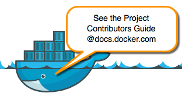

# Contribute to the Moby Project

Want to hack on the Moby Project? Awesome! We have a contributor's guide that explains
[setting up a development environment and the contribution
process](docs/contributing/). 

[](https://docs.docker.com/opensource/project/who-written-for/)

This page contains information about reporting issues as well as some tips and
guidelines useful to experienced open source contributors. Finally, make sure
you read our [community guidelines](#moby-community-guidelines) before you
start participating.

## Topics

* [Reporting Security Issues](#reporting-security-issues)
* [Design and Cleanup Proposals](#design-and-cleanup-proposals)
* [Reporting Issues](#reporting-other-issues)
* [Quick Contribution Tips and Guidelines](#quick-contribution-tips-and-guidelines)
* [Community Guidelines](#moby-community-guidelines)

## Reporting security issues

The Moby maintainers take security seriously. If you discover a security
issue, please bring it to their attention right away!

Please **DO NOT** file a public issue, instead send your report privately to
[security@docker.com](mailto:security@docker.com).

Security reports are greatly appreciated and we will publicly thank you for it,
although we keep your name confidential if you request it. We also like to send
gifts&mdash;if you're into schwag, make sure to let us know. We currently do not
offer a paid security bounty program, but are not ruling it out in the future.


## Reporting other issues

A great way to contribute to the project is to send a detailed report when you
encounter an issue. We always appreciate a well-written, thorough bug report,
and will thank you for it!

Check that [our issue database](https://github.com/moby/moby/issues)
doesn't already include that problem or suggestion before submitting an issue.
If you find a match, you can use the "subscribe" button to get notified on
updates. Do *not* leave random "+1" or "I have this too" comments, as they
only clutter the discussion, and don't help resolving it. However, if you
have ways to reproduce the issue or have additional information that may help
resolving the issue, please leave a comment.

When reporting issues, always include:

* The output of `docker version`.
* The output of `docker info`.

Also include the steps required to reproduce the problem if possible and
applicable. This information will help us review and fix your issue faster.
When sending lengthy log-files, consider posting them as a gist (https://gist.github.com).
Don't forget to remove sensitive data from your logfiles before posting (you can
replace those parts with "REDACTED").

## Quick contribution tips and guidelines

This section gives the experienced contributor some tips and guidelines.

### Pull requests are always welcome

Not sure if that typo is worth a pull request? Found a bug and know how to fix
it? Do it! We will appreciate it. Any significant improvement should be
documented as [a GitHub issue](https://github.com/moby/moby/issues) before
anybody starts working on it.

We are always thrilled to receive pull requests. We do our best to process them
quickly. If your pull request is not accepted on the first try,
don't get discouraged! Our contributor's guide explains [the review process we
use for simple changes](https://docs.docker.com/opensource/workflow/make-a-contribution/).

### Design and cleanup proposals

You can propose new designs for existing Docker features. You can also design
entirely new features. We really appreciate contributors who want to refactor or
otherwise cleanup our project. For information on making these types of
contributions, see [the advanced contribution
section](https://docs.docker.com/opensource/workflow/advanced-contributing/) in
the contributors guide.

### Connect with other Moby Project contributors

<table class="tg">
  <col width="45%">
  <col width="65%">
  <tr>
    <td>Forums</td>
    <td>
      A public forum for users to discuss questions and explore current design patterns and
      best practices about all the Moby projects. To participate, log in with your Github
      account or create an account at <a href="https://forums.mobyproject.org" target="_blank">https://forums.mobyproject.org</a>.
    </td>
  </tr>
  <tr>
    <td>Slack</td>
    <td>
      <p>
        Register for the Docker Community Slack at
	<a href="https://dockr.ly/slack" target="_blank">https://dockr.ly/slack</a>.
        We use the #moby-project channel for general discussion, and there are separate channels for other Moby projects such as #containerd.
      </p>
    </td>
  </tr>
  <tr>
    <td>Twitter</td>
    <td>
      You can follow <a href="https://twitter.com/moby/" target="_blank">Moby Project Twitter feed</a>
      to get updates on our products. You can also tweet us questions or just
      share blogs or stories.
    </td>
  </tr>
</table>


### Conventions

Fork the repository and make changes on your fork in a feature branch:

- If it's a bug fix branch, name it XXXX-something where XXXX is the number of
	the issue. 
- If it's a feature branch, create an enhancement issue to announce
	your intentions, and name it XXXX-something where XXXX is the number of the
	issue.

Submit tests for your changes. See [TESTING.md](./TESTING.md) for details.

If your changes need integration tests, write them against the API. The `cli`
integration tests are slowly either migrated to API tests or moved away as unit
tests in `docker/cli` and end-to-end tests for Docker.

Update the documentation when creating or modifying features. Test your
documentation changes for clarity, concision, and correctness, as well as a
clean documentation build. See our contributors guide for [our style
guide](https://docs.docker.com/opensource/doc-style) and instructions on [building
the documentation](https://docs.docker.com/opensource/project/test-and-docs/#build-and-test-the-documentation).

Write clean code. Universally formatted code promotes ease of writing, reading,
and maintenance. Always run `gofmt -s -w file.go` on each changed file before
committing your changes. Most editors have plug-ins that do this automatically.

Pull request descriptions should be as clear as possible and include a reference
to all the issues that they address.

### Successful Changes

Before contributing large or high impact changes, make the effort to coordinate
with the maintainers of the project before submitting a pull request. This
prevents you from doing extra work that may or may not be merged.

Large PRs that are just submitted without any prior communication are unlikely
to be successful.

While pull requests are the methodology for submitting changes to code, changes
are much more likely to be accepted if they are accompanied by additional
engineering work. While we don't define this explicitly, most of these goals
are accomplished through communication of the design goals and subsequent
solutions. Often times, it helps to first state the problem before presenting
solutions.

Typically, the best methods of accomplishing this are to submit an issue,
stating the problem. This issue can include a problem statement and a
checklist with requirements. If solutions are proposed, alternatives should be
listed and eliminated. Even if the criteria for elimination of a solution is
frivolous, say so.

Larger changes typically work best with design documents. These are focused on
providing context to the design at the time the feature was conceived and can
inform future documentation contributions.

### Commit Messages

Commit messages must start with a capitalized and short summary (max. 50 chars)
written in the imperative, followed by an optional, more detailed explanatory
text which is separated from the summary by an empty line.

Commit messages should follow best practices, including explaining the context
of the problem and how it was solved, including in caveats or follow up changes
required. They should tell the story of the change and provide readers
understanding of what led to it.

If you're lost about what this even means, please see [How to Write a Git
Commit Message](http://chris.beams.io/posts/git-commit/) for a start.

In practice, the best approach to maintaining a nice commit message is to
leverage a `git add -p` and `git commit --amend` to formulate a solid
changeset. This allows one to piece together a change, as information becomes
available.

If you squash a series of commits, don't just submit that. Re-write the commit
message, as if the series of commits was a single stroke of brilliance.

That said, there is no requirement to have a single commit for a PR, as long as
each commit tells the story. For example, if there is a feature that requires a
package, it might make sense to have the package in a separate commit then have
a subsequent commit that uses it.

Remember, you're telling part of the story with the commit message. Don't make
your chapter weird.

### Review

Code review comments may be added to your pull request. Discuss, then make the
suggested modifications and push additional commits to your feature branch. Post
a comment after pushing. New commits show up in the pull request automatically,
but the reviewers are notified only when you comment.

Pull requests must be cleanly rebased on top of master without multiple branches
mixed into the PR.

**Git tip**: If your PR no longer merges cleanly, use `rebase master` in your
feature branch to update your pull request rather than `merge master`.

Before you make a pull request, squash your commits into logical units of work
using `git rebase -i` and `git push -f`. A logical unit of work is a consistent
set of patches that should be reviewed together: for example, upgrading the
version of a vendored dependency and taking advantage of its now available new
feature constitute two separate units of work. Implementing a new function and
calling it in another file constitute a single logical unit of work. The very
high majority of submissions should have a single commit, so if in doubt: squash
down to one.

After every commit, [make sure the test suite passes](./TESTING.md). Include
documentation changes in the same pull request so that a revert would remove
all traces of the feature or fix.

Include an issue reference like `Closes #XXXX` or `Fixes #XXXX` in commits that
close an issue. Including references automatically closes the issue on a merge.

Please do not add yourself to the `AUTHORS` file, as it is regenerated regularly
from the Git history.

Please see the [Coding Style](#coding-style) for further guidelines.

### Merge approval

Moby maintainers use LGTM (Looks Good To Me) in comments on the code review to
indicate acceptance, or use the Github review approval feature.

For an explanation of the review and approval process see the
[REVIEWING](project/REVIEWING.md) page.

### Sign your work

The sign-off is a simple line at the end of the explanation for the patch. Your
signature certifies that you wrote the patch or otherwise have the right to pass
it on as an open-source patch. The rules are pretty simple: if you can certify
the below (from [developercertificate.org](http://developercertificate.org/)):

```
Developer Certificate of Origin
Version 1.1

Copyright (C) 2004, 2006 The Linux Foundation and its contributors.
1 Letterperson Drive
Suite D4700
San Francisco, CA, 94129

Everyone is permitted to copy and distribute verbatim copies of this
license document, but changing it is not allowed.

Developer's Certificate of Origin 1.1

By making a contribution to this project, I certify that:

(a) The contribution was created in whole or in part by me and I
    have the right to submit it under the open source license
    indicated in the file; or

(b) The contribution is based upon previous work that, to the best
    of my knowledge, is covered under an appropriate open source
    license and I have the right under that license to submit that
    work with modifications, whether created in whole or in part
    by me, under the same open source license (unless I am
    permitted to submit under a different license), as indicated
    in the file; or

(c) The contribution was provided directly to me by some other
    person who certified (a), (b) or (c) and I have not modified
    it.

(d) I understand and agree that this project and the contribution
    are public and that a record of the contribution (including all
    personal information I submit with it, including my sign-off) is
    maintained indefinitely and may be redistributed consistent with
    this project or the open source license(s) involved.
```

Then you just add a line to every git commit message:

    Signed-off-by: Joe Smith <joe.smith@email.com>

Use your real name (sorry, no pseudonyms or anonymous contributions.)

If you set your `user.name` and `user.email` git configs, you can sign your
commit automatically with `git commit -s`.

### How can I become a maintainer?

The procedures for adding new maintainers are explained in the 
[/project/GOVERNANCE.md](/project/GOVERNANCE.md)
file in this repository.

Don't forget: being a maintainer is a time investment. Make sure you
will have time to make yourself available. You don't have to be a
maintainer to make a difference on the project!

### Manage issues and pull requests using the Derek bot

If you want to help label, assign, close or reopen issues or pull requests
without commit rights, ask a maintainer to add your Github handle to the 
`.DEREK.yml` file. [Derek](https://github.com/alexellis/derek) is a bot that extends
Github's user permissions to help non-committers to manage issues and pull requests simply by commenting.

For example:

* Labels

```
Derek add label: kind/question
Derek remove label: status/claimed
```

* Assign work

```
Derek assign: username
Derek unassign: me
```

* Manage issues and PRs

```
Derek close
Derek reopen
```

## Moby community guidelines

We want to keep the Moby community awesome, growing and collaborative. We need
your help to keep it that way. To help with this we've come up with some general
guidelines for the community as a whole:

* Be nice: Be courteous, respectful and polite to fellow community members:
  no regional, racial, gender, or other abuse will be tolerated. We like
  nice people way better than mean ones!

* Encourage diversity and participation: Make everyone in our community feel
  welcome, regardless of their background and the extent of their
  contributions, and do everything possible to encourage participation in
  our community.

* Keep it legal: Basically, don't get us in trouble. Share only content that
  you own, do not share private or sensitive information, and don't break
  the law.

* Stay on topic: Make sure that you are posting to the correct channel and
  avoid off-topic discussions. Remember when you update an issue or respond
  to an email you are potentially sending to a large number of people. Please
  consider this before you update. Also remember that nobody likes spam.

* Don't send email to the maintainers: There's no need to send email to the
  maintainers to ask them to investigate an issue or to take a look at a
  pull request. Instead of sending an email, GitHub mentions should be
  used to ping maintainers to review a pull request, a proposal or an
  issue.

The open source governance for this repository is handled via the [Moby Technical Steering Committee (TSC)](https://github.com/moby/tsc)
charter. For any concerns with the community process regarding technical contributions,
please contact the TSC. More information on project governance is available in
our [project/GOVERNANCE.md](/project/GOVERNANCE.md) document.

### Guideline violations — 3 strikes method

The point of this section is not to find opportunities to punish people, but we
do need a fair way to deal with people who are making our community suck.

1. First occurrence: We'll give you a friendly, but public reminder that the
   behavior is inappropriate according to our guidelines.

2. Second occurrence: We will send you a private message with a warning that
   any additional violations will result in removal from the community.

3. Third occurrence: Depending on the violation, we may need to delete or ban
   your account.

**Notes:**

* Obvious spammers are banned on first occurrence. If we don't do this, we'll
  have spam all over the place.

* Violations are forgiven after 6 months of good behavior, and we won't hold a
  grudge.

* People who commit minor infractions will get some education, rather than
  hammering them in the 3 strikes process.

* The rules apply equally to everyone in the community, no matter how much
	you've contributed.

* Extreme violations of a threatening, abusive, destructive or illegal nature
	will be addressed immediately and are not subject to 3 strikes or forgiveness.

* Contact abuse@docker.com to report abuse or appeal violations. In the case of
	appeals, we know that mistakes happen, and we'll work with you to come up with a
	fair solution if there has been a misunderstanding.

## Coding Style

Unless explicitly stated, we follow all coding guidelines from the Go
community. While some of these standards may seem arbitrary, they somehow seem
to result in a solid, consistent codebase.

It is possible that the code base does not currently comply with these
guidelines. We are not looking for a massive PR that fixes this, since that
goes against the spirit of the guidelines. All new contributions should make a
best effort to clean up and make the code base better than they left it.
Obviously, apply your best judgement. Remember, the goal here is to make the
code base easier for humans to navigate and understand. Always keep that in
mind when nudging others to comply.

The rules:

1. All code should be formatted with `gofmt -s`.
2. All code should pass the default levels of
   [`golint`](https://github.com/golang/lint).
3. All code should follow the guidelines covered in [Effective
   Go](http://golang.org/doc/effective_go.html) and [Go Code Review
   Comments](https://github.com/golang/go/wiki/CodeReviewComments).
4. Comment the code. Tell us the why, the history and the context.
5. Document _all_ declarations and methods, even private ones. Declare
   expectations, caveats and anything else that may be important. If a type
   gets exported, having the comments already there will ensure it's ready.
6. Variable name length should be proportional to its context and no longer.
   `noCommaALongVariableNameLikeThisIsNotMoreClearWhenASimpleCommentWouldDo`.
   In practice, short methods will have short variable names and globals will
   have longer names.
7. No underscores in package names. If you need a compound name, step back,
   and re-examine why you need a compound name. If you still think you need a
   compound name, lose the underscore.
8. No utils or helpers packages. If a function is not general enough to
   warrant its own package, it has not been written generally enough to be a
   part of a util package. Just leave it unexported and well-documented.
9. All tests should run with `go test` and outside tooling should not be
   required. No, we don't need another unit testing framework. Assertion
   packages are acceptable if they provide _real_ incremental value.
10. Even though we call these "rules" above, they are actually just
    guidelines. Since you've read all the rules, you now know that.

If you are having trouble getting into the mood of idiomatic Go, we recommend
reading through [Effective Go](https://golang.org/doc/effective_go.html). The
[Go Blog](https://blog.golang.org) is also a great resource. Drinking the
kool-aid is a lot easier than going thirsty.
