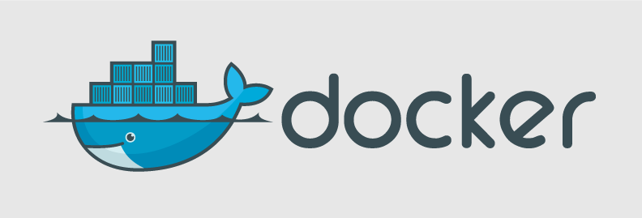

Docker: the Linux container engine
==================================

Docker is an open-source engine which automates the deployment of
applications as highly portable, self-sufficient containers.

Docker containers are both *hardware-agnostic* and
*platform-agnostic*. This means that they can run anywhere, from your
laptop to the largest EC2 compute instance and everything in between -
and they don't require that you use a particular language, framework
or packaging system. That makes them great building blocks for
deploying and scaling web apps, databases and backend services without
depending on a particular stack or provider.

Docker is an open-source implementation of the deployment engine which
powers [dotCloud](http://dotcloud.com), a popular
Platform-as-a-Service.  It benefits directly from the experience
accumulated over several years of large-scale operation and support of
hundreds of thousands of applications and databases.



## Better than VMs

A common method for distributing applications and sandbox their
execution is to use virtual machines, or VMs. Typical VM formats are
VMWare's vmdk, Oracle Virtualbox's vdi, and Amazon EC2's ami. In
theory these formats should allow every developer to automatically
package their application into a "machine" for easy distribution and
deployment. In practice, that almost never happens, for a few reasons:

  * *Size*: VMs are very large which makes them impractical to store
     and transfer.
  * *Performance*: running VMs consumes significant CPU and memory,
    which makes them impractical in many scenarios, for example local
    development of multi-tier applications, and large-scale deployment
    of cpu and memory-intensive applications on large numbers of
    machines.
  * *Portability*: competing VM environments don't play well with each
     other. Although conversion tools do exist, they are limited and
     add even more overhead.
  * *Hardware-centric*: VMs were designed with machine operators in
    mind, not software developers. As a result, they offer very
    limited tooling for what developers need most: building, testing
    and running their software. For example, VMs offer no facilities
    for application versioning, monitoring, configuration, logging or
    service discovery.

By contrast, Docker relies on a different sandboxing method known as
*containerization*. Unlike traditional virtualization,
containerization takes place at the kernel level. Most modern
operating system kernels now support the primitives necessary for
containerization, including Linux with [openvz](http://openvz.org),
[vserver](http://linux-vserver.org) and more recently
[lxc](http://lxc.sourceforge.net), Solaris with
[zones](http://docs.oracle.com/cd/E26502_01/html/E29024/preface-1.html#scrolltoc)
and FreeBSD with
[Jails](http://www.freebsd.org/doc/handbook/jails.html).

Docker builds on top of these low-level primitives to offer developers
a portable format and runtime environment that solves all 4
problems. Docker containers are small (and their transfer can be
optimized with layers), they have basically zero memory and cpu
overhead, they are completely portable and are designed from the
ground up with an application-centric design.

The best part: because ``docker`` operates at the OS level, it can
still be run inside a VM!

## Plays well with others

Docker does not require that you buy into a particular programming
language, framework, packaging system or configuration language.

Is your application a Unix process? Does it use files, tcp
connections, environment variables, standard Unix streams and
command-line arguments as inputs and outputs? Then ``docker`` can run
it.

Can your application's build be expressed as a sequence of such
commands? Then ``docker`` can build it.


## Escape dependency hell

A common problem for developers is the difficulty of managing all
their application's dependencies in a simple and automated way.

This is usually difficult for several reasons:

  * *Cross-platform dependencies*. Modern applications often depend on
    a combination of system libraries and binaries, language-specific
    packages, framework-specific modules, internal components
    developed for another project, etc. These dependencies live in
    different "worlds" and require different tools - these tools
    typically don't work well with each other, requiring awkward
    custom integrations.

  * Conflicting dependencies. Different applications may depend on
    different versions of the same dependency. Packaging tools handle
    these situations with various degrees of ease - but they all
    handle them in different and incompatible ways, which again forces
    the developer to do extra work.
  
  * Custom dependencies. A developer may need to prepare a custom
    version of their application's dependency. Some packaging systems
    can handle custom versions of a dependency, others can't - and all
    of them handle it differently.


Docker solves dependency hell by giving the developer a simple way to
express *all* their application's dependencies in one place, and
streamline the process of assembling them. If this makes you think of
[XKCD 927](http://xkcd.com/927/), don't worry. Docker doesn't
*replace* your favorite packaging systems. It simply orchestrates
their use in a simple and repeatable way. How does it do that? With
layers.

Docker defines a build as running a sequence of Unix commands, one
after the other, in the same container. Build commands modify the
contents of the container (usually by installing new files on the
filesystem), the next command modifies it some more, etc. Since each
build command inherits the result of the previous commands, the
*order* in which the commands are executed expresses *dependencies*.

Here's a typical Docker build process:

```bash
from ubuntu:12.10
run apt-get update
run DEBIAN_FRONTEND=noninteractive apt-get install -q -y python
run DEBIAN_FRONTEND=noninteractive apt-get install -q -y python-pip
run pip install django
run DEBIAN_FRONTEND=noninteractive apt-get install -q -y curl
run curl -L https://github.com/shykes/helloflask/archive/master.tar.gz | tar -xzv
run cd helloflask-master && pip install -r requirements.txt
```

Note that Docker doesn't care *how* dependencies are built - as long
as they can be built by running a Unix command in a container.


Install instructions
==================

Quick install on Ubuntu 12.04 and 12.10
---------------------------------------

```bash
curl https://get.docker.io | sudo sh -x
```

Binary installs
----------------

Docker supports the following binary installation methods.  Note that
some methods are community contributions and not yet officially
supported.

* [Ubuntu 12.04 and 12.10 (officially supported)](http://docs.docker.io/en/latest/installation/ubuntulinux/)
* [Arch Linux](http://docs.docker.io/en/latest/installation/archlinux/)
* [Mac OS X (with Vagrant)](http://docs.docker.io/en/latest/installation/vagrant/)
* [Windows (with Vagrant)](http://docs.docker.io/en/latest/installation/windows/)
* [Amazon EC2 (with Vagrant)](http://docs.docker.io/en/latest/installation/amazon/)

Installing from source
----------------------

1. Install Dependencies
    * [Go language 1.1.x](http://golang.org/doc/install)
    * [git](http://git-scm.com)
    * [lxc](http://lxc.sourceforge.net)
    * [aufs-tools](http://aufs.sourceforge.net)

2. Checkout the source code

   ```bash
   git clone http://github.com/dotcloud/docker
   ```

3. Build the ``docker`` binary

   ```bash
   cd docker
   make VERBOSE=1
   sudo cp ./bin/docker /usr/local/bin/docker
   ```

Usage examples
==============

First run the ``docker`` daemon
-------------------------------

All the examples assume your machine is running the ``docker``
daemon. To run the ``docker`` daemon in the background, simply type:

```bash
# On a production system you want this running in an init script
sudo docker -d &
```

Now you can run ``docker`` in client mode: all commands will be
forwarded to the ``docker`` daemon, so the client can run from any
account.

```bash
# Now you can run docker commands from any account.
docker help
```


Throwaway shell in a base Ubuntu image
--------------------------------------

```bash
docker pull ubuntu:12.10

# Run an interactive shell, allocate a tty, attach stdin and stdout
# To detach the tty without exiting the shell, use the escape sequence Ctrl-p + Ctrl-q
docker run -i -t ubuntu:12.10 /bin/bash
```

Starting a long-running worker process
--------------------------------------

```bash
# Start a very useful long-running process
JOB=$(docker run -d ubuntu /bin/sh -c "while true; do echo Hello world; sleep 1; done")

# Collect the output of the job so far
docker logs $JOB

# Kill the job
docker kill $JOB
```

Running an irc bouncer
----------------------

```bash
BOUNCER_ID=$(docker run -d -p 6667 -u irc shykes/znc zncrun $USER $PASSWORD)
echo "Configure your irc client to connect to port $(docker port $BOUNCER_ID 6667) of this machine"
```

Running Redis
-------------

```bash
REDIS_ID=$(docker run -d -p 6379 shykes/redis redis-server)
echo "Configure your redis client to connect to port $(docker port $REDIS_ID 6379) of this machine"
```

Share your own image!
---------------------

```bash
CONTAINER=$(docker run -d ubuntu:12.10 apt-get install -y curl)
docker commit -m "Installed curl" $CONTAINER $USER/betterbase
docker push $USER/betterbase
```

A list of publicly available images is [available
here](https://github.com/dotcloud/docker/wiki/Public-docker-images).

Expose a service on a TCP port
------------------------------

```bash
# Expose port 4444 of this container, and tell netcat to listen on it
JOB=$(docker run -d -p 4444 base /bin/nc -l -p 4444)

# Which public port is NATed to my container?
PORT=$(docker port $JOB 4444)

# Connect to the public port via the host's public address
# Please note that because of how routing works connecting to localhost or 127.0.0.1 $PORT will not work.
# Replace *eth0* according to your local interface name.
IP=$(ip -o -4 addr list eth0 | perl -n -e 'if (m{inet\s([\d\.]+)\/\d+\s}xms) { print $1 }')
echo hello world | nc $IP $PORT

# Verify that the network connection worked
echo "Daemon received: $(docker logs $JOB)"
```

Under the hood
--------------

Under the hood, Docker is built on the following components:

* The
  [cgroup](http://blog.dotcloud.com/kernel-secrets-from-the-paas-garage-part-24-c)
  and
  [namespacing](http://blog.dotcloud.com/under-the-hood-linux-kernels-on-dotcloud-part)
  capabilities of the Linux kernel;
* [AUFS](http://aufs.sourceforge.net/aufs.html), a powerful union
  filesystem with copy-on-write capabilities;
* The [Go](http://golang.org) programming language;
* [lxc](http://lxc.sourceforge.net/), a set of convenience scripts to
  simplify the creation of Linux containers.


Contributing to Docker
======================

Want to hack on Docker? Awesome! There are instructions to get you
started [here](CONTRIBUTING.md).

They are probably not perfect, please let us know if anything feels
wrong or incomplete.


Note
----

We also keep the documentation in this repository. The website
documentation is generated using Sphinx using these sources.  Please
find it under docs/sources/ and read more about it
https://github.com/dotcloud/docker/tree/master/docs/README.md

Please feel free to fix / update the documentation and send us pull
requests. More tutorials are also welcome.


Setting up a dev environment
----------------------------

Instructions that have been verified to work on Ubuntu 12.10,

```bash
sudo apt-get -y install lxc curl xz-utils golang git mercurial

export GOPATH=~/go/
export PATH=$GOPATH/bin:$PATH

mkdir -p $GOPATH/src/github.com/dotcloud
cd $GOPATH/src/github.com/dotcloud
git clone https://github.com/dotcloud/docker.git
cd docker

go get -v github.com/dotcloud/docker/...
go install -v github.com/dotcloud/docker/...
```

Then run the docker daemon,

```bash
sudo $GOPATH/bin/docker -d
```

Run the `go install` command (above) to recompile docker.


What is a Standard Container?
=============================

Docker defines a unit of software delivery called a Standard
Container. The goal of a Standard Container is to encapsulate a
software component and all its dependencies in a format that is
self-describing and portable, so that any compliant runtime can run it
without extra dependencies, regardless of the underlying machine and
the contents of the container.

The spec for Standard Containers is currently a work in progress, but
it is very straightforward. It mostly defines 1) an image format, 2) a
set of standard operations, and 3) an execution environment.

A great analogy for this is the shipping container. Just like how
Standard Containers are a fundamental unit of software delivery,
shipping containers are a fundamental unit of physical delivery.

### 1. STANDARD OPERATIONS

Just like shipping containers, Standard Containers define a set of
STANDARD OPERATIONS. Shipping containers can be lifted, stacked,
locked, loaded, unloaded and labelled. Similarly, Standard Containers
can be started, stopped, copied, snapshotted, downloaded, uploaded and
tagged.


### 2. CONTENT-AGNOSTIC

Just like shipping containers, Standard Containers are
CONTENT-AGNOSTIC: all standard operations have the same effect
regardless of the contents. A shipping container will be stacked in
exactly the same way whether it contains Vietnamese powder coffee or
spare Maserati parts. Similarly, Standard Containers are started or
uploaded in the same way whether they contain a postgres database, a
php application with its dependencies and application server, or Java
build artifacts.


### 3. INFRASTRUCTURE-AGNOSTIC

Both types of containers are INFRASTRUCTURE-AGNOSTIC: they can be
transported to thousands of facilities around the world, and
manipulated by a wide variety of equipment. A shipping container can
be packed in a factory in Ukraine, transported by truck to the nearest
routing center, stacked onto a train, loaded into a German boat by an
Australian-built crane, stored in a warehouse at a US facility,
etc. Similarly, a standard container can be bundled on my laptop,
uploaded to S3, downloaded, run and snapshotted by a build server at
Equinix in Virginia, uploaded to 10 staging servers in a home-made
Openstack cluster, then sent to 30 production instances across 3 EC2
regions.


### 4. DESIGNED FOR AUTOMATION

Because they offer the same standard operations regardless of content
and infrastructure, Standard Containers, just like their physical
counterparts, are extremely well-suited for automation. In fact, you
could say automation is their secret weapon.

Many things that once required time-consuming and error-prone human
effort can now be programmed. Before shipping containers, a bag of
powder coffee was hauled, dragged, dropped, rolled and stacked by 10
different people in 10 different locations by the time it reached its
destination. 1 out of 50 disappeared. 1 out of 20 was damaged. The
process was slow, inefficient and cost a fortune - and was entirely
different depending on the facility and the type of goods.

Similarly, before Standard Containers, by the time a software
component ran in production, it had been individually built,
configured, bundled, documented, patched, vendored, templated, tweaked
and instrumented by 10 different people on 10 different
computers. Builds failed, libraries conflicted, mirrors crashed,
post-it notes were lost, logs were misplaced, cluster updates were
half-broken. The process was slow, inefficient and cost a fortune -
and was entirely different depending on the language and
infrastructure provider.


### 5. INDUSTRIAL-GRADE DELIVERY

There are 17 million shipping containers in existence, packed with
every physical good imaginable. Every single one of them can be loaded
onto the same boats, by the same cranes, in the same facilities, and
sent anywhere in the World with incredible efficiency. It is
embarrassing to think that a 30 ton shipment of coffee can safely
travel half-way across the World in *less time* than it takes a
software team to deliver its code from one datacenter to another
sitting 10 miles away.

With Standard Containers we can put an end to that embarrassment, by
making INDUSTRIAL-GRADE DELIVERY of software a reality.


### Legal

Transfers of Docker shall be in accordance with applicable export
controls of any country and all other applicable legal requirements.
Docker shall not be distributed or downloaded to or in Cuba, Iran,
North Korea, Sudan or Syria and shall not be distributed or downloaded
to any person on the Denied Persons List administered by the U.S.
Department of Commerce.

