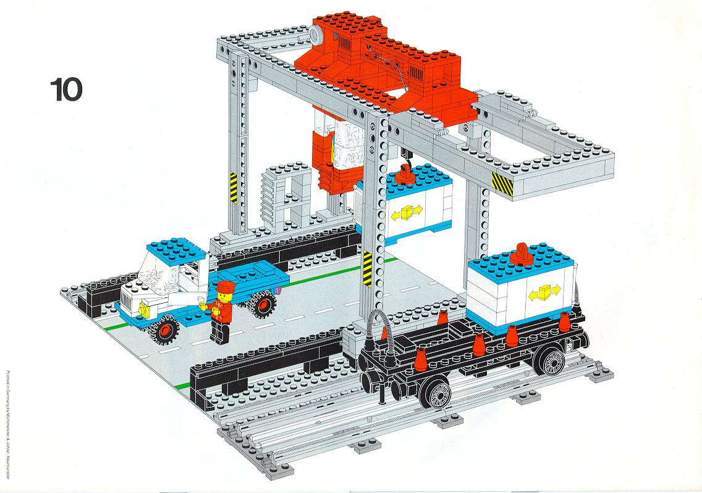

Docker: the Linux container runtime
===================================

Docker complements LXC with a high-level API which operates at the process level. It runs unix processes with strong guarantees of isolation and repeatability across servers.

Docker is a great building block for automating distributed systems: large-scale web deployments, database clusters, continuous deployment systems, private PaaS, service-oriented architectures, etc.



* *Heterogeneous payloads*: any combination of binaries, libraries, configuration files, scripts, virtualenvs, jars, gems, tarballs, you name it. No more juggling between domain-specific tools. Docker can deploy and run them all.

* *Any server*: docker can run on any x64 machine with a modern linux kernel - whether it's a laptop, a bare metal server or a VM. This makes it perfect for multi-cloud deployments.

* *Isolation*: docker isolates processes from each other and from the underlying host, using lightweight containers.

* *Repeatability*: because containers are isolated in their own filesystem, they behave the same regardless of where, when, and alongside what they run.


Notable features
-----------------

* Filesystem isolation: each process container runs in a completely separate root filesystem.

* Resource isolation: system resources like cpu and memory can be allocated differently to each process container, using cgroups.

* Network isolation: each process container runs in its own network namespace, with a virtual interface and IP address of its own.

* Copy-on-write: root filesystems are created using copy-on-write, which makes deployment extremely fast, memory-cheap and disk-cheap.

* Logging: the standard streams (stdout/stderr/stdin) of each process container are collected and logged for real-time or batch retrieval.

* Change management: changes to a container's filesystem can be committed into a new image and re-used to create more containers. No templating or manual configuration required.

* Interactive shell: docker can allocate a pseudo-tty and attach to the standard input of any container, for example to run a throwaway interactive shell.


Under the hood
--------------

Under the hood, Docker is built on the following components:


* The [cgroup](http://blog.dotcloud.com/kernel-secrets-from-the-paas-garage-part-24-c) and [namespacing](http://blog.dotcloud.com/under-the-hood-linux-kernels-on-dotcloud-part) capabilities of the Linux kernel;

* [AUFS](http://aufs.sourceforge.net/aufs.html), a powerful union filesystem with copy-on-write capabilities;

* The [Go](http://golang.org) programming language;

* [lxc](http://lxc.sourceforge.net/), a set of convenience scripts to simplify the creation of linux containers.


Install instructions
==================

Quick install on Ubuntu 12.04 and 12.10
---------------------------------------

```bash
curl get.docker.io | sh -x
```

Binary installs
----------------

Docker supports the following binary installation methods.
Note that some methods are community contributions and not yet officially supported.

* [Ubuntu 12.04 and 12.10 (officially supported)](http://docs.docker.io/en/latest/installation/ubuntulinux/)
* [Arch Linux](http://docs.docker.io/en/latest/installation/archlinux/)
* [MacOS X (with Vagrant)](http://docs.docker.io/en/latest/installation/macos/)
* [Windows (with Vagrant)](http://docs.docker.io/en/latest/installation/windows/)
* [Amazon EC2 (with Vagrant)](http://docs.docker.io/en/latest/installation/amazon/)

Installing from source
----------------------

1. Make sure you have a [Go language](http://golang.org/doc/install) compiler and [git](http://git-scm.com) installed.

2. Checkout the source code

   ```bash
   git clone http://github.com/dotcloud/docker
   ```

3. Build the docker binary

   ```bash
   cd docker
   make VERBOSE=1
   sudo cp ./bin/docker /usr/local/bin/docker
   ```

Usage examples
==============

First run the docker daemon
---------------------------

All the examples assume your machine is running the docker daemon. To run the docker daemon in the background, simply type:

```bash
# On a production system you want this running in an init script
sudo docker -d &
```

Now you can run docker in client mode: all commands will be forwarded to the docker daemon, so the client can run from any account.

```bash
# Now you can run docker commands from any account.
docker help
```


Throwaway shell in a base ubuntu image
--------------------------------------

```bash
docker pull ubuntu:12.10

# Run an interactive shell, allocate a tty, attach stdin and stdout
# To detach the tty without exiting the shell, use the escape sequence Ctrl-p + Ctrl-q
docker run -i -t ubuntu:12.10 /bin/bash
```

Starting a long-running worker process
--------------------------------------

```bash
# Start a very useful long-running process
JOB=$(docker run -d ubuntu /bin/sh -c "while true; do echo Hello world; sleep 1; done")

# Collect the output of the job so far
docker logs $JOB

# Kill the job
docker kill $JOB
```

Running an irc bouncer
----------------------

```bash
BOUNCER_ID=$(docker run -d -p 6667 -u irc shykes/znc $USER $PASSWORD)
echo "Configure your irc client to connect to port $(port $BOUNCER_ID 6667) of this machine"
```

Running Redis
-------------

```bash
REDIS_ID=$(docker run -d -p 6379 shykes/redis redis-server)
echo "Configure your redis client to connect to port $(port $REDIS_ID 6379) of this machine"
```

Share your own image!
---------------------

```bash
CONTAINER=$(docker run -d ubuntu:12.10 apt-get install -y curl)
docker commit -m "Installed curl" $CONTAINER $USER/betterbase
docker push $USER/betterbase
```


Expose a service on a TCP port
------------------------------

```bash
# Expose port 4444 of this container, and tell netcat to listen on it
JOB=$(docker run -d -p 4444 base /bin/nc -l -p 4444)

# Which public port is NATed to my container?
PORT=$(docker port $JOB 4444)

# Connect to the public port via the host's public address
# Please note that because of how routing works connecting to localhost or 127.0.0.1 $PORT will not work.
IP=$(ifconfig eth0 | perl -n -e 'if (m/inet addr:([\d\.]+)/g) { print $1 }')
echo hello world | nc $IP $PORT

# Verify that the network connection worked
echo "Daemon received: $(docker logs $JOB)"
```

Contributing to Docker
======================

Want to hack on Docker? Awesome! There are instructions to get you started on the website: http://docs.docker.io/en/latest/contributing/contributing/

They are probably not perfect, please let us know if anything feels wrong or incomplete.


Note
----

We also keep the documentation in this repository. The website documentation is generated using sphinx using these sources.
Please find it under docs/sources/ and read more about it https://github.com/dotcloud/docker/master/docs/README.md

Please feel free to fix / update the documentation and send us pull requests. More tutorials are also welcome.


Setting up a dev environment
----------------------------

Instructions that have been verified to work on Ubuntu 12.10,

```bash
sudo apt-get -y install lxc wget bsdtar curl golang git

export GOPATH=~/go/
export PATH=$GOPATH/bin:$PATH

mkdir -p $GOPATH/src/github.com/dotcloud
cd $GOPATH/src/github.com/dotcloud
git clone git@github.com:dotcloud/docker.git
cd docker

go get -v github.com/dotcloud/docker/...
go install -v github.com/dotcloud/docker/...
```

Then run the docker daemon,

```bash
sudo $GOPATH/bin/docker -d
```

Run the `go install` command (above) to recompile docker.


What is a Standard Container?
=============================

Docker defines a unit of software delivery called a Standard Container. The goal of a Standard Container is to encapsulate a software component and all its dependencies in
a format that is self-describing and portable, so that any compliant runtime can run it without extra dependencies, regardless of the underlying machine and the contents of the container.

The spec for Standard Containers is currently a work in progress, but it is very straightforward. It mostly defines 1) an image format, 2) a set of standard operations, and 3) an execution environment.

A great analogy for this is the shipping container. Just like Standard Containers are a fundamental unit of software delivery, shipping containers (http://bricks.argz.com/ins/7823-1/12) are a fundamental unit of physical delivery.

### 1. STANDARD OPERATIONS

Just like shipping containers, Standard Containers define a set of STANDARD OPERATIONS. Shipping containers can be lifted, stacked, locked, loaded, unloaded and labelled. Similarly, standard containers can be started, stopped, copied, snapshotted, downloaded, uploaded and tagged.


### 2. CONTENT-AGNOSTIC

Just like shipping containers, Standard Containers are CONTENT-AGNOSTIC: all standard operations have the same effect regardless of the contents. A shipping container will be stacked in exactly the same way whether it contains Vietnamese powder coffee or spare Maserati parts. Similarly, Standard Containers are started or uploaded in the same way whether they contain a postgres database, a php application with its dependencies and application server, or Java build artifacts.


### 3. INFRASTRUCTURE-AGNOSTIC

Both types of containers are INFRASTRUCTURE-AGNOSTIC: they can be transported to thousands of facilities around the world, and manipulated by a wide variety of equipment. A shipping container can be packed in a factory in Ukraine, transported by truck to the nearest routing center, stacked onto a train, loaded into a German boat by an Australian-built crane, stored in a warehouse at a US facility, etc. Similarly, a standard container can be bundled on my laptop, uploaded to S3, downloaded, run and snapshotted by a build server at Equinix in Virginia, uploaded to 10 staging servers in a home-made Openstack cluster, then sent to 30 production instances across 3 EC2 regions.


### 4. DESIGNED FOR AUTOMATION

Because they offer the same standard operations regardless of content and infrastructure, Standard Containers, just like their physical counterpart, are extremely well-suited for automation. In fact, you could say automation is their secret weapon.

Many things that once required time-consuming and error-prone human effort can now be programmed. Before shipping containers, a bag of powder coffee was hauled, dragged, dropped, rolled and stacked by 10 different people in 10 different locations by the time it reached its destination. 1 out of 50 disappeared. 1 out of 20 was damaged. The process was slow, inefficient and cost a fortune - and was entirely different depending on the facility and the type of goods.

Similarly, before Standard Containers, by the time a software component ran in production, it had been individually built, configured, bundled, documented, patched, vendored, templated, tweaked and instrumented by 10 different people on 10 different computers. Builds failed, libraries conflicted, mirrors crashed, post-it notes were lost, logs were misplaced, cluster updates were half-broken. The process was slow, inefficient and cost a fortune - and was entirely different depending on the language and infrastructure provider.


### 5. INDUSTRIAL-GRADE DELIVERY

There are 17 million shipping containers in existence, packed with every physical good imaginable. Every single one of them can be loaded on the same boats, by the same cranes, in the same facilities, and sent anywhere in the World with incredible efficiency. It is embarrassing to think that a 30 ton shipment of coffee can safely travel half-way across the World in *less time* than it takes a software team to deliver its code from one datacenter to another sitting 10 miles away.

With Standard Containers we can put an end to that embarrassment, by making INDUSTRIAL-GRADE DELIVERY of software a reality.


Standard Container Specification
--------------------------------

(TODO)

### Image format


### Standard operations

* Copy
* Run
* Stop
* Wait
* Commit
* Attach standard streams
* List filesystem changes
* ...

### Execution environment

#### Root filesystem

#### Environment variables

#### Process arguments

#### Networking

#### Process namespacing

#### Resource limits

#### Process monitoring

#### Logging

#### Signals

#### Pseudo-terminal allocation

#### Security


