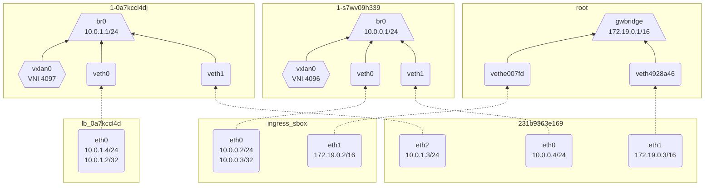

# Observed behaviour with iptables mode

```console
$ docker network create -d overlay someovl
$ docker service create --mode global --name foo --network someovl --publish 3000:80 --publish 3001:53/udp nginx
```

## `docker inspect $servicetask`
```json
   {
       "NetworkSettings": {
            "SandboxID": "231b9363e169d65d45a93a8707e32f8b5b2f4e13c9099163bbf1ff23f5a525e6",
            "SandboxKey": "/var/run/docker/netns/231b9363e169",
            "Ports": {
                "80/tcp": null
            },
            "Networks": {
                "ingress": {
                    "IPAMConfig": {
                        "IPv4Address": "10.0.0.4"
                    },
                    "Links": null,
                    "Aliases": null,
                    "DriverOpts": null,
                    "GwPriority": 0,
                    "NetworkID": "s7wv09h339pg33bwa1x7e94zf",
                    "EndpointID": "a4a5f3a9b833bd8542b90aa00ee7982276432c1c79dac8f9d468cb55c7201b1f",
                    "Gateway": "",
                    "IPAddress": "10.0.0.4",
                    "MacAddress": "02:42:0a:00:00:04",
                    "IPPrefixLen": 24,
                    "IPv6Gateway": "",
                    "GlobalIPv6Address": "",
                    "GlobalIPv6PrefixLen": 0,
                    "DNSNames": [
                        "foo.b575fhbepobkezwuoxhuu81de.myd389c5xnuj0efizrj4cui4k",
                        "f2b1465118aa"
                    ]
                },
                "someovl": {
                    "IPAMConfig": {
                        "IPv4Address": "10.0.1.3"
                    },
                    "Links": null,
                    "Aliases": null,
                    "DriverOpts": null,
                    "GwPriority": 0,
                    "NetworkID": "0a7kccl4djhyr6mqdo553viir",
                    "EndpointID": "610eb196f8175ed104ef504ccff22e49cdeb77bfcd9fcdbed70bf14f709d7590",
                    "Gateway": "",
                    "IPAddress": "10.0.1.3",
                    "MacAddress": "02:42:0a:00:01:03",
                    "IPPrefixLen": 24,
                    "IPv6Gateway": "",
                    "GlobalIPv6Address": "",
                    "GlobalIPv6PrefixLen": 0,
                    "DNSNames": [
                        "foo.b575fhbepobkezwuoxhuu81de.myd389c5xnuj0efizrj4cui4k",
                        "f2b1465118aa"
                    ]
                }
            }
        }
    }
```

## `docker network inspect -v ingress someovl`
```json
[
    {
        "Name": "ingress",
        "Id": "s7wv09h339pg33bwa1x7e94zf",
        "Created": "2026-06-17T15:26:52.277276764Z",
        "Scope": "swarm",
        "Driver": "overlay",
        "EnableIPv4": true,
        "EnableIPv6": false,
        "IPAM": {
            "Driver": "default",
            "Options": null,
            "Config": [
                {
                    "Subnet": "10.0.0.0/24",
                    "Gateway": "10.0.0.1"
                }
            ]
        },
        "Internal": false,
        "Attachable": false,
        "Ingress": true,
        "ConfigFrom": {
            "Network": ""
        },
        "ConfigOnly": false,
        "Options": {
            "com.docker.network.driver.overlay.vxlanid_list": "4096"
        },
        "Labels": {},
        "Peers": [
            {
                "Name": "dab0d2bf09bf",
                "IP": "172.17.0.3"
            }
        ],
        "Containers": {
            "f2b1465118aabe32b1f0be61931890f018adb5b8b22805c689010db91d2017aa": {
                "Name": "foo.b575fhbepobkezwuoxhuu81de.myd389c5xnuj0efizrj4cui4k",
                "EndpointID": "a4a5f3a9b833bd8542b90aa00ee7982276432c1c79dac8f9d468cb55c7201b1f",
                "MacAddress": "02:42:0a:00:00:04",
                "IPv4Address": "10.0.0.4/24",
                "IPv6Address": ""
            },
            "ingress-sbox": {
                "Name": "ingress-endpoint",
                "EndpointID": "012cfd9641daed1b8f5f7f03d88a204a1fc7166472ed698116594d1a025531fe",
                "MacAddress": "02:42:0a:00:00:02",
                "IPv4Address": "10.0.0.2/24",
                "IPv6Address": ""
            }
        },
        "Services": {
            "foo": {
                "VIP": "10.0.0.3",
                "Ports": [
                    "Target: 80, Publish: 3000",
                    "Target: 53, Publish: 3001"
                ],
                "LocalLBIndex": 256,
                "Tasks": [
                    {
                        "Name": "foo.b575fhbepobkezwuoxhuu81de.myd389c5xnuj0efizrj4cui4k",
                        "EndpointID": "a4a5f3a9b833bd8542b90aa00ee7982276432c1c79dac8f9d468cb55c7201b1f",
                        "EndpointIP": "10.0.0.4",
                        "Info": {
                            "Host IP": "172.17.0.3"
                        }
                    }
                ]
            }
        },
        "Status": {
            "IPAM": {
                "Subnets": {
                    "10.0.0.0/24": {
                        "IPsInUse": 6,
                        "DynamicIPsAvailable": 250
                    }
                }
            }
        }
    },
    {
        "Name": "someovl",
        "Id": "0a7kccl4djhyr6mqdo553viir",
        "Created": "2026-06-17T15:37:07.362104423Z",
        "Scope": "swarm",
        "Driver": "overlay",
        "EnableIPv4": true,
        "EnableIPv6": false,
        "IPAM": {
            "Driver": "default",
            "Options": null,
            "Config": [
                {
                    "Subnet": "10.0.1.0/24",
                    "Gateway": "10.0.1.1"
                }
            ]
        },
        "Internal": false,
        "Attachable": false,
        "Ingress": false,
        "ConfigFrom": {
            "Network": ""
        },
        "ConfigOnly": false,
        "Options": {
            "com.docker.network.driver.overlay.vxlanid_list": "4097"
        },
        "Labels": {},
        "Peers": [
            {
                "Name": "dab0d2bf09bf",
                "IP": "172.17.0.3"
            }
        ],
        "Containers": {
            "f2b1465118aabe32b1f0be61931890f018adb5b8b22805c689010db91d2017aa": {
                "Name": "foo.b575fhbepobkezwuoxhuu81de.myd389c5xnuj0efizrj4cui4k",
                "EndpointID": "610eb196f8175ed104ef504ccff22e49cdeb77bfcd9fcdbed70bf14f709d7590",
                "MacAddress": "02:42:0a:00:01:03",
                "IPv4Address": "10.0.1.3/24",
                "IPv6Address": ""
            },
            "lb-someovl": {
                "Name": "someovl-endpoint",
                "EndpointID": "a44739039ebe1f8169bb8727a9467cef96d3ead8ff381cacf8e9aeb4f279c10e",
                "MacAddress": "02:42:0a:00:01:04",
                "IPv4Address": "10.0.1.4/24",
                "IPv6Address": ""
            }
        },
        "Services": {
            "foo": {
                "VIP": "10.0.1.2",
                "Ports": [],
                "LocalLBIndex": 257,
                "Tasks": [
                    {
                        "Name": "foo.b575fhbepobkezwuoxhuu81de.myd389c5xnuj0efizrj4cui4k",
                        "EndpointID": "610eb196f8175ed104ef504ccff22e49cdeb77bfcd9fcdbed70bf14f709d7590",
                        "EndpointIP": "10.0.1.3",
                        "Info": {
                            "Host IP": "172.17.0.3"
                        }
                    }
                ]
            }
        },
        "Status": {
            "IPAM": {
                "Subnets": {
                    "10.0.1.0/24": {
                        "IPsInUse": 6,
                        "DynamicIPsAvailable": 250
                    }
                }
            }
        }
    }
]
```

## Host netns

```console
$ iptables-save
# Generated by iptables-save v1.8.9 (nf_tables) on Wed Jun 17 15:37:19 2026
*raw
:PREROUTING ACCEPT [0:0]
:OUTPUT ACCEPT [0:0]
## Drop incoming packets addressed to a container's gwbridge link
## except for packets that have been masqueraded and xmit'ed over the bridge link
## which then presumably re-enters on the input side of netfilter, or something.
-A PREROUTING -d 172.19.0.2/32 ! -i docker_gwbridge -j DROP
-A PREROUTING -d 172.19.0.3/32 ! -i docker_gwbridge -j DROP
COMMIT
# Completed on Wed Jun 17 15:37:19 2026
# Generated by iptables-save v1.8.9 (nf_tables) on Wed Jun 17 15:37:19 2026
*filter
:INPUT ACCEPT [0:0]
:FORWARD ACCEPT [0:0]
:OUTPUT ACCEPT [0:0]
:DOCKER - [0:0]
:DOCKER-BRIDGE - [0:0]
:DOCKER-CT - [0:0]
:DOCKER-FORWARD - [0:0]
:DOCKER-INGRESS - [0:0]
:DOCKER-INTERNAL - [0:0]
:DOCKER-USER - [0:0]
-A FORWARD -j DOCKER-USER
-A FORWARD -j DOCKER-FORWARD
-A DOCKER ! -i docker0 -o docker0 -j DROP
-A DOCKER ! -i docker_gwbridge -o docker_gwbridge -j DROP
-A DOCKER-BRIDGE -o docker0 -j DOCKER
-A DOCKER-BRIDGE -o docker_gwbridge -j DOCKER
-A DOCKER-CT -o docker0 -m conntrack --ctstate RELATED,ESTABLISHED -j ACCEPT
-A DOCKER-CT -o docker_gwbridge -m conntrack --ctstate RELATED,ESTABLISHED -j ACCEPT
-A DOCKER-FORWARD -j DOCKER-INGRESS
-A DOCKER-FORWARD -j DOCKER-CT
-A DOCKER-FORWARD -j DOCKER-INTERNAL
-A DOCKER-FORWARD -j DOCKER-BRIDGE
-A DOCKER-FORWARD -i docker0 -j ACCEPT
-A DOCKER-FORWARD -i docker_gwbridge -o docker_gwbridge -j DROP
-A DOCKER-FORWARD -i docker_gwbridge ! -o docker_gwbridge -j ACCEPT
-A DOCKER-INGRESS -p udp -m udp --dport 3001 -j ACCEPT
-A DOCKER-INGRESS -p udp -m udp --sport 3001 -m conntrack --ctstate RELATED,ESTABLISHED -j ACCEPT
-A DOCKER-INGRESS -p tcp -m tcp --dport 3000 -j ACCEPT
-A DOCKER-INGRESS -p tcp -m tcp --sport 3000 -m conntrack --ctstate RELATED,ESTABLISHED -j ACCEPT
-A DOCKER-INGRESS -j RETURN
COMMIT
## Flattened ruleset:
### DOCKER-INGRESS (don't apply other rules to routed packets addressed to a published port)
## -A FORWARD -p udp -m udp --dport 3001 -j ACCEPT
## -A FORWARD -p udp -m udp --sport 3001 -m conntrack --ctstate RELATED,ESTABLISHED -j ACCEPT
## -A FORWARD -p tcp -m tcp --dport 3000 -j ACCEPT
## -A FORWARD -p tcp -m tcp --sport 3000 -m conntrack --ctstate RELATED,ESTABLISHED -j ACCEPT
### DOCKER-CT (don't interfere with packets belonging to an existing connection)
## -A FORWARD -o docker0 -m conntrack --ctstate RELATED,ESTABLISHED -j ACCEPT
## -A FORWARD -o docker_gwbridge -m conntrack --ctstate RELATED,ESTABLISHED -j ACCEPT
### DOCKER-BRIDGE + DOCKER
### drop packets routed to a bridge that have not been hairpinned from the same bridge
## -A FORWARD ! -i docker0 -o docker0 -j DROP
## -A FORWARD ! -i docker_gwbridge -o docker_gwbridge -j DROP
### accept all packets received on docker0 irrespective of the routing destination
## -A FORWARD -i docker0 -j ACCEPT
### drop packets hairpinned thru docker_gwbridge
## -A FORWARD -i docker_gwbridge -o docker_gwbridge -j DROP
### accept packets recieved on docker_gwbridge
## -A FORWARD -i docker_gwbridge ! -o docker_gwbridge -j ACCEPT
##
# Completed on Wed Jun 17 15:37:19 2026
# Generated by iptables-save v1.8.9 (nf_tables) on Wed Jun 17 15:37:19 2026
*nat
:PREROUTING ACCEPT [0:0]
:INPUT ACCEPT [0:0]
:OUTPUT ACCEPT [0:0]
:POSTROUTING ACCEPT [0:0]
:DOCKER - [0:0]
:DOCKER-INGRESS - [0:0]
-A PREROUTING -m addrtype --dst-type LOCAL -j DOCKER-INGRESS
-A PREROUTING -m addrtype --dst-type LOCAL -j DOCKER
-A OUTPUT -m addrtype --dst-type LOCAL -j DOCKER-INGRESS
-A OUTPUT -m addrtype --dst-type LOCAL -j DOCKER
### Masquerade locally-xmitted connections addressed to an address behind the gwbridge (why?)
-A POSTROUTING -o docker_gwbridge -m addrtype --src-type LOCAL -j MASQUERADE
### Egress: masquerade connections from a container behind the gwbridge
-A POSTROUTING -s 172.19.0.0/16 ! -o docker_gwbridge -j MASQUERADE
-A POSTROUTING -o docker0 -m addrtype --src-type LOCAL -j MASQUERADE
-A POSTROUTING -s 172.18.0.0/16 ! -o docker0 -j MASQUERADE
### DNAT connections to published ports onto ingress_sbox
-A DOCKER-INGRESS -p udp -m udp --dport 3001 -j DNAT --to-destination 172.19.0.2:3001
-A DOCKER-INGRESS -p tcp -m tcp --dport 3000 -j DNAT --to-destination 172.19.0.2:3000
-A DOCKER-INGRESS -j RETURN
COMMIT
# Completed on Wed Jun 17 15:37:19 2026
```

```console
$ ip -d a
1: lo: <LOOPBACK,UP,LOWER_UP> mtu 65536 qdisc noqueue state UNKNOWN group default qlen 1000
    link/loopback 00:00:00:00:00:00 brd 00:00:00:00:00:00 promiscuity 0  allmulti 0 minmtu 0 maxmtu 0 numtxqueues 1 numrxqueues 1 gso_max_size 65536 gso_max_segs 65535 tso_max_size 524280 tso_max_segs 65535 gro_max_size 65536
    inet 127.0.0.1/8 scope host lo
       valid_lft forever preferred_lft forever
    inet6 ::1/128 scope host
       valid_lft forever preferred_lft forever
[...snip...]
11: eth0@if82: <BROADCAST,MULTICAST,UP,LOWER_UP> mtu 65535 qdisc noqueue state UP group default
    link/ether ee:2f:8d:9a:52:9b brd ff:ff:ff:ff:ff:ff link-netnsid 0 promiscuity 0  allmulti 0 minmtu 68 maxmtu 65535
    veth numtxqueues 14 numrxqueues 14 gso_max_size 65536 gso_max_segs 65535 tso_max_size 524280 tso_max_segs 65535 gro_max_size 65536
    inet 172.17.0.3/16 brd 172.17.255.255 scope global eth0
       valid_lft forever preferred_lft forever
12: docker0: <NO-CARRIER,BROADCAST,MULTICAST,UP> mtu 1500 qdisc noqueue state DOWN group default
    link/ether 5a:df:14:7e:11:c6 brd ff:ff:ff:ff:ff:ff promiscuity 0  allmulti 0 minmtu 68 maxmtu 65535
    bridge forward_delay 1500 hello_time 200 max_age 2000 ageing_time 30000 stp_state 0 priority 32768 vlan_filtering 0 vlan_protocol 802.1Q bridge_id 8000.5a:df:14:7e:11:c6 designated_root 8000.5a:df:14:7e:11:c6 root_port 0 root_path_cost 0 topology_change 0 topology_change_detected 0 hello_timer    0.00 tcn_timer    0.00 topology_change_timer    0.00 gc_timer  259.14 vlan_default_pvid 1 vlan_stats_enabled 0 vlan_stats_per_port 0 group_fwd_mask 0 group_address 01:80:c2:00:00:00 mcast_snooping 1 no_linklocal_learn 0 mcast_vlan_snooping 0 mcast_router 1 mcast_query_use_ifaddr 0 mcast_querier 0 mcast_hash_elasticity 16 mcast_hash_max 4096 mcast_last_member_count 2 mcast_startup_query_count 2 mcast_last_member_interval 100 mcast_membership_interval 26000 mcast_querier_interval 25500 mcast_query_interval 12500 mcast_query_response_interval 1000 mcast_startup_query_interval 3125 mcast_stats_enabled 0 mcast_igmp_version 2 mcast_mld_version 1 nf_call_iptables 0 nf_call_ip6tables 0 nf_call_arptables 0 numtxqueues 1 numrxqueues 1 gso_max_size 65536 gso_max_segs 65535 tso_max_size 65536 tso_max_segs 65535 gro_max_size 65536
    inet 172.18.0.1/16 brd 172.18.255.255 scope global docker0
       valid_lft forever preferred_lft forever
16: docker_gwbridge: <BROADCAST,MULTICAST,UP,LOWER_UP> mtu 1500 qdisc noqueue state UP group default
    link/ether 32:c7:79:f2:17:e1 brd ff:ff:ff:ff:ff:ff promiscuity 0  allmulti 0 minmtu 68 maxmtu 65535
    bridge forward_delay 1500 hello_time 200 max_age 2000 ageing_time 30000 stp_state 0 priority 32768 vlan_filtering 0 vlan_protocol 802.1Q bridge_id 8000.32:c7:79:f2:17:e1 designated_root 8000.32:c7:79:f2:17:e1 root_port 0 root_path_cost 0 topology_change 0 topology_change_detected 0 hello_timer    0.00 tcn_timer    0.00 topology_change_timer    0.00 gc_timer  226.37 vlan_default_pvid 1 vlan_stats_enabled 0 vlan_stats_per_port 0 group_fwd_mask 0 group_address 01:80:c2:00:00:00 mcast_snooping 1 no_linklocal_learn 0 mcast_vlan_snooping 0 mcast_router 1 mcast_query_use_ifaddr 0 mcast_querier 0 mcast_hash_elasticity 16 mcast_hash_max 4096 mcast_last_member_count 2 mcast_startup_query_count 2 mcast_last_member_interval 100 mcast_membership_interval 26000 mcast_querier_interval 25500 mcast_query_interval 12500 mcast_query_response_interval 1000 mcast_startup_query_interval 3125 mcast_stats_enabled 0 mcast_igmp_version 2 mcast_mld_version 1 nf_call_iptables 0 nf_call_ip6tables 0 nf_call_arptables 0 numtxqueues 1 numrxqueues 1 gso_max_size 65536 gso_max_segs 65535 tso_max_size 524280 tso_max_segs 65535 gro_max_size 65536
    inet 172.19.0.1/16 brd 172.19.255.255 scope global docker_gwbridge
       valid_lft forever preferred_lft forever
    inet6 fe80::30c7:79ff:fef2:17e1/64 scope link
       valid_lft forever preferred_lft forever
# ingress-sbox
18: vethee00f7d@if17: <BROADCAST,MULTICAST,UP,LOWER_UP> mtu 1500 qdisc noqueue master docker_gwbridge state UP group default
    link/ether f6:77:3d:db:00:5a brd ff:ff:ff:ff:ff:ff link-netnsid 2 promiscuity 1  allmulti 1 minmtu 68 maxmtu 65535
    veth
    bridge_slave state forwarding priority 32 cost 2 hairpin on guard off root_block off fastleave off learning on flood on port_id 0x8001 port_no 0x1 designated_port 32769 designated_cost 0 designated_bridge 8000.32:c7:79:f2:17:e1 designated_root 8000.32:c7:79:f2:17:e1 hold_timer    0.00 message_age_timer    0.00 forward_delay_timer    0.00 topology_change_ack 0 config_pending 0 proxy_arp off proxy_arp_wifi off mcast_router 1 mcast_fast_leave off mcast_flood on bcast_flood on mcast_to_unicast off neigh_suppress off group_fwd_mask 0 group_fwd_mask_str 0x0 vlan_tunnel off isolated off locked off numtxqueues 14 numrxqueues 14 gso_max_size 65536 gso_max_segs 65535 tso_max_size 524280 tso_max_segs 65535 gro_max_size 65536
    inet6 fe80::f477:3dff:fedb:5a/64 scope link
       valid_lft forever preferred_lft forever
# task
25: veth4928a46@if24: <BROADCAST,MULTICAST,UP,LOWER_UP> mtu 1500 qdisc noqueue master docker_gwbridge state UP group default
    link/ether 4a:93:e6:96:e0:1b brd ff:ff:ff:ff:ff:ff link-netnsid 5 promiscuity 1  allmulti 1 minmtu 68 maxmtu 65535
    veth
    bridge_slave state forwarding priority 32 cost 2 hairpin on guard off root_block off fastleave off learning on flood on port_id 0x8002 port_no 0x2 designated_port 32770 designated_cost 0 designated_bridge 8000.32:c7:79:f2:17:e1 designated_root 8000.32:c7:79:f2:17:e1 hold_timer    0.00 message_age_timer    0.00 forward_delay_timer    0.00 topology_change_ack 0 config_pending 0 proxy_arp off proxy_arp_wifi off mcast_router 1 mcast_fast_leave off mcast_flood on bcast_flood on mcast_to_unicast off neigh_suppress off group_fwd_mask 0 group_fwd_mask_str 0x0 vlan_tunnel off isolated off locked off numtxqueues 14 numrxqueues 14 gso_max_size 65536 gso_max_segs 65535 tso_max_size 524280 tso_max_segs 65535 gro_max_size 65536
    inet6 fe80::4893:e6ff:fe96:e01b/64 scope link
       valid_lft forever preferred_lft forever
```

```
$ ip route
default via 172.17.0.1 dev eth0
172.17.0.0/16 dev eth0 proto kernel scope link src 172.17.0.3
172.18.0.0/16 dev docker0 proto kernel scope link src 172.18.0.1 linkdown
172.19.0.0/16 dev docker_gwbridge proto kernel scope link src 172.19.0.1
```

```console
$ ipvsadm -S
```

## `nsenter --net=1-0a7kccl4dj`
"Ingress NS" for someovl network (VNI 4097).

```console
$ iptables-save
```

```console
$ ip -d a
1: lo: <LOOPBACK,UP,LOWER_UP> mtu 65536 qdisc noqueue state UNKNOWN group default qlen 1000
    link/loopback 00:00:00:00:00:00 brd 00:00:00:00:00:00 promiscuity 0  allmulti 0 minmtu 0 maxmtu 0 numtxqueues 1 numrxqueues 1 gso_max_size 65536 gso_max_segs 65535 tso_max_size 524280 tso_max_segs 65535 gro_max_size 65536
    inet 127.0.0.1/8 scope host lo
       valid_lft forever preferred_lft forever
    inet6 ::1/128 scope host
       valid_lft forever preferred_lft forever
[...snip...]
11: br0: <BROADCAST,MULTICAST,UP,LOWER_UP> mtu 1450 qdisc noqueue state UP group default
    link/ether 0e:00:65:fb:13:5d brd ff:ff:ff:ff:ff:ff promiscuity 0  allmulti 0 minmtu 68 maxmtu 65535
    bridge forward_delay 1500 hello_time 200 max_age 2000 ageing_time 30000 stp_state 0 priority 32768 vlan_filtering 0 vlan_protocol 802.1Q bridge_id 8000.e:0:65:fb:13:5d designated_root 8000.e:0:65:fb:13:5d root_port 0 root_path_cost 0 topology_change 0 topology_change_detected 0 hello_timer    0.00 tcn_timer    0.00 topology_change_timer    0.00 gc_timer  183.75 vlan_default_pvid 0 vlan_stats_enabled 0 vlan_stats_per_port 0 group_fwd_mask 0 group_address 01:80:c2:00:00:00 mcast_snooping 1 no_linklocal_learn 0 mcast_vlan_snooping 0 mcast_router 1 mcast_query_use_ifaddr 0 mcast_querier 0 mcast_hash_elasticity 16 mcast_hash_max 4096 mcast_last_member_count 2 mcast_startup_query_count 2 mcast_last_member_interval 100 mcast_membership_interval 26000 mcast_querier_interval 25500 mcast_query_interval 12500 mcast_query_response_interval 1000 mcast_startup_query_interval 3125 mcast_stats_enabled 0 mcast_igmp_version 2 mcast_mld_version 1 nf_call_iptables 0 nf_call_ip6tables 0 nf_call_arptables 0 numtxqueues 1 numrxqueues 1 gso_max_size 65536 gso_max_segs 65535 tso_max_size 65536 tso_max_segs 65535 gro_max_size 65536
    inet 10.0.1.1/24 brd 10.0.1.255 scope global br0
       valid_lft forever preferred_lft forever
19: vxlan0@if19: <BROADCAST,MULTICAST,UP,LOWER_UP> mtu 1450 qdisc noqueue master br0 state UNKNOWN group default
    link/ether 7a:e1:90:98:b8:63 brd ff:ff:ff:ff:ff:ff link-netnsid 0 promiscuity 1  allmulti 1 minmtu 68 maxmtu 65535
    vxlan id 4097 srcport 0 0 dstport 4789 proxy l2miss l3miss ttl auto ageing 300 udpcsum noudp6zerocsumtx noudp6zerocsumrx
    bridge_slave state forwarding priority 32 cost 100 hairpin off guard off root_block off fastleave off learning on flood on port_id 0x8001 port_no 0x1 designated_port 32769 designated_cost 0 designated_bridge 8000.e:0:65:fb:13:5d designated_root 8000.e:0:65:fb:13:5d hold_timer    0.00 message_age_timer    0.00 forward_delay_timer    0.00 topology_change_ack 0 config_pending 0 proxy_arp off proxy_arp_wifi off mcast_router 1 mcast_fast_leave off mcast_flood on bcast_flood on mcast_to_unicast off neigh_suppress off group_fwd_mask 0 group_fwd_mask_str 0x0 vlan_tunnel off isolated off locked off numtxqueues 1 numrxqueues 1 gso_max_size 65536 gso_max_segs 65535 tso_max_size 65536 tso_max_segs 65535 gro_max_size 65536
# lb_0a7kccl4d
21: veth0@if20: <BROADCAST,MULTICAST,UP,LOWER_UP> mtu 1450 qdisc noqueue master br0 state UP group default
    link/ether 62:59:a0:55:4f:96 brd ff:ff:ff:ff:ff:ff link-netnsid 1 promiscuity 1  allmulti 1 minmtu 68 maxmtu 65535
    veth
    bridge_slave state forwarding priority 32 cost 2 hairpin off guard off root_block off fastleave off learning on flood on port_id 0x8002 port_no 0x2 designated_port 32770 designated_cost 0 designated_bridge 8000.e:0:65:fb:13:5d designated_root 8000.e:0:65:fb:13:5d hold_timer    0.00 message_age_timer    0.00 forward_delay_timer    0.00 topology_change_ack 0 config_pending 0 proxy_arp off proxy_arp_wifi off mcast_router 1 mcast_fast_leave off mcast_flood on bcast_flood on mcast_to_unicast off neigh_suppress off group_fwd_mask 0 group_fwd_mask_str 0x0 vlan_tunnel off isolated off locked off numtxqueues 14 numrxqueues 14 gso_max_size 65536 gso_max_segs 65535 tso_max_size 524280 tso_max_segs 65535 gro_max_size 65536
# task
27: veth1@if26: <BROADCAST,MULTICAST,UP,LOWER_UP> mtu 1450 qdisc noqueue master br0 state UP group default
    link/ether 0e:00:65:fb:13:5d brd ff:ff:ff:ff:ff:ff link-netnsid 2 promiscuity 1  allmulti 1 minmtu 68 maxmtu 65535
    veth
    bridge_slave state forwarding priority 32 cost 2 hairpin off guard off root_block off fastleave off learning on flood on port_id 0x8003 port_no 0x3 designated_port 32771 designated_cost 0 designated_bridge 8000.e:0:65:fb:13:5d designated_root 8000.e:0:65:fb:13:5d hold_timer    0.00 message_age_timer    0.00 forward_delay_timer    0.00 topology_change_ack 0 config_pending 0 proxy_arp off proxy_arp_wifi off mcast_router 1 mcast_fast_leave off mcast_flood on bcast_flood on mcast_to_unicast off neigh_suppress off group_fwd_mask 0 group_fwd_mask_str 0x0 vlan_tunnel off isolated off locked off numtxqueues 14 numrxqueues 14 gso_max_size 65536 gso_max_segs 65535 tso_max_size 524280 tso_max_segs 65535 gro_max_size 65536
```

```console
$ ip route
10.0.1.0/24 dev br0 proto kernel scope link src 10.0.1.1
```

```console
$ ipvsadm -S
```

## `nsenter --net=1-s7wv09h339`
"Ingress NS" for the network named "ingress"

```console
$ iptables-save
```

```console
$ ip -d a
1: lo: <LOOPBACK,UP,LOWER_UP> mtu 65536 qdisc noqueue state UNKNOWN group default qlen 1000
    link/loopback 00:00:00:00:00:00 brd 00:00:00:00:00:00 promiscuity 0  allmulti 0 minmtu 0 maxmtu 0 numtxqueues 1 numrxqueues 1 gso_max_size 65536 gso_max_segs 65535 tso_max_size 524280 tso_max_segs 65535 gro_max_size 65536
    inet 127.0.0.1/8 scope host lo
       valid_lft forever preferred_lft forever
    inet6 ::1/128 scope host
       valid_lft forever preferred_lft forever
[...snip...]
11: br0: <BROADCAST,MULTICAST,UP,LOWER_UP> mtu 1450 qdisc noqueue state UP group default
    link/ether 4e:a3:cd:3d:49:66 brd ff:ff:ff:ff:ff:ff promiscuity 0  allmulti 0 minmtu 68 maxmtu 65535
    bridge forward_delay 1500 hello_time 200 max_age 2000 ageing_time 30000 stp_state 0 priority 32768 vlan_filtering 0 vlan_protocol 802.1Q bridge_id 8000.4e:a3:cd:3d:49:66 designated_root 8000.4e:a3:cd:3d:49:66 root_port 0 root_path_cost 0 topology_change 0 topology_change_detected 0 hello_timer    0.00 tcn_timer    0.00 topology_change_timer    0.00 gc_timer  183.75 vlan_default_pvid 0 vlan_stats_enabled 0 vlan_stats_per_port 0 group_fwd_mask 0 group_address 01:80:c2:00:00:00 mcast_snooping 1 no_linklocal_learn 0 mcast_vlan_snooping 0 mcast_router 1 mcast_query_use_ifaddr 0 mcast_querier 0 mcast_hash_elasticity 16 mcast_hash_max 4096 mcast_last_member_count 2 mcast_startup_query_count 2 mcast_last_member_interval 100 mcast_membership_interval 26000 mcast_querier_interval 25500 mcast_query_interval 12500 mcast_query_response_interval 1000 mcast_startup_query_interval 3125 mcast_stats_enabled 0 mcast_igmp_version 2 mcast_mld_version 1 nf_call_iptables 0 nf_call_ip6tables 0 nf_call_arptables 0 numtxqueues 1 numrxqueues 1 gso_max_size 65536 gso_max_segs 65535 tso_max_size 65536 tso_max_segs 65535 gro_max_size 65536
    inet 10.0.0.1/24 brd 10.0.0.255 scope global br0
       valid_lft forever preferred_lft forever
13: vxlan0@if13: <BROADCAST,MULTICAST,UP,LOWER_UP> mtu 1450 qdisc noqueue master br0 state UNKNOWN group default
    link/ether 8a:63:bb:13:3b:df brd ff:ff:ff:ff:ff:ff link-netnsid 0 promiscuity 1  allmulti 1 minmtu 68 maxmtu 65535
    vxlan id 4096 srcport 0 0 dstport 4789 proxy l2miss l3miss ttl auto ageing 300 udpcsum noudp6zerocsumtx noudp6zerocsumrx
    bridge_slave state forwarding priority 32 cost 100 hairpin off guard off root_block off fastleave off learning on flood on port_id 0x8001 port_no 0x1 designated_port 32769 designated_cost 0 designated_bridge 8000.4e:a3:cd:3d:49:66 designated_root 8000.4e:a3:cd:3d:49:66 hold_timer    0.00 message_age_timer    0.00 forward_delay_timer    0.00 topology_change_ack 0 config_pending 0 proxy_arp off proxy_arp_wifi off mcast_router 1 mcast_fast_leave off mcast_flood on bcast_flood on mcast_to_unicast off neigh_suppress off group_fwd_mask 0 group_fwd_mask_str 0x0 vlan_tunnel off isolated off locked off numtxqueues 1 numrxqueues 1 gso_max_size 65536 gso_max_segs 65535 tso_max_size 65536 tso_max_segs 65535 gro_max_size 65536
# ingress_sbox
15: veth0@if14: <BROADCAST,MULTICAST,UP,LOWER_UP> mtu 1450 qdisc noqueue master br0 state UP group default
    link/ether 4e:a3:cd:3d:49:66 brd ff:ff:ff:ff:ff:ff link-netnsid 1 promiscuity 1  allmulti 1 minmtu 68 maxmtu 65535
    veth
    bridge_slave state forwarding priority 32 cost 2 hairpin off guard off root_block off fastleave off learning on flood on port_id 0x8002 port_no 0x2 designated_port 32770 designated_cost 0 designated_bridge 8000.4e:a3:cd:3d:49:66 designated_root 8000.4e:a3:cd:3d:49:66 hold_timer    0.00 message_age_timer    0.00 forward_delay_timer    0.00 topology_change_ack 0 config_pending 0 proxy_arp off proxy_arp_wifi off mcast_router 1 mcast_fast_leave off mcast_flood on bcast_flood on mcast_to_unicast off neigh_suppress off group_fwd_mask 0 group_fwd_mask_str 0x0 vlan_tunnel off isolated off locked off numtxqueues 14 numrxqueues 14 gso_max_size 65536 gso_max_segs 65535 tso_max_size 524280 tso_max_segs 65535 gro_max_size 65536
# task
23: veth1@if22: <BROADCAST,MULTICAST,UP,LOWER_UP> mtu 1450 qdisc noqueue master br0 state UP group default
    link/ether 9e:e9:6f:2d:9b:c4 brd ff:ff:ff:ff:ff:ff link-netnsid 2 promiscuity 1  allmulti 1 minmtu 68 maxmtu 65535
    veth
    bridge_slave state forwarding priority 32 cost 2 hairpin off guard off root_block off fastleave off learning on flood on port_id 0x8003 port_no 0x3 designated_port 32771 designated_cost 0 designated_bridge 8000.4e:a3:cd:3d:49:66 designated_root 8000.4e:a3:cd:3d:49:66 hold_timer    0.00 message_age_timer    0.00 forward_delay_timer    0.00 topology_change_ack 0 config_pending 0 proxy_arp off proxy_arp_wifi off mcast_router 1 mcast_fast_leave off mcast_flood on bcast_flood on mcast_to_unicast off neigh_suppress off group_fwd_mask 0 group_fwd_mask_str 0x0 vlan_tunnel off isolated off locked off numtxqueues 14 numrxqueues 14 gso_max_size 65536 gso_max_segs 65535 tso_max_size 524280 tso_max_segs 65535 gro_max_size 65536
```

```console
$ ip route
10.0.0.0/24 dev br0 proto kernel scope link src 10.0.0.1
```

```console
$ ipvsadm -S
```

## `nsenter --net=231b9363e169`
```console
$ iptables-save
# Generated by iptables-save v1.8.9 (nf_tables) on Wed Jun 17 15:55:30 2026
*filter
:INPUT ACCEPT [0:0]
:FORWARD ACCEPT [0:0]
:OUTPUT ACCEPT [0:0]
### Accept traffic addressed to the container's ingress link iff it's addressed to a published port
-A INPUT -d 10.0.0.4/32 -p udp -m udp --dport 53 -m conntrack --ctstate NEW,ESTABLISHED -j ACCEPT
-A INPUT -d 10.0.0.4/32 -p tcp -m tcp --dport 80 -m conntrack --ctstate NEW,ESTABLISHED -j ACCEPT
-A INPUT -d 10.0.0.4/32 -p sctp -j DROP
-A INPUT -d 10.0.0.4/32 -p udp -j DROP
-A INPUT -d 10.0.0.4/32 -p tcp -j DROP
### Block outgoing connections from the container to the ingress link but allow replies
-A OUTPUT -s 10.0.0.4/32 -p udp -m udp --sport 53 -m conntrack --ctstate ESTABLISHED -j ACCEPT
-A OUTPUT -s 10.0.0.4/32 -p tcp -m tcp --sport 80 -m conntrack --ctstate ESTABLISHED -j ACCEPT
-A OUTPUT -s 10.0.0.4/32 -p sctp -j DROP
-A OUTPUT -s 10.0.0.4/32 -p udp -j DROP
-A OUTPUT -s 10.0.0.4/32 -p tcp -j DROP
COMMIT
# Completed on Wed Jun 17 15:55:30 2026
# Generated by iptables-save v1.8.9 (nf_tables) on Wed Jun 17 15:55:30 2026
*nat
:PREROUTING ACCEPT [0:0]
:INPUT ACCEPT [0:0]
:OUTPUT ACCEPT [0:0]
:POSTROUTING ACCEPT [0:0]
:DOCKER_OUTPUT - [0:0]
:DOCKER_POSTROUTING - [0:0]
### DNAT published port -> target port on ingress traffic.
### This implies that packets traversing the ingress VXLAN will have dport==publishPort.
### We can't change what goes over the wire because of mixed-version Swarms and Windows nodes.
### But maybe we can make it transparent to the container by moving the mangling into the ingress NS.
-A PREROUTING -d 10.0.0.4/32 -p tcp -m tcp --dport 3000 -j REDIRECT --to-ports 80
-A PREROUTING -d 10.0.0.4/32 -p udp -m udp --dport 3001 -j REDIRECT --to-ports 53
### Docker DNS resolver stuff
-A OUTPUT -d 127.0.0.11/32 -j DOCKER_OUTPUT
-A POSTROUTING -d 127.0.0.11/32 -j DOCKER_POSTROUTING
-A DOCKER_OUTPUT -d 127.0.0.11/32 -p tcp -m tcp --dport 53 -j DNAT --to-destination 127.0.0.11:43453
-A DOCKER_OUTPUT -d 127.0.0.11/32 -p udp -m udp --dport 53 -j DNAT --to-destination 127.0.0.11:58069
-A DOCKER_POSTROUTING -s 127.0.0.11/32 -p tcp -m tcp --sport 43453 -j SNAT --to-source :53
-A DOCKER_POSTROUTING -s 127.0.0.11/32 -p udp -m udp --sport 58069 -j SNAT --to-source :53
COMMIT
# Completed on Wed Jun 17 15:55:30 2026
```

```console
$ ip -d a
1: lo: <LOOPBACK,UP,LOWER_UP> mtu 65536 qdisc noqueue state UNKNOWN group default qlen 1000
    link/loopback 00:00:00:00:00:00 brd 00:00:00:00:00:00 promiscuity 0  allmulti 0 minmtu 0 maxmtu 0 numtxqueues 1 numrxqueues 1 gso_max_size 65536 gso_max_segs 65535 tso_max_size 524280 tso_max_segs 65535 gro_max_size 65536
    inet 127.0.0.1/8 scope host lo
       valid_lft forever preferred_lft forever
    inet6 ::1/128 scope host
       valid_lft forever preferred_lft forever
[...snip...]
# 1-s7wv09h339
22: eth0@if23: <BROADCAST,MULTICAST,UP,LOWER_UP> mtu 1450 qdisc noqueue state UP group default
    link/ether 02:42:0a:00:00:04 brd ff:ff:ff:ff:ff:ff link-netnsid 0 promiscuity 0  allmulti 0 minmtu 68 maxmtu 65535
    veth numtxqueues 14 numrxqueues 14 gso_max_size 65536 gso_max_segs 65535 tso_max_size 524280 tso_max_segs 65535 gro_max_size 65536
    inet 10.0.0.4/24 brd 10.0.0.255 scope global eth0
       valid_lft forever preferred_lft forever
# 1-s7wv09h339 (somehow two separate netns ids inside this netns reference the same netns)
24: eth1@if25: <BROADCAST,MULTICAST,UP,LOWER_UP> mtu 1500 qdisc noqueue state UP group default
    link/ether 02:63:10:cc:a6:cd brd ff:ff:ff:ff:ff:ff link-netnsid 1 promiscuity 0  allmulti 0 minmtu 68 maxmtu 65535
    veth numtxqueues 14 numrxqueues 14 gso_max_size 65536 gso_max_segs 65535 tso_max_size 524280 tso_max_segs 65535 gro_max_size 65536
    inet 172.19.0.3/16 brd 172.19.255.255 scope global eth1
       valid_lft forever preferred_lft forever
# 1-0a7kccl4dj
26: eth2@if27: <BROADCAST,MULTICAST,UP,LOWER_UP> mtu 1450 qdisc noqueue state UP group default
    link/ether 02:42:0a:00:01:03 brd ff:ff:ff:ff:ff:ff link-netnsid 2 promiscuity 0  allmulti 0 minmtu 68 maxmtu 65535
    veth numtxqueues 14 numrxqueues 14 gso_max_size 65536 gso_max_segs 65535 tso_max_size 524280 tso_max_segs 65535 gro_max_size 65536
    inet 10.0.1.3/24 brd 10.0.1.255 scope global eth2
       valid_lft forever preferred_lft forever
```

```console
$ ip route
default via 172.19.0.1 dev eth1
10.0.0.0/24 dev eth0 proto kernel scope link src 10.0.0.4
10.0.1.0/24 dev eth2 proto kernel scope link src 10.0.1.3
172.19.0.0/16 dev eth1 proto kernel scope link src 172.19.0.3
```

```console
$ ipvsadm -S
```

## `nsenter --net=ingress_sbox`
```console
$ iptables-save
# Generated by iptables-save v1.8.9 (nf_tables) on Wed Jun 17 15:55:30 2026
*mangle
:PREROUTING ACCEPT [0:0]
:INPUT ACCEPT [0:0]
:FORWARD ACCEPT [0:0]
:OUTPUT ACCEPT [0:0]
:POSTROUTING ACCEPT [0:0]
-A PREROUTING -p tcp -m tcp --dport 3000 -j MARK --set-xmark 0x100/0xffffffff
-A PREROUTING -p udp -m udp --dport 3001 -j MARK --set-xmark 0x100/0xffffffff
### Mark for IPVS incoming packets addressed to the VIP of the service...
### but nothing DNATs packets to the service VIP on the ingress sandbox AFAICT.
### Inert rule on the ingress sandbox?
-A INPUT -d 10.0.0.3/32 -j MARK --set-xmark 0x100/0xffffffff
COMMIT
# Completed on Wed Jun 17 15:55:30 2026
# Generated by iptables-save v1.8.9 (nf_tables) on Wed Jun 17 15:55:30 2026
*nat
:PREROUTING ACCEPT [0:0]
:INPUT ACCEPT [0:0]
:OUTPUT ACCEPT [0:0]
:POSTROUTING ACCEPT [0:0]
:DOCKER_OUTPUT - [0:0]
:DOCKER_POSTROUTING - [0:0]
-A OUTPUT -d 127.0.0.11/32 -j DOCKER_OUTPUT
-A POSTROUTING -d 127.0.0.11/32 -j DOCKER_POSTROUTING
-A POSTROUTING -d 10.0.0.0/24 -m ipvs --ipvs -j SNAT --to-source 10.0.0.2
-A DOCKER_OUTPUT -d 127.0.0.11/32 -p tcp -m tcp --dport 53 -j DNAT --to-destination 127.0.0.11:36501
-A DOCKER_OUTPUT -d 127.0.0.11/32 -p udp -m udp --dport 53 -j DNAT --to-destination 127.0.0.11:35470
-A DOCKER_POSTROUTING -s 127.0.0.11/32 -p tcp -m tcp --sport 36501 -j SNAT --to-source :53
-A DOCKER_POSTROUTING -s 127.0.0.11/32 -p udp -m udp --sport 35470 -j SNAT --to-source :53
### Flattened
### DNAT DNS requests from container over to engine DNS resolver.
### Why is this on the ingress_sbox? Inert?
## -A OUTPUT -d 127.0.0.11/32 -p tcp -m tcp --dport 53 -j DNAT --to-destination 127.0.0.11:36501
## -A OUTPUT -d 127.0.0.11/32 -p udp -m udp --dport 53 -j DNAT --to-destination 127.0.0.11:35470
## -A POSTROUTING -s 127.0.0.11/32 -p tcp -m tcp --sport 36501 -j SNAT --to-source :53
## -A POSTROUTING -s 127.0.0.11/32 -p udp -m udp --sport 35470 -j SNAT --to-source :53
### SNAT connections that have been routed to a backend via IPVS (IPVS only does DNAT apparently)
## -A POSTROUTING -d 10.0.0.0/24 -m ipvs --ipvs -j SNAT --to-source 10.0.0.2
COMMIT
# Completed on Wed Jun 17 15:55:30 2026
```

```console
$ ip -d a
1: lo: <LOOPBACK,UP,LOWER_UP> mtu 65536 qdisc noqueue state UNKNOWN group default qlen 1000
    link/loopback 00:00:00:00:00:00 brd 00:00:00:00:00:00 promiscuity 0  allmulti 0 minmtu 0 maxmtu 0 numtxqueues 1 numrxqueues 1 gso_max_size 65536 gso_max_segs 65535 tso_max_size 524280 tso_max_segs 65535 gro_max_size 65536
    inet 127.0.0.1/8 scope host lo
       valid_lft forever preferred_lft forever
    inet6 ::1/128 scope host
       valid_lft forever preferred_lft forever
[...snip...]
# 1-s7wv09h339
14: eth0@if15: <BROADCAST,MULTICAST,UP,LOWER_UP> mtu 1450 qdisc noqueue state UP group default
    link/ether 02:42:0a:00:00:02 brd ff:ff:ff:ff:ff:ff link-netnsid 0 promiscuity 0  allmulti 0 minmtu 68 maxmtu 65535
    veth numtxqueues 14 numrxqueues 14 gso_max_size 65536 gso_max_segs 65535 tso_max_size 524280 tso_max_segs 65535 gro_max_size 65536
    inet 10.0.0.2/24 brd 10.0.0.255 scope global eth0
       valid_lft forever preferred_lft forever
    inet 10.0.0.3/32 scope global eth0
       valid_lft forever preferred_lft forever
# 1-s7wv09h339 (2nd netns id for same netns)
17: eth1@if18: <BROADCAST,MULTICAST,UP,LOWER_UP> mtu 1500 qdisc noqueue state UP group default
    link/ether b6:e5:b0:8f:8a:c9 brd ff:ff:ff:ff:ff:ff link-netnsid 1 promiscuity 0  allmulti 0 minmtu 68 maxmtu 65535
    veth numtxqueues 14 numrxqueues 14 gso_max_size 65536 gso_max_segs 65535 tso_max_size 524280 tso_max_segs 65535 gro_max_size 65536
    inet 172.19.0.2/16 brd 172.19.255.255 scope global eth1
       valid_lft forever preferred_lft forever
```

```console
$ ip route
default via 172.19.0.1 dev eth1
10.0.0.0/24 dev eth0 proto kernel scope link src 10.0.0.2
172.19.0.0/16 dev eth1 proto kernel scope link src 172.19.0.2
```

```console
$ ipvsadm -S
-A -f 256 -s rr
-a -f 256 -r 10.0.0.4:0 -m -w 1
```

## `nsenter --net=lb_0a7kccl4d`
```console
$ iptables-save
# Generated by iptables-save v1.8.9 (nf_tables) on Wed Jun 17 15:55:30 2026
*mangle
:PREROUTING ACCEPT [0:0]
:INPUT ACCEPT [0:0]
:FORWARD ACCEPT [0:0]
:OUTPUT ACCEPT [0:0]
:POSTROUTING ACCEPT [0:0]
### Mark packets addressed to the service VIP (as resolved from container DNS) for IPVS processing
-A INPUT -d 10.0.1.2/32 -j MARK --set-xmark 0x101/0xffffffff
COMMIT
# Completed on Wed Jun 17 15:55:30 2026
# Generated by iptables-save v1.8.9 (nf_tables) on Wed Jun 17 15:55:30 2026
*nat
:PREROUTING ACCEPT [0:0]
:INPUT ACCEPT [0:0]
:OUTPUT ACCEPT [0:0]
:POSTROUTING ACCEPT [0:0]
:DOCKER_OUTPUT - [0:0]
:DOCKER_POSTROUTING - [0:0]
-A OUTPUT -d 127.0.0.11/32 -j DOCKER_OUTPUT
-A POSTROUTING -d 127.0.0.11/32 -j DOCKER_POSTROUTING
-A POSTROUTING -d 10.0.1.0/24 -m ipvs --ipvs -j SNAT --to-source 10.0.1.4
-A DOCKER_OUTPUT -d 127.0.0.11/32 -p tcp -m tcp --dport 53 -j DNAT --to-destination 127.0.0.11:40003
-A DOCKER_OUTPUT -d 127.0.0.11/32 -p udp -m udp --dport 53 -j DNAT --to-destination 127.0.0.11:49716
-A DOCKER_POSTROUTING -s 127.0.0.11/32 -p tcp -m tcp --sport 40003 -j SNAT --to-source :53
-A DOCKER_POSTROUTING -s 127.0.0.11/32 -p udp -m udp --sport 49716 -j SNAT --to-source :53
COMMIT
# Completed on Wed Jun 17 15:55:30 2026
```

(container) 10.0.1.3 -> 10.0.1.2 (svc VIP)
routed into lb_0a... via 1-0a...
IPVS mangling: 10.0.1.3 -> 10.0.1.3
SNAT: 10.0.1.4 -> 10.0.1.3
forwarded back into container via 1-0a...

Container reply: 10.0.1.3 -> 10.0.1.4
back into lb_0a...
(no IPVS marking, mangling)
reverse SNAT: 10.0.1.3 -> 10.0.1.3
reverse DNAT: 10.0.1.2 -> 10.0.1.3
back to container

So the multi-ns shenanigans are legit? Seems like it's necessary for hairpin lb
to work with IPVS.
Is it still necessary with an nftables implementation, though? With nftables
rules doing all the mangling and nftables' facilities to associate base chains
with any netfilter hook at any priority it might not be necessary to use a
separate namespace for lb.

```console
$ ip -d a
1: lo: <LOOPBACK,UP,LOWER_UP> mtu 65536 qdisc noqueue state UNKNOWN group default qlen 1000
    link/loopback 00:00:00:00:00:00 brd 00:00:00:00:00:00 promiscuity 0  allmulti 0 minmtu 0 maxmtu 0 numtxqueues 1 numrxqueues 1 gso_max_size 65536 gso_max_segs 65535 tso_max_size 524280 tso_max_segs 65535 gro_max_size 65536
    inet 127.0.0.1/8 scope host lo
       valid_lft forever preferred_lft forever
    inet6 ::1/128 scope host
       valid_lft forever preferred_lft forever
[...snip...]
# 1-0a7kccl4dj
20: eth0@if21: <BROADCAST,MULTICAST,UP,LOWER_UP> mtu 1450 qdisc noqueue state UP group default
    link/ether 02:42:0a:00:01:04 brd ff:ff:ff:ff:ff:ff link-netnsid 0 promiscuity 0  allmulti 0 minmtu 68 maxmtu 65535
    veth numtxqueues 14 numrxqueues 14 gso_max_size 65536 gso_max_segs 65535 tso_max_size 524280 tso_max_segs 65535 gro_max_size 65536
    inet 10.0.1.4/24 brd 10.0.1.255 scope global eth0
       valid_lft forever preferred_lft forever
    inet 10.0.1.2/32 scope global eth0
       valid_lft forever preferred_lft forever
```

```console
$ ip route
10.0.1.0/24 dev eth0 proto kernel scope link src 10.0.1.4
```

```console
$ ipvsadm -S
-A -f 257 -s rr
-a -f 257 -r 10.0.1.3:0 -m -w 1
```

## Summary



### VXLAN traffic over the wire

#### Ingress VNI

- saddr: bastion host ingress_sbox address of the link that's bridged to the VXLAN
- daddr: backend host ingress_sbox address of the link that's bridged to the VXLAN
- port: publishPort

#### User-network VNI

Unicast traffic between containers is routed and forwarded without any special sauce.

Load balanced traffic to VIP (NAT):
- saddr: Endpoint IP of the load balancer for the overlay on the client container's node
- daddr: Endpoint IP of the chosen backend task instance
- port: unmangled

Load balanced traffic to VIP (DSR):
- saddr: Endpoint IP of the client container on the overlay network
- daddr: VIP
- port: unmangled
- dmac: MAC of the endpoint for the chosen backend task instance
