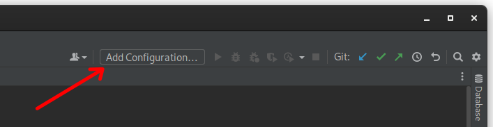
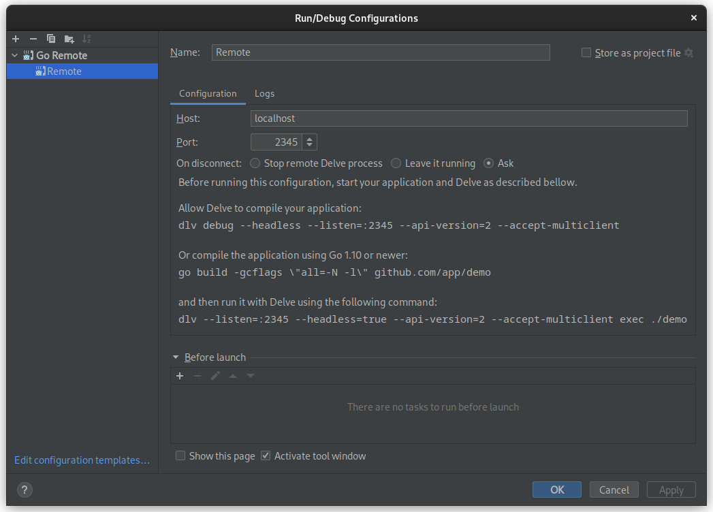
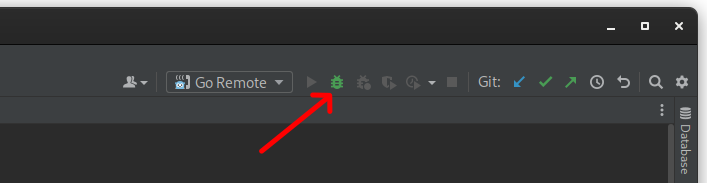

# Debugging the daemon

The Docker daemon inside the development container can be debugged with [Delve](https://github.com/go-delve/delve).

Delve debugger listens on a port, which has to be exposed outside the development container.
Also, in order to be able to debug the daemon, it has to be compiled with the debugging symbols.
This can be done by launching the development container with the following command:

```bash
$ make BIND_DIR=. DOCKER_DEBUG=1 DELVE_PORT=127.0.0.1:2345:2345 shell
```

The `DOCKER_DEBUG` variable disables build optimizations, allowing to debug the binary,
while `DELVE_PORT` publishes the specified port for use with the debugger.

The `DELVE_PORT` variable accepts the port in the same format as Docker CLI's `--publish` (`-p`) option.
This means that the port can be published in multiple ways:

1. `DELVE_PORT=127.0.0.1:2345:2345` - exposes debugger on port `2345` for local development only (recommended)
2. `DELVE_PORT=2345:2345` - exposes debugger on port `2345` without binding to specific IP
3. `DELVE_PORT=2345` - same as above

**IMPORTANT:** Publishing the port without binding it to localhost (127.0.0.1) might expose the debugger
outside the developer's machine and is not recommended.

## Running Docker daemon with debugger attached

1. Run development container with build optimizations disabled and Delve enabled:
   ```bash
   $ make BIND_DIR=. DOCKER_DEBUG=1 DELVE_PORT=127.0.0.1:2345:2345 shell
   ```
2. Inside the development container:
   1. Build the Docker daemon:
      ```bash
      $ ./hack/make.sh binary
      ```
   2. Install the newly-built daemon:
      ```bash
      $ make install
      ```
   3. Run the daemon through the `make.sh` script:
      ```bash
      $ ./hack/make.sh run
      ```
      The execution will stop and wait for the IDE or Delve CLI to attach
      to the port, specified with the `DELVE_PORT` variable.
      Once the IDE or Delve CLI is attached, the execution will continue.
   
## Debugging from IDE (on example of GoLand 2021.3)

1. Open the project in GoLand
2. Click *Add Configuration* on the taskbar
   
3. Create the *Go Remote* configuration. 
   No changes are necessary, unless a different port is to be used.
   
4. Run the Docker binary in the development container, as described in the previous section.
   Make sure that the port in the `DELVE_PORT` variable corresponds to one, used in the *Go Remote* configuration.
5. Run the *Go Remote* configuration.
   The Docker daemon will continue execution inside the container and debugger will stop it on the breakpoints.
   

## Where to go next

Congratulations, you have experienced how to use Delve to debug the Docker daemon
and how to configure an IDE to make use of it.