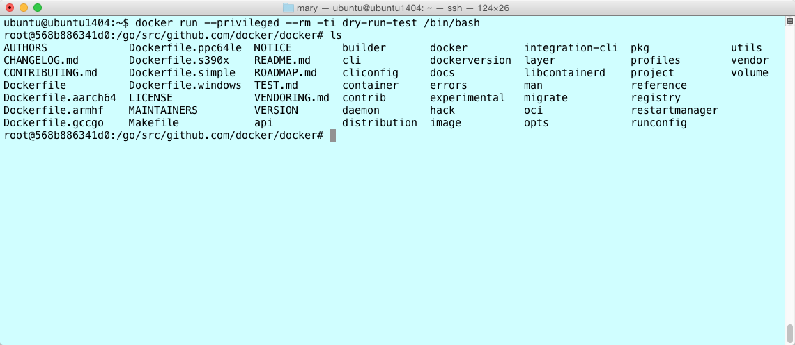

### Work with a development container

In this section, you learn to develop like the Moby Engine core team.
The `moby/moby` repository includes a `Dockerfile` at its root. This file defines
Moby's development environment. The `Dockerfile` lists the environment's
dependencies: system libraries and binaries, Go environment, Go dependencies,
etc.

Moby's development environment is itself, ultimately a Docker container.
You use the `moby/moby` repository and its `Dockerfile` to create a Docker image,
run a Docker container, and develop code in the container.

If you followed the procedures that [set up Git for contributing](./set-up-git.md), you should have a fork of the `moby/moby`
repository. You also created a branch called `dry-run-test`. In this section,
you continue working with your fork on this branch.

##  Task 1. Remove images and containers

Moby developers run the latest stable release of the Docker software. They clean their local hosts of
unnecessary Docker artifacts such as stopped containers or unused images.
Cleaning unnecessary artifacts isn't strictly necessary, but it is good
practice, so it is included here.

To remove unnecessary artifacts:

1. Verify that you have no unnecessary containers running on your host.

   ```none
   $ docker ps -a
   ```

   You should see something similar to the following:

   ```none
   CONTAINER ID        IMAGE               COMMAND             CREATED             STATUS              PORTS               NAMES
   ```

   There are no running or stopped containers on this host. A fast way to
   remove old containers is the following:

   You can now use the `docker system prune` command to achieve this:

   ```none
   $ docker system prune -a
   ```

   Older versions of the Docker Engine should reference the command below:

   ```none
   $ docker rm $(docker ps -a -q)
   ```

   This command uses `docker ps` to list all containers (`-a` flag) by numeric
   IDs (`-q` flag). Then, the `docker rm` command removes the resulting list.
   If you have running but unused containers, stop and then remove them with
   the `docker stop` and `docker rm` commands.

2. Verify that your host has no dangling images.

   ```none
   $ docker images
   ```

   You should see something similar to the following:

   ```none
   REPOSITORY          TAG                 IMAGE ID            CREATED             SIZE
   ```

   This host has no images. You may have one or more _dangling_ images. A
   dangling image is not used by a running container and is not an ancestor of
   another image on your system. A fast way to remove dangling image is
   the following:

   ```none
   $ docker rmi -f $(docker images -q -a -f dangling=true)
   ```

   This command uses `docker images` to list all images (`-a` flag) by numeric
   IDs (`-q` flag) and filter them to find dangling images (`-f dangling=true`).
   Then, the `docker rmi` command forcibly (`-f` flag) removes
   the resulting list. If you get a "docker: "rmi" requires a minimum of 1 argument."
   message, that means there were no dangling images. To remove just one image, use the
   `docker rmi ID` command.

## Task 2. Start a development container

If you followed the last procedure, your host is clean of unnecessary images and
containers. In this section, you build an image from the Engine development
environment and run it in the container. Both steps are automated for you by the
Makefile in the Engine code repository. The first time you build an image, it
can take over 15 minutes to complete.

1. Open a terminal.

   For [Docker Toolbox](https://github.com/docker/toolbox) users, use `docker-machine status your_vm_name` to make sure your VM is running. You
   may need to run `eval "$(docker-machine env your_vm_name)"` to initialize your
   shell environment. If you use Docker for Mac or Docker for Windows, you do not need
   to use Docker Machine.

2. Change into the root of the `moby-fork` repository.

   ```none
   $ cd ~/repos/moby-fork
   ```

   If you are following along with this guide, you created a `dry-run-test`
   branch when you [set up Git for contributing](./set-up-git.md).

3. Ensure you are on your `dry-run-test` branch.

   ```none
   $ git checkout dry-run-test
   ```

   If you get a message that the branch doesn't exist, add the `-b` flag (`git checkout -b dry-run-test`) so the
   command both creates the branch and checks it out.

4. Use `make` to build a development environment image and run it in a container.

   ```none
   $ make BIND_DIR=. shell
   ```

   Using the instructions in the
   `Dockerfile`, the build may need to download and / or configure source and other images. On first build this process may take between 5 - 15 minutes to create an image. The command returns informational messages as it runs.  A
   successful build returns a final message and opens a Bash shell into the
   container.

   ```none
   Successfully built 3d872560918e
   Successfully tagged docker-dev:dry-run-test
   docker run --rm -i --privileged -e BUILDFLAGS -e KEEPBUNDLE -e DOCKER_BUILD_GOGC -e DOCKER_BUILD_PKGS -e DOCKER_CLIENTONLY -e DOCKER_DEBUG -e DOCKER_EXPERIMENTAL -e DOCKER_GITCOMMIT -e DOCKER_GRAPHDRIVER=devicemapper -e DOCKER_REMAP_ROOT -e DOCKER_STORAGE_OPTS -e DOCKER_USERLANDPROXY -e TESTDIRS -e TESTFLAGS -e TIMEOUT -v "home/ubuntu/repos/docker/bundles:/go/src/github.com/docker/docker/bundles" -t "docker-dev:dry-run-test" bash
   #
   ```

   At this point, your prompt reflects the container's BASH shell.

5. List the contents of the current directory (`/go/src/github.com/docker/docker`).

   You should see the image's source from the  `/go/src/github.com/docker/docker`
   directory.

   

6. Make a `dockerd` binary.

   ```none
   # hack/make.sh binary
   Removing bundles/

   ---> Making bundle: binary (in bundles/binary)
   Building: bundles/binary-daemon/dockerd-17.06.0-dev
   Created binary: bundles/binary-daemon/dockerd-17.06.0-dev
   Copying nested executables into bundles/binary-daemon

   ```

7. Run `make install`, which copies the binary to the container's
   `/usr/local/bin/` directory.

   ```none
   # make install
   ```

8. Start the Engine daemon running in the background.

   ```none
   # dockerd -D &
   ...output snipped...
   DEBU[0001] Registering POST, /networks/{id:.*}/connect
   DEBU[0001] Registering POST, /networks/{id:.*}/disconnect
   DEBU[0001] Registering DELETE, /networks/{id:.*}
   INFO[0001] API listen on /var/run/docker.sock
   DEBU[0003] containerd connection state change: READY
   ```

   The `-D` flag starts the daemon in debug mode. The `&` starts it as a
   background process. You'll find these options useful when debugging code
   development. You will need to hit `return` in order to get back to your shell prompt.

   > **Note**: The following command automates the `build`,
   > `install`, and `run` steps above. Once the command below completes, hit `ctrl-z` to suspend the process, then run `bg 1` and hit `enter` to resume the daemon process in the background and get back to your shell prompt.

   ```none
   hack/make.sh binary install-binary run
   ```

9. Inside your container, check your Docker versions:

   ```none
   # docker version
   Client:
    Version:      17.06.0-ce
    API version:  1.30
    Go version:   go1.8.3
    Git commit:   02c1d87
    Built:        Fri Jun 23 21:15:15 2017
    OS/Arch:      linux/amd64

   Server:
    Version:      dev
    API version:  1.35 (minimum version 1.12)
    Go version:   go1.9.2
    Git commit:   4aa6362da
    Built:        Sat Dec  2 05:22:42 2017
    OS/Arch:      linux/amd64
    Experimental: false
   ```

   Notice the split versions between client and server, which might be
   unexpected. In more recent times the Docker CLI component (which provides the
   `docker` command) has split out from the Moby project and is now maintained in [docker/cli](https://github.com/docker/cli).
   
   The Moby project now defaults to a [fixed
   version](https://github.com/docker/cli/commits/v17.06.0-ce) of the
   `docker` CLI for integration tests.

   You may have noticed the following message when starting the container with the `shell` command:
   
   ```none
   Makefile:123: The docker client CLI has moved to github.com/docker/cli. For a dev-test cycle involving the CLI, run:
   DOCKER_CLI_PATH=/host/path/to/cli/binary make shell
   then change the cli and compile into a binary at the same location.
   ```

   By setting `DOCKER_CLI_PATH` you can supply a newer `docker` CLI to the
   server development container for testing and for `integration-cli`
   test-execution:

   ```none
   make DOCKER_CLI_PATH=/host/path/to/cli/binary/ BIND_DIR=. shell
   ...
   # which docker
   /usr/local/cli/docker
   # docker --version
   Docker version 17.09.0-dev, build 
   ```

    This Docker CLI should be built from the [docker-cli
    project](https://github.com/docker/cli) and needs to be a Linux
    binary. Note that by default, the Linux binary generated by the docker-cli
    project may be outputted in a directory you don't have permission to read.
    In order to locate the Linux binary's exact path for executing the command above,
    use the following:

    ```none
    sudo chmod 775 /directory-name
    ```

   Inside the container you are running a development version. This is the version
   on the current branch. It reflects the value of the `VERSION` file at the
   root of your `docker-fork` repository.

10. Run the `hello-world` image.

    ```none
    # docker run hello-world
    ```

11. List the image you just downloaded.

    ```none
    # docker images
	REPOSITORY   TAG     IMAGE ID      CREATED        SIZE
	hello-world  latest  c54a2cc56cbb  3 months ago   1.85 kB
    ```

12. Open another terminal on your local host.

13. List the container running your development container.

    ```none
    ubuntu@ubuntu1404:~$ docker ps
    CONTAINER ID        IMAGE                     COMMAND             CREATED             STATUS              PORTS               NAMES
    a8b2885ab900        docker-dev:dry-run-test   "hack/dind bash"    43 minutes ago      Up 43 minutes                           hungry_payne
    ```

    Notice that the tag on the container is marked with the `dry-run-test` branch name.


## Task 3. Make a code change

At this point, you have experienced the "Moby inception" technique. That is,
you have:

* forked and cloned the Moby Engine code repository
* created a feature branch for development
* created and started an Engine development container from your branch
* built a binary inside of your development container
* launched a `docker` daemon using your newly compiled binary
* called the `docker` client to run a `hello-world` container inside
  your development container

Running the `make BIND_DIR=. shell` command mounted your local Docker repository source into
your Docker container.

   > **Note**: Inspecting the `Dockerfile` shows a `COPY . /go/src/github.com/docker/docker` instruction, suggesting that dynamic code changes will _not_ be reflected in the container. However inspecting the `Makefile` shows that the current working directory _will_ be mounted via a `-v` volume mount.

When you start to develop code though, you'll
want to iterate code changes and builds inside the container. If you have
followed this guide exactly, you have a bash shell running a development
container.

Try a simple code change and see it reflected in your container. For this
example, you'll edit the help for the `attach` subcommand.

1. If you don't have one, open a terminal in your local host.

2. Make sure you are in your `moby-fork` repository.

   ```none
   $ pwd
   /Users/mary/go/src/github.com/moxiegirl/moby-fork
   ```

   Your location should be different because, at least, your username is
   different.

3. Open the `cmd/dockerd/docker.go` file.

4. Edit the command's help message.

   For example, you can edit this line:

   ```go
   Short:         "A self-sufficient runtime for containers.",
   ```

   And change it to this:

   ```go
   Short:         "A self-sufficient and really fun runtime for containers.",
   ```

5. Save and close the `cmd/dockerd/docker.go` file.

6. Go to your running docker development container shell.

7. Rebuild the binary by using the command `hack/make.sh binary` in the docker development container shell.

8. Stop Docker if it is running.

9. Copy the binaries to **/usr/bin** by entering the following commands in the docker development container shell.

   ```
   hack/make.sh binary install-binary
   ```

10. To view your change, run the `dockerd --help` command in the docker development container shell.

   ```bash
   # dockerd --help

   Usage:        dockerd COMMAND

   A self-sufficient and really fun runtime for containers.

   Options:
   ...

   ```

You've just done the basic workflow for changing the Engine code base. You made
your code changes in your feature branch. Then, you updated the binary in your
development container and tried your change out. If you were making a bigger
change, you might repeat or iterate through this flow several times.

## Where to go next

Congratulations, you have successfully achieved Docker inception. You've had a
small experience of the development process. You've set up your development
environment and verified almost all the essential processes you need to
contribute. Of course, before you start contributing, [you'll need to learn one
more piece of the development process, the test framework](test.md).
