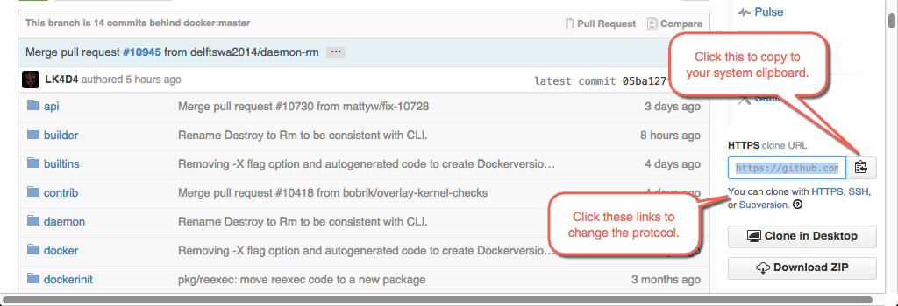
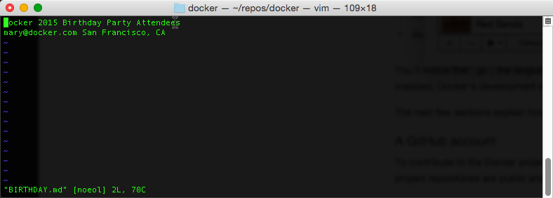
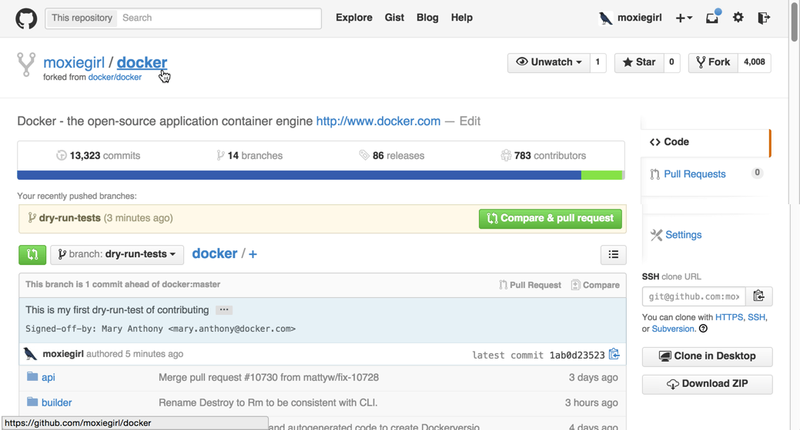

### Configure Git for contributing

Work through this page to configure Git and a repository you'll use throughout
the Contributor Guide. The work you do further in the guide, depends on the work
you do here.

## Task 1. Fork and clone the Moby code

Before contributing, you first fork the Moby code repository. A fork copies
a repository at a particular point in time. GitHub tracks for you where a fork
originates.

As you make contributions, you change your fork's code. When you are ready,
you make a pull request back to the original Docker repository. If you aren't
familiar with this workflow, don't worry, this guide walks you through all the
steps.

To fork and clone Moby:

1. Open a browser and log into GitHub with your account.

2. Go to the <a href="https://github.com/moby/moby"
target="_blank">moby/moby repository</a>.

3. Click the "Fork" button in the upper right corner of the GitHub interface.

    

    GitHub forks the repository to your GitHub account. The original
    `moby/moby` repository becomes a new fork `YOUR_ACCOUNT/moby` under
    your account.

4. Copy your fork's clone URL from GitHub.

    GitHub allows you to use HTTPS or SSH protocols for clones. You can use the
    `git` command line or clients like Subversion to clone a repository.

    

    This guide assume you are using the HTTPS protocol and the `git` command
    line. If you are comfortable with SSH and some other tool, feel free to use
    that instead. You'll need to convert what you see in the guide to what is
    appropriate to your tool.

5. Open a terminal window on your local host and change to your home directory.

   ```bash
   $ cd ~
   ```

    In Windows, you'll work in your Docker Quickstart Terminal window instead of
    Powershell or a `cmd` window.

6. Create a `repos` directory.

   ```bash
   $ mkdir repos
   ```

7. Change into your `repos` directory.

   ```bash
   $ cd repos
   ```

8. Clone the fork to your local host into a repository called `moby-fork`.

   ```bash
   $ git clone https://github.com/moxiegirl/moby.git moby-fork
   ```

    Naming your local repo `moby-fork` should help make these instructions
    easier to follow; experienced coders don't typically change the name.

9. Change directory into your new `moby-fork` directory.

   ```bash
   $ cd moby-fork
   ```

    Take a moment to familiarize yourself with the repository's contents. List
    the contents.

## Task 2. Set your signature and an upstream remote

When you contribute to Docker, you must certify you agree with the
<a href="http://developercertificate.org/" target="_blank">Developer Certificate of Origin</a>.
You indicate your agreement by signing your `git` commits like this:

```
Signed-off-by: Pat Smith <pat.smith@email.com>
```

To create a signature, you configure your username and email address in Git.
You can set these globally or locally on just your `moby-fork` repository.
You must sign with your real name. You can sign your git commit automatically
with `git commit -s`. Moby does not accept anonymous contributions or contributions
through pseudonyms.

As you change code in your fork, you'll want to keep it in sync with the changes
others make in the `moby/moby` repository. To make syncing easier, you'll
also add a _remote_ called `upstream` that points to `moby/moby`. A remote
is just another project version hosted on the internet or network.

To configure your username, email, and add a remote:

1. Change to the root of your `moby-fork` repository.

   ```bash
   $ cd moby-fork
   ```

2. Set your `user.name` for the repository.

   ```bash
   $ git config --local user.name "FirstName LastName"
   ```

3. Set your `user.email` for the repository.

   ```bash
   $ git config --local user.email "emailname@mycompany.com"
   ```

4. Set your local repo to track changes upstream, on the `moby/moby` repository.

   ```bash
   $ git remote add upstream https://github.com/moby/moby.git
   ```

5. Check the result in your `git` configuration.

   ```bash
   $ git config --local -l
   core.repositoryformatversion=0
   core.filemode=true
   core.bare=false
   core.logallrefupdates=true
   remote.origin.url=https://github.com/moxiegirl/moby.git
   remote.origin.fetch=+refs/heads/*:refs/remotes/origin/*
   branch.master.remote=origin
   branch.master.merge=refs/heads/master
   user.name=Mary Anthony
   user.email=mary@docker.com
   remote.upstream.url=https://github.com/moby/moby.git
   remote.upstream.fetch=+refs/heads/*:refs/remotes/upstream/*
   ```

	To list just the remotes use:

   ```bash
   $ git remote -v
   origin	https://github.com/moxiegirl/moby.git (fetch)
   origin	https://github.com/moxiegirl/moby.git (push)
   upstream https://github.com/moby/moby.git (fetch)
   upstream https://github.com/moby/moby.git (push)
   ```

## Task 3. Create and push a branch

As you change code in your fork, make your changes on a repository branch.
The branch name should reflect what you are working on. In this section, you
create a branch, make a change, and push it up to your fork.

This branch is just for testing your config for this guide. The changes are part
of a dry run, so the branch name will be dry-run-test. To create and push
the branch to your fork on GitHub:

1. Open a terminal and go to the root of your `moby-fork`.

   ```bash
   $ cd moby-fork
   ```

2. Create a `dry-run-test` branch.

   ```bash
   $ git checkout -b dry-run-test
   ```

    This command creates the branch and switches the repository to it.

3. Verify you are in your new branch.

   ```bash
   $ git branch
   * dry-run-test
     master
   ```

    The current branch has an * (asterisk) marker. So, these results show you
    are on the right branch.

4. Create a `TEST.md` file in the repository's root.

   ```bash
   $ touch TEST.md
   ```

5. Edit the file and add your email and location.

    

    You can use any text editor you are comfortable with.

6. Save and close the file.

7. Check the status of your branch.

   ```bash
   $ git status
   On branch dry-run-test
   Untracked files:
     (use "git add <file>..." to include in what will be committed)

       TEST.md

   nothing added to commit but untracked files present (use "git add" to track)
   ```

	You've only changed the one file. It is untracked so far by git.

8. Add your file.

   ```bash
   $ git add TEST.md
   ```

    That is the only _staged_ file. Stage is fancy word for work that Git is
    tracking.

9. Sign and commit your change.

   ```bash
   $ git commit -s -m "Making a dry run test."
   [dry-run-test 6e728fb] Making a dry run test
    1 file changed, 1 insertion(+)
    create mode 100644 TEST.md
   ```

    Commit messages should have a short summary sentence of no more than 50
    characters. Optionally, you can also include a more detailed explanation
    after the summary. Separate the summary from any explanation with an empty
    line.

10. Push your changes to GitHub.

    ```bash
    $ git push --set-upstream origin dry-run-test
    Username for 'https://github.com': moxiegirl
    Password for 'https://moxiegirl@github.com':
    ```

    Git prompts you for your GitHub username and password. Then, the command
    returns a result.

    ```bash
    Counting objects: 13, done.
    Compressing objects: 100% (2/2), done.
    Writing objects: 100% (3/3), 320 bytes | 0 bytes/s, done.
    Total 3 (delta 1), reused 0 (delta 0)
    To https://github.com/moxiegirl/moby.git
     * [new branch]      dry-run-test -> dry-run-test
    Branch dry-run-test set up to track remote branch dry-run-test from origin.
    ```

11. Open your browser to GitHub.

12. Navigate to your Moby fork.

13. Make sure the `dry-run-test` branch exists, that it has your commit, and the
commit is signed.

    

## Where to go next

Congratulations, you have finished configuring both your local host environment
and Git for contributing. In the next section you'll [learn how to set up and
work in a Moby development container](set-up-dev-env.md).
