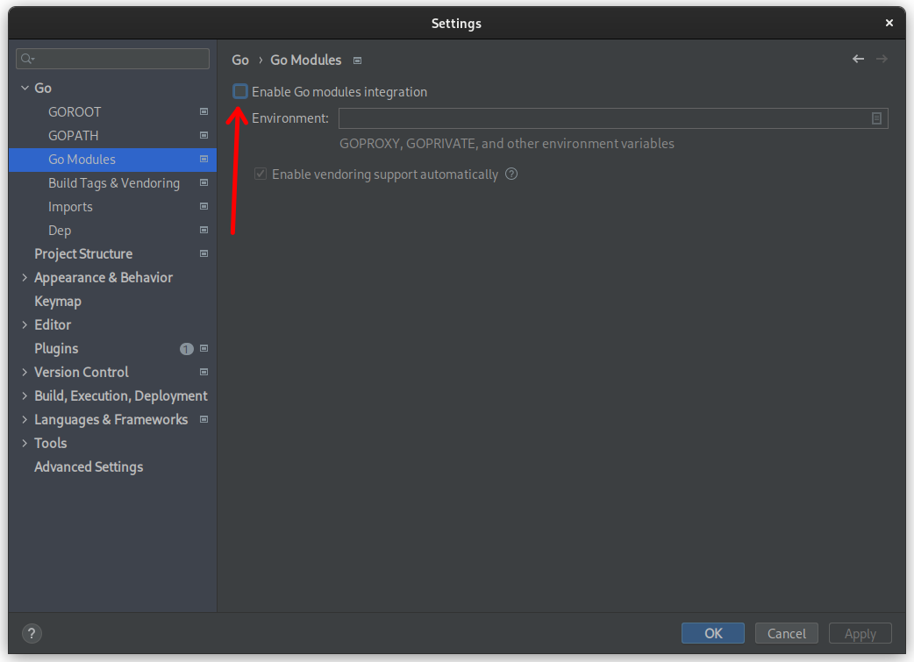
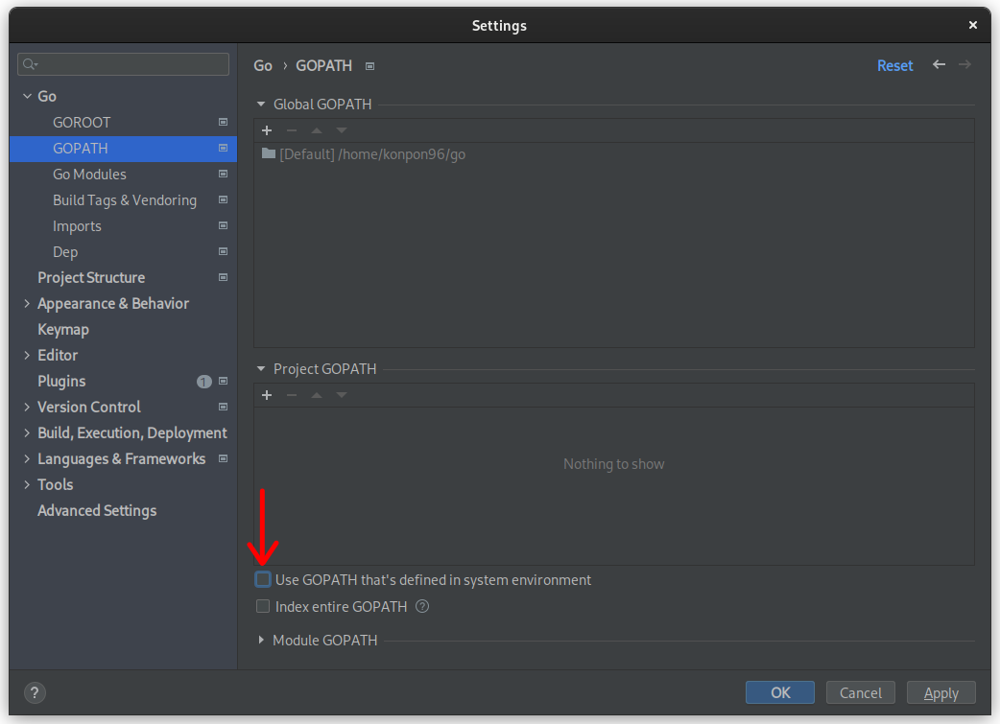
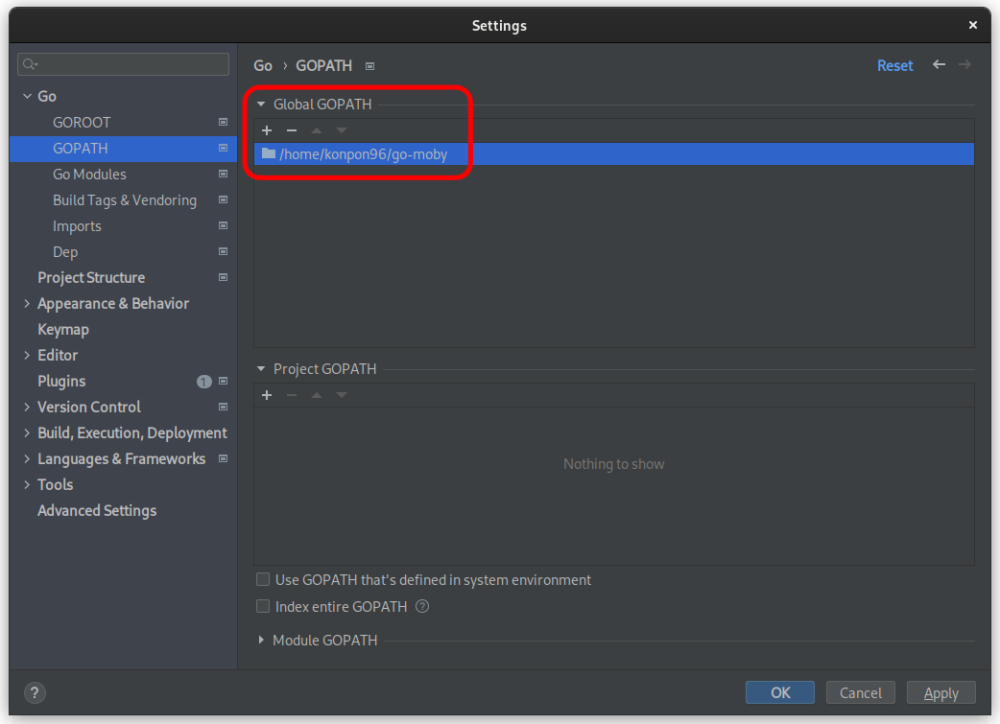

### Configure project for IDE (optional)

In this section you will configure the project in order to make use of [GoLand](https://www.jetbrains.com/go)
integrated development environment's (IDE) features like syntax highlighting and code completion.

## 1. Place repository to the GOPATH

The repository has to be placed under `src` directory in GOPATH.
The default location for Linux and macOS users is `~/go`, while for Windows it is `%USERPROFILE%\go`.

Move the previously cloned repository or clone it again to the `<GOPATH>/src/github.com/docker/docker` directory.

## 2. Configure IDE

Open the `<GOPATH>/src/github.com/docker/docker` directory in GoLand.
Then open the settings (Ctrl+Alt+S) and change two settings:

1. Disable Go modules integration

3. Disable using system environment's GOPATH

### Custom GOPATH

In case the custom GOPATH is used (for example to have multiple copies of the cloned repository),
it has to be configured in the settings as well:

## Where to go next

Congratulations, you have finished configuring project to work with the IDE. 
In the next section you'll [learn how to set up and work in a Moby development container](set-up-dev-env.md).
