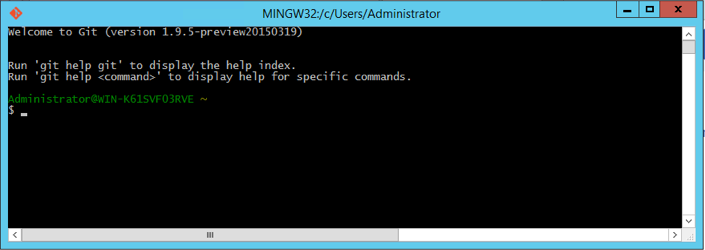

# Run tests

Contributing includes testing your changes. If you change the Moby code, you
may need to add a new test or modify an existing test. Your contribution could
even be adding tests to Moby. For this reason, you need to know a little
about Moby's test infrastructure.

This section describes tests you can run in the `dry-run-test` branch of your Docker
fork. If you have followed along in this guide, you already have this branch.
If you don't have this branch, you can create it or simply use another of your
branches.

## Understand how to test Moby

Moby tests use the Go language's test framework. In this framework, files
whose names end in `_test.go` contain test code; you'll find test files like
this throughout the Moby repo. Use these files for inspiration when writing
your own tests. For information on Go's test framework, see <a
href="http://golang.org/pkg/testing/" target="_blank">Go's testing package
documentation</a> and the <a href="http://golang.org/cmd/go/#hdr-Test_packages"
target="_blank">go test help</a>.

You are responsible for _unit testing_ your contribution when you add new or
change existing Moby code. A unit test is a piece of code that invokes a
single, small piece of code (_unit of work_) to verify the unit works as
expected.

Depending on your contribution, you may need to add _integration tests_. These
are tests that combine two or more work units into one component. These work
units each have unit tests and then, together, integration tests that test the
interface between the components. The `integration` and `integration-cli`
directories in the Docker repository contain integration test code.  Note that
`integration-cli` tests are now deprecated in the Moby project, and new tests
cannot be added to this suite - add `integration` tests instead using the API
client.

Testing is its own specialty. If you aren't familiar with testing techniques,
there is a lot of information available to you on the Web. For now, you should
understand that, the Docker maintainers may ask you to write a new test or
change an existing one.

## Run tests on your local host

Before submitting a pull request with a code change, you should run the entire
Moby Engine test suite. The `Makefile` contains a target for the entire test
suite, named `test`. Also, it contains several targets for
testing:

| Target                 | What this target does                          |
| ---------------------- | ---------------------------------------------- |
| `test`                 | Run the unit, integration, and docker-py tests |
| `test-unit`            | Run just the unit tests                        |
| `test-integration`     | Run the integration tests                      |
| `test-docker-py`       | Run the tests for the Docker API client        |

Running the entire test suite on your current repository can take over half an
hour. To run the test suite, do the following:

1.  Open a terminal on your local host.

2.  Change to the root of your Docker repository.

    ```bash
    $ cd moby-fork
    ```

3.  Make sure you are in your development branch.

    ```bash
    $ git checkout dry-run-test
    ```

4.  Run the `make test` command.

    ```bash
    $ make test
    ```

    This command does several things, it creates a container temporarily for
    testing. Inside that container, the `make`:

    * creates a new binary
    * cross-compiles all the binaries for the various operating systems
    * runs all the tests in the system

    It can take approximately one hour to run all the tests. The time depends
    on your host performance. The default timeout is 60 minutes, which is
    defined in `hack/make.sh` (`${TIMEOUT:=60m}`). You can modify the timeout
    value on the basis of your host performance. When they complete
    successfully, you see the output concludes with something like this:

    ```none
    Ran 68 tests in 79.135s
    ```

## Run targets inside a development container

If you are working inside a development container, you use the
`hack/test/unit` script to run unit-tests, and `hack/make.sh` script to run
integration and other tests. The `hack/make.sh` script doesn't
have a single target that runs all the tests. Instead, you provide a single
command line with multiple targets that does the same thing.

Try this now.

1.  Open a terminal and change to the `moby-fork` root.

2.  Start a Moby development image.

    If you are following along with this guide, you should have a
    `docker-dev:dry-run-test` image.

    ```bash
    $ docker run --privileged --rm -ti -v `pwd`:/go/src/github.com/docker/docker docker-dev:dry-run-test /bin/bash
    ```

3.  Run the unit tests using the `hack/test/unit` script.

    ```bash
    # hack/test/unit
    ```

4.  Run the tests using the `hack/make.sh` script.

    ```bash
    # hack/make.sh dynbinary binary test-integration test-docker-py
    ```

    The tests run just as they did within your local host.

    Of course, you can also run a subset of these targets too. For example, to run
    just the integration tests:

    ```bash
    # hack/make.sh dynbinary binary test-integration
    ```

    Most test targets require that you build these precursor targets first:
    `dynbinary binary`


## Run unit tests

We use golang standard [testing](https://golang.org/pkg/testing/)
package or [gocheck](https://labix.org/gocheck) for our unit tests.

You can use the `TESTDIRS` environment variable to run unit tests for
a single package.

```bash
$ TESTDIRS='github.com/docker/docker/opts' make test-unit
```

You can also use the `TESTFLAGS` environment variable to run a single test. The
flag's value is passed as arguments to the `go test` command. For example, from
your local host you can run the `TestValidateIPAddress` test with this command:

```bash
$ TESTFLAGS='-test.run ^TestValidateIPAddress$' make test-unit
```

On unit tests, it's better to use `TESTFLAGS` in combination with
`TESTDIRS` to make it quicker to run a specific test.

```bash
$ TESTDIRS='github.com/docker/docker/opts' TESTFLAGS='-test.run ^TestValidateIPAddress$' make test-unit
```

## Run integration tests

We use [gocheck](https://labix.org/gocheck) for our integration-cli tests.
You can use the `TESTFLAGS` environment variable to run a single test. The
flag's value is passed as arguments to the `go test` command. For example, from
your local host you can run the `TestDockerCLIBuildSuite` test with this command:

```bash
$ TESTFLAGS='-test.run TestDockerCLIBuildSuite' make test-integration
```

To run the same test inside your Docker development container, you do this:

```bash
# TESTFLAGS='-test.run TestDockerCLIBuildSuite' hack/make.sh binary test-integration
```

## Test the Windows binary against a Linux daemon

This explains how to test the Windows binary on a Windows machine set up as a
development environment. The tests will be run against a daemon
running on a remote Linux machine. You'll use **Git Bash** that came with the
Git for Windows installation. **Git Bash**, just as it sounds, allows you to
run a Bash terminal on Windows.

1.  If you don't have one open already, start a Git Bash terminal.

    

2.  Change to the `moby` source directory.

    ```bash
    $ cd /c/gopath/src/github.com/docker/docker
    ```

3.  Set `DOCKER_REMOTE_DAEMON` as follows:

    ```bash
    $ export DOCKER_REMOTE_DAEMON=1
    ```

4.  Set `DOCKER_TEST_HOST` to the `tcp://IP_ADDRESS:2376` value; substitute your
    Linux machine's actual IP address. For example:

    ```bash
    $ export DOCKER_TEST_HOST=tcp://213.124.23.200:2376
    ```

5.  Make the binary and run the tests:

    ```bash
    $ hack/make.sh binary test-integration
    ```
    Some tests are skipped on Windows for various reasons. You can see which
    tests were skipped by re-running the make and passing in the
   `TESTFLAGS='-test.v'` value. For example

    ```bash
    $ TESTFLAGS='-test.v' hack/make.sh binary test-integration
    ```

    Should you wish to run a single test such as one with the name
    'TestExample', you can pass in `TESTFLAGS='-test.run /TestExample'`. For
    example

    ```bash
    $ TESTFLAGS='-test.run /TestExample' hack/make.sh binary test-integration
    ```

You can now choose to make changes to the Moby source or the tests. If you
make any changes, just run these commands again.

## [Public CI infrastructure](ci.docker.com/public)

The current infrastructure is maintained here: [Moby ci job](https://ci.docker.com/public/job/moby).  The Jenkins infrastructure is for the Moby project is maintained and
managed by Docker Inc.  All contributions against the Jenkinsfile are
appreciated and welcomed!  However we might not be able to fully provide the
infrastructure to test against various architectures in our CI pipelines.  All
jobs can be triggered and re-ran by the Moby maintainers

## Where to go next

Congratulations, you have successfully completed the basics you need to
understand the Moby test framework.
In the next section you'll [learn how to debug Docker daemon, running inside the development container](debug.md).
