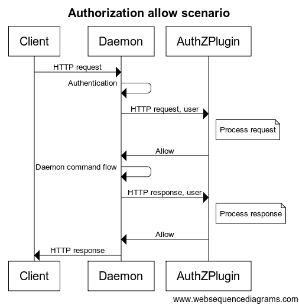
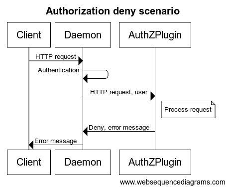

<!-- This file is maintained within the docker/docker Github
     repository at https://github.com/docker/docker/. Make all
     pull requests against that repo. If you see this file in
     another repository, consider it read-only there, as it will
     periodically be overwritten by the definitive file. Pull
     requests which include edits to this file in other repositories
     will be rejected.
-->

# Create an authorization plugin

This document describes the Docker Engine plugins generally available in Docker
Engine. To view information on plugins managed by Docker Engine,
refer to [Docker Engine plugin system](index.md).

Docker's out-of-the-box authorization model is all or nothing. Any user with
permission to access the Docker daemon can run any Docker client command. The
same is true for callers using Docker's Engine API to contact the daemon. If you
require greater access control, you can create authorization plugins and add
them to your Docker daemon configuration. Using an authorization plugin, a
Docker administrator can configure granular access policies for managing access
to Docker daemon.

Anyone with the appropriate skills can develop an authorization plugin. These
skills, at their most basic, are knowledge of Docker, understanding of REST, and
sound programming knowledge. This document describes the architecture, state,
and methods information available to an authorization plugin developer.

## Basic principles

Docker's [plugin infrastructure](plugin_api.md) enables
extending Docker by loading, removing and communicating with
third-party components using a generic API. The access authorization subsystem
was built using this mechanism.

Using this subsystem, you don't need to rebuild the Docker daemon to add an
authorization plugin.  You can add a plugin to an installed Docker daemon. You do
need to restart the Docker daemon to add a new plugin.

An authorization plugin approves or denies requests to the Docker daemon based
on both the current authentication context and the command context. The
authentication context contains all user details and the authentication method.
The command context contains all the relevant request data.

Authorization plugins must follow the rules described in [Docker Plugin API](plugin_api.md).
Each plugin must reside within directories described under the
[Plugin discovery](plugin_api.md#plugin-discovery) section.

**Note**: the abbreviations `AuthZ` and `AuthN` mean authorization and authentication
respectively.

## Default user authorization mechanism

If TLS is enabled in the [Docker daemon](https://docs.docker.com/engine/security/https/), the default user authorization flow extracts the user details from the certificate subject name.
That is, the `User` field is set to the client certificate subject common name, and the `AuthenticationMethod` field is set to `TLS`.

## Basic architecture

You are responsible for registering your plugin as part of the Docker daemon
startup. You can install multiple plugins and chain them together. This chain
can be ordered. Each request to the daemon passes in order through the chain.
Only when all the plugins grant access to the resource, is the access granted.

When an HTTP request is made to the Docker daemon through the CLI or via the
Engine API, the authentication subsystem passes the request to the installed
authentication plugin(s). The request contains the user (caller) and command
context. The plugin is responsible for deciding whether to allow or deny the
request.

The sequence diagrams below depict an allow and deny authorization flow:





Each request sent to the plugin includes the authenticated user, the HTTP
headers, and the request/response body. Only the user name and the
authentication method used are passed to the plugin. Most importantly, no user
credentials or tokens are passed. Finally, not all request/response bodies
are sent to the authorization plugin. Only those request/response bodies where
the `Content-Type` is either `text/*` or `application/json` are sent.

For commands that can potentially hijack the HTTP connection (`HTTP
Upgrade`), such as `exec`, the authorization plugin is only called for the
initial HTTP requests. Once the plugin approves the command, authorization is
not applied to the rest of the flow. Specifically, the streaming data is not
passed to the authorization plugins. For commands that return chunked HTTP
response, such as `logs` and `events`, only the HTTP request is sent to the
authorization plugins.

During request/response processing, some authorization flows might
need to do additional queries to the Docker daemon. To complete such flows,
plugins can call the daemon API similar to a regular user. To enable these
additional queries, the plugin must provide the means for an administrator to
configure proper authentication and security policies.

## Docker client flows

To enable and configure the authorization plugin, the plugin developer must
support the Docker client interactions detailed in this section.

### Setting up Docker daemon

Enable the authorization plugin with a dedicated command line flag in the
`--authorization-plugin=PLUGIN_ID` format. The flag supplies a `PLUGIN_ID`
value. This value can be the plugin’s socket or a path to a specification file.
Authorization plugins can be loaded without restarting the daemon. Refer
to the [`dockerd` documentation](../reference/commandline/dockerd.md#configuration-reloading) for more information.

```bash
$ dockerd --authorization-plugin=plugin1 --authorization-plugin=plugin2,...
```

Docker's authorization subsystem supports multiple `--authorization-plugin` parameters.

### Calling authorized command (allow)

```bash
$ docker pull centos
...
f1b10cd84249: Pull complete
...
```

### Calling unauthorized command (deny)

```bash
$ docker pull centos
...
docker: Error response from daemon: authorization denied by plugin PLUGIN_NAME: volumes are not allowed.
```

### Error from plugins

```bash
$ docker pull centos
...
docker: Error response from daemon: plugin PLUGIN_NAME failed with error: AuthZPlugin.AuthZReq: Cannot connect to the Docker daemon. Is the docker daemon running on this host?.
```

## API schema and implementation

In addition to Docker's standard plugin registration method, each plugin
should implement the following two methods:

* `/AuthZPlugin.AuthZReq` This authorize request method is called before the Docker daemon processes the client request.

* `/AuthZPlugin.AuthZRes` This authorize response method is called before the response is returned from Docker daemon to the client.

#### /AuthZPlugin.AuthZReq

**Request**:

```json
{
    "User":              "The user identification",
    "UserAuthNMethod":   "The authentication method used",
    "RequestMethod":     "The HTTP method",
    "RequestURI":        "The HTTP request URI",
    "RequestBody":       "Byte array containing the raw HTTP request body",
    "RequestHeader":     "Byte array containing the raw HTTP request header as a map[string][]string "
}
```

**Response**:

```json
{
    "Allow": "Determined whether the user is allowed or not",
    "Msg":   "The authorization message",
    "Err":   "The error message if things go wrong"
}
```
#### /AuthZPlugin.AuthZRes

**Request**:

```json
{
    "User":              "The user identification",
    "UserAuthNMethod":   "The authentication method used",
    "RequestMethod":     "The HTTP method",
    "RequestURI":        "The HTTP request URI",
    "RequestBody":       "Byte array containing the raw HTTP request body",
    "RequestHeader":     "Byte array containing the raw HTTP request header as a map[string][]string",
    "ResponseBody":      "Byte array containing the raw HTTP response body",
    "ResponseHeader":    "Byte array containing the raw HTTP response header as a map[string][]string",
    "ResponseStatusCode":"Response status code"
}
```

**Response**:

```json
{
   "Allow":              "Determined whether the user is allowed or not",
   "Msg":                "The authorization message",
   "Err":                "The error message if things go wrong"
}
```

### Request authorization

Each plugin must support two request authorization messages formats, one from the daemon to the plugin and then from the plugin to the daemon. The tables below detail the content expected in each message.

#### Daemon -> Plugin

Name                   | Type              | Description
-----------------------|-------------------|-------------------------------------------------------
User                   | string            | The user identification
Authentication method  | string            | The authentication method used
Request method         | enum              | The HTTP method (GET/DELETE/POST)
Request URI            | string            | The HTTP request URI including API version (e.g., v.1.17/containers/json)
Request headers        | map[string]string | Request headers as key value pairs (without the authorization header)
Request body           | []byte            | Raw request body


#### Plugin -> Daemon

Name    | Type   | Description
--------|--------|----------------------------------------------------------------------------------
Allow   | bool   | Boolean value indicating whether the request is allowed or denied
Msg     | string | Authorization message (will be returned to the client in case the access is denied)
Err     | string | Error message (will be returned to the client in case the plugin encounter an error. The string value supplied may appear in logs, so should not include confidential information)

### Response authorization

The plugin must support two authorization messages formats, one from the daemon to the plugin and then from the plugin to the daemon. The tables below detail the content expected in each message.

#### Daemon -> Plugin


Name                    | Type              | Description
----------------------- |------------------ |----------------------------------------------------
User                    | string            | The user identification
Authentication method   | string            | The authentication method used
Request method          | string            | The HTTP method (GET/DELETE/POST)
Request URI             | string            | The HTTP request URI including API version (e.g., v.1.17/containers/json)
Request headers         | map[string]string | Request headers as key value pairs (without the authorization header)
Request body            | []byte            | Raw request body
Response status code    | int               | Status code from the docker daemon
Response headers        | map[string]string | Response headers as key value pairs
Response body           | []byte            | Raw docker daemon response body


#### Plugin -> Daemon

Name    | Type   | Description
--------|--------|----------------------------------------------------------------------------------
Allow   | bool   | Boolean value indicating whether the response is allowed or denied
Msg     | string | Authorization message (will be returned to the client in case the access is denied)
Err     | string | Error message (will be returned to the client in case the plugin encounter an error. The string value supplied may appear in logs, so should not include confidential information)
