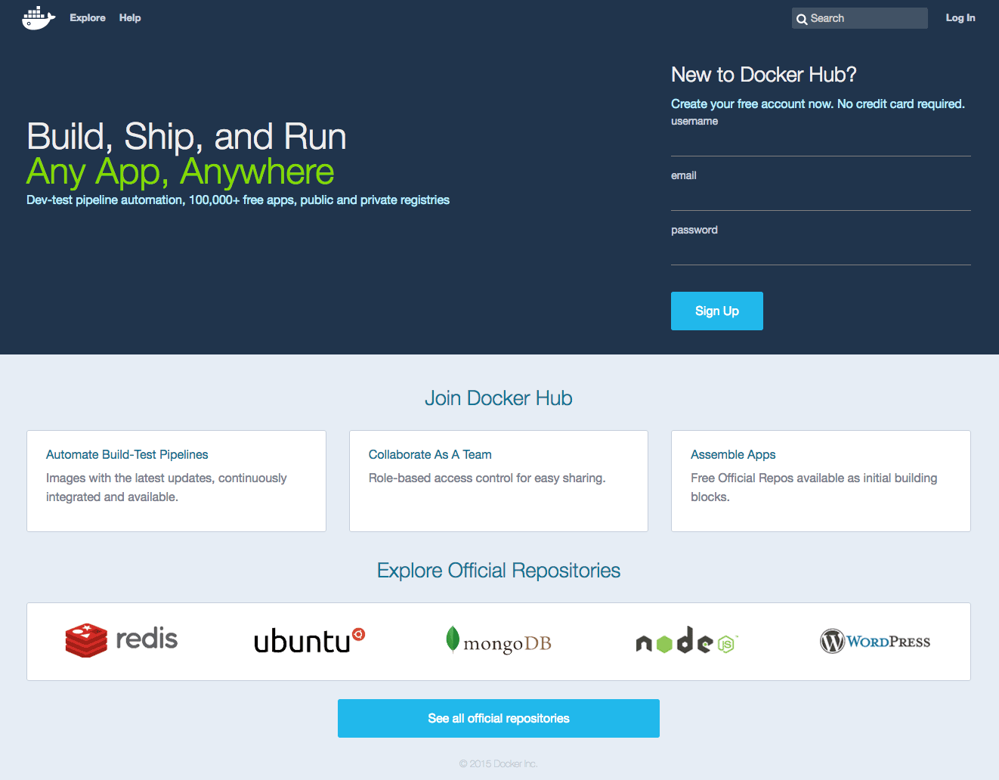
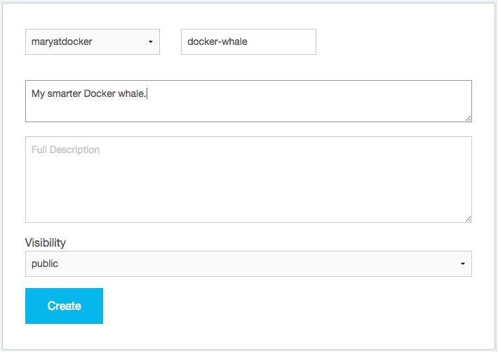

<!--[metadata]>
+++
aliases = [
"/mac/step_five/",
"/windows/step_five/",
"/linux/step_five/",
]
title = "Create a Docker Hub account & repository"
description = "Getting started with Docker"
keywords = ["beginner, getting started, Docker"]
[menu.main]
identifier = "getstart_docker_hub"
parent = "tutorial_getstart_menu"
weight = 5
+++
<![end-metadata]-->

# Create a Docker Hub account & repository

You've built something really cool, you should share it. In this next section,
you'll do just that. You'll need a Docker Hub account. Then, you'll push your
image up to it so other people with Docker Engine can run it.

## Step 1: Sign up for an account

1. Use your browser to navigate to <a href="https://hub.docker.com/?utm_source=getting_started_guide&utm_medium=embedded_MacOSX&utm_campaign=create_docker_hub_account" target="_blank">the Docker Hub signup page</a>.

	Your browser displays the page.

	

2. Fill out the form on the signup page.

	Docker Hub is free. Docker does need a name, password, and email address.

3. Press **Signup**.

	The browser displays the welcome to Docker Hub page.

## Step 2: Verify your email and add a repository

Before you can share anything on the hub, you need to verify your email address.

1. Open your email inbox.

2. Look for the email titled `Please confirm email for your Docker Hub account`.

	  If you don't see the email, check your Spam folder or wait a moment for the email to arrive.

2. Open the email and click the **Confirm Your Email** button.

	 The browser opens Docker Hub to your profile page.

4. Choose **Create Repository**.

	The browser opens the **Create Repository** page.

5. Provide a Repository Name and Short Description.

6. Make sure Visibility is set to **Public**.

    When you are done, your form should look similar to the following:

	

6. Press **Create** when you are done.

	Docker Hub creates your new repository.

## Where to go next

On this page, you opened an account on Docker Hub and created a new repository.
In the next section, you populate the repository [by tagging and pushing the
image you created earlier](step_six.md).

&nbsp;
