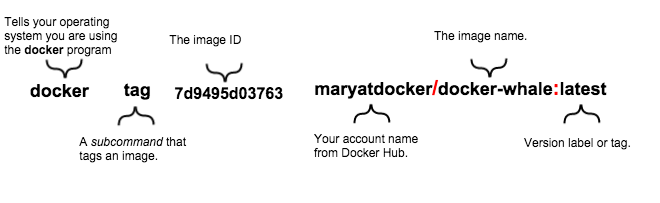
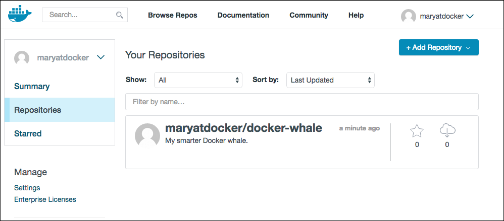

<!--[metadata]>
+++
aliases = [
"/mac/step_six/",
"/windows/step_six/",
"/linux/step_six/",
]
title = "Tag, push, & pull your image"
description = "Getting started with Docker"
keywords = ["beginner, getting started, Docker"]
[menu.main]
identifier = "getstart_tag_push_pull"
parent = "tutorial_getstart_menu"
weight = 6
+++
<![end-metadata]-->

# Tag, push, and pull your image

In this section, you tag and push your `docker-whale` image to your newly
created repository. When you are done, you test the repository by pulling your
new image.

## Step 1: Tag and push the image

If you don't already have a terminal open, open one now:

1. Go back to your command line terminal.

2. At the prompt, type `docker images` to list the images you currently have:

        $ docker images
        REPOSITORY           TAG          IMAGE ID            CREATED             VIRTUAL SIZE
        docker-whale         latest       7d9495d03763        38 minutes ago      273.7 MB
        <none>               <none>       5dac217f722c        45 minutes ago      273.7 MB
        docker/whalesay      latest       fb434121fc77        4 hours ago         247 MB
        hello-world          latest       91c95931e552        5 weeks ago         910 B

5. Find the `IMAGE ID` for your `docker-whale` image.

  	 In this example, the id is `7d9495d03763`.

     Notice that currently, the `REPOSITORY` shows the repo name `docker-whale`
     but not the namespace. You need to include the `namespace` for Docker Hub to
     associate it with your account. The `namespace` is the same as your Docker
     Hub account name. You need to rename the image to
     `YOUR_DOCKERHUB_NAME/docker-whale`.

6. Use `IMAGE ID` and the `docker tag` command to tag your `docker-whale` image.

    The command you type looks like this:

    

    Of course, your account name will be your own. So, you type the command with
    your image's ID and your account name and press RETURN.

		$ docker tag 7d9495d03763 maryatdocker/docker-whale:latest

7. Type the `docker images` command again to see your newly tagged image.

        $ docker images
        REPOSITORY                  TAG       IMAGE ID        CREATED          VIRTUAL SIZE
        maryatdocker/docker-whale   latest    7d9495d03763    5 minutes ago    273.7 MB
        docker-whale                latest    7d9495d03763    2 hours ago      273.7 MB
        <none>                      <none>    5dac217f722c    5 hours ago      273.7 MB
        docker/whalesay             latest    fb434121fc77    5 hours ago      247 MB
        hello-world                 latest    91c95931e552    5 weeks ago      910 B

8. Use the `docker login` command to log into the Docker Hub from the command line.

    The format for the login command is:

        docker login --username=yourhubusername --email=youremail@company.com

    When prompted, enter your password and press enter. So, for example:

        $ docker login --username=maryatdocker --email=mary@docker.com
        Password:
        WARNING: login credentials saved in C:\Users\sven\.docker\config.json
        Login Succeeded

9. Type the `docker push` command to push your image to your new repository.

		$ docker push maryatdocker/docker-whale
			The push refers to a repository [maryatdocker/docker-whale] (len: 1)
			7d9495d03763: Image already exists
			c81071adeeb5: Image successfully pushed
			eb06e47a01d2: Image successfully pushed
			fb434121fc77: Image successfully pushed
			5d5bd9951e26: Image successfully pushed
			99da72cfe067: Image successfully pushed
			1722f41ddcb5: Image successfully pushed
			5b74edbcaa5b: Image successfully pushed
			676c4a1897e6: Image successfully pushed
			07f8e8c5e660: Image successfully pushed
			37bea4ee0c81: Image successfully pushed
			a82efea989f9: Image successfully pushed
			e9e06b06e14c: Image successfully pushed
			Digest: sha256:ad89e88beb7dc73bf55d456e2c600e0a39dd6c9500d7cd8d1025626c4b985011

10. Return to your profile on Docker Hub to see your new image.

  

## Step 2: Pull your new image

In this last section, you'll pull the image you just pushed to hub. Before you
do that though, you'll need to remove the original image from your local
machine. If you left the original image on your machine. Docker would not pull
from the hub &mdash; why would it? The two images are identical.

1. Make sure Docker is running, and open a command line terminal.

2. At the prompt, type `docker images` to list the images you currently have on your local machine.

		$ docker images
		REPOSITORY                  TAG       IMAGE ID        CREATED          VIRTUAL SIZE
		maryatdocker/docker-whale   latest    7d9495d03763    5 minutes ago    273.7 MB
		docker-whale                latest    7d9495d03763    2 hours ago      273.7 MB
		<none>                      <none>    5dac217f722c    5 hours ago      273.7 MB
		docker/whalesay             latest    fb434121fc77    5 hours ago      247 MB
		hello-world                 latest    91c95931e552    5 weeks ago      910 B

    To make a good test, you need to remove the `maryatdocker/docker-whale` and
   `docker-whale` images from your local system. Removing them forces the next
   `docker pull` to get the image from your repository.

3. Use the `docker rmi` to remove the `maryatdocker/docker-whale` and `docker-whale`
images.

	You can use an ID or the name to remove an image.

		$ docker rmi -f 7d9495d03763
		$ docker rmi -f docker-whale

4. Pull and load a new image from your repository using the `docker run` command.

    The command you type should include your username from Docker Hub.

         docker run yourusername/docker-whale

	Since the image is no longer available on your local system, Docker downloads it.

		$ docker run maryatdocker/docker-whale
		Unable to find image 'maryatdocker/docker-whale:latest' locally
		latest: Pulling from maryatdocker/docker-whale
		eb06e47a01d2: Pull complete
		c81071adeeb5: Pull complete
		7d9495d03763: Already exists
		e9e06b06e14c: Already exists
		a82efea989f9: Already exists
		37bea4ee0c81: Already exists
		07f8e8c5e660: Already exists
		676c4a1897e6: Already exists
		5b74edbcaa5b: Already exists
		1722f41ddcb5: Already exists
		99da72cfe067: Already exists
		5d5bd9951e26: Already exists
		fb434121fc77: Already exists
		Digest: sha256:ad89e88beb7dc73bf55d456e2c600e0a39dd6c9500d7cd8d1025626c4b985011
		Status: Downloaded newer image for maryatdocker/docker-whale:latest
         ________________________________________
        / Having wandered helplessly into a      \
        | blinding snowstorm Sam was greatly     |
        | relieved to see a sturdy Saint Bernard |
        | dog bounding toward him with the       |
        | traditional keg of brandy strapped to  |
        | his collar.                            |
        |                                        |
        | "At last," cried Sam, "man's best      |
        \ friend -- and a great big dog, too!"   /
         ----------------------------------------
                        \
                         \
                          \
                                  ##        .
                            ## ## ##       ==
                         ## ## ## ##      ===
                     /""""""""""""""""___/ ===
                ~~~ {~~ ~~~~ ~~~ ~~~~ ~~ ~ /  ===- ~~~
                     \______ o          __/
                      \    \        __/
                        \____\______/

## Where to go next

You've done a lot, you've done all of the following fundamental Docker tasks.

* installed Docker
* run a software image in a container
* located an interesting image on Docker Hub
* run the image on your own machine
* modified an image to create your own and run it
* create a Docker Hub account and repository
* pushed your image to Docker Hub for others to share

<a href="https://twitter.com/intent/tweet?button_hashtag=dockerdocs&text=Just%20ran%20a%20container%20with%20an%20image%20I%20built.%20Find%20it%20on%20%23dockerhub.%20Build%20your%20own%3A%20http%3A%2F%2Fgoo.gl%2FMUi7cA" class="twitter-hashtag-button" data-size="large" data-related="docker" target="_blank">Tweet your accomplishment!</a>

You've only scratched the surface of what Docker can do. Go to the next page to [learn more](last_page.md).

&nbsp;
