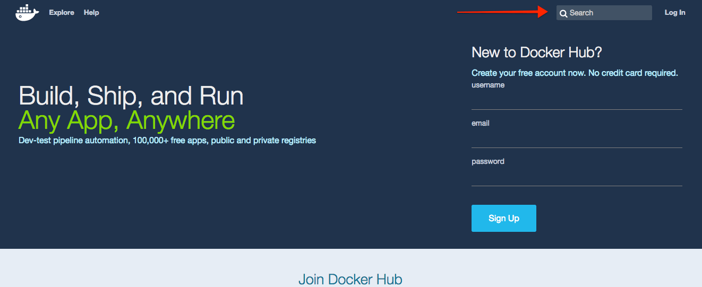
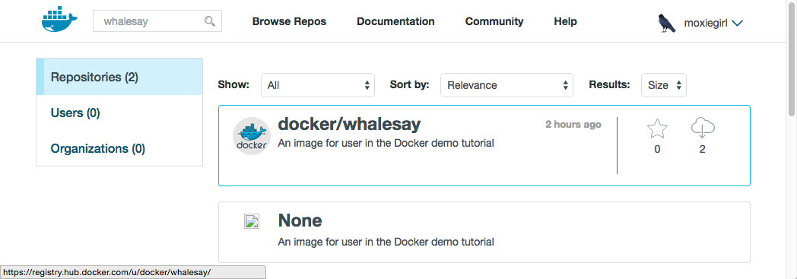
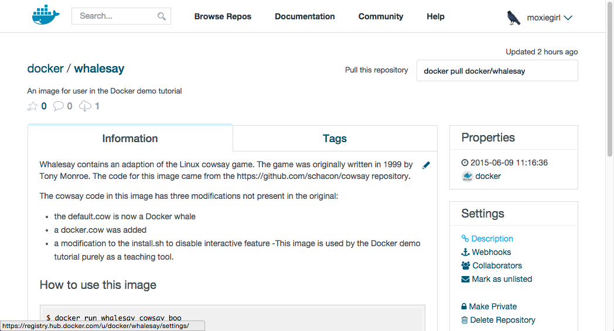

<!--[metadata]>
+++
aliases = [
"/mac/step_three/",
"/windows/step_three/",
"/linux/step_three/",
]
title = "Find & run the whalesay image"
description = "Getting started with Docker"
keywords = ["beginner, getting started, Docker"]
[menu.main]
identifier = "getstart_locate"
parent = "tutorial_getstart_menu"
weight = 3
+++
<![end-metadata]-->

# Find and run the whalesay image

People all over the world create Docker images. You can find these images by
browsing the Docker Hub. In this next section, you'll search for and find the
image you'll use in the rest of this getting started.

## Step 1: Locate the whalesay image

1. Open your browser and  <a href="https://hub.docker.com/?utm_source=getting_started_guide&utm_medium=embedded_MacOSX&utm_campaign=find_whalesay" target=_blank> browse to the Docker Hub</a>.

    

	The Docker Hub contains images from individuals like you and official images
	from organizations like RedHat, IBM, Google, and a whole lot more.

2. Click **Browse & Search**.

    The browser opens the search page.

3. Enter the word `whalesay` in the search bar.

    

4. Click on the **docker/whalesay** image in the results.

    The browser displays the repository for the **whalesay** image.

    

	  Each image repository contains information about an image. It should
    include information such as what kind of software the image contains and
    how to use it. You may notice that the **whalesay** image is based on a
    Linux distribution called Ubuntu. In the next step, you run the **whalesay** image on your machine.

## Step 2: Run the whalesay image

Make sure Docker is running. On Docker for Mac and Docker for Windows, this is indicated by the Docker whale showing in the status bar.

1. Open a command-line terminal.

2. Type the `docker run docker/whalesay cowsay boo` command and press RETURN.

    This command runs the **whalesay** image in a container. Your terminal should look like the following:

        $ docker run docker/whalesay cowsay boo
        Unable to find image 'docker/whalesay:latest' locally
        latest: Pulling from docker/whalesay
        e9e06b06e14c: Pull complete
        a82efea989f9: Pull complete
        37bea4ee0c81: Pull complete
        07f8e8c5e660: Pull complete
        676c4a1897e6: Pull complete
        5b74edbcaa5b: Pull complete
        1722f41ddcb5: Pull complete
        99da72cfe067: Pull complete
        5d5bd9951e26: Pull complete
        fb434121fc77: Already exists
        Digest: sha256:d6ee73f978a366cf97974115abe9c4099ed59c6f75c23d03c64446bb9cd49163
        Status: Downloaded newer image for docker/whalesay:latest
         _____
        < boo >
         -----
            \
             \
              \     
                            ##        .            
                      ## ## ##       ==            
                   ## ## ## ##      ===            
               /""""""""""""""""___/ ===        
          ~~~ {~~ ~~~~ ~~~ ~~~~ ~~ ~ /  ===- ~~~   
               \______ o          __/            
                \    \        __/             
                  \____\______/   

	The first time you run a software image, the `docker` command looks for it
	on your local system. If the image isn't there, then `docker` gets it from
	the hub.

5. While still in the command line terminal, type `docker images` command and press RETURN.

    The command lists all the images on your local system. You should see
    `docker/whalesay` in the list.

        $ docker images
        REPOSITORY           TAG         IMAGE ID            CREATED            SIZE
        docker/whalesay      latest      fb434121fc77        3 hours ago        247 MB
        hello-world          latest      91c95931e552        5 weeks ago        910 B

    When you run an image in a container, Docker downloads the image to your
    computer. This local copy of the image saves you time.  Docker only
    downloads the image again if the image's source changes on the hub.  You
    can, of course, delete the image yourself. You'll learn more about that
    later. Let's leave the image there for now because we are going to use it
    later.

6. Take a moment to play with the **whalesay** container a bit.

    Try running the `whalesay` image again with a word or phrase. Try a long or
    short phrase.  Can you break the cow?

        $ docker run docker/whalesay cowsay boo-boo
         _________
        < boo-boo >
         ---------
            \
             \
              \     
                            ##        .            
                      ## ## ##       ==            
                   ## ## ## ##      ===            
               /""""""""""""""""___/ ===        
          ~~~ {~~ ~~~~ ~~~ ~~~~ ~~ ~ /  ===- ~~~   
               \______ o          __/            
                \    \        __/             
                  \____\______/   

## Where to go next

On this page, you learned to search for images on Docker Hub. You used your
command line to run an image. Think about it, effectively you ran a piece of
Linux software on your Mac computer.  You learned that running an image copies
it on your computer.  Now, you are ready to create your own Docker image.
Go on to the next part [to build your own image](step_four.md).

&nbsp;
