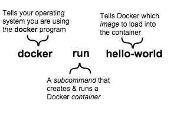

<!--[metadata]>
+++
aliases = [
"/mac/step_two/",
"/windows/step_two/",
"/linux/step_two/",
]
title = "Understand images & containers"
description = "Getting started with Docker"
keywords = ["beginner, getting started, Docker"]
[menu.main]
identifier = "getstart_understand"
parent = "tutorial_getstart_menu"
weight = 2
+++
<![end-metadata]-->

#  Learn about images & containers

Docker Engine provides the core Docker technology that enables images and
containers. As the last step in your installation, you ran the
`docker run hello-world` command. The command you ran had three parts.

An *image* is a filesystem and parameters to use at runtime. It doesn't have
state and never changes. A *container* is a running instance of an image.
When you ran the command, Docker Engine:

* checked to see if you had the `hello-world` software image
* downloaded the image from the Docker Hub (more about the hub later)
* loaded the image into the container and "ran" it

Depending on how it was built, an image might run a simple, single command and then exit. This is what `Hello-World` did.

A Docker image, though, is capable of much more. An image can start software as complex as a database, wait for you (or someone else) to add data, store the data for later use, and then wait for the next person.

Who built the `hello-world` software image though? In this case, Docker did but anyone can. Docker Engine lets people (or companies) create and share software through Docker images. Using Docker Engine, you don't have to worry about whether your computer can run the software in a Docker image &mdash; a Docker container *can always run it*.

## Where to go next

See, that was quick wasn't it? Now, you are ready to do some really fun stuff with Docker.
Go on to the next part [to find and run the whalesay image](step_three.md).

&nbsp;
