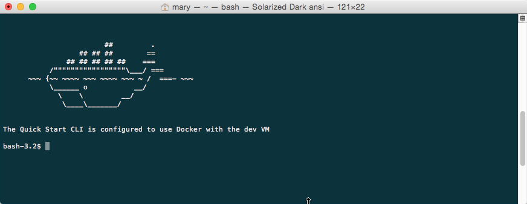
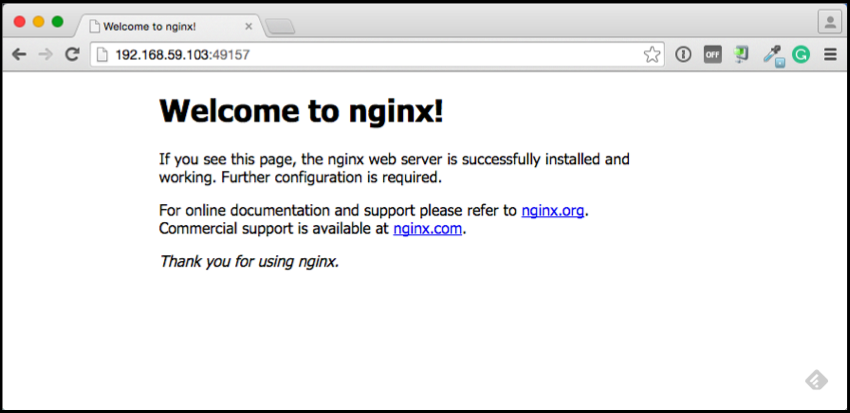

<!--[metadata]>
+++
title = "Installation on Mac OS X"
description = "Instructions for installing Docker on OS X using boot2docker."
keywords = ["Docker, Docker documentation, requirements, boot2docker, VirtualBox, SSH, Linux, OSX, OS X,  Mac"]
[menu.main]
parent = "smn_engine"
+++
<![end-metadata]-->

# Mac OS X

> **Note**: This release of Docker deprecates the Boot2Docker command line in
> favor of Docker Machine.  Use the Docker Toolbox to install Docker Machine as
> well as the other Docker tools.

You install Docker using Docker Toolbox. Docker Toolbox includes the following Docker tools:

* Docker Machine for running the `docker-machine` binary
* Docker Engine for running the `docker` binary
* Docker Compose for running the `docker-compose` binary
* Kitematic, the Docker GUI
* a shell preconfigured for a Docker command-line environment
* Oracle VM VirtualBox

Because the Docker daemon uses Linux-specific kernel features, you can't run
Docker natively in OS X. Instead, you must use `docker-machine` to create and
attach to a virtual machine (VM). This machine is a Linux VM that hosts Docker
for you on your Mac.

**Requirements**

Your Mac must be running OS X 10.8 "Mountain Lion" or newer to install the
Docker Toolbox.

### Learn the key concepts before installing

In a Docker installation on Linux, your physical machine is both the localhost
and the Docker host. In networking, localhost means your computer. The Docker
host is the computer on which the containers run.

On a typical Linux installation, the Docker client, the Docker daemon, and any
containers run directly on your localhost. This means you can address ports on a
Docker container using standard localhost addressing such as `localhost:8000` or
`0.0.0.0:8376`.

In an OS X installation, the `docker` daemon is running inside a Linux VM called
`default`. The `default` is a lightweight Linux VM made specifically to run
the Docker daemon on Mac OS X. The VM runs completely from RAM, is a small ~24MB
download, and boots in approximately 5s.

In OS X, the Docker host address is the address of the Linux VM. When you start
the VM with `docker-machine` it is assigned an IP address. When you start a
container, the ports on a container map to ports on the VM. To see this in
practice, work through the exercises on this page.

### Installation

If you have VirtualBox running, you must shut it down before running the
installer.

1. Go to the [Docker Toolbox](https://www.docker.com/toolbox) page.

2. Click the installer link to download.

3. Install Docker Toolbox by double-clicking the package or by right-clicking
and choosing "Open" from the pop-up menu.

    The installer launches the "Install Docker Toolbox" dialog.

    

4. Press "Continue" to install the toolbox.

    The installer presents you with options to customize the standard
    installation.

    

    By default, the standard Docker Toolbox installation:

    * installs binaries for the Docker tools in `/usr/local/bin`
    * makes these binaries available to all users
    * installs VirtualBox; or updates any existing installation

    Change these defaults by pressing "Customize" or "Change
    Install Location."

5. Press "Install" to perform the standard installation.

     The system prompts you for your password.

     

6. Provide your password to continue with the installation.

     When it completes, the installer provides you with some information you can
     use to complete some common tasks.

     

7. Press "Close" to exit.

## Running a Docker Container

To run a Docker container, you:

* create a new (or start an existing) Docker virtual machine
* switch your environment to your new VM
* use the `docker` client to create, load, and manage containers

Once you create a machine, you can reuse it as often as you like. Like any
VirtualBox VM, it maintains its configuration between uses.

There are two ways to use the installed tools, from the Docker Quickstart Terminal or
[from your shell](#from-your-shell).

### From the Docker Quickstart Terminal

1. Open the "Applications" folder or the "Launchpad".

2. Find the Docker Quickstart Terminal and double-click to launch it.

    The application:

    * opens a terminal window
    * creates a `default` VM if it doesn't exists, and starts the VM after
    * points the terminal environment to this VM

    Once the launch completes, the Docker Quickstart Terminal reports:

     

    Now, you can run `docker` commands.

3. Verify your setup succeeded by running the `hello-world` container.

        $ docker run hello-world
        Unable to find image 'hello-world:latest' locally
        511136ea3c5a: Pull complete
        31cbccb51277: Pull complete
        e45a5af57b00: Pull complete
        hello-world:latest: The image you are pulling has been verified.
        Important: image verification is a tech preview feature and should not be
        relied on to provide security.
        Status: Downloaded newer image for hello-world:latest
        Hello from Docker.
        This message shows that your installation appears to be working correctly.

        To generate this message, Docker took the following steps:
        1. The Docker client contacted the Docker daemon.
        2. The Docker daemon pulled the "hello-world" image from the Docker Hub.
           (Assuming it was not already locally available.)
        3. The Docker daemon created a new container from that image which runs the
           executable that produces the output you are currently reading.
        4. The Docker daemon streamed that output to the Docker client, which sent it
           to your terminal.

        To try something more ambitious, you can run an Ubuntu container with:
        $ docker run -it ubuntu bash

        For more examples and ideas, visit:
        http://docs.docker.com/userguide/

A more typical way to interact with the Docker tools is from your regular shell command line.

### From your shell

This section assumes you are running a Bash shell. You may be running a
different shell such as C Shell but the commands are the same.

1. Create a new Docker VM.

        $ docker-machine create --driver virtualbox default
        Creating VirtualBox VM...
        Creating SSH key...
        Starting VirtualBox VM...
        Starting VM...
        To see how to connect Docker to this machine, run: docker-machine env default

    This creates a new `default` VM in VirtualBox.

    The command also creates a machine configuration in the
    `~/.docker/machine/machines/default` directory. You only need to run the
    `create` command once. Then, you can use `docker-machine` to start, stop,
    query, and otherwise manage the VM from the command line.

2. List your available machines.

        $ docker-machine ls
        NAME                ACTIVE   DRIVER       STATE     URL                         SWARM
        default             *        virtualbox   Running   tcp://192.168.99.101:2376

    If you have previously installed the deprecated Boot2Docker application or
    run the Docker Quickstart Terminal, you may have a `dev` VM as well.  When you
    created `default` VM, the `docker-machine` command provided instructions
    for learning how to connect the VM.

3. Get the environment commands for your new VM.

        $ docker-machine env default
        export DOCKER_TLS_VERIFY="1"
        export DOCKER_HOST="tcp://192.168.99.101:2376"
        export DOCKER_CERT_PATH="/Users/mary/.docker/machine/machines/default"
        export DOCKER_MACHINE_NAME="default"
        # Run this command to configure your shell:
        # eval "$(docker-machine env default)"

4. Connect your shell to the `default` machine.

        $ eval "$(docker-machine env default)"

5. Run the `hello-world` container to verify your setup.

        $ docker run hello-world

## Learn about your Toolbox installation

Toolbox installs the Docker Engine binary, the Docker binary on your system. When you
use the Docker Quickstart Terminal or create a `default` VM manually, Docker
Machine updates the `~/.docker/machine/machines/default` folder to your
system. This folder contains the configuration for the VM.

You can create multiple VMs on your system with Docker Machine. Therefore, you
may end up with multiple VM folders if you have more than one VM. To remove a
VM, use the `docker-machine rm <machine-name>` command.

## Migrate from Boot2Docker

If you were using Boot2Docker previously, you have a pre-existing Docker
`boot2docker-vm` VM on your local system.  To allow Docker Machine to manage
this older VM, you can migrate it.

1. Open a terminal or the Docker CLI on your system.

2. Type the following command.

        $ docker-machine create -d virtualbox --virtualbox-import-boot2docker-vm boot2docker-vm docker-vm

3. Use the `docker-machine` command to interact with the migrated VM.

The `docker-machine` subcommands are slightly different than the `boot2docker`
subcommands. The table below lists the equivalent `docker-machine` subcommand
and what it does:

|  `boot2docker` | `docker-machine` | `docker-machine` description                             |
|----------------|------------------|----------------------------------------------------------|
| init           | create           | Creates a new docker host.                               |
| up             | start            | Starts a stopped machine.                                |
| ssh            | ssh              | Runs a command or interactive ssh session on the machine.|
| save           | -                | Not applicable.                                          |
| down           | stop             | Stops a running machine.                                 |
| poweroff       | stop             | Stops a running machine.                                 |
| reset          | restart          | Restarts a running machine.                              |
| config         | inspect          | Prints machine configuration details.                    |
| status         | ls               | Lists all machines and their status.                     |
| info           | inspect          | Displays a machine's details.                            |
| ip             | ip               | Displays the machine's ip address.                       |
| shellinit      | env              | Displays shell commands needed to configure your shell to interact with a machine |
| delete         | rm               | Removes a machine.                                       |
| download       | -                | Not applicable.                                          |
| upgrade        | upgrade          | Upgrades a machine's Docker client to the latest stable release. |

## Example of Docker on Mac OS X

Work through this section to try some practical container tasks on a VM. At this
point, you should have a VM running and be connected to it through your shell.
To verify this, run the following commands:

    $ docker-machine ls
    NAME                ACTIVE   DRIVER       STATE     URL                         SWARM
    default             *        virtualbox   Running   tcp://192.168.99.100:2376

The `ACTIVE` machine, in this case `default`, is the one your environment is pointing to.

### Access container ports

1. Start an NGINX container on the DOCKER_HOST.

        $ docker run -d -P --name web nginx

    Normally, the `docker run` commands starts a container, runs it, and then
    exits. The `-d` flag keeps the container running in the background
    after the `docker run` command completes. The `-P` flag publishes exposed ports from the
    container to your local host; this lets you access them from your Mac.

2. Display your running container with `docker ps` command

        CONTAINER ID        IMAGE               COMMAND                CREATED             STATUS              PORTS                                           NAMES
        5fb65ff765e9        nginx:latest        "nginx -g 'daemon of   3 minutes ago       Up 3 minutes        0.0.0.0:49156->443/tcp, 0.0.0.0:49157->80/tcp   web

    At this point, you can see `nginx` is running as a daemon.

3. View just the container's ports.

        $ docker port web
        443/tcp -> 0.0.0.0:49156
        80/tcp -> 0.0.0.0:49157

    This tells you that the `web` container's port `80` is mapped to port
    `49157` on your Docker host.

4. Enter the `http://localhost:49157` address (`localhost` is `0.0.0.0`) in your browser:

    

    This didn't work. The reason it doesn't work is your `DOCKER_HOST` address is
    not the localhost address (0.0.0.0) but is instead the address of the
    your Docker VM.

5. Get the address of the `default` VM.

        $ docker-machine ip default
        192.168.59.103

6. Enter the `http://192.168.59.103:49157` address in your browser:

    

    Success!

7. To stop and then remove your running `nginx` container, do the following:

        $ docker stop web
        $ docker rm web

### Mount a volume on the container

When you start a container it automatically shares your `/Users/username` directory
with the VM. You can use this share point to mount directories onto your container.
The next exercise demonstrates how to do this.

1. Change to your user `$HOME` directory.

        $ cd $HOME

2. Make a new `site` directory.

        $ mkdir site

3. Change into the `site` directory.

        $ cd site

4. Create a new `index.html` file.

        $ echo "my new site" > index.html

5. Start a new `nginx` container and replace the `html` folder with your `site` directory.

        $ docker run -d -P -v $HOME/site:/usr/share/nginx/html \
          --name mysite nginx

6. Get the `mysite` container's port.

        $ docker port mysite
        80/tcp -> 0.0.0.0:49166
        443/tcp -> 0.0.0.0:49165

7. Open the site in a browser:

    

8. Try adding a page to your `$HOME/site` in real time.

        $ echo "This is cool" > cool.html

9. Open the new page in the browser.

    

10. Stop and then remove your running `mysite` container.

        $ docker stop mysite
        $ docker rm mysite

## Upgrade Docker Toolbox

To upgrade Docker Toolbox, download an re-run [the Docker Toolbox
installer](https://docker.com/toolbox/).

## Uninstall Docker Toolbox

To uninstall, do the following:

1. List your machines.

        $ docker-machine ls
        NAME                ACTIVE   DRIVER       STATE     URL                         SWARM
        dev                 *        virtualbox   Running   tcp://192.168.99.100:2376
        my-docker-machine            virtualbox   Stopped
        default                      virtualbox   Stopped

2. Remove each machine.

        $ docker-machine rm dev
        Successfully removed dev

     Removing a machine deletes its VM from VirtualBox and from the
     `~/.docker/machine/machines` directory.

3. Remove the Docker Quickstart Terminal and Kitematic from your "Applications" folder.

4. Remove the `docker`, `docker-compose`, and `docker-machine` commands from the `/usr/local/bin` folder.

        $ rm /usr/local/bin/docker

5. Delete the `~/.docker` folder from your system.

## Learning more

Use `docker-machine help` to list the full command line reference for Docker Machine. For more
information about using SSH or SCP to access a VM, see [the Docker Machine
documentation](https://docs.docker.com/machine/).

You can continue with the [Docker User Guide](../userguide/index.md). If you are
interested in using the Kitematic GUI, see the [Kitematic user
guide](https://docs.docker.com/kitematic/userguide/).
