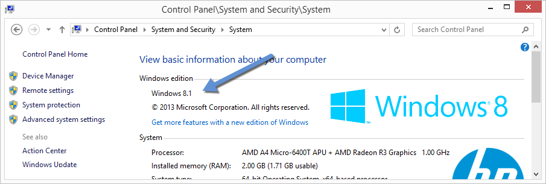
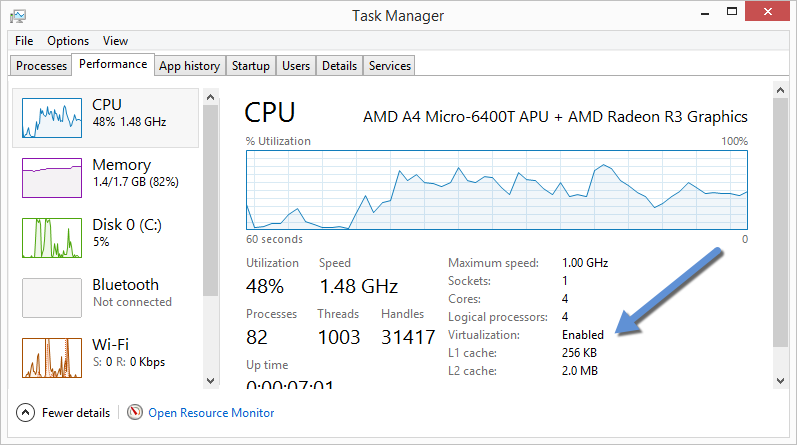
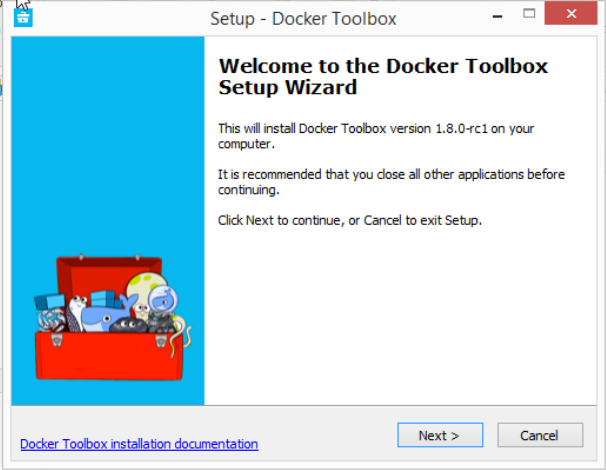
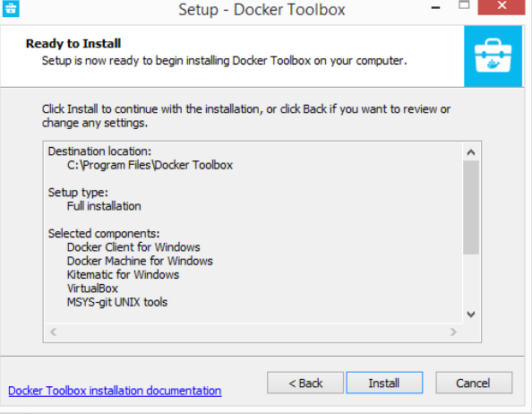

<!--[metadata]>
+++
title = "Installation on Windows"
description = "Docker installation on Microsoft Windows"
keywords = ["Docker, Docker documentation, Windows, requirements, virtualbox,  boot2docker"]
[menu.main]
parent = "engine_install"
weight="-80"
+++
<![end-metadata]-->

# Windows

> **Note**: This release of Docker deprecates the Boot2Docker command line in
> favor of Docker Machine.  Use the Docker Toolbox to install Docker Machine as
> well as the other Docker tools.

You install Docker using Docker Toolbox. Docker Toolbox includes the following Docker tools:

* Docker Machine for running the `docker-machine` binary
* Docker Engine for running the `docker` binary
* Kitematic, the Docker GUI
* a shell preconfigured for a Docker command-line environment
* Oracle VM VirtualBox

Because the Docker daemon uses Linux-specific kernel features, you can't run
Docker natively in Windows. Instead, you must use `docker-machine` to create and attach to a Docker VM on your machine. This VM hosts Docker for you on your Windows system.

The virtual machine runs a lightweight Linux distribution made specifically to
run the Docker daemon. The VirtualBox VM runs completely from RAM, is a small
~24MB download, and boots in approximately 5s.

## Requirements

To run Docker, your machine must have a 64-bit operating system running Windows 7 or higher. Additionally, you must make sure that virtualization is enabled on your machine.
To verify your machine meets these requirements, do the following:

1. Right click the Windows Start Menu and choose **System**.

    

    If you are using an unsupported version of Windows, you should consider
    upgrading your operating system in order to try out Docker.

2. Make sure your CPU supports [virtualization technology](https://en.wikipedia.org/wiki/X86_virtualization)
and virtualization support is enabled in BIOS and recognized by Windows.

    #### For Windows 8, 8.1 or 10

	  Choose **Start > Task Manager**. On Windows 10, click more details. Navigate to the **Performance** tab.
	  Under **CPU** you should see the following:

      

    If virtualization is not enabled on your system, follow the manufacturer's instructions for enabling it.

    #### For Windows 7

	  Run the <a
	  href="http://www.microsoft.com/en-us/download/details.aspx?id=592"
	  target="_blank"> Microsoft® Hardware-Assisted Virtualization Detection
	  Tool</a> and follow the on-screen instructions.

3. Verify your Windows OS is 64-bit (x64)

   How you do this verification depends on your Windows version.  For details, see the Windows
    article [How to determine whether a computer is running a 32-bit version or 64-bit version
    of the Windows operating system](https://support.microsoft.com/en-us/kb/827218).

> **Note**: If you have Docker hosts running and you don't wish to do a Docker Toolbox
installation, you can install the `docker.exe` using the *unofficial* Windows package
manager Chocolatey. For information on how to do this, see [Docker package on
Chocolatey](http://chocolatey.org/packages/docker).

### Learn the key concepts before installing

In a Docker installation on Linux, your machine is both the localhost and the
Docker host. In networking, localhost means your computer. The Docker host is
the machine on which the containers run.

On a typical Linux installation, the Docker client, the Docker daemon, and any
containers run directly on your localhost. This means you can address ports on a
Docker container using standard localhost addressing such as `localhost:8000` or
`0.0.0.0:8376`.

In a Windows installation, the `docker` daemon is running inside a Linux virtual
machine. You use the Windows Docker client to talk to the Docker host VM. Your
Docker containers run inside this host.

In Windows, the Docker host address is the address of the Linux VM. When you
start the VM with `docker-machine` it is assigned an IP address. When you start
a container, the ports on a container map to ports on the VM. To see this in
practice, work through the exercises on this page.

### Installation

If you have VirtualBox running, you must shut it down before running the
installer.

1. Go to the [Docker Toolbox](https://www.docker.com/toolbox) page.

2. Click the installer link to download.

3. Install Docker Toolbox by double-clicking the installer.

    The installer launches the "Setup - Docker Toolbox" dialog.

    

4. Press "Next" to install the toolbox.

    The installer presents you with options to customize the standard
    installation. By default, the standard Docker Toolbox installation:

    * installs executables for the Docker tools in `C:\Program Files\Docker Toolbox`
    * install VirtualBox; or updates any existing installation
    * adds a Docker Inc. folder to your program shortcuts
    * updates your `PATH` environment variable
    * adds desktop icons for the Docker Quickstart Terminal and Kitematic

    This installation assumes the defaults are acceptable.

5. Press "Next" until you reach the "Ready to Install" page.

     The system prompts you for your password.

     

6. Press "Install"  to continue with the installation.

     When it completes, the installer provides you with some information you can
     use to complete some common tasks.

     

7. Press "Finish" to exit.

## Running a Docker Container

To run a Docker container, you:

* Create a new (or start an existing) Docker virtual machine
* Switch your environment to your new VM
* Use the `docker` client to create, load, and manage containers

Once you create a machine, you can reuse it as often as you like. Like any
VirtualBox VM, it maintains its configuration between uses.

There are several ways to use the installed tools, from the Docker Quickstart Terminal or
[from your shell](#from-your-shell).

### Using the Docker Quickstart Terminal

1. Find the Docker Quickstart Terminal icon on your Desktop and double-click to launch it.

    The application:

    * Opens a terminal window
    * Creates a `default` VM if it doesn't exist, and starts the VM after
    * Points the terminal environment to this VM

    Once the launch completes, you can run `docker` commands.

3. Verify your setup succeeded by running the `hello-world` container.

        $ docker run hello-world
        Unable to find image 'hello-world:latest' locally
        511136ea3c5a: Pull complete
        31cbccb51277: Pull complete
        e45a5af57b00: Pull complete
        hello-world:latest: The image you are pulling has been verified.
        Important: image verification is a tech preview feature and should not be
        relied on to provide security.
        Status: Downloaded newer image for hello-world:latest
        Hello from Docker.
        This message shows that your installation appears to be working correctly.

        To generate this message, Docker took the following steps:
        1. The Docker client contacted the Docker daemon.
        2. The Docker daemon pulled the "hello-world" image from the Docker Hub.
           (Assuming it was not already locally available.)
        3. The Docker daemon created a new container from that image which runs the
           executable that produces the output you are currently reading.
        4. The Docker daemon streamed that output to the Docker client, which sent it
           to your terminal.

        To try something more ambitious, you can run an Ubuntu container with:
        $ docker run -it ubuntu bash

        For more examples and ideas, visit:
        http://docs.docker.com/userguide/

### Using Docker from Windows Command Prompt (cmd.exe)

1. Launch a Windows Command Prompt (cmd.exe).

    The `docker-machine` command requires `ssh.exe` in your `PATH` environment
    variable. This `.exe` is in the MsysGit `bin` folder.

2. Add this to the `%PATH%` environment variable by running:

        set PATH=%PATH%;"c:\Program Files (x86)\Git\bin"

3. Create a new Docker VM.

        docker-machine create --driver virtualbox my-default
        Creating VirtualBox VM...
        Creating SSH key...
        Starting VirtualBox VM...
        Starting VM...
        To see how to connect Docker to this machine, run: docker-machine env my-default

    The command also creates a machine configuration in the
    `C:\USERS\USERNAME\.docker\machine\machines` directory. You only need to run the `create`
    command once. Then, you can use `docker-machine` to start, stop, query, and
    otherwise manage the VM from the command line.

4. List your available machines.

        C:\Users\mary> docker-machine ls
        NAME                ACTIVE   DRIVER       STATE     URL                         SWARM
        my-default        *        virtualbox   Running   tcp://192.168.99.101:2376

    If you have previously installed the deprecated Boot2Docker application or
    run the Docker Quickstart Terminal, you may have a `dev` VM as well.

5. Get the environment commands for your new VM.

        C:\Users\mary> docker-machine env --shell cmd my-default

6. Connect your shell to the `my-default` machine.

        C:\Users\mary> eval "$(docker-machine env my-default)"

7. Run the `hello-world` container to verify your setup.

        C:\Users\mary> docker run hello-world

### Using Docker from PowerShell

1. Launch a Windows PowerShell window.

2. Add `ssh.exe` to your PATH:

        PS C:\Users\mary> $Env:Path = "${Env:Path};c:\Program Files (x86)\Git\bin"

3. Create a new Docker VM.

        PS C:\Users\mary> docker-machine create --driver virtualbox my-default

4. List your available machines.

        C:\Users\mary> docker-machine ls
        NAME                ACTIVE   DRIVER       STATE     URL                         SWARM
        my-default        *        virtualbox   Running   tcp://192.168.99.101:2376

5. Get the environment commands for your new VM.

        C:\Users\mary> docker-machine env --shell powershell my-default

6. Connect your shell to the `my-default` machine.

        C:\Users\mary> eval "$(docker-machine env my-default)"

7. Run the `hello-world` container to verify your setup.

        C:\Users\mary> docker run hello-world

## Learn about your Toolbox installation

Toolbox installs the Docker Engine binary in the `C:\Program Files\Docker
Toolbox` directory. When you use the Docker Quickstart Terminal or create a
`default` VM manually, Docker Machine updates the
`C:\USERS\USERNAME\.docker\machine\machines\default` folder to your
system. This folder contains the configuration for the VM.

You can create multiple VMs on your system with Docker Machine. Therefore, you
may end up with multiple VM folders if you have created more than one VM. To
remove a VM, use the `docker-machine rm <machine-name>` command.

## Migrate from Boot2Docker

If you were using Boot2Docker previously, you have a pre-existing Docker
`boot2docker-vm` VM on your local system.  To allow Docker Machine to manage
this older VM, you can migrate it.

1. Open a terminal or the Docker CLI on your system.

2. Type the following command.

        $ docker-machine create -d virtualbox --virtualbox-import-boot2docker-vm boot2docker-vm docker-vm

3. Use the `docker-machine` command to interact with the migrated VM.

The `docker-machine` subcommands are slightly different than the `boot2docker`
subcommands. The table below lists the equivalent `docker-machine` subcommand
and what it does:

|  `boot2docker` | `docker-machine` | `docker-machine` description                             |
|----------------|------------------|----------------------------------------------------------|
| init           | create           | Creates a new docker host.                               |
| up             | start            | Starts a stopped machine.                                |
| ssh            | ssh              | Runs a command or interactive ssh session on the machine.|
| save           | -                | Not applicable.                                          |
| down           | stop             | Stops a running machine.                                 |
| poweroff       | stop             | Stops a running machine.                                 |
| reset          | restart          | Restarts a running machine.                              |
| config         | inspect          | Prints machine configuration details.                    |
| status         | ls               | Lists all machines and their status.                     |
| info           | inspect          | Displays a machine's details.                            |
| ip             | ip               | Displays the machine's ip address.                       |
| shellinit      | env              | Displays shell commands needed to configure your shell to interact with a machine |
| delete         | rm               | Removes a machine.                                       |
| download       | -                | Not applicable.                                          |
| upgrade        | upgrade          | Upgrades a machine's Docker client to the latest stable release. |

## Upgrade Docker Toolbox

To upgrade Docker Toolbox, download and re-run [the Docker Toolbox
installer](https://www.docker.com/toolbox).

## Container port redirection

If you are curious, the username for the Docker default VM is `docker` and the
password is `tcuser`. The latest version of `docker-machine` sets up a host only
network adaptor which provides access to the container's ports.

If you run a container with a published port:

    $ docker run --rm -i -t -p 80:80 nginx

Then you should be able to access that nginx server using the IP address
reported to you using:

    $ docker-machine ip

Typically, the IP is 192.168.59.103, but it could get changed by VirtualBox's
DHCP implementation.

> **Note**: There is a [known
> issue](https://docs.docker.com/machine/drivers/virtualbox/#known-issues) that
> may cause files shared with your nginx container to not update correctly as you
> modify them on your host.

## Login with PUTTY instead of using the CMD

Docker Machine generates and uses the public/private key pair in your
`%USERPROFILE%\.docker\machine\machines\<name_of_your_machine>` directory. To
log in you need to use the private key from this same directory. The private key
needs to be converted into the format PuTTY uses. You can do this with
[puttygen](http://www.chiark.greenend.org.uk/~sgtatham/putty/download.html):

1. Open `puttygen.exe` and load ("File"->"Load" menu) the private key from (you may need to change to the `All Files (*.*)` filter)

        %USERPROFILE%\.docker\machine\machines\<name_of_your_machine>\id_rsa

2. Click "Save Private Key".

3.  Use the saved file to login with PuTTY using `docker@127.0.0.1:2022`.

## Uninstallation

You can uninstall Docker Toolbox using Window's standard process for removing
programs. This process does not remove the `docker-install.exe` file. You must
delete that file yourself.

## Learn more

You can continue with the [Docker Engine User Guide](../userguide/index.md). If you are
interested in using the Kitematic GUI, see the [Kitematic user
guide](https://docs.docker.com/kitematic/userguide/).
