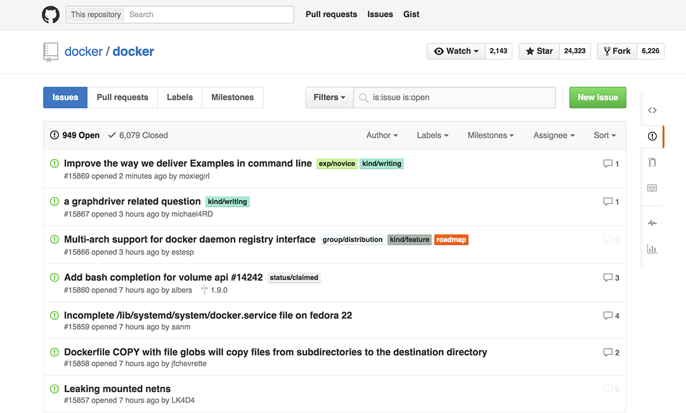

<!--[metadata]>
+++
title = "Find and claim an issue"
description = "Basic workflow for Docker contributions"
keywords = ["contribute, issue, review, workflow, beginner, expert, squash, commit"]
[menu.main]
parent = "smn_contribute"
weight=2
+++
<![end-metadata]-->

# Find and claim an issue

As a contributor, you can work on any open issue you want. You can view issues in the Issues tab in every repository.
If you are new to contributing, use the filter option to find suitable issues. You can filter issues by Author, Labels, Milestones, and Assignee or sort by time such as newest and oldest. 

## Understand the issue types
To help you identify the different types of issues, our maintainers assign labels to issues. Labels are color-coded and help you categorize and filter issues. There are four labels categories, kind, area, experience, and priority. You can filter using one or more labels. The kind and experience labels are useful for new contributors.

The following table describes the kind labels.

<table class="tg">
<thead>
<tr>
<td class="tg-031e">Kind Label</td>
<td class="tg-031e">Description</td>
</tr>
</thead>
  <tbody>
    <tr>
      <td class="tg-031e"><strong class="gh-label kindbug">kind/bug</strong></td>
      <td class="tg-031e">These issues contain bugs. The cause may or may not be known at triage time so debugging should be taken account into the time estimate.</td>
    </tr>
    <tr>
      <td class="tg-031e"><strong class="gh-label kinddocs">kind/docs</strong></td>
      <td class="tg-031e">These issues contain documentation, man pages, articles, blogs, or other significant word-driven task.
      </td>
    </tr>
    <tr>
      <td class="tg-031e"><strong class="gh-label enhancement">kind/enhancement</strong></td>
      <td class="tg-031e">These issues contain enhancements that are not bugs or new features but can drastically improve usability or performance of a project component.     
 </td>
    </tr>
    <tr>
      <td class="tg-031e"><strong class="gh-label kindfeature">kind/feature</strong></td>
      <td class="tg-031e">These issues contain new features, functionality, and elements that the project does not currently support. 
 </td>
    </tr>
    <tr>
      <td class="tg-031e"><strong class="gh-label kindquestion">kind/question</strong></td>
      <td class="tg-031e">These issues contain a user or contributor question that requires a response. 
 </td>
    </tr>
  </tbody>
</table>

The following table describes the experience level guidelines.

<table class="tg">
<thead>
<tr>
<td class="tg-031e"> Exp Label</td>
<td class="tg-031e">Experience Level</td>
</tr>
</thead>
  <tbody>
    <tr>
      <td class="tg-031e"><strong class="gh-label beginner">exp/beginner</strong></td>
      <td class="tg-031e">You are new to Docker and Golang and want to start contributing to the project. 
      These issues are for beginners who want to learn the basics. We encourage new contributors to start with exp/beginner issues.</td>
    </tr>
    <tr>
      <td class="tg-031e"><strong class="gh-label intermediate">exp/intermediate</strong></td>
      <td class="tg-031e">You understand the core concepts of Docker and are comfortable with Golang. 
      These issues are for intermediates who want to dive deeper into the project.</td>
    </tr>
    <tr>
      <td class="tg-031e"><strong class="gh-label expert">exp/expert</strong></td>
      <td class="tg-031e">You are proficient with Docker and Golang and are activey involved in the community. These issues are for experts who understand the rationale behind design decisions and where the project is headed. 
 </td>
    </tr>
  </tbody>
</table>

As stated, these labels are guidelines. You might have written a whole plugin for Docker in a personal 
project and never contributed to Docker. With that kind of experience, you could take on an <strong
class="gh-label expert">exp/expert</strong> issue. 

## Claim a beginner issue

To claim an issue:

1. Go to the `docker/docker` <a
	href="https://github.com/docker/docker" target="_blank">repository</a>.

2. Click the Issues tab. A list of the open issues appears. 

    

3. From the Labels drop-down, select <strong class="gh-label beginner">exp/beginner</strong>.

    The system filters to show only open <strong class="gh-label beginner">exp/beginner</strong> issues.

4. Open an issue that interests you.

    The comments on the issues describe the problem and can provide information for a potential 
    solution.

5. When you find an open issue that both interests you and is unclaimed, add a
`#dibs` comment. Make sure that no other user has chosen to work on the issue.

    The project does not permit external contributors to assign issues to themselves. Read 
    the comments to find if a user claimed the issue by leaving a
    `#dibs` comment on the issue.

7. Your issue # will be different depending on what you claimed. After a moment, Gordon the Docker 
bot, changes the issue status to claimed. The following example shows issue #11038.

    

8. Make a note of the issue number; you will need it for later. 

## Sync your fork and create a new branch

If you have followed along in this guide, you forked the `docker/docker`
repository. Maybe that was an hour ago or a few days ago. In any case, before
you start working on your issue, sync your repository with the upstream
`docker/docker` master. Syncing ensures your repository has the latest
changes.

To sync your repository:

1. Open a terminal on your local host.

2. Change directory to the `docker-fork` root.

        $ cd ~/repos/docker-fork

3. Checkout the master branch.

        $ git checkout master
        Switched to branch 'master'
        Your branch is up-to-date with 'origin/master'.

    Recall that `origin/master` is a branch on your remote GitHub repository.

4. Make sure you have the upstream remote `docker/docker` by listing them.

        $ git remote -v
        origin	https://github.com/moxiegirl/docker.git (fetch)
        origin	https://github.com/moxiegirl/docker.git (push)
        upstream	https://github.com/docker/docker.git (fetch)
        upstream	https://github.com/docker/docker.git (push)

    If the `upstream` is missing, add it.

        $ git remote add upstream https://github.com/docker/docker.git

5. Fetch all the changes from the `upstream master` branch.

        $ git fetch upstream master
        remote: Counting objects: 141, done.
        remote: Compressing objects: 100% (29/29), done.
        remote: Total 141 (delta 52), reused 46 (delta 46), pack-reused 66
        Receiving objects: 100% (141/141), 112.43 KiB | 0 bytes/s, done.
        Resolving deltas: 100% (79/79), done.
	    From github.com:docker/docker
	     * branch            master     -> FETCH_HEAD

    This command says get all the changes from the `master` branch belonging to
    the `upstream` remote.

7. Rebase your local master with the `upstream/master`.

        $ git rebase upstream/master
        First, rewinding head to replay your work on top of it...
        Fast-forwarded master to upstream/master.

    This command applies all the commits from the upstream master to your local
    master.

8.  Check the status of your local branch.

        $ git status
        On branch master
        Your branch is ahead of 'origin/master' by 38 commits.
          (use "git push" to publish your local commits)
        nothing to commit, working directory clean

    Your local repository now has all the changes from the `upstream` remote. You 
    need to push the changes to your own remote fork which is `origin master`.

9. Push the rebased master to `origin master`.

        $ git push origin master
        Username for 'https://github.com': moxiegirl
        Password for 'https://moxiegirl@github.com': 
        Counting objects: 223, done.
        Compressing objects: 100% (38/38), done.
        Writing objects: 100% (69/69), 8.76 KiB | 0 bytes/s, done.
        Total 69 (delta 53), reused 47 (delta 31)
        To https://github.com/moxiegirl/docker.git
           8e107a9..5035fa1  master -> master

9. Create a new feature branch to work on your issue.

    Your branch name should have the format `XXXX-descriptive` where `XXXX` is
    the issue number you are working on. For example:

        $ git checkout -b 11038-fix-rhel-link
        Switched to a new branch '11038-fix-rhel-link'

    Your branch should be up-to-date with the `upstream/master`. Why? Because you
    branched off a freshly synced master.  Let's check this anyway in the next
    step.

9. Rebase your branch from upstream/master.

        $ git rebase upstream/master
        Current branch 11038-fix-rhel-link is up to date.

    At this point, your local branch, your remote repository, and the Docker
    repository all have identical code. You are ready to make changes for your
    issue.

## Where to go next

At this point, you know what you want to work on and you have a branch to do
your work in.  Go onto the next section to learn [how to work on your
changes](work-issue.md).
