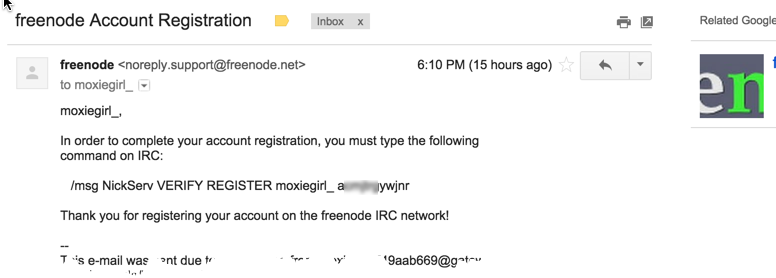
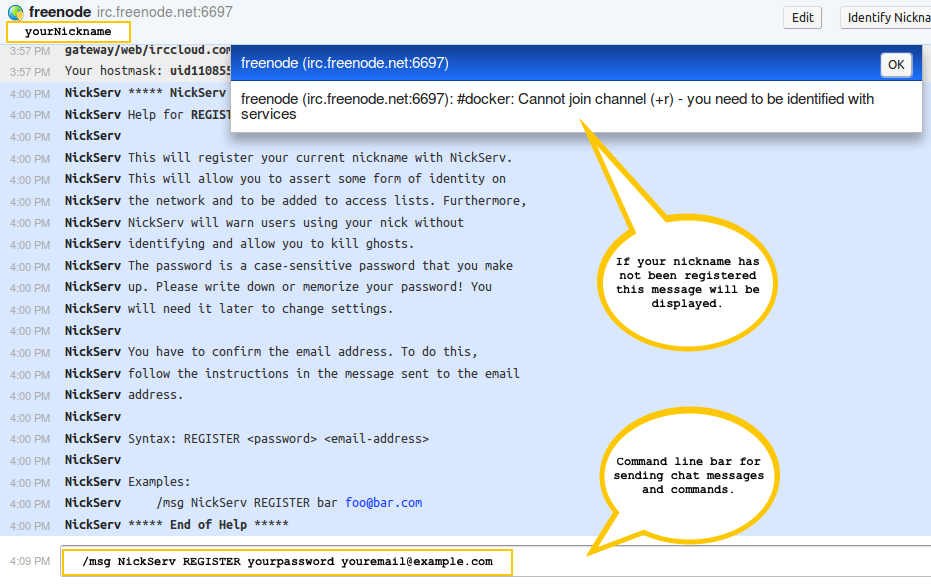
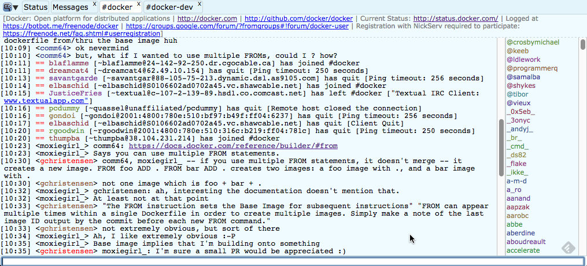

<!--[metadata]>
+++
title = "Where to chat or get help"
description = "Describes Docker's communication channels"
keywords = ["IRC, Google group, Twitter, blog,  Stackoverflow"]
[menu.main]
parent = "mn_opensource"
+++
<![end-metadata]-->

# Where to chat or get help

There are several communications channels you can use to chat with Docker
community members and developers.

<table>
  <col width="25%">
  <col width="75%">
  <tr>
    <td>Internet Relay Chat (IRC)</th>
    <td>
      

        IRC a direct line to our most knowledgeable Docker users.
        The <code>#docker</code> and <code>#docker-dev</code> group on 
        <strong>chat.freenode.net</strong>. IRC was first created in 1988. 
        So, it is a rich chat protocol but it can overwhelm new users. You can search
        <a href="https://botbot.me/freenode/docker/#" target="_blank">our chat archives</a>.
      

      Use our IRC quickstart guide below for easy ways to get started with IRC.
    </td>
  </tr>
  <tr>
    <td>Google Groups</td>
    <td>
      There are two groups.
      <a href="https://groups.google.com/forum/#!forum/docker-user" target="_blank">Docker-user</a>
      is for people using Docker containers. 
      The <a href="https://groups.google.com/forum/#!forum/docker-dev" target="_blank">docker-dev</a> 
      group is for contributors and other people contributing to the Docker 
      project.
    </td>
  </tr>
  <tr>
    <td>Twitter</td>
    <td>
      You can follow <a href="https://twitter.com/docker/" target="_blank">Docker's twitter</a>
      to get updates on our products. You can also tweet us questions or just 
      share blogs or stories.
    </td>
  </tr>
  <tr>
    <td>Stack Overflow</td>
    <td>
      Stack Overflow has over 7000K Docker questions listed. We regularly 
      monitor <a href="http://stackoverflow.com/search?tab=newest&q=docker" target="_blank">Docker questions</a>
      and so do many other knowledgeable Docker users.
    </td>
  </tr>
</table>

# IRC Quickstart 

The following instructions show you how to register with two web based IRC
tools. Use one illustrated here or find another. While these instructions are
only for two IRC web clients there are many IRC Clients available on most
platforms.

## Webchat 

Using Webchat from Freenode.net is a quick and easy way to get chatting. To
register:

1. In your browser open <a href="https://webchat.freenode.net" target="_blank">https://webchat.freenode.net</a>

    

2. Fill out the form.

    <table class="no-zebra" style="width: auto">
      <tr>
        <td><b>Nickname</b></td>
        <td>The short name you want to be known as on IRC chat channels.</td>
      </tr>
      <tr>
        <td><b>Channels</b></td>
        <td><code>#docker</code></td>
      </tr>
      <tr>
        <td><b>reCAPTCHA</b></td>
        <td>Use the value provided.</td>
      </tr>
    </table>

3. Click on the "Connect" button.

    The browser connects you to Webchat. You'll see a lot of text. At the bottom of
    the Webchat web page is a command line bar. Just above the command line bar
    a message is shown asking you to register.

    

4. Register your nickname by entering the following command in the
command line bar:

        /msg NickServ REGISTER yourpassword youremail@example.com

    

    This command line bar is also the entry field that you will use for entering 
    chat messages into IRC chat channels after you have registered and joined a
    chat channel. 
    
    After entering the REGISTER command, an email is sent to the email address
    that you provided. This email will contain instructions for completing
    your registration.

5. Open your email client and look for the email.

    

6. Back in the browser, complete the registration according to the email
by entering the following command into the webchat command line bar:

        /msg NickServ VERIFY REGISTER yournickname somecode

    Your nickname is now registered to chat on freenode.net.

[Jump ahead to tips to join a docker channel and start chatting](#tips)  

## IRCCloud

IRCCloud is a web-based IRC client service that is hosted in the cloud. This is
a Freemium product, meaning the free version is limited and you can pay for more
features. To use IRCCloud:

1. Select the following link:
  <a href="https://www.irccloud.com/invite?channel=%23docker&amp;hostname=chat.freenode.net&amp;port=6697" target="_blank">Join the #docker channel on chat.freenode.net</a>

    The following web page is displayed in your browser:

    
  
2. If this is your first time using IRCCloud enter a valid email address in the
form. People who have already registered with IRCCloud can select the "sign in
here" link. Additionally, people who are already registered with IRCCloud may
have a cookie stored on their web browser that enables a quick start "let's go"
link to be shown instead of the above form. In this case just select the
"let's go" link and [jump ahead to start chatting](#start-chatting)

3. After entering your email address in the form, check your email for an invite
from IRCCloud and follow the instructions provided in the email. 

4. After following the instructions in your email you should have an IRCCloud
Client web page in your browser:

    

    The message shown above may appear indicating that you need to register your
    nickname. 

5. To register your nickname enter the following message into the command line bar
at the bottom of the IRCCloud Client:
        
        /msg NickServ REGISTER yourpassword youremail@example.com

    This command line bar is for chatting and entering in IRC commands.

6. Check your email for an invite to freenode.net:

    

7. Back in the browser, complete the registration according to the email.

        /msg NickServ VERIFY REGISTER yournickname somecode

## Tips

The procedures in this section apply to both IRC clients.

### Set a nickname 

Next time you return to log into chat, you may need to re-enter your password 
on the command line using this command:

      /msg NickServ identify <password>

With Webchat if you forget or lose your password see <a
href="https://freenode.net/faq.shtml#sendpass" target="_blank">the FAQ on
freenode.net</a> to learn how to recover it.

### Join a Docker Channel

Join the `#docker` group using the following command in the command line bar of
your IRC Client:

        /j #docker

You can also join the `#docker-dev` group:

        /j #docker-dev

### Start chatting

To ask questions to the group just type messages in the command line bar:

  

## Learning more about IRC

This quickstart was meant to get you up and into IRC very quickly. If you find 
IRC useful there is more to learn. Drupal, another open source project, 
has <a href="https://www.drupal.org/irc/setting-up" target="_blank">
written some documentation about using IRC</a> for their project 
(thanks Drupal!).

