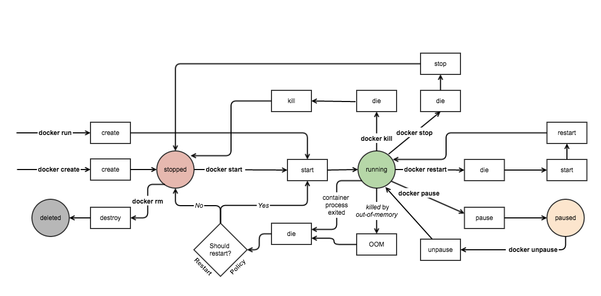

<!--[metadata]>
+++
title = "Remote API"
description = "API Documentation for Docker"
keywords = ["API, Docker, rcli, REST,  documentation"]
[menu.main]
parent = "smn_remoteapi"
weight=-3
+++
<![end-metadata]-->

# Docker Remote API

Docker's Remote API uses an open schema model.  In this model, unknown
properties in incoming messages are ignored. Client applications need to take
this behavior into account to ensure they do not break when talking to newer
Docker daemons.

The API tends to be REST, but for some complex commands, like attach or pull,
the HTTP connection is hijacked to transport STDOUT, STDIN, and STDERR.

By default the Docker daemon listens on `unix:///var/run/docker.sock` and the
client must have `root` access to interact with the daemon. If a group named
`docker` exists on your system, `docker` applies ownership of the socket to the
group.

The current version of the API is v1.22 which means calling `/info` is the same
as calling `/v1.22/info`. To call an older version of the API use
`/v1.21/info`.

Use the table below to find the API version for a Docker version:

Docker version  | API version                        | Changes
----------------|------------------------------------|------------------------------------------------------
1.10.x          | [1.22](docker_remote_api_v1.22.md) | [API changes](docker_remote_api.md#v1-22-api-changes)
1.9.x           | [1.21](docker_remote_api_v1.21.md) | [API changes](docker_remote_api.md#v1-21-api-changes)
1.8.x           | [1.20](docker_remote_api_v1.20.md) | [API changes](docker_remote_api.md#v1-20-api-changes)
1.7.x           | [1.19](docker_remote_api_v1.19.md) | [API changes](docker_remote_api.md#v1-19-api-changes)
1.6.x           | [1.18](docker_remote_api_v1.18.md) | [API changes](docker_remote_api.md#v1-18-api-changes)
1.5.x           | [1.17](docker_remote_api_v1.17.md) | [API changes](docker_remote_api.md#v1-17-api-changes)
1.4.x           | [1.16](docker_remote_api_v1.16.md) | [API changes](docker_remote_api.md#v1-16-api-changes)
1.3.x           | [1.15](docker_remote_api_v1.15.md) | [API changes](docker_remote_api.md#v1-15-api-changes)
1.2.x           | [1.14](docker_remote_api_v1.14.md) | [API changes](docker_remote_api.md#v1-14-api-changes)

Refer to the [GitHub repository](
https://github.com/docker/docker/tree/master/docs/reference/api) for
older releases.

## Authentication

Since API version 1.2, the auth configuration is now handled client side, so the
client has to send the `authConfig` as a `POST` in `/images/(name)/push`. The
`authConfig`, set as the `X-Registry-Auth` header, is currently a Base64 encoded
(JSON) string with the following structure:

```
{"username": "string", "password": "string", "email": "string",
   "serveraddress" : "string", "auth": ""}
```

Callers should leave the `auth` empty. The `serveraddress` is a domain/ip
without protocol. Throughout this structure, double quotes are required.

## Using Docker Machine with the API

If you are using `docker-machine`, the Docker daemon is on a virtual host that uses an encrypted TCP socket. This means, for Docker Machine users, you need to add extra parameters to `curl` or `wget` when making test API requests, for example:

```
curl --insecure --cert ~/.docker/cert.pem --key ~/.docker/key.pem https://YOUR_VM_IP:2376/images/json

wget --no-check-certificate --certificate=$DOCKER_CERT_PATH/cert.pem --private-key=$DOCKER_CERT_PATH/key.pem https://your_vm_ip:2376/images/json -O - -q
```

## Docker Events

The following diagram depicts the container states accessible through the API.



Some container-related events are not affected by container state, so they are not included in this diagram. These events are:

* **export** emitted by `docker export`
* **exec_create** emitted by `docker exec`
* **exec_start** emitted by `docker exec` after **exec_create**

Running `docker rmi` emits an **untag** event when removing an image name.  The `rmi` command may also emit **delete** events when images are deleted by ID directly or by deleting the last tag referring to the image.

> **Acknowledgement**: This diagram and the accompanying text were used with the permission of Matt Good and Gilder Labs. See Matt's original blog post [Docker Events Explained](http://gliderlabs.com/blog/2015/04/14/docker-events-explained/).

## Version history

This section lists each version from latest to oldest.  Each listing includes a link to the full documentation set and the changes relevant in that release.

### v1.22 API changes

[Docker Remote API v1.22](docker_remote_api_v1.22.md) documentation

* `GET /containers/json` supports filter `isolation` on Windows.
* `GET /info` Now returns `Architecture` and `OSType` fields, providing information
  about the host architecture and operating system type that the daemon runs on.
* `GET /networks/(name)` now returns a `Name` field for each container attached to the network.

### v1.21 API changes

[Docker Remote API v1.21](docker_remote_api_v1.21.md) documentation

* `GET /volumes` lists volumes from all volume drivers.
* `POST /volumes/create` to create a volume.
* `GET /volumes/(name)` get low-level information about a volume.
* `DELETE /volumes/(name)`remove a volume with the specified name.
* `VolumeDriver` has been moved from config to hostConfig to make the configuration portable.
* `GET /images/(name)/json` now returns information about tags and digests of the image.
* The `config` option now accepts the field `StopSignal`, which specifies the signal to use to kill a container.
* `GET /containers/(id)/stats` will return networking information respectively for each interface.
* The `hostConfig` option now accepts the field `DnsOptions`, which specifies a
list of DNS options to be used in the container.
* `POST /build` now optionally takes a serialized map of build-time variables.
* `GET /events` now includes a `timenano` field, in addition to the existing `time` field.
* `GET /events` now supports filtering by image and container labels.
* `GET /info` now lists engine version information and return the information of `CPUShares` and `Cpuset`.
* `GET /containers/json` will return `ImageID` of the image used by container.
* `POST /exec/(name)/start` will now return an HTTP 409 when the container is either stopped or paused.
* `GET /containers/(name)/json` now accepts a `size` parameter. Setting this parameter to '1' returns container size information in the `SizeRw` and `SizeRootFs` fields.
* `GET /containers/(name)/json` now returns a `NetworkSettings.Networks` field,
  detailing network settings per network. This field deprecates the
  `NetworkSettings.Gateway`, `NetworkSettings.IPAddress`,
  `NetworkSettings.IPPrefixLen`, and `NetworkSettings.MacAddress` fields, which
  are still returned for backward-compatibility, but will be removed in a future version.
* `GET /exec/(id)/json` now returns a `NetworkSettings.Networks` field,
  detailing networksettings per network. This field deprecates the
  `NetworkSettings.Gateway`, `NetworkSettings.IPAddress`,
  `NetworkSettings.IPPrefixLen`, and `NetworkSettings.MacAddress` fields, which
  are still returned for backward-compatibility, but will be removed in a future version.

### v1.20 API changes

[Docker Remote API v1.20](docker_remote_api_v1.20.md) documentation

* `GET /containers/(id)/archive` get an archive of filesystem content from a container.
* `PUT /containers/(id)/archive` upload an archive of content to be extracted to
an existing directory inside a container's filesystem.
* `POST /containers/(id)/copy` is deprecated in favor of the above `archive`
endpoint which can be used to download files and directories from a container.
* The `hostConfig` option now accepts the field `GroupAdd`, which specifies a
list of additional groups that the container process will run as.

### v1.19 API changes

[Docker Remote API v1.19](docker_remote_api_v1.19.md) documentation

* When the daemon detects a version mismatch with the client, usually when
the client is newer than the daemon, an HTTP 400 is now returned instead
of a 404.
* `GET /containers/(id)/stats` now accepts `stream` bool to get only one set of stats and disconnect.
* `GET /containers/(id)/logs` now accepts a `since` timestamp parameter.
* `GET /info` The fields `Debug`, `IPv4Forwarding`, `MemoryLimit`, and
`SwapLimit` are now returned as boolean instead of as an int. In addition, the
end point now returns the new boolean fields `CpuCfsPeriod`, `CpuCfsQuota`, and
`OomKillDisable`.
* The `hostConfig` option now accepts the fields `CpuPeriod` and `CpuQuota`
* `POST /build` accepts `cpuperiod` and `cpuquota` options

### v1.18 API changes

[Docker Remote API v1.18](docker_remote_api_v1.18.md) documentation

* `GET /version` now returns `Os`, `Arch` and `KernelVersion`.
* `POST /containers/create` and `POST /containers/(id)/start`allow you to  set ulimit settings for use in the container.
* `GET /info` now returns `SystemTime`, `HttpProxy`,`HttpsProxy` and `NoProxy`.
* `GET /images/json` added a `RepoDigests` field to include image digest information.
* `POST /build` can now set resource constraints for all containers created for the build.
* `CgroupParent` can be passed in the host config to setup container cgroups under a specific cgroup.
* `POST /build` closing the HTTP request cancels the build
* `POST /containers/(id)/exec` includes `Warnings` field to response.

### v1.17 API changes

[Docker Remote API v1.17](docker_remote_api_v1.17.md) documentation

* The build supports `LABEL` command. Use this to add metadata to an image. For
example you could add data describing the content of an image. `LABEL
"com.example.vendor"="ACME Incorporated"`
* `POST /containers/(id)/attach` and `POST /exec/(id)/start`
* The Docker client now hints potential proxies about connection hijacking using HTTP Upgrade headers.
* `POST /containers/create` sets labels on container create describing the container.
* `GET /containers/json` returns the labels associated with the containers (`Labels`).
* `GET /containers/(id)/json` returns the list current execs associated with the
container (`ExecIDs`). This endpoint now returns the container labels
(`Config.Labels`).
* `POST /containers/(id)/rename` renames a container `id` to a new name.*
* `POST /containers/create` and `POST /containers/(id)/start` callers can pass
`ReadonlyRootfs` in the host config to mount the container's root filesystem as
read only.
* `GET /containers/(id)/stats` returns a live stream of a container's resource usage statistics.
* `GET /images/json` returns the labels associated with each image (`Labels`).


### v1.16 API changes

[Docker Remote API v1.16](docker_remote_api_v1.16.md)

* `GET /info` returns the number of CPUs available on the machine (`NCPU`),
total memory available (`MemTotal`), a user-friendly name describing the running Docker daemon (`Name`), a unique ID identifying the daemon (`ID`), and
a list of daemon labels (`Labels`).
* `POST /containers/create` callers can set the new container's MAC address explicitly.
* Volumes are now initialized when the container is created.
* `POST /containers/(id)/copy` copies data which is contained in a volume.

### v1.15 API changes

[Docker Remote API v1.15](docker_remote_api_v1.15.md) documentation

`POST /containers/create` you can set a container's `HostConfig` when creating a
container. Previously this was only available when starting a container.

### v1.14 API changes

[Docker Remote API v1.14](docker_remote_api_v1.14.md) documentation

* `DELETE /containers/(id)` when using `force`, the container will be immediately killed with SIGKILL.
* `POST /containers/(id)/start` the `hostConfig` option accepts the field `CapAdd`, which specifies a list of capabilities
to add, and the field `CapDrop`, which specifies a list of capabilities to drop.
* `POST /images/create` th `fromImage` and `repo` parameters support the
`repo:tag` format. Consequently,  the `tag` parameter is now obsolete. Using the
new format and the `tag` parameter at the same time will return an error.
