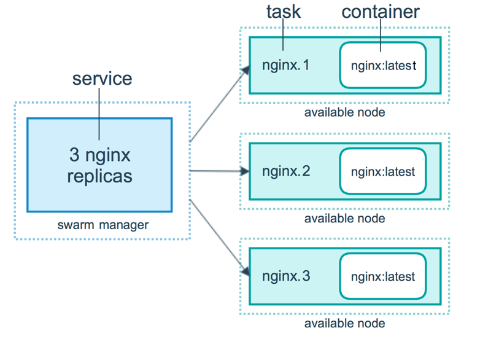

# Glossary

A list of terms used around the Docker project.

## aufs

aufs (advanced multi layered unification filesystem) is a Linux [filesystem](#filesystem) that
Docker supports as a storage backend. It implements the
[union mount](http://en.wikipedia.org/wiki/Union_mount) for Linux file systems.

## base image

An image that has no parent is a **base image**.

## boot2docker

[boot2docker](http://boot2docker.io/) is a lightweight Linux distribution made
specifically to run Docker containers. The boot2docker management tool for Mac and Windows was deprecated and replaced by [`docker-machine`](#machine) which you can install with the Docker Toolbox.

## btrfs

btrfs (B-tree file system) is a Linux [filesystem](#filesystem) that Docker
supports as a storage backend. It is a [copy-on-write](http://en.wikipedia.org/wiki/Copy-on-write)
filesystem.

## build

build is the process of building Docker images using a [Dockerfile](#dockerfile).
The build uses a Dockerfile and a "context". The context is the set of files in the
directory in which the image is built.

## cgroups

cgroups is a Linux kernel feature that limits, accounts for, and isolates
the resource usage (CPU, memory, disk I/O, network, etc.) of a collection
of processes. Docker relies on cgroups to control and isolate resource limits.

*Also known as : control groups*

## Compose

[Compose](https://github.com/docker/compose) is a tool for defining and
running complex applications with Docker. With compose, you define a
multi-container application in a single file, then spin your
application up in a single command which does everything that needs to
be done to get it running.

*Also known as : docker-compose, fig*

## container

A container is a runtime instance of a [docker image](#image).

A Docker container consists of

- A Docker image
- Execution environment
- A standard set of instructions

The concept is borrowed from Shipping Containers, which define a standard to ship
goods globally. Docker defines a standard to ship software.

## data volume

A data volume is a specially-designated directory within one or more containers
that bypasses the Union File System. Data volumes are designed to persist data,
independent of the container's life cycle. Docker therefore never automatically
delete volumes when you remove a container, nor will it "garbage collect"
volumes that are no longer referenced by a container.

## Docker

The term Docker can refer to

- The Docker project as a whole, which is a platform for developers and sysadmins to
develop, ship, and run applications
- The docker daemon process running on the host which manages images and containers

## Docker Hub

The [Docker Hub](https://hub.docker.com/) is a centralized resource for working with
Docker and its components. It provides the following services:

- Docker image hosting
- User authentication
- Automated image builds and work-flow tools such as build triggers and web hooks
- Integration with GitHub and Bitbucket

## Dockerfile

A Dockerfile is a text document that contains all the commands you would
normally execute manually in order to build a Docker image. Docker can
build images automatically by reading the instructions from a Dockerfile.

## filesystem

A file system is the method an operating system uses to name files
and assign them locations for efficient storage and retrieval.

Examples :

- Linux : ext4, aufs, btrfs, zfs
- Windows : NTFS
- OS X : HFS+

## image

Docker images are the basis of [containers](#container). An Image is an
ordered collection of root filesystem changes and the corresponding
execution parameters for use within a container runtime. An image typically
contains a union of layered filesystems stacked on top of each other. An image
does not have state and it never changes.

## libcontainer

libcontainer provides a native Go implementation for creating containers with
namespaces, cgroups, capabilities, and filesystem access controls. It allows
you to manage the lifecycle of the container performing additional operations
after the container is created.

## libnetwork

libnetwork provides a native Go implementation for creating and managing container
network namespaces and other network resources. It manage the networking lifecycle
of the container performing additional operations after the container is created.

## link

links provide a legacy interface to connect Docker containers running on the
same host to each other without exposing the hosts' network ports. Use the
Docker networks feature instead.

## Machine

[Machine](https://github.com/docker/machine) is a Docker tool which
makes it really easy to create Docker hosts on  your computer, on
cloud providers and inside your own data center. It creates servers,
installs Docker on them, then configures the Docker client to talk to them.

*Also known as : docker-machine*

## node

A [node](../swarm/how-swarm-mode-works/nodes.md) is a physical or virtual
machine running an instance of the Docker Engine in swarm mode.

**Manager nodes** perform swarm management and orchestration duties. By default
manager nodes are also worker nodes.

**Worker nodes** execute tasks.

## overlay network driver

Overlay network driver provides out of the box multi-host network connectivity
for docker containers in a cluster.

## overlay storage driver

OverlayFS is a [filesystem](#filesystem) service for Linux which implements a
[union mount](http://en.wikipedia.org/wiki/Union_mount) for other file systems.
It is supported by the Docker daemon as a storage driver.

## registry

A Registry is a hosted service containing [repositories](#repository) of [images](#image)
which responds to the Registry API.

The default registry can be accessed using a browser at [Docker Hub](#docker-hub)
or using the `docker search` command.

## repository

A repository is a set of Docker images. A repository can be shared by pushing it
to a [registry](#registry) server. The different images in the repository can be
labeled using [tags](#tag).

Here is an example of the shared [nginx repository](https://hub.docker.com/_/nginx/)
and its [tags](https://hub.docker.com/r/library/nginx/tags/)

## service

A [service](../swarm/how-swarm-mode-works/services.md) is the definition of how
you want to run your application containers in a swarm. At the most basic level
a service  defines which container image to run in the swarm and which commands
to run in the container. For orchestration purposes, the service defines the
"desired state", meaning how many containers to run as tasks and constraints for
deploying the containers.

Frequently a service is a microservice within the context of some larger
application. Examples of services might include an HTTP server, a database, or
any other type of executable program that you wish to run in a distributed
environment.

## service discovery

Swarm mode [service discovery](../swarm/networking.md) is a DNS component
internal to the swarm that automatically assigns each service on an overlay
network in the swarm a VIP and DNS entry. Containers on the network share DNS
mappings for the service via gossip so any container on the network can access
the service via its service name.

You don’t need to expose service-specific ports to make the service available to
other services on the same overlay network. The swarm’s internal load balancer
automatically distributes requests to the service VIP among the active tasks.

## swarm

A [swarm](../swarm/index.md) is a cluster of one or more Docker Engines running in [swarm mode](#swarm-mode).

## Swarm

Do not confuse [Docker Swarm](https://github.com/docker/swarm) with the [swarm mode](#swarm-mode) features in Docker Engine.

Docker Swarm is the name of a standalone native clustering tool for Docker.
Docker Swarm pools together several Docker hosts and exposes them as a single
virtual Docker host. It serves the standard Docker API, so any tool that already
works with Docker can now transparently scale up to multiple hosts.

*Also known as : docker-swarm*

## swarm mode

[Swarm mode](../swarm/index.md) refers to cluster management and orchestration
features embedded in Docker Engine. When you initialize a new swarm (cluster) or
join nodes to a swarm, the Docker Engine runs in swarm mode.

## tag

A tag is a label applied to a Docker image in a [repository](#repository).
tags are how various images in a repository are distinguished from each other.

*Note : This label is not related to the key=value labels set for docker daemon*

## task

A [task](../swarm/how-swarm-mode-works/services.md#tasks-and-scheduling) is the
atomic unit of scheduling within a swarm. A task carries a Docker container and
the commands to run inside the container. Manager nodes assign tasks to worker
nodes according to the number of replicas set in the service scale.

The diagram below illustrates the relationship of services to tasks and
containers.

## Toolbox

Docker Toolbox is the installer for Mac and Windows users.

## Union file system

Union file systems, or UnionFS, are file systems that operate by creating layers, making them
very lightweight and fast. Docker uses union file systems to provide the building
blocks for containers.

## virtual machine

A virtual machine is a program that emulates a complete computer and imitates dedicated hardware.
It shares physical hardware resources with other users but isolates the operating system. The
end user has the same experience on a Virtual Machine as they would have on dedicated hardware.

Compared to to containers, a virtual machine is heavier to run, provides more isolation,
gets its own set of resources and does minimal sharing.

*Also known as : VM*
