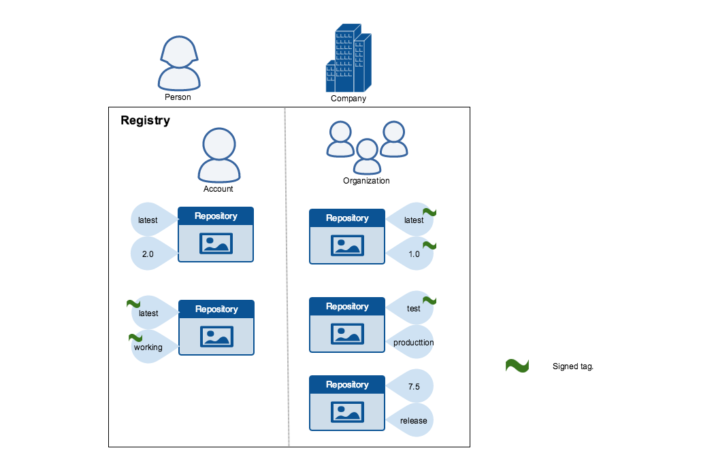
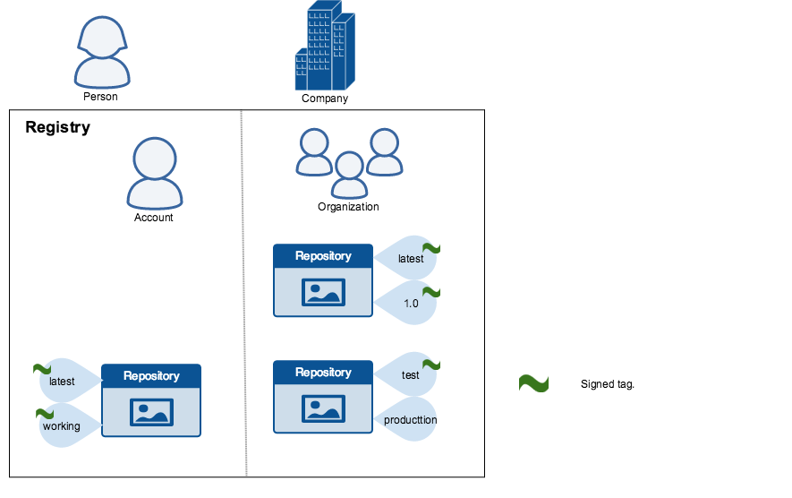
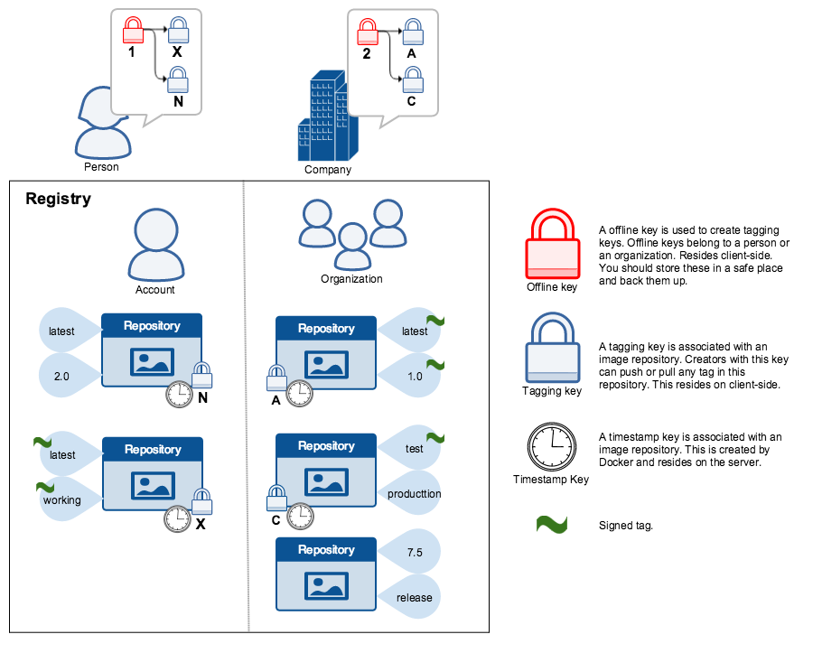

<!--[metadata]>
+++
title = "Content trust in Docker"
description = "Enabling content trust in Docker"
keywords = ["content, trust, security, docker,  documentation"]
[menu.main]
parent= "smn_content_trust"
weight=-1
+++
<![end-metadata]-->

# Content trust in Docker

When transferring data among networked systems, *trust* is a central concern. In
particular, when communicating over an untrusted medium such as the internet, it
is critical to ensure the integrity and the publisher of all the data a system
operates on. You use Docker Engine to push and pull images (data) to a public or private registry. Content trust
gives you the ability to verify both the integrity and the publisher of all the
data received from a registry over any channel.

## Understand trust in Docker

Content trust allows operations with a remote Docker registry to enforce
client-side signing and verification of image tags. Content trust provides the
ability to use digital signatures for data sent to and received from remote
Docker registries. These signatures allow client-side verification of the
integrity and publisher of specific image tags.

Currently, content trust is disabled by default. You must enable it by setting
the `DOCKER_CONTENT_TRUST` environment variable. Refer to the
[environment variables](../../reference/commandline/cli.md#environment-variables)
and [Notary](../../reference/commandline/cli.md#notary) configuration
for the docker client for more options.

Once content trust is enabled, image publishers can sign their images. Image consumers can
ensure that the images they use are signed. publishers and consumers can be
individuals alone or in organizations. Docker's content trust supports users and
automated processes such as builds.

### Image tags and content trust

An individual image record has the following identifier:

```
[REGISTRY_HOST[:REGISTRY_PORT]/]REPOSITORY[:TAG]
```

A particular image `REPOSITORY` can have multiple tags. For example, `latest` and
 `3.1.2` are both tags on the `mongo` image. An image publisher can build an image
 and tag combination many times changing the image with each build.

Content trust is associated with the `TAG` portion of an image. Each image
repository has a set of keys that image publishers use to sign an image tag.
Image publishers have discretion on which tags they sign.

An image repository can contain an image with one tag that is signed and another
tag that is not. For example, consider [the Mongo image
repository](https://hub.docker.com/r/library/mongo/tags/). The `latest`
tag could be unsigned while the `3.1.6` tag could be signed. It is the
responsibility of the image publisher to decide if an image tag is signed or
not. In this representation, some image tags are signed, others are not:



Publishers can choose to sign a specific tag or not. As a result, the content of
an unsigned tag and that of a signed tag with the same name may not match. For
example, a publisher can push a tagged image `someimage:latest` and sign it.
Later, the same publisher can push an unsigned `someimage:latest` image. This second
push replaces the last unsigned tag `latest` but does not affect the signed `latest` version.
The ability to choose which tags they can sign, allows publishers to iterate over
the unsigned version of an image before officially signing it.

Image consumers can enable content trust to ensure that images they use were
signed. If a consumer enables content trust, they can only pull, run, or build
with trusted images. Enabling content trust is like wearing a pair of
rose-colored glasses. Consumers "see" only signed images tags and the less
desirable, unsigned image tags are "invisible" to them.



To the consumer who has not enabled content trust, nothing about how they
work with Docker images changes. Every image is visible regardless of whether it
is signed or not.


### Content trust operations and keys

When content trust is enabled, `docker` CLI commands that operate on tagged images must
either have content signatures or explicit content hashes. The commands that
operate with content trust are:

* `push`
* `build`
* `create`
* `pull`
* `run`

For example, with content trust enabled a `docker pull someimage:latest` only
succeeds if `someimage:latest` is signed. However, an operation with an explicit
content hash always succeeds as long as the hash exists:

```bash
$ docker pull someimage@sha256:d149ab53f8718e987c3a3024bb8aa0e2caadf6c0328f1d9d850b2a2a67f2819a
```

Trust for an image tag is managed through the use of signing keys. A key set is
created when an operation using content trust is first invoked. A key set consists
of the following classes of keys:

- an offline key that is the root of content trust for an image tag
- repository or tagging keys that sign tags
- server-managed keys such as the timestamp key, which provides freshness
	security guarantees for your repository

The following image depicts the various signing keys and their relationships:



>**WARNING**: Loss of the root key is **very difficult** to recover from.
>Correcting this loss requires intervention from [Docker
>Support](https://support.docker.com) to reset the repository state. This loss
>also requires **manual intervention** from every consumer that used a signed
>tag from this repository prior to the loss.

You should backup the root key somewhere safe. Given that it is only required
to create new repositories, it is a good idea to store it offline in hardware.
For details on securing, and backing up your keys, make sure you
read how to [manage keys for content trust](trust_key_mng.md).

## Survey of typical content trust operations

This section surveys the typical trusted operations users perform with Docker
images. Specifically, we will be going through the following steps to help us exercise
these various trusted operations:

* Build and push an unsigned image
* Pull an unsigned image
* Build and push a signed image
* Pull the signed image pushed above
* Pull unsigned image pushed above

### Enable and disable content trust per-shell or per-invocation

In a shell, you can enable content trust by setting the `DOCKER_CONTENT_TRUST`
environment variable. Enabling per-shell is useful because you can have one
shell configured for trusted operations and another terminal shell for untrusted
operations. You can also add this declaration to your shell profile to have it
turned on always by default.

To enable content trust in a `bash` shell enter the following command:

```bash
export DOCKER_CONTENT_TRUST=1
```

Once set, each of the "tag" operations requires a key for a trusted tag.

In an environment where `DOCKER_CONTENT_TRUST` is set, you can use the
`--disable-content-trust` flag to run individual operations on tagged images
without content trust on an as-needed basis.

Consider the following Dockerfile that uses an untrusted base image:

```
$  cat Dockerfile
FROM docker/trusttest:latest
RUN echo
```

In order to build a container successfully using this Dockerfile, one can do:

```
$  docker build --disable-content-trust -t <username>/nottrusttest:latest .
Sending build context to Docker daemon 42.84 MB
...
Successfully built f21b872447dc
```

The same is true for all the other commands, such as `pull` and `push`:

```
$  docker pull --disable-content-trust docker/trusttest:latest
...
$  docker push --disable-content-trust <username>/nottrusttest:latest
...
```

To invoke a command with content trust enabled regardless of whether or how the `DOCKER_CONTENT_TRUST` variable is set:

```bash
$  docker build --disable-content-trust=false -t <username>/trusttest:testing .
```

All of the trusted operations support the `--disable-content-trust` flag.


### Push trusted content

To create signed content for a specific image tag, simply enable content trust
and push a tagged image. If this is the first time you have pushed an image
using content trust on your system, the session looks like this:

```bash
$ docker push <username>/trusttest:testing
The push refers to a repository [docker.io/<username>/trusttest] (len: 1)
9a61b6b1315e: Image already exists
902b87aaaec9: Image already exists
latest: digest: sha256:d02adacee0ac7a5be140adb94fa1dae64f4e71a68696e7f8e7cbf9db8dd49418 size: 3220
Signing and pushing trust metadata
You are about to create a new root signing key passphrase. This passphrase
will be used to protect the most sensitive key in your signing system. Please
choose a long, complex passphrase and be careful to keep the password and the
key file itself secure and backed up. It is highly recommended that you use a
password manager to generate the passphrase and keep it safe. There will be no
way to recover this key. You can find the key in your config directory.
Enter passphrase for new root key with id a1d96fb:
Repeat passphrase for new root key with id a1d96fb:
Enter passphrase for new repository key with id docker.io/<username>/trusttest (3a932f1):
Repeat passphrase for new repository key with id docker.io/<username>/trusttest (3a932f1):
Finished initializing "docker.io/<username>/trusttest"
```
When you push your first tagged image with content trust enabled, the  `docker`
client recognizes this is your first push and:

 - alerts you that it will create a new root key
 - requests a passphrase for the root key
 - generates a root key in the `~/.docker/trust` directory
 - requests a passphrase for the repository key
 - generates a repository key for in the `~/.docker/trust` directory

The passphrase you chose for both the root key and your repository key-pair
should be randomly generated and stored in a *password manager*.

> **NOTE**: If you omit the `testing` tag, content trust is skipped. This is true
even if content trust is enabled and even if this is your first push.

```bash
$ docker push <username>/trusttest
The push refers to a repository [docker.io/<username>/trusttest] (len: 1)
9a61b6b1315e: Image successfully pushed
902b87aaaec9: Image successfully pushed
latest: digest: sha256:a9a9c4402604b703bed1c847f6d85faac97686e48c579bd9c3b0fa6694a398fc size: 3220
No tag specified, skipping trust metadata push
```

It is skipped because as the message states, you did not supply an image `TAG`
value. In Docker content trust, signatures are associated with tags.

Once you have a root key on your system, subsequent images repositories
you create can use that same root key:

```bash
$ docker push docker.io/<username>/otherimage:latest
The push refers to a repository [docker.io/<username>/otherimage] (len: 1)
a9539b34a6ab: Image successfully pushed
b3dbab3810fc: Image successfully pushed
latest: digest: sha256:d2ba1e603661a59940bfad7072eba698b79a8b20ccbb4e3bfb6f9e367ea43939 size: 3346
Signing and pushing trust metadata
Enter key passphrase for root key with id a1d96fb:
Enter passphrase for new repository key with id docker.io/<username>/otherimage (bb045e3):
Repeat passphrase for new repository key with id docker.io/<username>/otherimage (bb045e3):
Finished initializing "docker.io/<username>/otherimage"
```

The new image has its own repository key and timestamp key. The `latest` tag is signed with both of
these.


### Pull image content

A common way to consume an image is to `pull` it. With content trust enabled, the Docker
client only allows `docker pull` to retrieve signed images. Let's try to pull the image
you signed and pushed earlier:

```
$  docker pull <username>/trusttest:testing
Using default tag: latest
Pull (1 of 1): <username>/trusttest:testing@sha256:d149ab53f871
...
Tagging <username>/trusttest@sha256:d149ab53f871 as docker/trusttest:testing
```

In the following example, the command does not specify a tag, so the system uses
the `latest` tag by default again and the `docker/trusttest:latest` tag is not signed.

```bash
$ docker pull docker/trusttest
Using default tag: latest
no trust data available
```

Because the tag `docker/trusttest:latest` is not trusted, the `pull` fails.

## Related information

* [Manage keys for content trust](trust_key_mng.md)
* [Automation with content trust](trust_automation.md)
* [Delegations for content trust](trust_delegation.md)
* [Play in a content trust sandbox](trust_sandbox.md)
