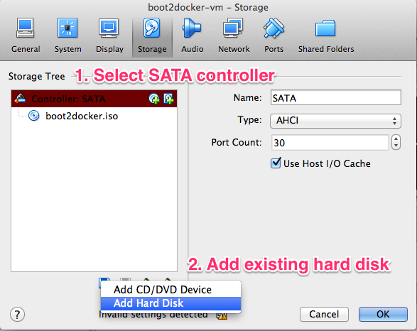
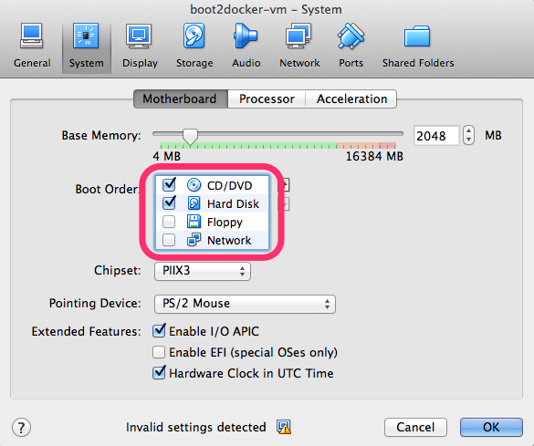

page_title: Resizing a Boot2Docker Volume	
page_description: Resizing a Boot2Docker Volume in VirtualBox with GParted
page_keywords: boot2docker, volume, virtualbox

# Getting “no space left on device” Errors with Boot2Docker?

If you're using Boot2Docker with a large number of images, or the images you're working 
with are very large, you might run into trouble if the Boot2Docker VM's volume runs out of 
space. The solution is to increase the volume size by first cloning it, then resizing it 
using a disk partitioning tool. We'll use (GParted)[http://gparted.sourceforge.net/download.php/index.php] 
since it's a free ISO and works well with VirtualBox.

## 1. Stop Boot2Docker’s VM: 

    $ boot2docker stop 

Boot2Docker ships with a VMDK image, which can’t be resized by VirtualBox’s native tools. We will instead create a VDI volume and clone the VMDK volume to it.

## 2. Using the VirtualBox command line tools, clone the VMDK image to a VDI image:

    $ vboxmanage clonehd /full/path/to/boot2docker-hd.vmdk /full/path/to/<newVDIimage>.vdi —format VDI —variant Standard

## 3. Resize the new clone volume, choosing a size that will be appropriate for your needs. If you’re spinning up a lot of containers, or your containers are particularly large, larger will be better:

    $ vboxmanage modifyhd /full/path/to/<newVDIimage>.vdi —resize <size in MB>

## 4. Download a disk partitioning tool ISO, like (GParted)[http://gparted.sourceforge.net/download.php/]. Add the ISO to the Boot2Docker VM’s IDE bus. You might need to create the bus before you can add the ISO.

## 5. Add the new VDI image to the Boot2Docker image in VirtualBox.

## 6. Verify in the Settings for the Boot2Docker VM that CD/DVD is the at the top of the **Boot Order** list.

## 7. Start the Boot2Docker VM in VirtualBox, and the disk partitioning ISO should start up. Using GParted, choose the **GParted Live (default settings)** option. Choose the default keyboard, language, and XWindows settings, and the GParted tool will start up and display the new VDI volume you created. Right click on the VDI and choose **Resize/Move**. Drag the slider representing the volume to its maximum size, click **Resize/Move**, and then **Apply**. Quit GParted and shut down the VM. Remove the GParted ISO from the IDE controller for the Boot2Docker VM in VirtualBox.

## 8. Start the Boot2Docker VM, either in VirtualBox or using the command line (`boot2docker start`) to make sure the volume changes took effect.

## You’re done!

