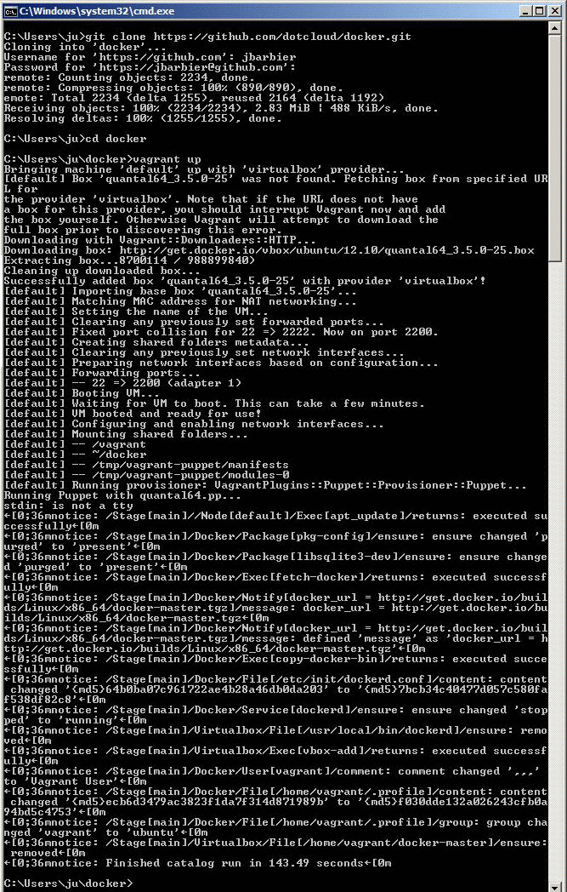
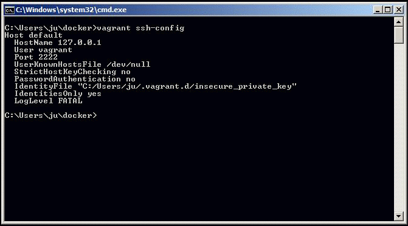
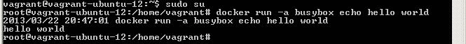

:title: Requirements and Installation on Windows
:description: Docker's tutorial to run docker on Windows
:keywords: Docker, Docker documentation, Windows, requirements, virtualbox, vagrant, git, ssh, putty, cygwin

.. _windows:

**Vagrant installation is temporarily out of date, it will be updated for 0.6 soon.**

Using Vagrant (Windows)
=======================

  Please note this is a community contributed installation path. The only 'official' installation is using the :ref:`ubuntu_linux` installation path. This version
  may be out of date because it depends on some binaries to be updated and published


Requirements
------------

1. Install virtualbox from https://www.virtualbox.org - or follow this tutorial__

.. __: http://www.slideshare.net/julienbarbier42/install-virtualbox-on-windows-7

2. Install vagrant from http://www.vagrantup.com - or follow this tutorial__

.. __: http://www.slideshare.net/julienbarbier42/install-vagrant-on-windows-7

3. Install git with ssh from http://git-scm.com/downloads - or follow this tutorial__

.. __: http://www.slideshare.net/julienbarbier42/install-git-with-ssh-on-windows-7


We recommend having at least 2Gb of free disk space and 2Gb of RAM (or more).

Opening a command prompt
------------------------

First open a cmd prompt. Press Windows key and then press “R” key. This will open the RUN dialog box for you. Type “cmd” and press Enter. Or you can click on Start, type “cmd” in the “Search programs and files” field, and click on cmd.exe.

.. image:: images/win/_01.gif
   :alt: Git install
   :align: center

This should open a cmd prompt window.

.. image:: images/win/_02.gif
   :alt: run docker
   :align: center

Alternatively, you can also use a Cygwin terminal, or Git Bash (or any other command line program you are usually using). The next steps would be the same.

Launch an Ubuntu virtual server
-------------------------------

Let’s download and run an Ubuntu image with docker binaries already installed.

.. code-block:: bash

	git clone https://github.com/dotcloud/docker.git 
	cd docker
	vagrant up



Congratulations! You are running an Ubuntu server with docker installed on it. You do not see it though, because it is running in the background.

Log onto your Ubuntu server
---------------------------

Let’s log into your Ubuntu server now. To do so you have two choices:

- Use Vagrant on Windows command prompt OR
- Use SSH

Using Vagrant on Windows Command Prompt
```````````````````````````````````````

Run the following command

.. code-block:: bash

	vagrant ssh

You may see an error message starting with “`ssh` executable not found”. In this case it means that you do not have SSH in your PATH. If you do not have SSH in your PATH you can set it up with the “set” command. For instance, if your ssh.exe is in the folder named “C:\Program Files (x86)\Git\bin”, then you can run the following command:

.. code-block:: bash

	set PATH=%PATH%;C:\Program Files (x86)\Git\bin

.. image:: images/win/run_03.gif
   :alt: run docker
   :align: center

Using SSH
`````````

First step is to get the IP and port of your Ubuntu server. Simply run:

.. code-block:: bash

	vagrant ssh-config 

You should see an output with HostName and Port information. In this example, HostName is 127.0.0.1 and port is 2222. And the User is “vagrant”. The password is not shown, but it is also “vagrant”.



You can now use this information for connecting via SSH to your server. To do so you can:

- Use putty.exe OR
- Use SSH from a terminal

Use putty.exe
'''''''''''''

You can download putty.exe from this page http://www.chiark.greenend.org.uk/~sgtatham/putty/download.html
Launch putty.exe and simply enter the information you got from last step.

.. image:: images/win/putty.gif
   :alt: run docker
   :align: center

Open, and enter user = vagrant and password = vagrant.

.. image:: images/win/putty_2.gif
   :alt: run docker
   :align: center

SSH from a terminal
'''''''''''''''''''

You can also run this command on your favorite terminal (windows prompt, cygwin, git-bash, …). Make sure to adapt the IP and port from what you got from the vagrant ssh-config command.

.. code-block:: bash

	ssh vagrant@127.0.0.1 –p 2222

Enter user = vagrant and password = vagrant.

.. image:: images/win/cygwin.gif
   :alt: run docker
   :align: center

Congratulations, you are now logged onto your Ubuntu Server, running on top of your Windows machine !

Running Docker
--------------

First you have to be root in order to run docker. Simply run the following command:

.. code-block:: bash

	sudo su

You are now ready for the docker’s “hello world” example. Run

.. code-block:: bash

	docker run busybox echo hello world



All done!

Now you can continue with the :ref:`hello_world` example.
