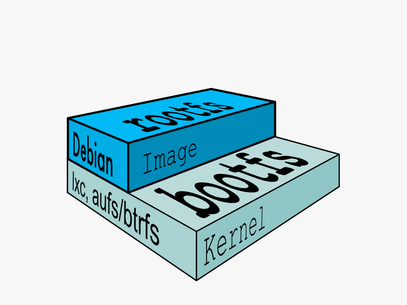
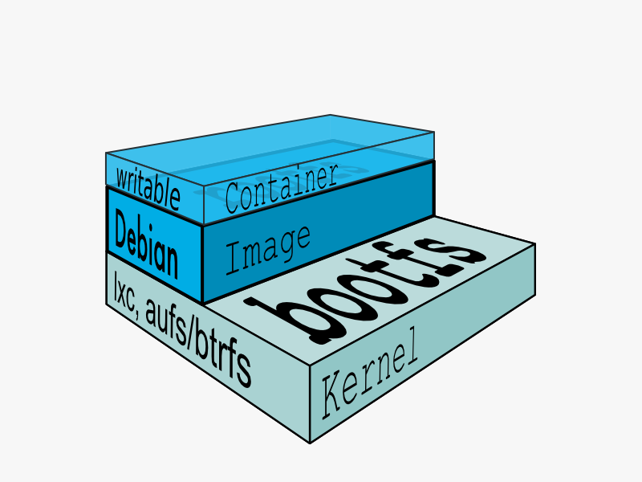
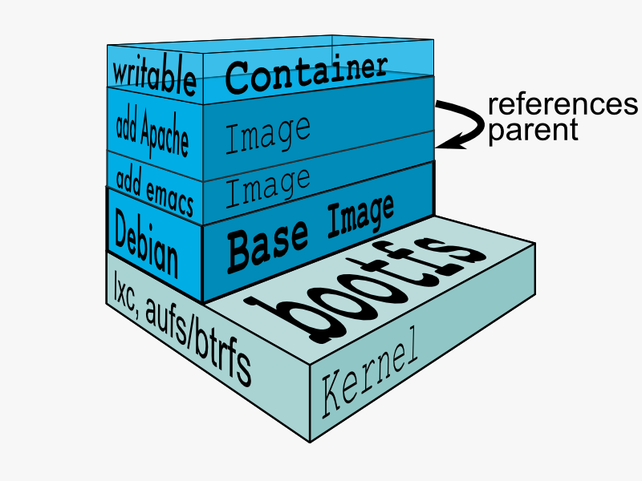

:title: Images
:description: Definition of an image
:keywords: containers, lxc, concepts, explanation, image, container

.. _image_def:

Image
=====

In Docker terminology, a read-only :ref:`layer_def` is called an
**image**. An image never changes. 

Since Docker uses a :ref:`ufs_def`, the processes think the whole file
system is mounted read-write. But all the changes go to the top-most
writeable layer, and underneath, the original file in the read-only
image is unchanged. Since images don't change, images do not have state.

.. _parent_image_def:

Parent Image
............

Each image may depend on one more image which forms the layer beneath
it. We sometimes say that the lower image is the **parent** of the
upper image.

.. _base_image_def:

Base Image
..........

An image that has no parent is a **base image**.

Image IDs
.........
All images are identified by a 64 hexadecimal digit string (internally a 256bit 
value). To simplify their use, a short ID of the first 12 characters can be used 
on the command line. There is a small possibility of short id collisions, so the 
docker server will always return the long ID.

