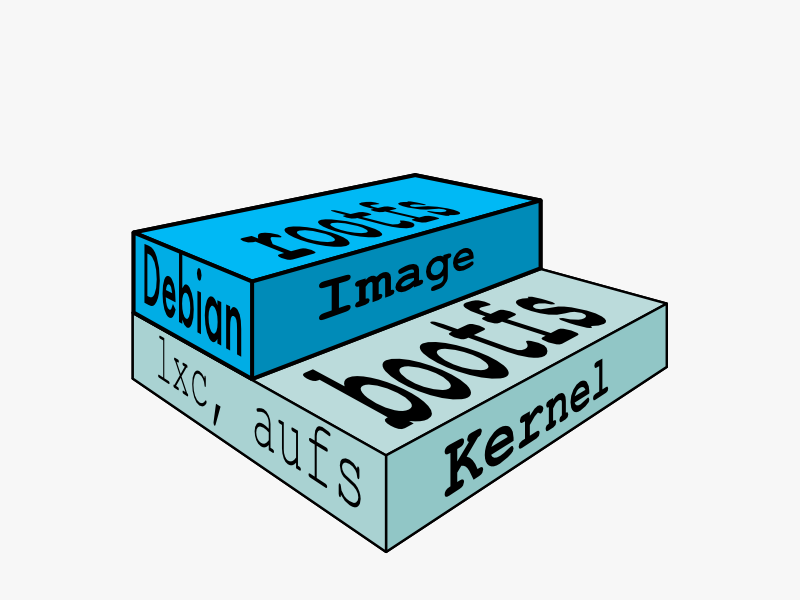
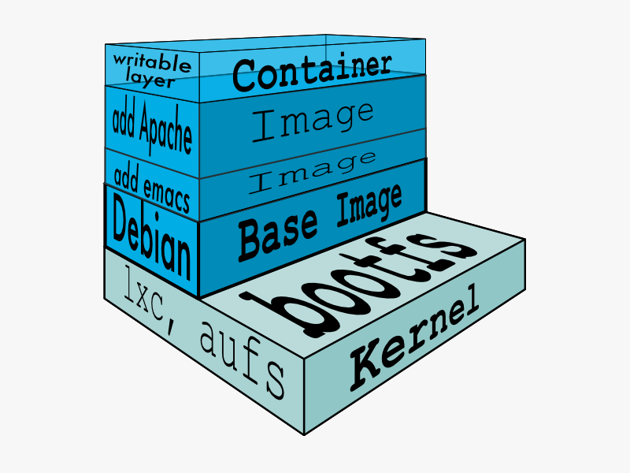

:title: Images
:description: Definition of an image
:keywords: containers, lxc, concepts, explanation, image, container

.. _image_def:

Image
=====

In Docker terminology, a read-only :ref:`layer_def` is called an
**image**. An image never changes. 

Since Docker uses a :ref:`ufs_def`, the processes think the whole file
system is mounted read-write. But all the changes go to the top-most
writeable layer, and underneath, the original file in the read-only
image is unchanged. Since images don't change, images do not have state.

You can **create an image** from a container by :doc:`committing
</commandline/command/commit>` a container or with a :ref:`Dockerfile
<dockerbuilder>`. But it is a lot easier to **pull an image** from a
:ref:`repository <working_with_the_repository>`.

.. image:: images/docker-filesystems-debianrw.png

.. _parent_image_def:

Parent Image
............

Each image may depend on one more image which forms the layer beneath
it. We sometimes say that the lower image is the **parent** of the
upper image.

.. _base_image_def:

Base Image
..........

An image that has no parent is a **base image**. You can :ref:`create
your own <base_image_creation>` or use one of the public images in the
`central Index <http://index.docker.io>`_ where you can search for
your favorite distro by name.

