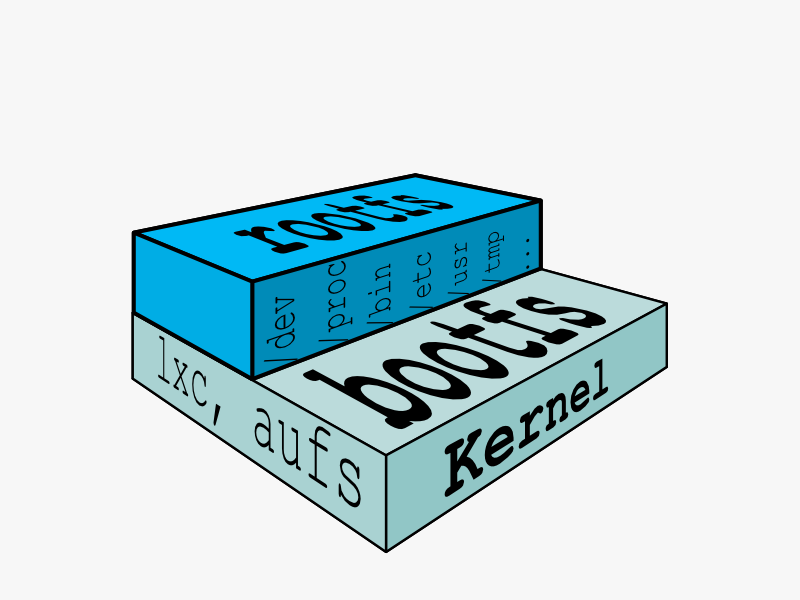
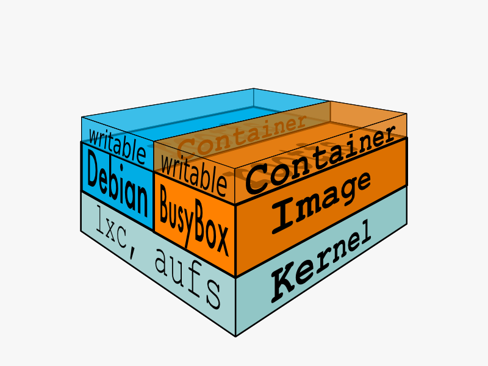
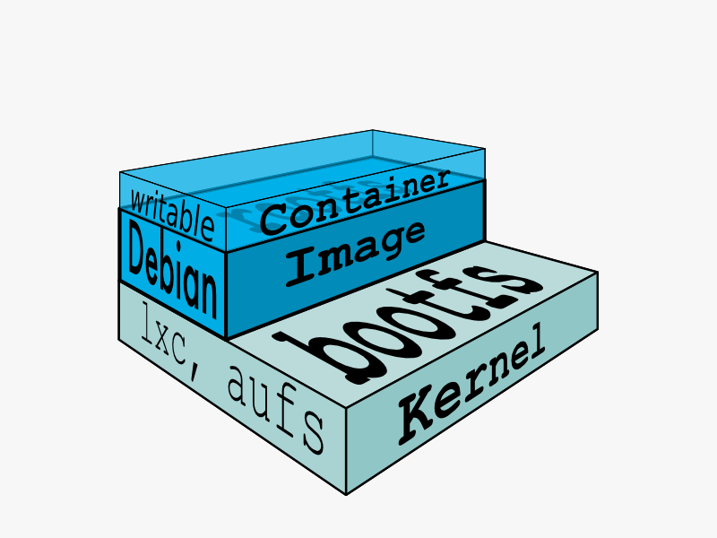

:title: Image & Container
:description: Definitions of an image and container
:keywords: containers, lxc, concepts, explanation, image, container

File Systems
============

In order for a Linux system to run, it typically needs two `file
systems <http://en.wikipedia.org/wiki/Filesystem>`_:

1. boot file system (bootfs)
2. root file system (rootfs)

The **boot file system** contains the bootloader and the kernel. The
user never makes any changes to the boot file system. In fact, soon
after the boot process is complete, the entire kernel is in memory,
and the boot file system is unmounted to free up the RAM associated
with the initrd disk image.

The **root file system** includes the typical directory structure we
associate with Unix-like operating systems: ``/dev, /proc, /bin, /etc,
/lib, /usr,`` and ``/tmp`` plus all the configuration files, binaries
and libraries required to run user applications (like bash, ls, and so
forth). 

While there can be important kernal differences between differnt Linux
distributions, the contents and organization of the root file system
are usually what make your software packages dependant on one
distribution versus another. Docker can help solve this problem by
running multiple distributions at the same time.

Layers and Union Mounts
=======================

In a traditional Linux boot, the kernel first mounts the root file
system as read-only, checks its integrity, and then switches the whole
rootfs volume to read-write mode. Docker does something similar,
*except* that instead of changing the file system to read-write mode,
it takes advantage of a `union mount
<http://en.wikipedia.org/wiki/Union_mount>`_ to add a read-write file
system *over* the read-only file system. In fact there may be multiple
read-only file systems stacked on top of each other.

At first, the top layer has nothing in it, but any time a process
creates a file, this happens in the top layer. And if something needs
to update an existing file in a lower layer, then the file gets copied
to the upper layer and changes go into the copy. The version of the
file on the lower layer cannot be seen by the applications anymore,
but it is there, unchanged.

We call the union of the read-write layer and all the read-only layers
a **union file system**.

Image
=====

In Docker terminology, the read-only layer is called the
**image**. An image never changes. Because Docker uses a union file
system, the applications think the whole file system is mounted
read-write, because any file can be changed. But all the changes go to
the top-most layer, and underneath, the image is unchanged. Since they
don't change, images do not have state.

Each image may depend on one more image which forms the layer beneath
it. We sometimes say that the lower image is the **parent** of the
upper image.

Base Image
==========

An image that has no parent is a **base image**.

Container
=========

Once you start a Docker container from an image, Docker fetches the
image and its parent, and repeats the process until it reaches the
base image. Then the union file system adds a read-write layer on
top. That read-write layer, plus the information about its parent and
some additional information like its unique id, is called a
**container**. 

Containers can change, and so they have state. A container may be
running or exited. In either case, the state of the file system and
its exit value is preserved. You can start, stop, and restart a
container. The processes restart from scratch (their memory state is
**not** preserved in a container), but the file system is just as it
was when the container was stopped.

You can promote a container to an image with ``docker commit``. Once a
container is an image, you can use it as a parent for new containers.
