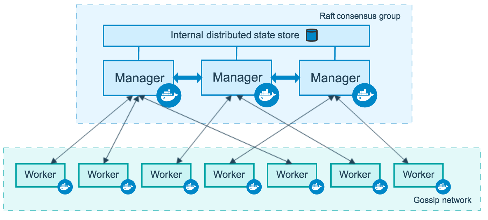

<!--[metadata]>
+++
aliases = [
"/engine/swarm/how-swarm-mode-works/"
]
title = "How nodes work"
description = "How swarm nodes work"
keywords = ["docker, container, cluster, swarm mode, node"]
[menu.main]
identifier="how-nodes-work"
parent="how-swarm-works"
weight="3"
+++
<![end-metadata]-->

# How nodes work

Docker Engine 1.12 introduces swarm mode that enables you to create a
cluster of one or more Docker Engines called a swarm. A swarm consists
of one or more nodes: physical or virtual machines running Docker
Engine 1.12 or later in swarm mode.

There are two types of nodes: [**managers**](#manager-nodes) and
[**workers**](#worker-nodes).

If you haven't already, read through the [swarm mode overview](../index.md) and [key concepts](../key-concepts.md).

## Manager nodes

Manager nodes handle cluster management tasks:

* maintaining cluster state
* scheduling services
* serving swarm mode [HTTP API endpoints](../../reference/api/index.md)

Using a [Raft](https://raft.github.io/raft.pdf) implementation, the managers
maintain a consistent internal state of the entire swarm and all the services
running on it. For testing purposes it is OK to run a swarm with a single
manager. If the manager in a single-manager swarm fails, your services will
continue to run, but you will need to create a new cluster to recover.

To take advantage of swarm mode's fault-tolerance features, Docker recommends
you implement an odd number of nodes according to your organization's
high-availability requirements. When you have multiple managers you can recover
from the failure of a manager node without downtime.

* A three-manager swarm tolerates a maximum loss of one manager.
* A five-manager swarm tolerates a maximum simultaneous loss of two
manager nodes.
* An `N` manager cluster will tolerate the loss of at most
`(N-1)/2` managers.
* Docker recommends a maximum of seven manager nodes for a swarm.

    >**Important Note**: Adding more managers does NOT mean increased
    scalability or higher performance. In general, the opposite is true.

## Worker nodes

Worker nodes are also instances of Docker Engine whose sole purpose is to
execute containers. Worker nodes don't participate in the Raft distributed
state, make in scheduling decisions, or serve the swarm mode HTTP API.

You can create a swarm of one manager node, but you cannot have a worker node
without at least one manager node. By default, all managers are also workers.
In a single manager node cluster, you can run commands like `docker service
create` and the scheduler will place all tasks on the local Engine.

To prevent the scheduler from placing tasks on a manager node in a multi-node
swarm, set the availability for the manager node to `Drain`. The scheduler
gracefully stops tasks on nodes in `Drain` mode and schedules the tasks on an
`Active` node. The scheduler does not assign new tasks to nodes with `Drain`
availability.

Refer to the [`docker node update`](../../reference/commandline/node_update.md)
command line reference to see how to change node availability.

## Changing roles

You can promote a worker node to be a manager by running `docker node promote`.
For example, you may want to promote a worker node when you
take a manager node offline for maintenance. See [node promote](../../reference/commandline/node_promote.md).

You can also demote a manager node to a worker node. See
[node demote](../../reference/commandline/node_demote.md).

## Learn More

* Read about how swarm mode [services](services.md) work.
* Learn how [PKI](pki.md) works in swarm mode
