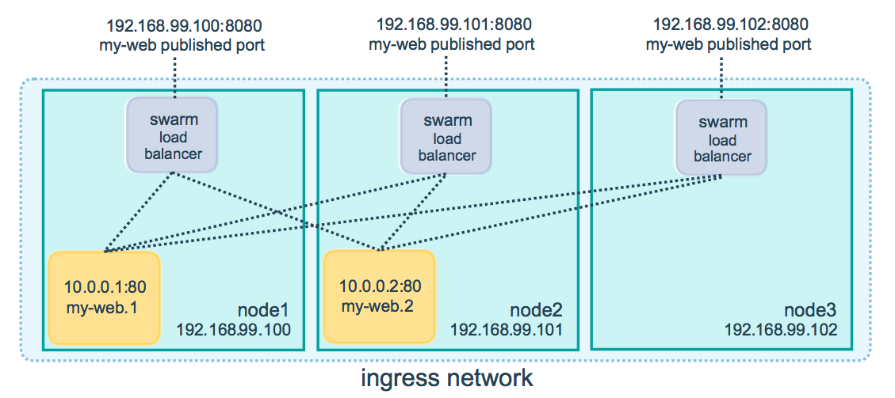
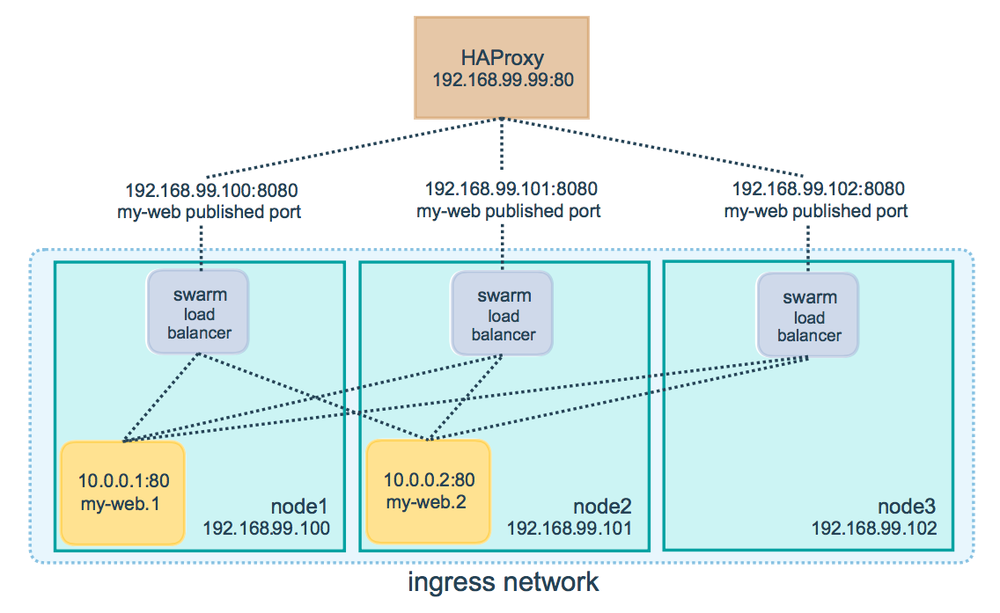

<!--[metadata]>
+++
title = "Use swarm mode routing mesh"
description = "Use the routing mesh to publish services externally to a swarm"
keywords = ["guide", "swarm mode", "swarm", "network", "ingress", "routing mesh"]
[menu.main]
identifier="ingress-guide"
parent="engine_swarm"
weight=17
+++
<![end-metadata]-->

# Use swarm mode routing mesh

Docker Engine swarm mode makes it easy to publish ports for services to make
them available to resources outside the swarm. All nodes participate in an
ingress **routing mesh**. The routing mesh enables each node in the swarm to
accept connections on published ports for any service running in the swarm, even
if there's no task running on the node. The routing mesh routes all
incoming requests to published ports on available nodes to an active container.

In order to use the ingress network in the swarm, you need to have the following
ports open between the swarm nodes before you enable swarm mode:

* Port `7946` TCP/UDP for container network discovery.
* Port `4789` UDP for the container ingress network.

You must also open the published port between the swarm nodes and any external
resources, such as an external load balancer, that require access to the port.

## Publish a port for a service

Use the `--publish` flag to publish a port when you create a service:

```bash
$ docker service create \
  --name <SERVICE-NAME> \
  --publish <PUBLISHED-PORT>:<TARGET-PORT> \
  <IMAGE>
```

The `<TARGET-PORT>` is the port where the container listens.
The `<PUBLISHED-PORT>` is the port where the swarm makes the service available.

For example, the following command publishes port 80 in the nginx container to
port 8080 for any node in the swarm:

```bash
$ docker service create \
  --name my-web \
  --publish 8080:80 \
  --replicas 2 \
  nginx
```

When you access port 8080 on any node, the swarm load balancer routes your
request to an active container.

The routing mesh listens on the published port for any IP address assigned to
the node. For externally routable IP addresses, the port is available from
outside the host. For all other IP addresses the access is only available from
within the host.



You can publish a port for an existing service using the following command:

```bash
$ docker service update \
  --publish-add <PUBLISHED-PORT>:<TARGET-PORT> \
  <SERVICE>
```

You can use `docker service inspect` to view the service's published port. For
instance:

```bash
$ docker service inspect --format="{{json .Endpoint.Spec.Ports}}" my-web

[{"Protocol":"tcp","TargetPort":80,"PublishedPort":8080}]
```

The output shows the `<TARGET-PORT>` from the containers and the
`<PUBLISHED-PORT>` where nodes listen for requests for the service.

## Configure an external load balancer

You can configure an external load balancer to route requests to a swarm
service. For example, you could configure [HAProxy](http://www.haproxy.org) to
balance requests to an nginx service published to port 8080.



In this case, port 8080 must be open between the load balancer and the nodes in
the swarm. The swarm nodes can reside on a private network that is accessible to
the proxy server, but that is not publicly accessible.

You can configure the load balancer to balance requests between every node in
the swarm even if the there are no tasks scheduled on the node. For example, you
could have the following HAProxy configuration in `/etc/haproxy/haproxy.cfg`:

```bash
global
        log /dev/log    local0
        log /dev/log    local1 notice
...snip...

# Configure HAProxy to listen on port 80
frontend http_front
   bind *:80
   stats uri /haproxy?stats
   default_backend http_back

# Configure HAProxy to route requests to swarm nodes on port 8080
backend http_back
   balance roundrobin
   server node1 192.168.99.100:8080 check
   server node2 192.168.99.101:8080 check
   server node3 192.168.99.102:8080 check
```

When you access the HAProxy load balancer on port 80, it forwards requests to
nodes in the swarm. The swarm routing mesh routes the request to an active task.
If, for any reason the swarm scheduler dispatches tasks to different nodes, you
don't need to reconfigure the load balancer.

You can configure any type of load balancer to route requests to swarm nodes.
To learn more about HAProxy, see the [HAProxy documentation](https://cbonte.github.io/haproxy-dconv/).

## Learn more

* [Deploy services to a swarm](services.md)
