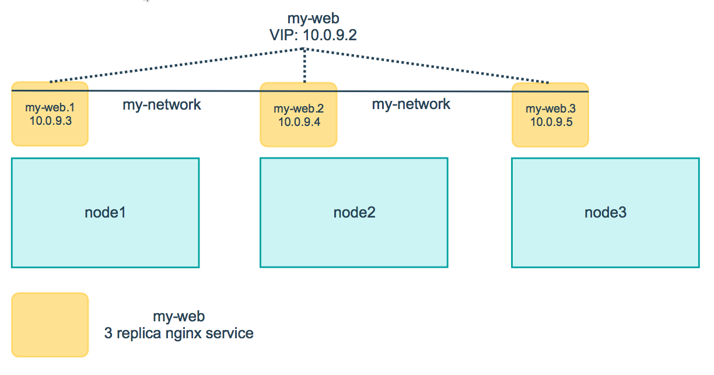

<!--[metadata]>
+++
title = "Attach services to an overlay network"
description = "Use swarm mode networking features"
keywords = ["guide", "swarm mode", "swarm", "network"]
[menu.main]
identifier="networking-guide"
parent="engine_swarm"
weight=16
+++
<![end-metadata]-->

# Attach services to an overlay network

Docker Engine swarm mode natively supports **overlay networks**, so you can
enable container-to-container networks. When you use swarm mode, you don't need
an external key-value store. Features of swarm mode overlay networks include the
following:

* You can attach multiple services to the same network.
* By default, **service discovery** assigns a virtual IP address (VIP) and DNS
entry to each service in the swarm, making it available by its service name to
containers on the same network.
* You can configure the service to use DNS round-robin instead of a VIP.

In order to use overlay networks in the swarm, you need to have the following
ports open between the swarm nodes before you enable swarm mode:

* Port `7946` TCP/UDP for container network discovery.
* Port `4789` UDP for the container overlay network.

## Create an overlay network in a swarm

When you run Docker Engine in swarm mode, you can run `docker network create`
from a manager node to create an overlay network. For instance, to create a
network named `my-network`:

```
$ docker network create \
  --driver overlay \
  --subnet 10.0.9.0/24 \
  --opt encrypted \
  my-network

273d53261bcdfda5f198587974dae3827e947ccd7e74a41bf1f482ad17fa0d33
```

By default nodes in the swarm encrypt traffic between themselves and other
nodes. The optional `--opt encrypted` flag enables an additional layer of
encryption in the overlay driver for vxlan traffic between containers on
different nodes. For more information, refer to [Docker swarm mode overlay network security model](../userguide/networking/overlay-security-model.md).

The `--subnet` flag specifies the subnet for use with the overlay network. When
you don't specify a subnet, the swarm manager automatically chooses a subnet and
assigns it to the network. On some older kernels, including kernel 3.10,
automatically assigned adresses may overlap with another subnet in your
infrastructure. Such overlaps can cause connectivity issues or failures with containers connected to the network.

Before you attach a service to the network, the network only extends to manager
nodes. You can run `docker network ls` to view the network:

```bash
$ docker network ls

NETWORK ID          NAME        DRIVER   SCOPE
f9145f09b38b        bridge      bridge   local
..snip..
273d53261bcd        my-network  overlay  swarm
```

The `swarm` scope indicates that the network is available for use with services
deployed to the swarm. After you create a service attached to the network, the
swarm only extends the network to worker nodes where the scheduler places tasks
for the service. On workers without tasks running for a service attached to the
network, `network ls` does not display the network.

## Attach a service to an overlay network

To attach a service to an overlay network, pass the `--network` flag when you
create a service. For example to create an nginx service attached to a
network called `my-network`:

```bash
$ docker service create \
  --replicas 3 \
  --name my-web \
  --network my-network \
  nginx
```

>**Note:** You have to create the network before you can attach a service to it.

The containers for the tasks in the service can connect to one another on the
overlay network. The swarm extends the network to all the nodes with `Running`
tasks for the service.

From a manager node, run `docker service ps <SERVICE>` to view the nodes where
tasks are running for the service:

```bash
$ docker service ps my-web

ID                         NAME      IMAGE  NODE   DESIRED STATE  CURRENT STATE               ERROR
63s86gf6a0ms34mvboniev7bs  my-web.1  nginx  node1  Running        Running 58 seconds ago
6b3q2qbjveo4zauc6xig7au10  my-web.2  nginx  node2  Running        Running 58 seconds ago
66u2hcrz0miqpc8h0y0f3v7aw  my-web.3  nginx  node3  Running        Running about a minute ago
```



You can inspect the network from any node with a `Running` task for a service
attached to the network:

```bash
$ docker network inspect <NETWORK>
```

The network information includes a list of the containers on the node that are
attached to the network. For instance:

```bash
$ docker network inspect my-network
[
    {
        "Name": "my-network",
        "Id": "273d53261bcdfda5f198587974dae3827e947ccd7e74a41bf1f482ad17fa0d33",
        "Scope": "swarm",
        "Driver": "overlay",
        "EnableIPv6": false,
        "IPAM": {
            "Driver": "default",
            "Options": null,
            "Config": [
                {
                    "Subnet": "10.0.9.0/24",
                    "Gateway": "10.0.9.1"
                }
            ]
        },
        "Internal": false,
        "Containers": {
            "404d1dec939a021678132a35259c3604b9657649437e59060621a17edae7a819": {
                "Name": "my-web.1.63s86gf6a0ms34mvboniev7bs",
                "EndpointID": "3c9588d04db9bc2bf8749cb079689a3072c44c68e544944cbea8e4bc20eb7de7",
                "MacAddress": "02:42:0a:00:09:03",
                "IPv4Address": "10.0.9.3/24",
                "IPv6Address": ""
            }
        },
        "Options": {
            "com.docker.network.driver.overlay.vxlanid_list": "257"
        },
        "Labels": {}
    }
]
```

In the example above, the container `my-web.1.63s86gf6a0ms34mvboniev7bs` for the
`my-web` service is attached to the `my-network` network on node2.

## Use swarm mode service discovery

By default, when you create a service attached to a network, the swarm assigns
the service a VIP. The VIP maps to a DNS alias based upon the service name.
Containers on the network share DNS mappings for the service via gossip so any container on the network can access the service via its service
name.

You don't need to expose service-specific ports to make the service
available to other services on the same overlay network. The swarm's internal
load balancer automatically distributes requests to the service VIP among the
active tasks.

You can inspect the service to view the virtual IP. For example:

```bash
$ docker service inspect \
  --format='{{json .Endpoint.VirtualIPs}}' \
  my-web

[{"NetworkID":"7m2rjx0a97n88wzr4nu8772r3" "Addr":"10.0.0.2/24"}]
```

The following example shows how you can add a `busybox` service on the same
network as the `nginx` service and the busybox service is able to access `nginx`
using the DNS name `my-web`:

1. From a manager node, deploy a busybox service to the same network as
`my-web`:

    ```bash
    $ docker service create \
      --name my-busybox \
      --network my-network \
      busybox \
      sleep 3000
    ```

2. Lookup the node where `my-busybox` is running:

    ```bash
    $ docker service ps my-busybox

    ID                         NAME          IMAGE    NODE   DESIRED STATE  CURRENT STATE          ERROR
    1dok2cmx2mln5hbqve8ilnair  my-busybox.1  busybox  node1  Running        Running 5 seconds ago
    ```

3. From the node where the busybox task is running, open an interactive shell to
the busybox container:

    ```bash
    $ docker exec -it my-busybox.1.1dok2cmx2mln5hbqve8ilnair /bin/sh
    ```

    You can deduce the container name as `<TASK-NAME>`+`<ID>`. Alternatively,
    you can run `docker ps` on the node where the task is running.

4. From inside the busybox container, query the DNS to view the VIP for the
`my-web` service:

    ```bash
    $ nslookup my-web

    Server:    127.0.0.11
    Address 1: 127.0.0.11

    Name:      my-web
    Address 1: 10.0.9.2 ip-10-0-9-2.us-west-2.compute.internal
    ```

    >**Note:** the examples here use `nslookup`, but you can use `dig` or any
    available DNS query tool.

5. From inside the busybox container, query the DNS using a special query
<tasks.SERVICE-NAME> to find the IP addresses of all the containers for the
`my-web` service:

    ```bash
    $ nslookup tasks.my-web

    Server:    127.0.0.11
    Address 1: 127.0.0.11

    Name:      tasks.my-web
    Address 1: 10.0.9.4 my-web.2.6b3q2qbjveo4zauc6xig7au10.my-network
    Address 2: 10.0.9.3 my-web.1.63s86gf6a0ms34mvboniev7bs.my-network
    Address 3: 10.0.9.5 my-web.3.66u2hcrz0miqpc8h0y0f3v7aw.my-network
    ```

6. From inside the busybox container, run `wget` to access the nginx web server
running in the `my-web` service:

    ```bash
    $ wget -O- my-web

    Connecting to my-web (10.0.9.2:80)
    <!DOCTYPE html>
    <html>
    <head>
    <title>Welcome to nginx!</title>
    ...snip...
    ```

    The swarm load balancer automatically routes the HTTP request to the
    service's VIP to an active task. It distributes subsequent requests to
    other tasks using round-robin selection.

## Use DNS round-robin for a service

You can configure the service to use DNS round-robin directly without using a
VIP, by setting the `--endpoint-mode dnsrr` when you create the service. DNS round-robin is useful in cases where you want to use your own load balancer.

The following example shows a service with `dnsrr` endpoint mode:

```bash
$ docker service create \
  --replicas 3 \
  --name my-dnsrr-service \
  --network my-network \
  --endpoint-mode dnsrr \
  nginx
```

When you query the DNS for the service name, the DNS service returns the IP
addresses for all the task containers:

```bash
$ nslookup my-dnsrr-service
Server:    127.0.0.11
Address 1: 127.0.0.11

Name:      my-dnsrr
Address 1: 10.0.9.8 my-dnsrr-service.1.bd3a67p61by5dfdkyk7kog7pr.my-network
Address 2: 10.0.9.10 my-dnsrr-service.3.0sb1jxr99bywbvzac8xyw73b1.my-network
Address 3: 10.0.9.9 my-dnsrr-service.2.am6fx47p3bropyy2dy4f8hofb.my-network
```

## Confirm VIP connectivity

In genaral we recommend you use `dig`, `nslookup`, or another DNS query tool to
test access to the service name via DNS. Because a VIP is a logical IP, `ping`
is not the right tool to confirm VIP connectivity.

## Learn More

* [Deploy services to a swarm](services.md)
* [Swarm administration guide](admin_guide.md)
* [Docker Engine command line reference](../reference/commandline/index.md)
* [Swarm mode tutorial](swarm-tutorial/index.md)
