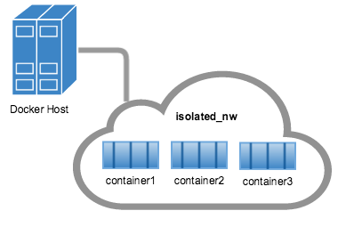
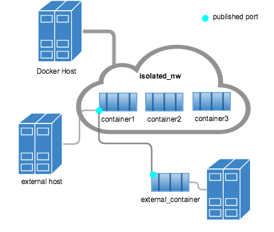
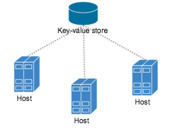
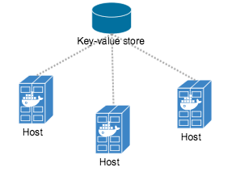
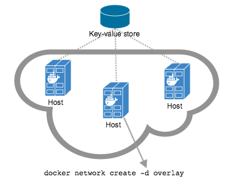
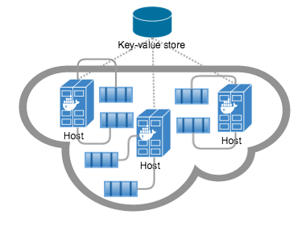

<!--[metadata]>
+++
title = "Docker container networking"
description = "How do we connect docker containers within and across hosts ?"
keywords = ["Examples, Usage, network, docker, documentation, user guide, multihost, cluster"]
[menu.main]
parent = "smn_networking"
weight = -5
+++
<![end-metadata]-->

# Understand Docker container networks

To build web applications that act in concert but do so securely, use the Docker
networks feature. Networks, by definition, provide complete isolation for
containers. So, it is important to have control over the networks your
applications run on. Docker container networks give you that control.

This section provides an overview of the default networking behavior that Docker
Engine delivers natively. It describes the type of networks created by default
and how to create your own, user--defined networks. It also describes the
resources required to create networks on a single host or across a cluster of
hosts.

## Default Networks

When you install Docker, it creates three networks automatically. You can list
these networks using the `docker network ls` command:

```
$ docker network ls
NETWORK ID          NAME                DRIVER
7fca4eb8c647        bridge              bridge
9f904ee27bf5        none                null
cf03ee007fb4        host                host
```

Historically, these three networks are  part of Docker's implementation. When
you run a container you can use the `--net` flag to specify which network you
want to run a container on. These three networks are still available to you.

The `bridge` network represents the `docker0` network present in all Docker
installations. Unless you specify otherwise with the `docker run
--net=<NETWORK>` option, the Docker daemon connects containers to this network
by default. You can see this bridge as part of a host's network stack by using
the `ifconfig` command on the host.

```
ubuntu@ip-172-31-36-118:~$ ifconfig
docker0   Link encap:Ethernet  HWaddr 02:42:47:bc:3a:eb  
          inet addr:172.17.0.1  Bcast:0.0.0.0  Mask:255.255.0.0
          inet6 addr: fe80::42:47ff:febc:3aeb/64 Scope:Link
          UP BROADCAST RUNNING MULTICAST  MTU:9001  Metric:1
          RX packets:17 errors:0 dropped:0 overruns:0 frame:0
          TX packets:8 errors:0 dropped:0 overruns:0 carrier:0
          collisions:0 txqueuelen:0
          RX bytes:1100 (1.1 KB)  TX bytes:648 (648.0 B)
```

The `none` network adds a container to a container-specific network stack. That container lacks a network interface. Attaching to such a container and looking at it's stack you see this:

```
ubuntu@ip-172-31-36-118:~$ docker attach nonenetcontainer

/ # cat /etc/hosts
127.0.0.1	localhost
::1	localhost ip6-localhost ip6-loopback
fe00::0	ip6-localnet
ff00::0	ip6-mcastprefix
ff02::1	ip6-allnodes
ff02::2	ip6-allrouters
/ # ifconfig
lo        Link encap:Local Loopback  
          inet addr:127.0.0.1  Mask:255.0.0.0
          inet6 addr: ::1/128 Scope:Host
          UP LOOPBACK RUNNING  MTU:65536  Metric:1
          RX packets:0 errors:0 dropped:0 overruns:0 frame:0
          TX packets:0 errors:0 dropped:0 overruns:0 carrier:0
          collisions:0 txqueuelen:0
          RX bytes:0 (0.0 B)  TX bytes:0 (0.0 B)

/ #
```
>**Note**: You can detach from the container and leave it running with `CTRL-p CTRL-q`.

The `host` network adds a container on the hosts network stack. You'll find the
network configuration inside the container is identical to the host.

With the exception of the the `bridge` network, you really don't need to
interact with these default networks. While you can list and inspect them, you
cannot remove them. They are required by your Docker installation. However, you
can add your own user-defined networks and these you can remove when you no
longer need them. Before you learn more about creating your own networks, it is
worth looking at the `default` network a bit.


### The default bridge network in detail
The default bridge network is present on all Docker hosts. The `docker network inspect`

```
$ docker network inspect bridge
[
   {
       "Name": "bridge",
       "Id": "f7ab26d71dbd6f557852c7156ae0574bbf62c42f539b50c8ebde0f728a253b6f",
       "Scope": "local",
       "Driver": "bridge",
       "IPAM": {
           "Driver": "default",
           "Config": [
               {
                   "Subnet": "172.17.0.1/16",
                   "Gateway": "172.17.0.1"
               }
           ]
       },
       "Containers": {},
       "Options": {
           "com.docker.network.bridge.default_bridge": "true",
           "com.docker.network.bridge.enable_icc": "true",
           "com.docker.network.bridge.enable_ip_masquerade": "true",
           "com.docker.network.bridge.host_binding_ipv4": "0.0.0.0",
           "com.docker.network.bridge.name": "docker0",
           "com.docker.network.driver.mtu": "9001"
       }
   }
]
```
The Engine automatically creates a `Subnet` and `Gateway` to the network.
The `docker run` command automatically adds new containers to this network.

```
$ docker run -itd --name=container1 busybox
3386a527aa08b37ea9232cbcace2d2458d49f44bb05a6b775fba7ddd40d8f92c

$ docker run -itd --name=container2 busybox
94447ca479852d29aeddca75c28f7104df3c3196d7b6d83061879e339946805c
```

Inspecting the `bridge` network again after starting two containers shows both newly launched containers in the network. Their ids show up in the container

```
$ docker network inspect bridge
{[
    {
        "Name": "bridge",
        "Id": "f7ab26d71dbd6f557852c7156ae0574bbf62c42f539b50c8ebde0f728a253b6f",
        "Scope": "local",
        "Driver": "bridge",
        "IPAM": {
            "Driver": "default",
            "Config": [
                {
                    "Subnet": "172.17.0.1/16",
                    "Gateway": "172.17.0.1"
                }
            ]
        },
        "Containers": {
            "3386a527aa08b37ea9232cbcace2d2458d49f44bb05a6b775fba7ddd40d8f92c": {
                "EndpointID": "647c12443e91faf0fd508b6edfe59c30b642abb60dfab890b4bdccee38750bc1",
                "MacAddress": "02:42:ac:11:00:02",
                "IPv4Address": "172.17.0.2/16",
                "IPv6Address": ""
            },
            "94447ca479852d29aeddca75c28f7104df3c3196d7b6d83061879e339946805c": {
                "EndpointID": "b047d090f446ac49747d3c37d63e4307be745876db7f0ceef7b311cbba615f48",
                "MacAddress": "02:42:ac:11:00:03",
                "IPv4Address": "172.17.0.3/16",
                "IPv6Address": ""
            }
        },
        "Options": {
            "com.docker.network.bridge.default_bridge": "true",
            "com.docker.network.bridge.enable_icc": "true",
            "com.docker.network.bridge.enable_ip_masquerade": "true",
            "com.docker.network.bridge.host_binding_ipv4": "0.0.0.0",
            "com.docker.network.bridge.name": "docker0",
            "com.docker.network.driver.mtu": "9001"
        }
    }
]
```

The `docker network inspect` command above shows all the connected containers and their network resources on a given network. Containers in this default network are able to communicate with each other using IP addresses. Docker does not support automatic service discovery on the default bridge network. If you want to communicate with container names in this default bridge network, you must connect the containers via the legacy `docker run --link` option.

You can `attach` to a running `container` and investigate its configuration:

```
$ docker attach container1

/ # ifconfig
ifconfig
eth0      Link encap:Ethernet  HWaddr 02:42:AC:11:00:02  
          inet addr:172.17.0.2  Bcast:0.0.0.0  Mask:255.255.0.0
          inet6 addr: fe80::42:acff:fe11:2/64 Scope:Link
          UP BROADCAST RUNNING MULTICAST  MTU:9001  Metric:1
          RX packets:16 errors:0 dropped:0 overruns:0 frame:0
          TX packets:8 errors:0 dropped:0 overruns:0 carrier:0
          collisions:0 txqueuelen:0
          RX bytes:1296 (1.2 KiB)  TX bytes:648 (648.0 B)

lo        Link encap:Local Loopback  
          inet addr:127.0.0.1  Mask:255.0.0.0
          inet6 addr: ::1/128 Scope:Host
          UP LOOPBACK RUNNING  MTU:65536  Metric:1
          RX packets:0 errors:0 dropped:0 overruns:0 frame:0
          TX packets:0 errors:0 dropped:0 overruns:0 carrier:0
          collisions:0 txqueuelen:0
          RX bytes:0 (0.0 B)  TX bytes:0 (0.0 B)
```

Then use `ping` for about 3 seconds to test the connectivity of the containers on this `bridge` network.

```
/ # ping -w3 172.17.0.3
PING 172.17.0.3 (172.17.0.3): 56 data bytes
64 bytes from 172.17.0.3: seq=0 ttl=64 time=0.096 ms
64 bytes from 172.17.0.3: seq=1 ttl=64 time=0.080 ms
64 bytes from 172.17.0.3: seq=2 ttl=64 time=0.074 ms

--- 172.17.0.3 ping statistics ---
3 packets transmitted, 3 packets received, 0% packet loss
round-trip min/avg/max = 0.074/0.083/0.096 ms
```

Finally, use the `cat` command to check the `container1` network configuration:

```
/ # cat /etc/hosts
172.17.0.2	3386a527aa08
127.0.0.1	localhost
::1	localhost ip6-localhost ip6-loopback
fe00::0	ip6-localnet
ff00::0	ip6-mcastprefix
ff02::1	ip6-allnodes
ff02::2	ip6-allrouters
```
To detach from a `container1` and leave it running use `CTRL-p CTRL-q`.Then, attach to `container2` and repeat these three commands.

```
$ docker attach container2

/ # ifconfig
eth0      Link encap:Ethernet  HWaddr 02:42:AC:11:00:03  
          inet addr:172.17.0.3  Bcast:0.0.0.0  Mask:255.255.0.0
          inet6 addr: fe80::42:acff:fe11:3/64 Scope:Link
          UP BROADCAST RUNNING MULTICAST  MTU:9001  Metric:1
          RX packets:15 errors:0 dropped:0 overruns:0 frame:0
          TX packets:13 errors:0 dropped:0 overruns:0 carrier:0
          collisions:0 txqueuelen:0
          RX bytes:1166 (1.1 KiB)  TX bytes:1026 (1.0 KiB)

lo        Link encap:Local Loopback  
          inet addr:127.0.0.1  Mask:255.0.0.0
          inet6 addr: ::1/128 Scope:Host
          UP LOOPBACK RUNNING  MTU:65536  Metric:1
          RX packets:0 errors:0 dropped:0 overruns:0 frame:0
          TX packets:0 errors:0 dropped:0 overruns:0 carrier:0
          collisions:0 txqueuelen:0
          RX bytes:0 (0.0 B)  TX bytes:0 (0.0 B)

/ # ping -w3 172.17.0.2
PING 172.17.0.2 (172.17.0.2): 56 data bytes
64 bytes from 172.17.0.2: seq=0 ttl=64 time=0.067 ms
64 bytes from 172.17.0.2: seq=1 ttl=64 time=0.075 ms
64 bytes from 172.17.0.2: seq=2 ttl=64 time=0.072 ms

--- 172.17.0.2 ping statistics ---
3 packets transmitted, 3 packets received, 0% packet loss
round-trip min/avg/max = 0.067/0.071/0.075 ms
/ # cat /etc/hosts
172.17.0.3	94447ca47985
127.0.0.1	localhost
::1	localhost ip6-localhost ip6-loopback
fe00::0	ip6-localnet
ff00::0	ip6-mcastprefix
ff02::1	ip6-allnodes
ff02::2	ip6-allrouters
```

The default `docker0` bridge network supports the use of port mapping and  `docker run --link` to allow communications between containers in the `docker0` network. These techniques are cumbersome to set up and prone to error. While they are still available to you as techniques, it is better to avoid them and define your own bridge networks instead.

## User-defined networks

You can create your own user-defined networks that better isolate containers.
Docker provides some default **network drivers** for use creating these
networks. You can create a new **bridge network** or **overlay network**. You
can also create a **network plugin** or **remote network**  written to your own
specifications.

You can create multiple networks. You can add containers to more than one
network. Containers can only communicate within networks but not across
networks. A container attached to two networks can communicate with member
containers in either network.

The next few sections describe each of Docker's built-in network drivers in
greater detail.

### A bridge network

The easiest user-defined network to create is a `bridge` network. This network
is similar to the historical, default `docker0` network. There are some added
features and some old features that aren't available.

```
$ docker network create --driver bridge isolated_nw
c5ee82f76de30319c75554a57164c682e7372d2c694fec41e42ac3b77e570f6b

$ docker network inspect isolated_nw
[
    {
        "Name": "isolated_nw",
        "Id": "c5ee82f76de30319c75554a57164c682e7372d2c694fec41e42ac3b77e570f6b",
        "Scope": "local",
        "Driver": "bridge",
        "IPAM": {
            "Driver": "default",
            "Config": [
                {}
            ]
        },
        "Containers": {},
        "Options": {}
    }
]

$ docker network ls
NETWORK ID          NAME                DRIVER
9f904ee27bf5        none                null
cf03ee007fb4        host                host
7fca4eb8c647        bridge              bridge
c5ee82f76de3        isolated_nw         bridge

```

After you create the network, you can launch containers on it using  the `docker run --net=<NETWORK>` option.

```
$ docker run --net=isolated_nw -itd --name=container3 busybox
885b7b4f792bae534416c95caa35ba272f201fa181e18e59beba0c80d7d77c1d

$ docker network inspect isolated_nw
[
    {
        "Name": "isolated_nw",
        "Id": "c5ee82f76de30319c75554a57164c682e7372d2c694fec41e42ac3b77e570f6b",
        "Scope": "local",
        "Driver": "bridge",
        "IPAM": {
            "Driver": "default",
            "Config": [
                {}
            ]
        },
        "Containers": {
            "885b7b4f792bae534416c95caa35ba272f201fa181e18e59beba0c80d7d77c1d": {
                "EndpointID": "514e1b419074397ea92bcfaa6698d17feb62db49d1320a27393b853ec65319c3",
                "MacAddress": "02:42:ac:15:00:02",
                "IPv4Address": "172.21.0.2/16",
                "IPv6Address": ""
            }
        },
        "Options": {}
    }
]
```

The containers you launch into this network must reside on the same Docker host.
Each container in the network can immediately communicate with other containers
in the network. Though, the network itself isolates the containers from external
networks.



Within a user-defined bridge network, linking is not supported. You can
expose and publish container ports on containers in this network. This is useful
if you want to make a portion of the `bridge` network available to an outside
network.



A bridge network is useful in cases where you want to run a relatively small
network on a single host. You can, however, create significantly larger networks
by creating an `overlay` network.


### An overlay network

Docker's `overlay` network driver supports multi-host networking natively
out-of-the-box. This support is accomplished with the help of `libnetwork`, a
built-in VXLAN-based overlay network driver, and Docker's `libkv` library.

The `overlay` network requires a valid key-value store service. Currently,
Docker's supports Consul, Etcd, and ZooKeeper (Distributed store). Before
creating a network you must install and configure your chosen key-value store
service. The Docker hosts that you intend to network and the service must be
able to communicate.



Each host in the network must run a Docker Engine instance. The easiest way to
provision the hosts are with Docker Machine.



You should open the following ports between each of your hosts.

| Protocol | Port | Description           |
|----------|------|-----------------------|
| udp      | 4789 | Data plane (VXLAN)    |
| tcp/udp  | 7946 | Control plane         |

Your key-value store service may require additional ports. 
Check your vendor's documentation and open any required ports.

Once you have several machines provisioned, you can use Docker Swarm to quickly
form them into a swarm which includes a discovery service as well.

To create an overlay network, you configure options on  the `daemon` on each
Docker Engine for use with `overlay` network. There are two options to set:

<table>
    <thead>
    <tr>
        <th>Option</th>
        <th>Description</th>
    </tr>
    </thead>
    <tbody>
    <tr>
        <td><pre>--cluster-store=PROVIDER://URL</pre></td>
        <td>Describes the location of the KV service.</td>
    </tr>
    <tr>
        <td><pre>--cluster-advertise=HOST_IP|HOST_IFACE:PORT</pre></td>
        <td>The IP address or interface of the HOST used for clustering.</td>
    </tr>
    </tbody>
</table>

Create an `overlay` network on one of the machines in the Swarm.

    $ docker network create --driver overlay my-multi-host-network

This results in a single network spanning multiple hosts. An `overlay` network
provides complete isolation for the containers.



Then, on each host, launch containers making sure to specify the network name.

    $ docker run -itd --net=my-multi-host-network busybox

Once connected, each container has access to all the containers in the network
regardless of which Docker host the container was launched on.



If you would like to try this for yourself, see the [Getting started for
overlay](get-started-overlay.md).

### Custom network plugin

If you like, you can write your own network driver plugin. A network
driver plugin makes use of Docker's plugin infrastructure. In this
infrastructure, a plugin is a process running on the same Docker host as the
Docker `daemon`.

Network plugins follow the same restrictions and installation rules as other
plugins. All plugins make use of the plugin API. They have a lifecycle that
encompasses installation, starting, stopping and activation.

Once you have created and installed a custom network driver, you use it like the
built-in network drivers. For example:

    $ docker network create --driver weave mynet

You can inspect it, add containers too and from it, and so forth. Of course,
different plugins may make use of different technologies or frameworks. Custom
networks can include features not present in Docker's default networks. For more
information on writing plugins, see [Extending Docker](../../extend/index.md) and
[Writing a network driver plugin](../../extend/plugins_network.md).

## Legacy links

Before the Docker network feature, you could use the Docker link feature to
allow containers to discover each other and securely transfer information about
one container to another container. With the introduction of Docker networks,
you can still create links but they are only supported on the default `bridge`
network named `bridge` and appearing in your network stack as `docker0`.

While links are still supported in this limited capacity, you should avoid them
in preference of Docker networks. The link feature is expected to be deprecated
and removed in a future release.

## Related information

- [Work with network commands](work-with-networks.md)
- [Get started with multi-host networking](get-started-overlay.md)
- [Managing Data in Containers](../dockervolumes.md)
- [Docker Machine overview](https://docs.docker.com/machine)
- [Docker Swarm overview](https://docs.docker.com/swarm)
- [Investigate the LibNetwork project](https://github.com/docker/libnetwork)
