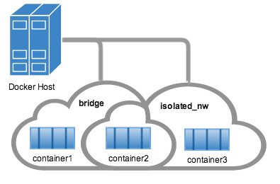

<!--[metadata]>
+++
title = "Work with network commands"
description = "How to work with docker networks"
keywords = ["commands, Usage, network, docker, cluster"]
[menu.main]
parent = "smn_networking"
weight=-4
+++
<![end-metadata]-->

# Work with network commands

This article provides examples of the network subcommands you can use to interact with Docker networks and the containers in them. The commands are available through the Docker Engine CLI.  These commands are:

* `docker network create`
* `docker network connect`
* `docker network ls`
* `docker network rm`
* `docker network disconnect`
* `docker network inspect`

While not required, it is a good idea to read [Understanding Docker
network](dockernetworks.md) before trying the examples in this section. The
examples for the rely on a `bridge` network so that you can try them
immediately.  If you would prefer to experiment with an `overlay` network see
the [Getting started with multi-host networks](get-started-overlay.md) instead.

## Create networks

Docker Engine creates a `bridge` network automatically when you install Engine.
This network corresponds to the `docker0` bridge that Engine has traditionally
relied on. In addition to this network, you can create your own `bridge` or `overlay` network.  

A `bridge` network resides on a single host running an instance of Docker Engine.  An `overlay` network can span multiple hosts running their own engines. If you run `docker network create` and supply only a network name, it creates a bridge network for you.

```bash
$ docker network create simple-network
de792b8258895cf5dc3b43835e9d61a9803500b991654dacb1f4f0546b1c88f8
$ docker network inspect simple-network
[
    {
        "Name": "simple-network",
        "Id": "de792b8258895cf5dc3b43835e9d61a9803500b991654dacb1f4f0546b1c88f8",
        "Scope": "local",
        "Driver": "bridge",
        "IPAM": {
            "Driver": "default",
            "Config": [
                {}
            ]
        },
        "Containers": {},
        "Options": {}
    }
]
```

Unlike `bridge` networks, `overlay` networks require some pre-existing conditions
before you can create one. These conditions are:

* Access to a key-value store. Engine supports Consul Etcd, and ZooKeeper (Distributed store) key-value stores.
* A cluster of hosts with connectivity to the key-value store.
* A properly configured Engine `daemon` on each host in the swarm.

The `docker daemon` options that support the `overlay` network are:

* `--cluster-store`
* `--cluster-store-opt`
* `--cluster-advertise`

It is also a good idea, though not required, that you install Docker Swarm
to manage the cluster. Swarm provides sophisticated discovery and server
management that can assist your implementation.

When you create a network, Engine creates a non-overlapping subnetwork for the
network by default. You can override this default and specify a subnetwork
directly using the the `--subnet` option. On a `bridge` network you can only
create a single subnet. An `overlay` network supports multiple subnets.

In addition to the `--subnetwork` option, you also specify the `--gateway` `--ip-range` and `--aux-address` options.

```bash
$ docker network create -d overlay
  --subnet=192.168.0.0/16 --subnet=192.170.0.0/16
  --gateway=192.168.0.100 --gateway=192.170.0.100
  --ip-range=192.168.1.0/24
  --aux-address a=192.168.1.5 --aux-address b=192.168.1.6
  --aux-address a=192.170.1.5 --aux-address b=192.170.1.6
  my-multihost-network
```

Be sure that your subnetworks do not overlap. If they do, the network create fails and Engine returns an error.

## Connect containers

You can connect containers dynamically to one or more networks. These networks
can be backed the same or different network drivers. Once connected, the
containers can communicate using another container's IP address or name.

For `overlay` networks or custom plugins that support multi-host
connectivity, containers connected to the same multi-host network but launched
from different hosts can also communicate in this way.

Create two containers for this example:

```bash
$ docker run -itd --name=container1 busybox
18c062ef45ac0c026ee48a83afa39d25635ee5f02b58de4abc8f467bcaa28731

$ docker run -itd --name=container2 busybox
498eaaaf328e1018042c04b2de04036fc04719a6e39a097a4f4866043a2c2152
```

Then create an isolated, `bridge` network to test with.

```bash
$ docker network create -d bridge isolated_nw
f836c8deb6282ee614eade9d2f42d590e603d0b1efa0d99bd88b88c503e6ba7a
```

Connect `container2` to the network and then `inspect` the network to verify the connection:

```
$ docker network connect isolated_nw container2
$ docker network inspect isolated_nw
[[
    {
        "Name": "isolated_nw",
        "Id": "f836c8deb6282ee614eade9d2f42d590e603d0b1efa0d99bd88b88c503e6ba7a",
        "Scope": "local",
        "Driver": "bridge",
        "IPAM": {
            "Driver": "default",
            "Config": [
                {}
            ]
        },
        "Containers": {
            "498eaaaf328e1018042c04b2de04036fc04719a6e39a097a4f4866043a2c2152": {
                "EndpointID": "0e24479cfaafb029104999b4e120858a07b19b1b6d956ae56811033e45d68ad9",
                "MacAddress": "02:42:ac:15:00:02",
                "IPv4Address": "172.21.0.2/16",
                "IPv6Address": ""
            }
        },
        "Options": {}
    }
]
```

You can see that the Engine automatically assigns an IP address to `container2`.
If you had specified a `--subnetwork` when creating your network, the network
would have used that addressing. Now, start a third container and connect it to
the network on launch using the `docker run` command's `--net` option:

```bash
$ docker run --net=isolated_nw -itd --name=container3 busybox
c282ca437ee7e926a7303a64fc04109740208d2c20e442366139322211a6481c
```

Now, inspect the network resources used by `container3`.

```bash
$ docker inspect --format='{{json .NetworkSettings.Networks}}'  container3
{"isolated_nw":{"EndpointID":"e5d077f9712a69c6929fdd890df5e7c1c649771a50df5b422f7e68f0ae61e847","Gateway":"172.21.0.1","IPAddress":"172.21.0.3","IPPrefixLen":16,"IPv6Gateway":"","GlobalIPv6Address":"","GlobalIPv6PrefixLen":0,"MacAddress":"02:42:ac:15:00:03"}}
```
Repeat this command for `container2`. If you have Python installed, you can pretty print the output.

```bash
$ docker inspect --format='{{json .NetworkSettings.Networks}}'  container2 | python -m json.tool
{
    "bridge": {
        "EndpointID": "281b5ead415cf48a6a84fd1a6504342c76e9091fe09b4fdbcc4a01c30b0d3c5b",
        "Gateway": "172.17.0.1",
        "GlobalIPv6Address": "",
        "GlobalIPv6PrefixLen": 0,
        "IPAddress": "172.17.0.3",
        "IPPrefixLen": 16,
        "IPv6Gateway": "",
        "MacAddress": "02:42:ac:11:00:03"
    },
    "isolated_nw": {
        "EndpointID": "0e24479cfaafb029104999b4e120858a07b19b1b6d956ae56811033e45d68ad9",
        "Gateway": "172.21.0.1",
        "GlobalIPv6Address": "",
        "GlobalIPv6PrefixLen": 0,
        "IPAddress": "172.21.0.2",
        "IPPrefixLen": 16,
        "IPv6Gateway": "",
        "MacAddress": "02:42:ac:15:00:02"
    }
}
```

You should find `container2` belongs to two networks.  The `bridge` network
which it joined by default when you launched it and the `isolated_nw` which you
later connected it to.



In the case of `container3`, you connected it through `docker run` to the
`isolated_nw` so that container is not connected to `bridge`.

Use the `docker attach` command to connect to the running `container2` and
examine its networking stack:

```bash
$ docker attach container2
```

If you look a the container's network stack you should see two Ethernet interfaces, one for the default bridge network and one for the `isolated_nw` network.

```bash
/ # ifconfig
eth0      Link encap:Ethernet  HWaddr 02:42:AC:11:00:03  
          inet addr:172.17.0.3  Bcast:0.0.0.0  Mask:255.255.0.0
          inet6 addr: fe80::42:acff:fe11:3/64 Scope:Link
          UP BROADCAST RUNNING MULTICAST  MTU:9001  Metric:1
          RX packets:8 errors:0 dropped:0 overruns:0 frame:0
          TX packets:8 errors:0 dropped:0 overruns:0 carrier:0
          collisions:0 txqueuelen:0
          RX bytes:648 (648.0 B)  TX bytes:648 (648.0 B)

eth1      Link encap:Ethernet  HWaddr 02:42:AC:15:00:02  
          inet addr:172.21.0.2  Bcast:0.0.0.0  Mask:255.255.0.0
          inet6 addr: fe80::42:acff:fe15:2/64 Scope:Link
          UP BROADCAST RUNNING MULTICAST  MTU:1500  Metric:1
          RX packets:8 errors:0 dropped:0 overruns:0 frame:0
          TX packets:8 errors:0 dropped:0 overruns:0 carrier:0
          collisions:0 txqueuelen:0
          RX bytes:648 (648.0 B)  TX bytes:648 (648.0 B)

lo        Link encap:Local Loopback  
          inet addr:127.0.0.1  Mask:255.0.0.0
          inet6 addr: ::1/128 Scope:Host
          UP LOOPBACK RUNNING  MTU:65536  Metric:1
          RX packets:0 errors:0 dropped:0 overruns:0 frame:0
          TX packets:0 errors:0 dropped:0 overruns:0 carrier:0
          collisions:0 txqueuelen:0
          RX bytes:0 (0.0 B)  TX bytes:0 (0.0 B)
```

Display the container's `etc/hosts` file:

```bash
/ # cat /etc/hosts
172.17.0.3	498eaaaf328e
127.0.0.1	localhost
::1	localhost ip6-localhost ip6-loopback
fe00::0	ip6-localnet
ff00::0	ip6-mcastprefix
ff02::1	ip6-allnodes
ff02::2	ip6-allrouters
172.21.0.3	container3
172.21.0.3	container3.isolated_nw
```

On the `isolated_nw` which was user defined, the Docker network feature updated the `/etc/hosts` with the proper name resolution.  Inside of `container2` it is possible to ping `container3` by name.

```bash
/ # ping -w 4 container3
PING container3 (172.21.0.3): 56 data bytes
64 bytes from 172.21.0.3: seq=0 ttl=64 time=0.070 ms
64 bytes from 172.21.0.3: seq=1 ttl=64 time=0.080 ms
64 bytes from 172.21.0.3: seq=2 ttl=64 time=0.080 ms
64 bytes from 172.21.0.3: seq=3 ttl=64 time=0.097 ms

--- container3 ping statistics ---
4 packets transmitted, 4 packets received, 0% packet loss
round-trip min/avg/max = 0.070/0.081/0.097 ms
```

This isn't the case for the default bridge network. Both `container2` and  `container1` are connected to the default bridge network. Docker does not support automatic service discovery on this network. For this reason, pinging  `container1` by name fails as you would expect based on the `/etc/hosts` file:

```bash
/ # ping -w 4 container1
ping: bad address 'container1'
```

A ping using the `container1` IP address does succeed though:

```bash
/ # ping -w 4 172.17.0.2
PING 172.17.0.2 (172.17.0.2): 56 data bytes
64 bytes from 172.17.0.2: seq=0 ttl=64 time=0.095 ms
64 bytes from 172.17.0.2: seq=1 ttl=64 time=0.075 ms
64 bytes from 172.17.0.2: seq=2 ttl=64 time=0.072 ms
64 bytes from 172.17.0.2: seq=3 ttl=64 time=0.101 ms

--- 172.17.0.2 ping statistics ---
4 packets transmitted, 4 packets received, 0% packet loss
round-trip min/avg/max = 0.072/0.085/0.101 ms
```

If you wanted you could connect `container1` to `container2` with the `docker
run --link` command and that would enable the two containers to interact by name
as well as IP.

Detach from a `container2` and leave it running using `CTRL-p CTRL-q`.

In this example, `container2` is attached to both networks and so can talk to
`container1` and `container3`. But `container3` and `container1` are not in the
same network and cannot communicate. Test, this now by attaching to
`container3` and attempting to ping `container1` by IP address.

```bash
$ docker attach container3
/ # ping 172.17.0.2
PING 172.17.0.2 (172.17.0.2): 56 data bytes
^C
--- 172.17.0.2 ping statistics ---
10 packets transmitted, 0 packets received, 100% packet loss

```

To connect a container to a network, the container must be running. If you stop
a container and inspect a network it belongs to, you won't see that container.
The `docker network inspect` command only shows running containers.

## Disconnecting containers

You can disconnect a container from a network using the `docker network
disconnect` command.

```
$ docker network disconnect isolated_nw container2

docker inspect --format='{{json .NetworkSettings.Networks}}'  container2 | python -m json.tool
{
    "bridge": {
        "EndpointID": "9e4575f7f61c0f9d69317b7a4b92eefc133347836dd83ef65deffa16b9985dc0",
        "Gateway": "172.17.0.1",
        "GlobalIPv6Address": "",
        "GlobalIPv6PrefixLen": 0,
        "IPAddress": "172.17.0.3",
        "IPPrefixLen": 16,
        "IPv6Gateway": "",
        "MacAddress": "02:42:ac:11:00:03"
    }
}


$ docker network inspect isolated_nw
[[
    {
        "Name": "isolated_nw",
        "Id": "f836c8deb6282ee614eade9d2f42d590e603d0b1efa0d99bd88b88c503e6ba7a",
        "Scope": "local",
        "Driver": "bridge",
        "IPAM": {
            "Driver": "default",
            "Config": [
                {}
            ]
        },
        "Containers": {
            "c282ca437ee7e926a7303a64fc04109740208d2c20e442366139322211a6481c": {
                "EndpointID": "e5d077f9712a69c6929fdd890df5e7c1c649771a50df5b422f7e68f0ae61e847",
                "MacAddress": "02:42:ac:15:00:03",
                "IPv4Address": "172.21.0.3/16",
                "IPv6Address": ""
            }
        },
        "Options": {}
    }
]
```

Once a container is disconnected from a network, it cannot communicate with
other containers connected to that network. In this example, `container2` can no longer  talk to `container3` on the `isolated_nw` network.

```
$ docker attach container2

/ # ifconfig
eth0      Link encap:Ethernet  HWaddr 02:42:AC:11:00:03  
          inet addr:172.17.0.3  Bcast:0.0.0.0  Mask:255.255.0.0
          inet6 addr: fe80::42:acff:fe11:3/64 Scope:Link
          UP BROADCAST RUNNING MULTICAST  MTU:9001  Metric:1
          RX packets:8 errors:0 dropped:0 overruns:0 frame:0
          TX packets:8 errors:0 dropped:0 overruns:0 carrier:0
          collisions:0 txqueuelen:0
          RX bytes:648 (648.0 B)  TX bytes:648 (648.0 B)

lo        Link encap:Local Loopback  
          inet addr:127.0.0.1  Mask:255.0.0.0
          inet6 addr: ::1/128 Scope:Host
          UP LOOPBACK RUNNING  MTU:65536  Metric:1
          RX packets:0 errors:0 dropped:0 overruns:0 frame:0
          TX packets:0 errors:0 dropped:0 overruns:0 carrier:0
          collisions:0 txqueuelen:0
          RX bytes:0 (0.0 B)  TX bytes:0 (0.0 B)

/ # ping container3
PING container3 (172.20.0.1): 56 data bytes
^C
--- container3 ping statistics ---
2 packets transmitted, 0 packets received, 100% packet loss
```

The `container2` still has full connectivity to the bridge network

```bash
/ # ping container1
PING container1 (172.17.0.2): 56 data bytes
64 bytes from 172.17.0.2: seq=0 ttl=64 time=0.119 ms
64 bytes from 172.17.0.2: seq=1 ttl=64 time=0.174 ms
^C
--- container1 ping statistics ---
2 packets transmitted, 2 packets received, 0% packet loss
round-trip min/avg/max = 0.119/0.146/0.174 ms
/ #
```

## Remove a network

When all the containers in a network are stopped or disconnected, you can remove a network.

```bash
$ docker network disconnect isolated_nw container3
```

```bash
docker network inspect isolated_nw
[
    {
        "Name": "isolated_nw",
        "Id": "f836c8deb6282ee614eade9d2f42d590e603d0b1efa0d99bd88b88c503e6ba7a",
        "Scope": "local",
        "Driver": "bridge",
        "IPAM": {
            "Driver": "default",
            "Config": [
                {}
            ]
        },
        "Containers": {},
        "Options": {}
    }
]

$ docker network rm isolated_nw
```

List all your networks to verify the `isolated_nw` was removed:

```
$ docker network ls
NETWORK ID          NAME                DRIVER
72314fa53006        host                host                
f7ab26d71dbd        bridge              bridge              
0f32e83e61ac        none                null  
```

## Related information

* [network create](../../reference/commandline/network_create.md)
* [network inspect](../../reference/commandline/network_inspect.md)
* [network connect](../../reference/commandline/network_connect.md)
* [network disconnect](../../reference/commandline/network_disconnect.md)
* [network ls](../../reference/commandline/network_ls.md)
* [network rm](../../reference/commandline/network_rm.md)
