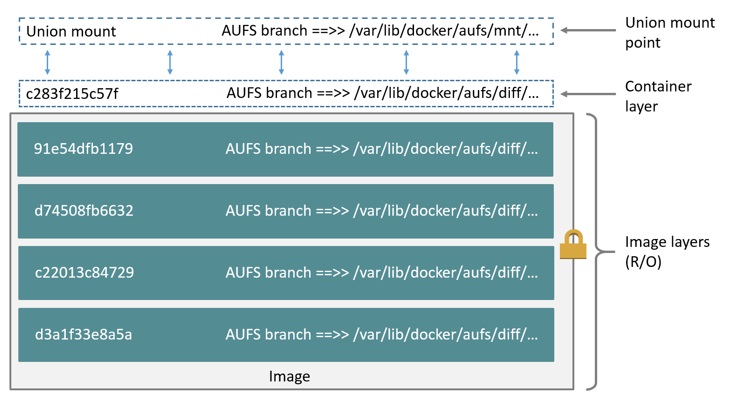
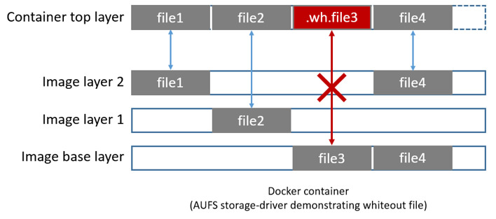
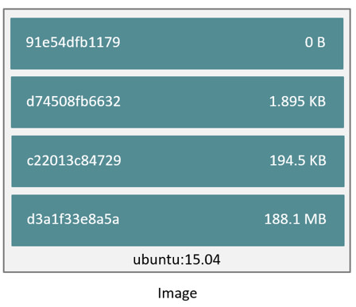

<!--[metadata]>
+++
title = "AUFS storage driver in practice"
description = "Learn how to optimize your use of AUFS driver."
keywords = ["container, storage, driver, AUFS "]
[menu.main]
parent = "mn_storage_docker"
+++
<![end-metadata]-->

# Docker and AUFS in practice

AUFS was the first storage driver in use with Docker. As a result, it has a long and close history with Docker, is very stable, has a lot of real-world deployments, and has strong community support.  AUFS has several features that make it a good choice for Docker. These features enable:

- Fast container startup times.
- Efficient use of storage.
- Efficient use of memory.

Despite its capabilities and long history with Docker, some Linux distributions do not support AUFS. This is usually because AUFS is not included in the mainline (upstream) Linux kernel.

The following sections examine some AUFS features and how they relate to Docker.

## Image layering and sharing with AUFS

AUFS is a *unification filesystem*. This means that it takes multiple directories on a single Linux host, stacks them on top of each other, and provides a single unified view. To achieve this, AUFS uses *union mount*.

AUFS stacks multiple directories and exposes them as a unified view through a single mount point. All of the directories in the stack, as well as the union mount point, must all exist on the same Linux host. AUFS refers to each directory that it stacks as a *branch*.

Within Docker, AUFS union mounts enable image layering. The AUFS storage driver implements Docker image layers using this union mount system. AUFS branches correspond to Docker image layers. The diagram below shows a Docker container based on the `ubuntu:latest` image.



This diagram shows the relationship between the Docker image layers and the AUFS branches (directories) in `/var/lib/docker/aufs`. Each image layer  and the container layer correspond to an AUFS branch (directory) in the Docker host's local storage area. The union mount point gives the unified view of all layers.

AUFS also supports the copy-on-write technology (CoW). Not all storage drivers do.

## Container reads and writes with AUFS

Docker leverages AUFS CoW technology to enable image sharing and minimize the use of disk space. AUFS works at the file level. This means that all AUFS CoW operations copy entire files - even if only a small part of the file is being modified. This behavior can have a noticeable impact on container performance, especially if the files being copied are large, below a lot of image layers, or the CoW operation must search a deep directory tree.

Consider, for example, an application running in a container needs to add a single new value to a large key-value store (file). If this is the first time the file is modified it does not yet exist in the container's top writable layer. So, the CoW must *copy up* the file from the underlying image. The AUFS storage driver searches each image layer for the file. The search order is from top to bottom. When it is found, the entire file is *copied up* to the container's top writable layer. From there, it can be opened and modified.

Larger files obviously take longer to *copy up* than smaller files, and files that exist in lower image layers take longer to locate than those in higher layers. However, a *copy up* operation only occurs once per file on any given container. Subsequent reads and writes happen against the file's copy already *copied-up* to the container's top layer.


## Deleting files with the AUFS storage driver

The AUFS storage driver deletes a file from a container by placing a *whiteout
file* in the container's top layer. The whiteout file effectively obscures the
existence of the file in image's lower, read-only layers.  The simplified
diagram below shows a container based on an image with three image layers.



The `file3` was deleted from the container. So, the AUFS storage driver  placed
a whiteout file in the container's top layer. This whiteout file effectively
"deletes"  `file3` from the container by obscuring any of the original file's
existence in the image's read-only base layer. Of course, the image could have
been in any of the other layers instead or in addition depending on how the
layers are built.

## Configure Docker with AUFS

You can only use the AUFS storage driver on Linux systems with AUFS installed. Use the following command to determine if your system supports AUFS.

```bash
$ grep aufs /proc/filesystems
nodev   aufs
```

This output indicates the system supports AUFS.  Once you've verified your
system supports AUFS, you can must instruct the Docker daemon to use it. You do
this from the command line with the `docker daemon` command:

```bash
$ sudo docker daemon --storage-driver=aufs &
```

Alternatively, you can edit the Docker config file and add the
`--storage-driver=aufs` option to the `DOCKER_OPTS` line.

```bash
# Use DOCKER_OPTS to modify the daemon startup options.
DOCKER_OPTS="--storage-driver=aufs"
```

Once your daemon is running, verify the storage driver with the `docker info` command.

```bash
$ sudo docker info
Containers: 1
Images: 4
Storage Driver: aufs
 Root Dir: /var/lib/docker/aufs
 Backing Filesystem: extfs
 Dirs: 6
 Dirperm1 Supported: false
Execution Driver: native-0.2
...output truncated...
````

The output above shows that the Docker daemon is running the AUFS storage driver on top of an existing ext4 backing filesystem.

## Local storage and AUFS

As the `docker daemon` runs with the AUFS driver, the driver stores images and containers on within the Docker host's local storage area in the `/var/lib/docker/aufs` directory.

### Images

Image layers and their contents are stored under
`/var/lib/docker/aufs/mnt/diff/<image-id>` directory. The contents of an image
layer in this location includes all the files and directories belonging in that
image layer.

The `/var/lib/docker/aufs/layers/` directory contains metadata about how image
layers are stacked. This directory contains one file for every image or
container layer on the Docker host. Inside each file are the image layers names
that exist below it. The diagram below shows an image with 4 layers.



Inspecting the contents of the file relating to the top layer of the image
shows the three image layers below it. They are listed in the order they are
stacked.

```bash
$ cat /var/lib/docker/aufs/layers/91e54dfb11794fad694460162bf0cb0a4fa710cfa3f60979c177d920813e267c

d74508fb6632491cea586a1fd7d748dfc5274cd6fdfedee309ecdcbc2bf5cb82

c22013c8472965aa5b62559f2b540cd440716ef149756e7b958a1b2aba421e87

d3a1f33e8a5a513092f01bb7eb1c2abf4d711e5105390a3fe1ae2248cfde1391
```

The base layer in an image has no image layers below it, so its file is empty.

### Containers

Running containers are mounted at locations in the
`/var/lib/docker/aufs/mnt/<container-id>` directory. This is the AUFS union
mount point that exposes the container and all underlying image layers as a
single unified view. If a container is not running, its directory still exists
but is empty. This is because containers are only mounted when they are running.

Container metadata and various config files that are placed into the running
container are stored in `/var/lib/containers/<container-id>`. Files in this
directory exist for all containers on the system, including ones that are
stopped. However, when a container is running the container's log files are also
in this directory.

A container's thin writable layer is stored under
`/var/lib/docker/aufs/diff/<container-id>`. This directory is stacked by AUFS as
the containers top writable layer and is where all changes to the container are
stored. The directory exists even if the container is stopped. This means that
restarting a container will not lose changes made to it. Once a container is
deleted this directory is deleted.

Information about which image layers are stacked below a container's top
writable layer is stored in the following file
`/var/lib/docker/aufs/layers/<container-id>`. The command below shows that the
container with ID `b41a6e5a508d` has 4 image layers below it:

```bash
$ cat /var/lib/docker/aufs/layers/b41a6e5a508dfa02607199dfe51ed9345a675c977f2cafe8ef3e4b0b5773404e-init
91e54dfb11794fad694460162bf0cb0a4fa710cfa3f60979c177d920813e267c
d74508fb6632491cea586a1fd7d748dfc5274cd6fdfedee309ecdcbc2bf5cb82
c22013c8472965aa5b62559f2b540cd440716ef149756e7b958a1b2aba421e87
d3a1f33e8a5a513092f01bb7eb1c2abf4d711e5105390a3fe1ae2248cfde1391
```

The image layers are shown in order. In the output above, the layer starting
with image ID "d3a1..." is the image's base  layer. The image layer starting
with "91e5..." is the image's topmost layer.


## AUFS and Docker performance

To summarize some of the performance related aspects already mentioned:

- The AUFS storage driver is a good choice for PaaS and other similar use-cases where container density is important. This is because AUFS efficiently shares images between multiple running containers, enabling fast container start times and minimal use of disk space.

- The underlying mechanics of how AUFS shares files between image layers and containers uses the systems page cache very efficiently.

- The AUFS storage driver can introduce significant latencies into container write performance. This is because the first time a container writes to any file, the file has be located and copied into the containers top writable layer. These latencies increase and are compounded when these files exist below many image layers and the files themselves are large.

One final point. Data volumes provide the best and most predictable performance.
This is because they bypass the storage driver and do not incur any of the
potential overheads introduced by thin provisioning and copy-on-write. For this
reason, you may want to place heavy write workloads on data volumes.

## Related information

* [Understand images, containers, and storage drivers](imagesandcontainers.md)
* [Select a storage driver](selectadriver.md)
* [Btrfs storage driver in practice](btrfs-driver.md)
* [Device Mapper storage driver in practice](device-mapper-driver.md)
