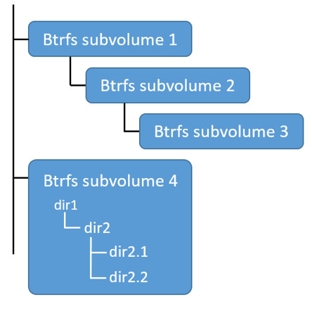
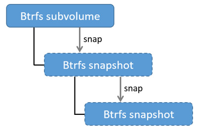
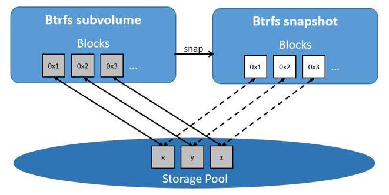
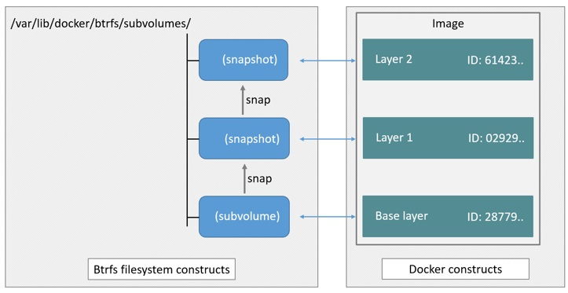

<!--[metadata]>
+++
title = "BTRFS storage in practice"
description = "Learn how to optimize your use of BTRFS driver."
keywords = ["container, storage, driver, BTRFS "]
[menu.main]
parent = "mn_storage_docker"
+++
<![end-metadata]-->

# Docker and BTRFS in practice

Btrfs is a next generation copy-on-write filesystem that supports many advanced
storage technologies that make it a good fit for Docker. Btrfs is included in
the mainline Linux kernel and it's on-disk-format is now considered stable.
However, many of its features are still under heavy development and users should
consider it a fast-moving target.

Docker's `btrfs` storage driver leverages many Btrfs features for image and
container management. Among these features are thin provisioning, copy-on-write,
and snapshotting.

This article refers to Docker's Btrfs storage driver as `btrfs` and the overall Btrfs Filesystem as Btrfs.

>**Note**: The [Commercially Supported Docker Engine (CS-Engine)](https://www.docker.com/compatibility-maintenance) does not currently support the `btrfs` storage driver.

## The future of Btrfs

Btrfs has been long hailed as the future of Linux filesystems. With full support in the mainline Linux kernel, a stable on-disk-format, and active development with a focus on stability, this is now becoming more of a reality.

As far as Docker on the Linux platform goes, many people see the `btrfs` storage driver as a potential long-term replacement for the `devicemapper` storage driver. However, at the time of writing, the `devicemapper` storage driver should be considered safer, more stable, and more *production ready*. You should only consider the `btrfs` driver for production deployments if you understand it well and have existing experience with Btrfs.

## Image layering and sharing with Btrfs

Docker leverages Btrfs *subvolumes* and *snapshots* for managing the on-disk components of image and container layers.  Btrfs subvolumes look and feel like a normal Unix filesystem. As such, they can have their own internal directory structure that hooks into the wider Unix filesystem.

Subvolumes are natively copy-on-write and have space allocated to them on-demand
from an underlying storage pool. They can also be nested and snapped. The
diagram blow shows 4 subvolumes. 'Subvolume 2' and 'Subvolume 3' are nested,
whereas 'Subvolume 4' shows its own internal directory tree.



Snapshots are a point-in-time read-write copy of an entire subvolume. They exist directly below the subvolume they were created from. You can create snapshots of snapshots as shown in the diagram below.



Btfs allocates space to subvolumes and snapshots on demand from an underlying pool of storage. The unit of allocation is referred to as a *chunk* and *chunks* are normally ~1GB in size.

Snapshots are first-class citizens in a Btrfs filesystem. This means that they look, feel, and operate just like regular subvolumes. The technology required to create them is built directly into the Btrfs filesystem thanks to its native copy-on-write design. This means that Btrfs snapshots are space efficient with little or no performance overhead. The diagram below shows a subvolume and it's snapshot sharing the same data.



Docker's `btrfs` storage driver stores every image layer and container in its own Btrfs subvolume or snapshot. The base layer of an image is stored as a subvolume whereas child image layers and containers are stored as snapshots. This is shown in the diagram below.


The high level process for creating images and containers on Docker hosts running the `btrfs` driver is as follows:

1. The image's base layer is stored in a Btrfs subvolume under
`/var/lib/docker/btrfs/subvolumes`.

    The image ID is used as the subvolume name. E.g., a base layer with image ID
    "f9a9f253f6105141e0f8e091a6bcdb19e3f27af949842db93acba9048ed2410b" will be
    stored in
    `/var/lib/docker/btrfs/subvolumes/f9a9f253f6105141e0f8e091a6bcdb19e3f27af949842db93acba9048ed2410b`

2. Subsequent image layers are stored as a Btrfs snapshot of the parent layer's subvolume or snapshot.

    The diagram below shows a three-layer image. The base layer is a subvolume. Layer 1 is a snapshot of the base layer's subvolume. Layer 2 is a snapshot of Layer 1's snapshot.

    

## Image and container on-disk constructs

Image layers and containers are visible in the Docker host's filesystem at
`/var/lib/docker/btrfs/subvolumes/<image-id> OR <container-id>`. Directories for
containers are present even for containers with a stopped status. This is
because the `btrfs` storage driver mounts a default, top-level subvolume at
`/var/lib/docker/subvolumes`. All other subvolumes and snapshots exist below
that as Btrfs filesystem objects and not as individual mounts.

The following example shows a single Docker image with four image layers.

```bash
$ sudo docker images -a
REPOSITORY          TAG                 IMAGE ID            CREATED             VIRTUAL SIZE
ubuntu              latest              0a17decee413        2 weeks ago         188.3 MB
<none>              <none>              3c9a9d7cc6a2        2 weeks ago         188.3 MB
<none>              <none>              eeb7cb91b09d        2 weeks ago         188.3 MB
<none>              <none>              f9a9f253f610        2 weeks ago         188.1 MB
```

Each image layer exists as a Btrfs subvolume or snapshot with the same name as it's image ID as illustrated by the `btrfs subvolume list` command shown below:

```bash
$ sudo btrfs subvolume list /var/lib/docker
ID 257 gen 9 top level 5 path btrfs/subvolumes/f9a9f253f6105141e0f8e091a6bcdb19e3f27af949842db93acba9048ed2410b
ID 258 gen 10 top level 5 path btrfs/subvolumes/eeb7cb91b09d5de9edb2798301aeedf50848eacc2123e98538f9d014f80f243c
ID 260 gen 11 top level 5 path btrfs/subvolumes/3c9a9d7cc6a235eb2de58ca9ef3551c67ae42a991933ba4958d207b29142902b
ID 261 gen 12 top level 5 path btrfs/subvolumes/0a17decee4139b0de68478f149cc16346f5e711c5ae3bb969895f22dd6723751
```

Under the `/var/lib/docker/btrfs/subvolumes` directoy, each of these subvolumes and snapshots are visible as a normal Unix directory:

```bash
$ ls -l /var/lib/docker/btrfs/subvolumes/
total 0
drwxr-xr-x 1 root root 132 Oct 16 14:44 0a17decee4139b0de68478f149cc16346f5e711c5ae3bb969895f22dd6723751
drwxr-xr-x 1 root root 132 Oct 16 14:44 3c9a9d7cc6a235eb2de58ca9ef3551c67ae42a991933ba4958d207b29142902b
drwxr-xr-x 1 root root 132 Oct 16 14:44 eeb7cb91b09d5de9edb2798301aeedf50848eacc2123e98538f9d014f80f243c
drwxr-xr-x 1 root root 132 Oct 16 14:44 f9a9f253f6105141e0f8e091a6bcdb19e3f27af949842db93acba9048ed2410b
```

Because Btrfs works at the filesystem level and not the block level, each image
and container layer can be browsed in the filesystem using normal Unix commands.
The example below shows a truncated output of an `ls -l` command against the
image's top layer:

```bash
$ ls -l /var/lib/docker/btrfs/subvolumes/0a17decee4139b0de68478f149cc16346f5e711c5ae3bb969895f22dd6723751/
total 0
drwxr-xr-x 1 root root 1372 Oct  9 08:39 bin
drwxr-xr-x 1 root root    0 Apr 10  2014 boot
drwxr-xr-x 1 root root  882 Oct  9 08:38 dev
drwxr-xr-x 1 root root 2040 Oct 12 17:27 etc
drwxr-xr-x 1 root root    0 Apr 10  2014 home
...output truncated...
```

## Container reads and writes with Btrfs

A container is a space-efficient snapshot of an image. Metadata in the snapshot
points to the actual data blocks in the storage pool. This is the same as with a
subvolume. Therefore, reads performed against a snapshot are essentially the
same as reads performed against a subvolume. As a result, no performance
overhead is incurred from the Btrfs driver.

Writing a new file to a container invokes an allocate-on-demand operation to
allocate new data block to the container's snapshot. The file is then written to
this new space. The allocate-on-demand operation is native to all writes with
Btrfs and is the same as writing new data to a subvolume. As a result, writing
new files to a container's snapshot operate at native Btrfs speeds.

Updating an existing file in a container causes a copy-on-write operation
(technically *redirect-on-write*). The driver leaves the original data and
allocates new space to the snapshot. The updated data is written to this new
space. Then, the driver updates the filesystem metadata in the snapshot to point
to this new data. The original data is preserved in-place for subvolumes and
snapshots further up the tree. This behavior is native to copy-on-write
filesystems like Btrfs and incurs very little overhead.

With Btfs, writing and updating lots of small files can result in slow performance. More on this later.

## Configuring Docker with Btrfs

The `btrfs` storage driver only operates on a Docker host where `/var/lib/docker` is mounted as a Btrfs filesystem. The following procedure shows  how to configure Btrfs on Ubuntu 14.04 LTS.

### Prerequisites

If you have already used the Docker daemon on your Docker host and have images you want to keep, `push` them to Docker Hub or your private Docker Trusted Registry before attempting this procedure.

Stop the Docker daemon. Then, ensure that you have a spare block device at `/dev/xvdb`. The device identifier may be different in your environment and you should substitute your own values throughout the procedure.

The procedure also assumes your kernel has the appropriate Btrfs modules loaded. To verify this, use the following command:

```bash
$ cat /proc/filesystems | grep btrfs`
```

### Configure Btrfs on Ubuntu 14.04 LTS

Assuming your system meets the prerequisites, do the following:

1. Install the "btrfs-tools" package.

        $ sudo apt-get install btrfs-tools
        Reading package lists... Done
        Building dependency tree
        <output truncated>

2. Create the Btrfs storage pool.

    Btrfs storage pools are created with the `mkfs.btrfs` command. Passing multiple devices to the `mkfs.btrfs` command creates a pool across all of those devices. Here you create a pool with a single device at `/dev/xvdb`.

        $ sudo mkfs.btrfs -f /dev/xvdb
        WARNING! - Btrfs v3.12 IS EXPERIMENTAL
        WARNING! - see http://btrfs.wiki.kernel.org before using

        Turning ON incompat feature 'extref': increased hardlink limit per file to 65536
        fs created label (null) on /dev/xvdb
            nodesize 16384 leafsize 16384 sectorsize 4096 size 4.00GiB
        Btrfs v3.12

    Be sure to substitute `/dev/xvdb` with the appropriate device(s) on your
    system.

    > **Warning**: Take note of the warning about Btrfs being experimental. As
    noted earlier, Btrfs is not currently recommended for production deployments
    unless you already have extensive experience.

3. If it does not already exist, create a directory for the Docker host's local storage area at `/var/lib/docker`.

        $ sudo mkdir /var/lib/docker

4. Configure the system to automatically mount the Btrfs filesystem each time the system boots.

    a. Obtain the Btrfs filesystem's UUID.

        $ sudo blkid /dev/xvdb
        /dev/xvdb: UUID="a0ed851e-158b-4120-8416-c9b072c8cf47" UUID_SUB="c3927a64-4454-4eef-95c2-a7d44ac0cf27" TYPE="btrfs"

    b. Create a `/etc/fstab` entry to automatically mount `/var/lib/docker` each time the system boots.

        /dev/xvdb /var/lib/docker btrfs defaults 0 0
        UUID="a0ed851e-158b-4120-8416-c9b072c8cf47" /var/lib/docker btrfs defaults 0 0

5. Mount the new filesystem and verify the operation.

        $ sudo mount -a
        $ mount
        /dev/xvda1 on / type ext4 (rw,discard)
        <output truncated>
        /dev/xvdb on /var/lib/docker type btrfs (rw)

    The last line in the output above shows the `/dev/xvdb` mounted at `/var/lib/docker` as Btrfs.


Now that you have a Btrfs filesystem mounted at `/var/lib/docker`, the daemon should automatically load with the `btrfs` storage driver.

1. Start the Docker daemon.

        $ sudo service docker start
        docker start/running, process 2315

    The procedure for starting the Docker daemon may differ depending on the
    Linux distribution you are using.

    You can start the Docker daemon with the `btrfs` storage driver by passing
    the `--storage-driver=btrfs` flag to the `docker daemon` command or you can
    add the `DOCKER_OPTS` line to the Docker config file.

2. Verify the storage driver with the `docker info` command.

        $ sudo docker info
        Containers: 0
        Images: 0
        Storage Driver: btrfs
        [...]

Your Docker host is now configured to use the `btrfs` storage driver.

## BTRFS and Docker performance

There are several factors that influence Docker's performance under the  `btrfs` storage driver.

- **Page caching**. Btrfs does not support page cache sharing. This means that *n* containers accessing the same file require *n* copies to be cached. As a result, the `btrfs` driver may not be the best choice for PaaS and other high density container use cases.

- **Small writes**. Containers performing lots of small writes (including Docker hosts that start and stop many containers) can lead to poor use of Btrfs chunks. This can ultimately lead to out-of-space conditions on your Docker host and stop it working. This is currently a major drawback to using current versions of Btrfs.

    If you use the `btrfs` storage driver, closely monitor the free space on your Btrfs filesystem using the `btrfs filesys show` command. Do not trust the output of normal Unix commands such as `df`; always use the Btrfs native commands.

- **Sequential writes**. Btrfs writes data to disk via journaling technique. This can impact sequential writes, where performance can be up to half.

- **Fragmentation**. Fragmentation is a natural byproduct of copy-on-write filesystems like Btrfs. Many small random writes can compound this issue. It can manifest as CPU spikes on Docker hosts using SSD media and head thrashing on Docker hosts using spinning media. Both of these result in poor performance.

    Recent versions of Btrfs allow you to specify `autodefrag` as a mount option. This mode attempts to detect random writes and defragment them. You should perform your own tests before enabling this option on your Docker hosts. Some tests have shown this option has a negative performance impact on Docker hosts performing lots of small writes (including systems that start and stop many containers).

- **Solid State Devices (SSD)**. Btrfs has native optimizations for SSD media. To enable these, mount with the `-o ssd` mount option. These optimizations include enhanced SSD write performance by avoiding things like *seek optimizations* that have no use on SSD media.

    Btfs also supports the TRIM/Discard primitives. However, mounting with the `-o discard` mount option can cause performance issues. Therefore, it is recommended you perform your own tests before using this option.

- **Use Data Volumes**. Data volumes provide the best and most predictable performance. This is because they bypass the storage driver and do not incur any of the potential overheads introduced by thin provisioning and copy-on-write. For this reason, you may want to place heavy write workloads on data volumes.

## Related Information

* [Understand images, containers, and storage drivers](imagesandcontainers.md)
* [Select a storage driver](selectadriver.md)
* [AUFS storage driver in practice](aufs-driver.md)
* [Device Mapper storage driver in practice](device-mapper-driver.md)
