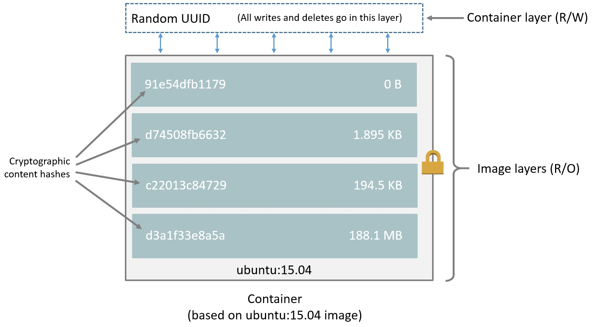

<!--[metadata]>
+++
title = "Understand images, containers, and storage drivers"
description = "Learn the technologies that support storage drivers."
keywords = ["container, storage, driver, AUFS, btfs, devicemapper,zvfs"]
[menu.main]
parent = "engine_driver"
weight = -2
+++
<![end-metadata]-->

# Understand images, containers, and storage drivers

To use storage drivers effectively, you must understand how Docker builds and
stores images. Then, you need an understanding of how these images are used by 
containers. Finally, you'll need a short introduction to the technologies that 
enable both images and container operations.

## Images and layers

Each Docker image references a list of read-only layers that represent 
filesystem differences. Layers are stacked on top of each other to form a base 
for a container's root filesystem. The diagram below shows the Ubuntu 15.04 
image comprising 4 stacked image layers.

The Docker storage driver is responsible for stacking these layers and 
providing a single unified view.
 
When you create a new container, you add a new, thin, writable layer on top of 
the underlying stack. This layer is often called the "container layer". All 
changes made to the running container - such as writing new files, modifying 
existing files, and deleting files - are written to this thin writable 
container layer. The diagram below shows a container based on the Ubuntu 15.04 
image.

### Content addressable storage

Docker 1.10 introduced a new content addressable storage model. This is a 
completely new way to address image and layer data on disk. Previously, image 
and layer data was referenced and stored using a randomly generated UUID. In 
the new model this is replaced by a secure *content hash*.

The new model improves security, provides a built-in way to avoid ID 
collisions, and guarantees data integrity after pull, push, load, and save 
operations. It also enables better sharing of layers by allowing many images to
 freely share their layers even if they didn’t come from the same build.

The diagram below shows an updated version of the previous diagram, 
highlighting the changes implemented by Docker 1.10. 

As can be seen, all image layer IDs are cryptographic hashes, whereas the 
container ID is still a randomly generated UUID.

There are several things to note regarding the new model. These include:

1. Migration of existing images
2. Image and layer filesystem structures

Existing images, those created and pulled by earlier versions of Docker, need 
to be migrated before they can be used with the new model. This migration 
involves calculating new secure checksums and is performed automatically the 
first time you start an updated Docker daemon. After the migration is complete,
 all images and tags will have brand new secure IDs. 

Although the migration is automatic and transparent, it is computationally 
intensive. This means it can take time if you have lots of image data.
During this time your Docker daemon will not respond to other requests.

A migration tool exists that allows you to migrate existing images to the new 
format before upgrading your Docker daemon. This means that upgraded Docker 
daemons do not need to perform the migration in-band, and therefore avoids any 
associated downtime. It also provides a way to manually migrate existing images
 so that they can be distributed to other Docker daemons in your environment 
that are already running the latest versions of Docker.

The migration tool is provided by Docker, Inc., and runs as a container. You 
can download it from [https://github.com/docker/v1.10-migrator/releases](https://github.com/docker/v1.10-migrator/releases).

While running the "migrator" image you need to expose your Docker host's data 
directory to the container. If you are using the default Docker data path, the 
command to run the container will look like this 

    $ sudo docker run --rm -v /var/lib/docker:/var/lib/docker docker/v1.10-migrator

If you use the `devicemapper` storage driver, you will need to include the 
`--privileged` option so that the container has access to your storage devices.

#### Migration example

The following example shows the migration tool in use on a Docker host running
version 1.9.1 of the Docker daemon and the AUFS storage driver. The Docker host
 is running on a **t2.micro** AWS EC2 instance with 1 vCPU, 1GB RAM, and a 
single 8GB general purpose SSD EBS volume. The Docker data directory 
(`/var/lib/docker`) was consuming 2GB of space.

    $ docker images
    REPOSITORY          TAG                 IMAGE ID            CREATED             SIZE
    jenkins             latest              285c9f0f9d3d        17 hours ago        708.5 MB
    mysql               latest              d39c3fa09ced        8 days ago          360.3 MB
    mongo               latest              a74137af4532        13 days ago         317.4 MB
    postgres            latest              9aae83d4127f        13 days ago         270.7 MB
    redis               latest              8bccd73928d9        2 weeks ago         151.3 MB
    centos              latest              c8a648134623        4 weeks ago         196.6 MB
    ubuntu              15.04               c8be1ac8145a        7 weeks ago         131.3 MB
    
    $ sudo du -hs /var/lib/docker
    2.0G    /var/lib/docker
    
    $ time docker run --rm -v /var/lib/docker:/var/lib/docker docker/v1.10-migrator
    Unable to find image 'docker/v1.10-migrator:latest' locally
    latest: Pulling from docker/v1.10-migrator
    ed1f33c5883d: Pull complete
    b3ca410aa2c1: Pull complete
    2b9c6ed9099e: Pull complete
    dce7e318b173: Pull complete
    Digest: sha256:bd2b245d5d22dd94ec4a8417a9b81bb5e90b171031c6e216484db3fe300c2097
    Status: Downloaded newer image for docker/v1.10-migrator:latest
    time="2016-01-27T12:31:06Z" level=debug msg="Assembling tar data for 01e70da302a553ba13485ad020a0d77dbb47575a31c4f48221137bb08f45878d from /var/lib/docker/aufs/diff/01e70da302a553ba13485ad020a0d77dbb47575a31c4f48221137bb08f45878d"
    time="2016-01-27T12:31:06Z" level=debug msg="Assembling tar data for 07ac220aeeef9febf1ac16a9d1a4eff7ef3c8cbf5ed0be6b6f4c35952ed7920d from /var/lib/docker/aufs/diff/07ac220aeeef9febf1ac16a9d1a4eff7ef3c8cbf5ed0be6b6f4c35952ed7920d"
    <snip>
    time="2016-01-27T12:32:00Z" level=debug msg="layer dbacfa057b30b1feaf15937c28bd8ca0d6c634fc311ccc35bd8d56d017595d5b took 10.80 seconds"

    real    0m59.583s
    user    0m0.046s
    sys     0m0.008s

The Unix `time` command prepends the `docker run` command to produce timings 
for the operation. As can be seen, the overall time taken to migrate 7 images 
comprising 2GB of disk space took approximately 1 minute. However, this 
included the time taken to pull the `docker/v1.10-migrator` image 
(approximately 3.5 seconds). The same operation on an m4.10xlarge EC2 instance 
with 40 vCPUs, 160GB RAM and an 8GB provisioned IOPS EBS volume resulted in the
 following improved timings:

    real    0m9.871s
    user    0m0.094s
    sys     0m0.021s

This shows that the migration operation is affected by the hardware spec of the
 machine performing the migration.

## Container and layers

The major difference between a container and an image is the top writable 
layer. All writes to the container that add new or modify existing data are 
stored in this writable layer. When the container is deleted the writable layer
 is also deleted. The underlying image remains unchanged.

Because each container has its own thin writable container layer, and all 
changes are stored in this container layer, this means that multiple containers 
can share access to the same underlying image and yet have their own data 
state. The diagram below shows multiple containers sharing the same Ubuntu 
15.04 image.

The Docker storage driver is responsible for enabling and managing both the 
image layers and the writable container layer. How a storage driver 
accomplishes these can vary between drivers. Two key technologies behind Docker
 image and container management are stackable image layers and copy-on-write 
(CoW).

## The copy-on-write strategy

Sharing is a good way to optimize resources. People do this instinctively in
daily life. For example, twins Jane and Joseph taking an Algebra class at
different times from different teachers can share the same exercise book by
passing it between each other. Now, suppose Jane gets an assignment to complete
the homework on page 11 in the book. At that point, Jane copies page 11, 
completes the homework, and hands in her copy. The original exercise book is 
unchanged and only Jane has a copy of the changed page 11.

Copy-on-write is a similar strategy of sharing and copying. In this strategy,
system processes that need the same data share the same instance of that data
rather than having their own copy. At some point, if one process needs to 
modify or write to the data, only then does the operating system make a copy of
 the data for that process to use. Only the process that needs to write has 
access to the data copy. All the other processes continue to use the original 
data.

Docker uses a copy-on-write technology with both images and containers. This 
CoW strategy optimizes both image disk space usage and the performance of 
container start times. The next sections look at how copy-on-write is leveraged
 with images and containers through sharing and copying.

### Sharing promotes smaller images

This section looks at image layers and copy-on-write technology.  All image and
 container layers exist inside the Docker host's *local storage area* and are 
managed by the storage driver. On Linux-based Docker hosts this is usually 
located under `/var/lib/docker/`.

The Docker client reports on image layers when instructed to pull and push
images with `docker pull` and `docker push`. The command below pulls the
`ubuntu:15.04` Docker image from Docker Hub.

    $ docker pull ubuntu:15.04
    15.04: Pulling from library/ubuntu
    1ba8ac955b97: Pull complete
    f157c4e5ede7: Pull complete
    0b7e98f84c4c: Pull complete
    a3ed95caeb02: Pull complete
    Digest: sha256:5e279a9df07990286cce22e1b0f5b0490629ca6d187698746ae5e28e604a640e
    Status: Downloaded newer image for ubuntu:15.04

From the output, you'll see  that the command actually pulls 4 image layers.
Each of the above lines lists an image layer and its UUID or cryptographic 
hash. The combination of these four layers makes up the `ubuntu:15.04` Docker 
image.

Each of these layers is stored in its own directory inside the Docker host's 
local storage are. 

Versions of Docker prior to 1.10 stored each layer in a directory with the same
 name as the image layer ID. However, this is not the case for images pulled 
with Docker version 1.10 and later. For example, the command below shows an 
image being pulled from Docker Hub, followed by a directory listing on a host 
running version 1.9.1 of the Docker Engine.

    $  docker pull ubuntu:15.04
    15.04: Pulling from library/ubuntu
    47984b517ca9: Pull complete
    df6e891a3ea9: Pull complete
    e65155041eed: Pull complete
    c8be1ac8145a: Pull complete
    Digest: sha256:5e279a9df07990286cce22e1b0f5b0490629ca6d187698746ae5e28e604a640e
    Status: Downloaded newer image for ubuntu:15.04

    $ ls /var/lib/docker/aufs/layers
    47984b517ca9ca0312aced5c9698753ffa964c2015f2a5f18e5efa9848cf30e2
    c8be1ac8145a6e59a55667f573883749ad66eaeef92b4df17e5ea1260e2d7356
    df6e891a3ea9cdce2a388a2cf1b1711629557454fd120abd5be6d32329a0e0ac
    e65155041eed7ec58dea78d90286048055ca75d41ea893c7246e794389ecf203

Notice how the four directories match up with the layer IDs of the downloaded 
image. Now compare this with the same operations performed on a host running 
version 1.10 of the Docker Engine.

    $ docker pull ubuntu:15.04
    15.04: Pulling from library/ubuntu
    1ba8ac955b97: Pull complete
    f157c4e5ede7: Pull complete
    0b7e98f84c4c: Pull complete
    a3ed95caeb02: Pull complete
    Digest: sha256:5e279a9df07990286cce22e1b0f5b0490629ca6d187698746ae5e28e604a640e
    Status: Downloaded newer image for ubuntu:15.04

    $ ls /var/lib/docker/aufs/layers/
    1d6674ff835b10f76e354806e16b950f91a191d3b471236609ab13a930275e24
    5dbb0cbe0148cf447b9464a358c1587be586058d9a4c9ce079320265e2bb94e7
    bef7199f2ed8e86fa4ada1309cfad3089e0542fec8894690529e4c04a7ca2d73
    ebf814eccfe98f2704660ca1d844e4348db3b5ccc637eb905d4818fbfb00a06a

See how the four directories do not match up with the image layer IDs pulled in
 the previous step.

Despite the differences between image management before and after version 1.10,
all versions of Docker still allow images to share layers. For example, If you 
`pull` an image that shares some of the same image layers as an image that has 
already been pulled, the Docker daemon recognizes this, and only pulls the 
layers it doesn't already have stored locally. After the second pull, the two 
images will share any common image layers.

You can illustrate this now for yourself. Starting with the `ubuntu:15.04` 
image that you just pulled, make a change to it, and build a new image based on
 the change. One way to do this is using a `Dockerfile` and the `docker build` 
command.

1. In an empty directory, create a simple `Dockerfile` that starts with the 
   ubuntu:15.04 image.

        FROM ubuntu:15.04

2. Add a new file called "newfile" in the image's `/tmp` directory with the 
   text "Hello world" in it.

    When you are done, the `Dockerfile` contains two lines:

        FROM ubuntu:15.04

        RUN echo "Hello world" > /tmp/newfile

3. Save and close the file.

4. From a terminal in the same folder as your `Dockerfile`, run the following 
   command:

        $ docker build -t changed-ubuntu .
        Sending build context to Docker daemon 2.048 kB
        Step 1 : FROM ubuntu:15.04
         ---> 3f7bcee56709
        Step 2 : RUN echo "Hello world" > /tmp/newfile
         ---> Running in d14acd6fad4e
         ---> 94e6b7d2c720
        Removing intermediate container d14acd6fad4e
        Successfully built 94e6b7d2c720

    > **Note:** The period (.) at the end of the above command is important. It
    >  tells the `docker build` command to use the current working directory as
    >   its build context.

    The output above shows a new image with image ID `94e6b7d2c720`.

5. Run the `docker images` command to verify the new `changed-ubuntu` image is 
   in the Docker host's local storage area.

        REPOSITORY       TAG      IMAGE ID       CREATED           SIZE
        changed-ubuntu   latest   03b964f68d06   33 seconds ago    131.4 MB
        ubuntu           15.04    013f3d01d247   6 weeks ago       131.3 MB

6. Run the `docker history` command to see which image layers were used to 
   create the new `changed-ubuntu` image.

        $ docker history changed-ubuntu
        IMAGE               CREATED              CREATED BY                                      SIZE        COMMENT
        94e6b7d2c720        2 minutes ago       /bin/sh -c echo "Hello world" > /tmp/newfile    12 B 
        3f7bcee56709        6 weeks ago         /bin/sh -c #(nop) CMD ["/bin/bash"]             0 B  
        <missing>           6 weeks ago         /bin/sh -c sed -i 's/^#\s*\(deb.*universe\)$/   1.879 kB
        <missing>           6 weeks ago         /bin/sh -c echo '#!/bin/sh' > /usr/sbin/polic   701 B
        <missing>           6 weeks ago         /bin/sh -c #(nop) ADD file:8e4943cd86e9b2ca13   131.3 MB

    The `docker history` output shows the new `94e6b7d2c720` image layer at the
    top. You know that this is the new image layer added because it was created
     by the `echo "Hello world" > /tmp/newfile` command in your `Dockerfile`. 
    The 4 image layers below it are the exact same image layers 
    that make up the `ubuntu:15.04` image.

> **Note:** Under the content addressable storage model introduced with Docker 
> 1.10, image history data is no longer stored in a config file with each image
> layer. It is now stored as a string of text in a single config file that 
> relates to the overall image. This can result in some image layers showing as
>  "missing" in the output of the `docker history` command. This is normal 
>  behaviour and can be ignored.
>
> You may hear images like these referred to as *flat images*.

Notice the new `changed-ubuntu` image does not have its own copies of every 
layer. As can be seen in the diagram below, the new image is sharing its four 
underlying layers with the `ubuntu:15.04` image.

The `docker history` command also shows the size of each image layer. As you 
can see, the `94e6b7d2c720` layer is only consuming 12 Bytes of disk space. 
This means that the `changed-ubuntu` image we just created is only consuming an
 additional 12 Bytes of disk space on the Docker host - all layers below the 
`94e6b7d2c720` layer already exist on the Docker host and are shared by other 
images.

This sharing of image layers is what makes Docker images and containers so 
space efficient.

### Copying makes containers efficient

You learned earlier that a container is a Docker image with a thin writable, 
container layer added. The diagram below shows the layers of a container based 
on the `ubuntu:15.04` image:

All writes made to a container are stored in the thin writable container layer.
 The other layers are read-only (RO) image layers and can't be changed. This 
means that multiple containers can safely share a single underlying image. The 
diagram below shows multiple containers sharing a single copy of the 
`ubuntu:15.04` image. Each container has its own thin RW layer, but they all 
share a single instance of the ubuntu:15.04 image:

When an existing file in a container is modified, Docker uses the storage 
driver to perform a copy-on-write operation. The specifics of operation depends
 on the storage driver. For the AUFS and OverlayFS storage drivers, the 
copy-on-write operation is pretty much as follows:

*  Search through the image layers for the file to update. The process starts 
at the top, newest layer and works down to the base layer one layer at a 
time.
*  Perform a "copy-up" operation on the first copy of the file that is found. A
 "copy up" copies the file up to the container's own thin writable layer.
* Modify the *copy of the file* in container's thin writable layer.

Btrfs, ZFS, and other drivers handle the copy-on-write differently. You can 
read more about the methods of these drivers later in their detailed 
descriptions.

Containers that write a lot of data will consume more space than containers 
that do not. This is because most write operations consume new space in the 
container's thin writable top layer. If your container needs to write a lot of 
data, you should consider using a data volume.

A copy-up operation can incur a noticeable performance overhead. This overhead 
is different depending on which storage driver is in use. However, large files,
 lots of layers, and deep directory trees can make the impact more noticeable. 
Fortunately, the operation only occurs the first time any particular file is 
modified. Subsequent modifications to the same file do not cause a copy-up 
operation and can operate directly on the file's existing copy already present 
in the container layer.

Let's see what happens if we spin up 5 containers based on our `changed-ubuntu`
 image we built earlier:

1. From a terminal on your Docker host, run the following `docker run` command 
5 times.

        $ docker run -dit changed-ubuntu bash
        75bab0d54f3cf193cfdc3a86483466363f442fba30859f7dcd1b816b6ede82d4
        $ docker run -dit changed-ubuntu bash
        9280e777d109e2eb4b13ab211553516124a3d4d4280a0edfc7abf75c59024d47
        $ docker run -dit changed-ubuntu bash
        a651680bd6c2ef64902e154eeb8a064b85c9abf08ac46f922ad8dfc11bb5cd8a
        $ docker run -dit changed-ubuntu bash
        8eb24b3b2d246f225b24f2fca39625aaad71689c392a7b552b78baf264647373
        $ docker run -dit changed-ubuntu bash
        0ad25d06bdf6fca0dedc38301b2aff7478b3e1ce3d1acd676573bba57cb1cfef

    This launches 5 containers based on the `changed-ubuntu` image.  As each 
container is created, Docker adds a writable layer and assigns it a random 
UUID. This is the value returned from the `docker run` command.

2. Run the `docker ps` command to verify the 5 containers are running.

        $ docker ps
        CONTAINER ID    IMAGE             COMMAND    CREATED              STATUS              PORTS    NAMES
        0ad25d06bdf6    changed-ubuntu    "bash"     About a minute ago   Up About a minute            stoic_ptolemy
        8eb24b3b2d24    changed-ubuntu    "bash"     About a minute ago   Up About a minute            pensive_bartik
        a651680bd6c2    changed-ubuntu    "bash"     2 minutes ago        Up 2 minutes                 hopeful_turing
        9280e777d109    changed-ubuntu    "bash"     2 minutes ago        Up 2 minutes                 backstabbing_mahavira
        75bab0d54f3c    changed-ubuntu    "bash"     2 minutes ago        Up 2 minutes                 boring_pasteur

    The output above shows 5 running containers, all sharing the 
`changed-ubuntu` image. Each `CONTAINER ID` is derived from the UUID when 
creating each container.

3. List the contents of the local storage area.

        $ sudo ls /var/lib/docker/containers
        0ad25d06bdf6fca0dedc38301b2aff7478b3e1ce3d1acd676573bba57cb1cfef
        9280e777d109e2eb4b13ab211553516124a3d4d4280a0edfc7abf75c59024d47
        75bab0d54f3cf193cfdc3a86483466363f442fba30859f7dcd1b816b6ede82d4
        a651680bd6c2ef64902e154eeb8a064b85c9abf08ac46f922ad8dfc11bb5cd8a
        8eb24b3b2d246f225b24f2fca39625aaad71689c392a7b552b78baf264647373

Docker's copy-on-write strategy not only reduces the amount of space consumed 
by containers, it also reduces the time required to start a container. At start
 time, Docker only has to create the thin writable layer for each container. 
The diagram below shows these 5 containers sharing a single read-only (RO) 
copy of the `changed-ubuntu` image.

If Docker had to make an entire copy of the underlying image stack each time it
started a new container, container start times and disk space used would be
significantly increased.

## Data volumes and the storage driver

When a container is deleted, any data written to the container that is not 
stored in a *data volume* is deleted along with the container. 

A data volume is a directory or file in the Docker host's filesystem that is 
mounted directly into a container. Data volumes are not controlled by the 
storage driver. Reads and writes to data volumes bypass the storage driver and 
operate at native host speeds. You can mount any number of data volumes into a 
container. Multiple containers can also share one or more data volumes.

The diagram below shows a single Docker host running two containers. Each 
container exists inside of its own address space within the Docker host's local
 storage area (`/var/lib/docker/...`). There is also a single shared data 
volume located at `/data` on the Docker host. This is mounted directly into 
both containers.

Data volumes reside outside of the local storage area on the Docker host, 
further reinforcing their independence from the storage driver's control. When 
a container is deleted, any data stored in data volumes persists on the Docker 
host.

For detailed information about data volumes 
[Managing data in containers](https://docs.docker.com/userguide/dockervolumes/).

## Related information

* [Select a storage driver](selectadriver.md)
* [AUFS storage driver in practice](aufs-driver.md)
* [Btrfs storage driver in practice](btrfs-driver.md)
* [Device Mapper storage driver in practice](device-mapper-driver.md)
