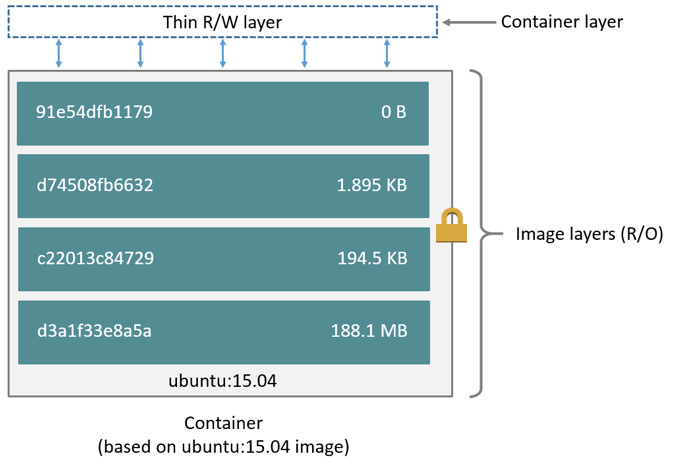
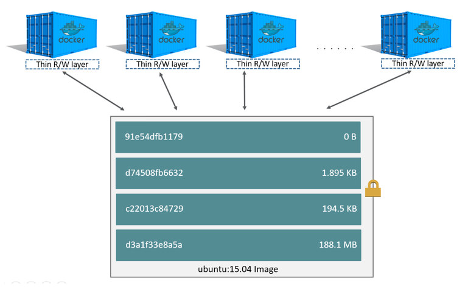
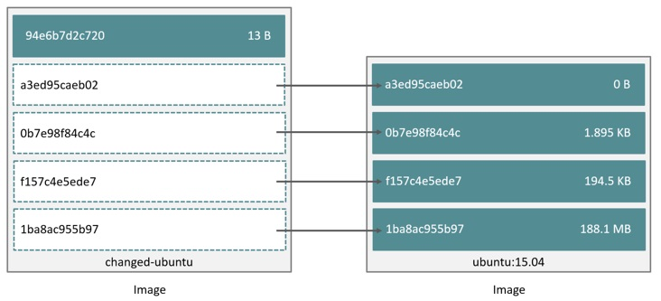
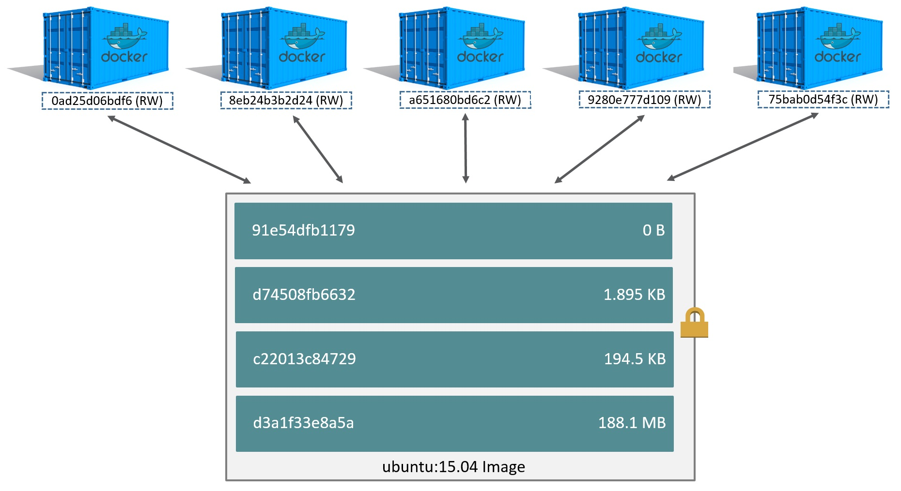
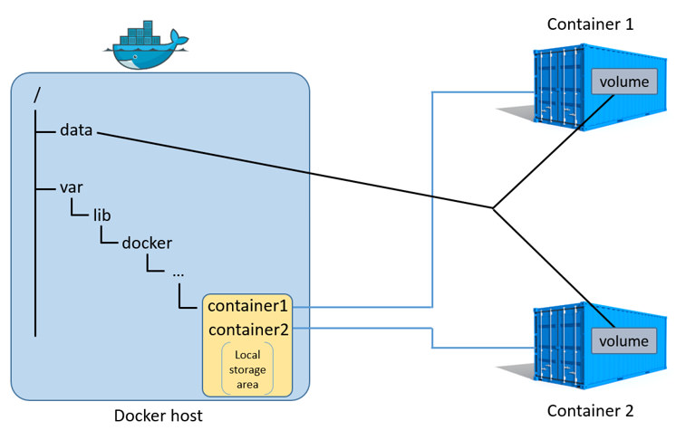

<!--[metadata]>
+++
title = "Understand images, containers, and storage drivers"
description = "Learn the technologies that support storage drivers."
keywords = ["container, storage, driver, AUFS, btfs, devicemapper,zvfs"]
[menu.main]
parent = "mn_storage_docker"
weight = -2
+++
<![end-metadata]-->

# Understand images, containers, and storage drivers

To use storage drivers effectively, you must understand how Docker builds and
stores images. Then, you need an understanding of how these images are used in  containers. Finally, you'll need a short introduction to the technologies that enable both images and container operations.

## Images and containers rely on layers

Docker images are a series of read-only layers that are stacked
on top of each other to form a single unified view. The first image in the stack
is called a *base image* and all the other layers are stacked on top of this
layer. The diagram below shows the Ubuntu 15:04 image comprising 4 stacked image layers.

When you make a change inside a container by, for example, adding a new file to the Ubuntu 15.04 image, you add a new layer on top of the underlying image stack. This change creates a new image layer containing the newly added file. Each image layer has its own universal unique identifier (UUID) and each successive image layer builds on top of the image layer below it.

Containers (in the storage context) are a combination of a Docker image with a
thin writable layer added to the top known as the *container layer*.  The diagram below shows a container running the Ubuntu 15.04 image.

The major difference between a container and an image is this writable layer. All writes to the container that add new or modifying existing data are stored in this writable layer. When the container is deleted the writeable layer is also deleted. The image remains unchanged.

Because each container has its own thin writable container layer and all data is stored this container layer, this means that multiple containers can share access to the same underlying image and yet have their own data state. The diagram below shows multiple containers sharing the same Ubuntu 15.04 image.

A storage driver is responsible for enabling and managing both the image layers and the writeable container layer. How a storage driver accomplishes these behaviors can vary. Two key technologies behind Docker image and container management are stackable image layers and copy-on-write (CoW).

## The copy-on-write strategy

Sharing is a good way to optimize resources. People do this instinctively in
daily life. For example, twins Jane and Joseph taking an Algebra class at
different times from different teachers can share the same exercise book by
passing it between each other. Now, suppose Jane gets an assignment to complete
the homework on page 11 in the book. At that point, Jane copy page 11, complete the homework, and hand in her copy. The original exercise book is unchanged and only Jane has a copy of the changed page 11.

Copy-on-write is a similar strategy of sharing and copying. In this strategy,
system processes that need the same data share the same instance of that data
rather than having their own copy. At some point, if one process needs to modify
or write to the data, only then does the operating system make a copy of the
data for that process to use. Only the process that needs to write has access to
the data copy. All the other processes continue to use the original data.

Docker uses a copy-on-write technology with both images and containers. This CoW
strategy optimizes both image disk space usage and the performance of container
start times. The next sections look at how copy-on-write is leveraged with
images and containers thru sharing and copying.

### Sharing promotes smaller images

This section looks at image layers and copy-on-write technology.  All image and container layers exist inside the Docker host's *local storage area* and are managed by the storage driver. It is a location on the host's
filesystem.

The Docker client reports on image layers when instructed to pull and push
images with `docker pull` and `docker push`. The command below pulls the
`ubuntu:15.04` Docker image from Docker Hub.

    $ docker pull ubuntu:15.04
    15.04: Pulling from library/ubuntu
    6e6a100fa147: Pull complete
    13c0c663a321: Pull complete
    2bd276ed39d5: Pull complete
    013f3d01d247: Pull complete
    Digest: sha256:c7ecf33cef00ae34b131605c31486c91f5fd9a76315d075db2afd39d1ccdf3ed
    Status: Downloaded newer image for ubuntu:15.04

From the output, you'll see  that the command actually pulls 4 image layers.
Each of the above lines lists an image layer and its UUID. The combination of
these four layers makes up the `ubuntu:15.04` Docker image.

The image layers are stored in the Docker host's local storage area. Typically,
the local storage area is in the host's `/var/lib/docker` directory. Depending
on which storage driver the local storage area may be in a different location.  You can list the layers in the local storage area. The following example shows the storage as it appears under the AUFS storage driver:

    $ sudo ls /var/lib/docker/aufs/layers
    013f3d01d24738964bb7101fa83a926181d600ebecca7206dced59669e6e6778  2bd276ed39d5fcfd3d00ce0a190beeea508332f5aec3c6a125cc619a3fdbade6
    13c0c663a321cd83a97f4ce1ecbaf17c2ba166527c3b06daaefe30695c5fcb8c  6e6a100fa147e6db53b684c8516e3e2588b160fd4898b6265545d5d4edb6796d

If you `pull` another image that shares some of the same image layers as the `ubuntu:15.04` image, the Docker daemon recognize this, and only pull the layers it hasn't already stored. After the second pull, the two images will share any common image layers.

You can illustrate this now for yourself. Starting the `ubuntu:15.04` image that
you just pulled, make a change to it, and build a new image based on the change.
One way to do this is using a Dockerfile and the `docker build` command.

1. In an empty directory, create a simple `Dockerfile` that starts with the ubuntu:15.04 image.

        FROM ubuntu:15.04

2. Add a new file called "newfile" in the image's `/tmp` directory with the text "Hello world" in it.

  When you are done, the `Dockerfile` contains two lines:

        FROM ubuntu:15.04

        RUN echo "Hello world" > /tmp/newfile

3. Save and close the file.

2. From a terminal in the same folder as your Dockerfile, run the following command:

        $ docker build -t changed-ubuntu .
        Sending build context to Docker daemon 2.048 kB
        Step 0 : FROM ubuntu:15.04
         ---> 013f3d01d247
        Step 1 : RUN echo "Hello world" > /tmp/newfile
         ---> Running in 2023460815df
         ---> 03b964f68d06
        Removing intermediate container 2023460815df
        Successfully built 03b964f68d06

    > **Note:** The period (.) at the end of the above command is important. It tells the `docker build` command to use the current working directory as its build context.

    The output above shows a new image with image ID `03b964f68d06`.

3. Run the `docker images` command to verify the new image is in the Docker host's local storage area.

        REPOSITORY          TAG                 IMAGE ID            CREATED             VIRTUAL SIZE
        changed-ubuntu      latest              03b964f68d06        33 seconds ago      131.4 MB
        ubuntu  

4. Run the `docker history` command to see which image layers were used to create the new `changed-ubuntu` image.

        $ docker history changed-ubuntu
        IMAGE               CREATED              CREATED BY                                      SIZE                COMMENT
        03b964f68d06        About a minute ago   /bin/sh -c echo "Hello world" > /tmp/newfile    12 B                
        013f3d01d247        6 weeks ago          /bin/sh -c #(nop) CMD ["/bin/bash"]             0 B                 
        2bd276ed39d5        6 weeks ago          /bin/sh -c sed -i 's/^#\s*\(deb.*universe\)$/   1.879 kB            
        13c0c663a321        6 weeks ago          /bin/sh -c echo '#!/bin/sh' > /usr/sbin/polic   701 B               
        6e6a100fa147        6 weeks ago          /bin/sh -c #(nop) ADD file:49710b44e2ae0edef4   131.4 MB            

    The `docker history` output shows the new `03b964f68d06` image layer at the
    top. You know that the `03b964f68d06` layer was added because it was created
    by the `echo "Hello world" > /tmp/newfile` command in your `Dockerfile`.
    The 4 image layers below it are the exact same image layers the make up the
    ubuntu:15.04 image as their UUIDs match.

5. List the contents of the local storage area to further confirm.

        $ sudo ls /var/lib/docker/aufs/layers
        013f3d01d24738964bb7101fa83a926181d600ebecca7206dced59669e6e6778  2bd276ed39d5fcfd3d00ce0a190beeea508332f5aec3c6a125cc619a3fdbade6
        03b964f68d06a373933bd6d61d37610a34a355c168b08dfc604f57b20647e073  6e6a100fa147e6db53b684c8516e3e2588b160fd4898b6265545d5d4edb6796d
        13c0c663a321cd83a97f4ce1ecbaf17c2ba166527c3b06daaefe30695c5fcb8c

      Where before you had four layers stored, you now have 5.

Notice the new `changed-ubuntu` image does not have its own copies of every layer. As can be seen in the diagram below, the new image is sharing it's four underlying layers with the `ubuntu:15.04` image.

The `docker history` command also shows the size of each image layer. The `03b964f68d06` is only consuming 13 Bytes of disk space. Because all of the layers below it already exist on the Docker host and are shared with the `ubuntu15:04` image, this means the entire `changed-ubuntu` image only consumes 13 Bytes of disk space.

This sharing of image layers is what makes Docker images and containers so space
efficient.

### Copying makes containers efficient

You learned earlier that a container a Docker image with a thin writable, container layer added. The diagram below shows the layers of a container based on the `ubuntu:15.04` image:

All writes made to a container are stored in the thin writable container layer. The other layers are read-only (RO) image layers and can't be changed. This means that multiple containers can safely share a single underlying image. The diagram below shows multiple containers sharing a single copy of the `ubuntu:15.04` image. Each container has its own thin RW layer, but they all share a single instance of the ubuntu:15.04 image:

When a write operation occurs in a container, Docker uses the storage driver to perform a copy-on-write operation. The type of operation depends on the storage driver. For AUFS and OverlayFS storage drivers the copy-on-write operation is pretty much as follows:

*  Search through the layers for the file to update. The process starts at the top, newest layer and works down to the base layer one-at-a-time.
*  Perform a "copy-up" operation on the first copy of the file that is found. A "copy up" copies the file up to the container's own thin writable layer.
* Modify the *copy of the file* in container's thin writable layer.

BTFS, ZFS, and other drivers handle the copy-on-write differently. You can read more about the methods of these drivers later in their detailed descriptions.

Containers that write a lot of data will consume more space than containers that do not. This is because most write operations consume new space in the containers thin writable top layer. If your container needs to write a lot of data, you can use a data volume.

A copy-up operation can incur a noticeable performance overhead. This overhead is different depending on which storage driver is in use. However, large files, lots of layers, and deep directory trees can make the impact more noticeable. Fortunately, the operation only occurs the first time any particular file is modified. Subsequent modifications to the same file do not cause a copy-up operation and can operate directly on the file's existing copy already present in container layer.

Let's see what happens if we spin up 5 containers based on our `changed-ubuntu` image we built earlier:

1. From a terminal on your Docker host, run the following `docker run` command 5 times.

        $ docker run -dit changed-ubuntu bash
        75bab0d54f3cf193cfdc3a86483466363f442fba30859f7dcd1b816b6ede82d4
        $ docker run -dit changed-ubuntu bash
        9280e777d109e2eb4b13ab211553516124a3d4d4280a0edfc7abf75c59024d47
        $ docker run -dit changed-ubuntu bash
        a651680bd6c2ef64902e154eeb8a064b85c9abf08ac46f922ad8dfc11bb5cd8a
        $ docker run -dit changed-ubuntu bash
        8eb24b3b2d246f225b24f2fca39625aaad71689c392a7b552b78baf264647373
        $ docker run -dit changed-ubuntu bash
        0ad25d06bdf6fca0dedc38301b2aff7478b3e1ce3d1acd676573bba57cb1cfef

  This launches 5 containers based on the `changed-ubuntu` image.  As the container is created, Docker adds a writable layer and assigns it a UUID. This is the value returned from the `docker run` command.

2. Run the `docker ps` command to verify the 5 containers are running.

        $ docker ps
        CONTAINER ID        IMAGE               COMMAND             CREATED              STATUS              PORTS               NAMES
        0ad25d06bdf6        changed-ubuntu      "bash"              About a minute ago   Up About a minute                       stoic_ptolemy
        8eb24b3b2d24        changed-ubuntu      "bash"              About a minute ago   Up About a minute                       pensive_bartik
        a651680bd6c2        changed-ubuntu      "bash"              2 minutes ago        Up 2 minutes                            hopeful_turing
        9280e777d109        changed-ubuntu      "bash"              2 minutes ago        Up 2 minutes                            backstabbing_mahavira
        75bab0d54f3c        changed-ubuntu      "bash"              2 minutes ago        Up 2 minutes                            boring_pasteur

    The output above shows 5 running containers, all sharing the `changed-ubuntu` image. Each `CONTAINER ID` is derived from the UUID when creating each container.

3. List the contents of the local storage area.

        $ sudo ls containers
        0ad25d06bdf6fca0dedc38301b2aff7478b3e1ce3d1acd676573bba57cb1cfef  9280e777d109e2eb4b13ab211553516124a3d4d4280a0edfc7abf75c59024d47
        75bab0d54f3cf193cfdc3a86483466363f442fba30859f7dcd1b816b6ede82d4  a651680bd6c2ef64902e154eeb8a064b85c9abf08ac46f922ad8dfc11bb5cd8a
        8eb24b3b2d246f225b24f2fca39625aaad71689c392a7b552b78baf264647373

Docker's copy-on-write strategy not only reduces the amount of space consumed by containers, it also reduces the time required to start a container. At start time, Docker only has to create the thin writable layer for each container. The diagram below shows these 5 containers sharing a single read-only (RO) copy of the `changed-ubuntu` image.

If Docker had to make an entire copy of the underlying image stack each time it
started a new container, container start times and disk space used would be
significantly increased.

## Data volumes and the storage driver

When a container is deleted, any data written to the container that is not stored in a *data volume* is deleted along with the container. A data volume is directory or file that is mounted directly into a container.

Data volumes are not controlled by the storage driver. Reads and writes to data
volumes bypass the storage driver and operate at native host speeds. You can mount any number of data volumes into a container. Multiple containers can also share one or more data volumes.

The diagram below shows a single Docker host running two containers. Each container exists inside of its own address space within the Docker host's local storage area. There is also a single shared data volume located at `/data` on the Docker host. This is mounted directly into both containers.

The data volume resides outside of the local storage area on the Docker host further reinforcing its independence from the storage driver's control. When a container is deleted, any data stored in shared data volumes persists on the Docker host.

For detailed information about data volumes [Managing data in containers](https://docs.docker.com/userguide/dockervolumes/).

## Related information

* [Select a storage driver](selectadriver.md)
* [AUFS storage driver in practice](aufs-driver.md)
* [BTRFS storage driver in practice](btrfs-driver.md)
* [Device Mapper storage driver in practice](device-mapper-driver.md)
