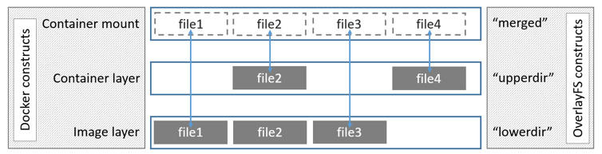
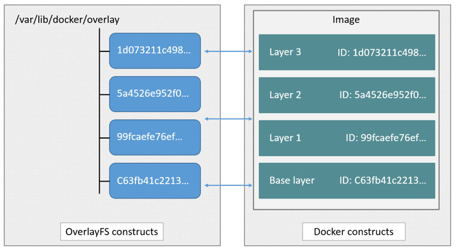

<!--[metadata]>
+++
title = "OverlayFS storage in practice"
description = "Learn how to optimize your use of OverlayFS driver."
keywords = ["container, storage, driver, OverlayFS "]
[menu.main]
parent = "mn_storage_docker"
+++
<![end-metadata]-->

# Docker and OverlayFS in practice

OverlayFS is a modern *union filesystem* that is similar to AUFS. In comparison to AUFS, OverlayFS:

* has a simpler design
* has been in the mainline Linux kernel since version 3.18
* is potentially faster

As a result, OverlayFS is rapidly gaining popularity in the Docker community and is seen by many as a natural successor to AUFS. As promising as OverlayFS is, it is still relatively young. Therefore caution should be taken before using it in production Docker environments.

Docker's `overlay` storage driver leverages several OverlayFS features to build and manage the on-disk structures of images and containers.

>**Note**: Since it was merged into the mainline kernel, the OverlayFS *kernel module* was renamed from "overlayfs" to "overlay". As a result you may see the two terms used interchangeably in some documentation. However, this document uses  "OverlayFS" to refer to the overall filesystem, and `overlay` to refer to Docker's storage-driver.

## Image layering and sharing with OverlayFS

OverlayFS takes two directories on a single Linux host, layers one on top of the other, and provides a single unified view. These directories are often referred to as *layers* and the technology used to layer them is is known as a *union mount*. The OverlayFS terminology is "lowerdir" for the bottom layer and "upperdir" for the top layer. The unified view is exposed through its own directory called "merged".

The diagram below shows how a Docker image and a Docker container are layered. The image layer is the "lowerdir" and the container layer is the "upperdir". The unified view is exposed through a directory called "merged" which is effectively the containers mount point. The diagram shows how Docker constructs map to OverlayFS constructs.

Notice how the image layer and container layer can contain the same files. When this happens, the files in the container layer ("upperdir") are dominant and obscure the existence of the same files in the image layer ("lowerdir"). The container mount ("merged") presents the unified view.

OverlayFS only works with two layers. This means that multi-layered images cannot be implemented as multiple OverlayFS layers. Instead, each image layer is implemented as its own directory under `/var/lib/docker/overlay`. Hard links are then used as a space-efficient way to reference data shared with lower layers. The diagram below shows a four-layer image and how it is represented in the Docker host's filesystem.

To create a container, the `overlay` driver combines the directory representing the image's top layer plus a new directory for the container. The image's top layer is the "lowerdir" in the overlay and read-only. The new directory for the container is the "upperdir" and is writable.

## Example: Image and container on-disk constructs

The following `docker images -a` command shows a Docker host with a single image. As can be seen, the image consists of four layers.

    $ docker images -a
    REPOSITORY          TAG                 IMAGE ID            CREATED             VIRTUAL SIZE
    ubuntu              latest              1d073211c498        7 days ago          187.9 MB
    <none>              <none>              5a4526e952f0        7 days ago          187.9 MB
    <none>              <none>              99fcaefe76ef        7 days ago          187.9 MB
    <none>              <none>              c63fb41c2213        7 days ago          187.7 MB

Below, the command's output illustrates that each of the four image layers has it's own directory under `/var/lib/docker/overlay/`.

    $ ls -l /var/lib/docker/overlay/
    total 24
    drwx------ 3 root root 4096 Oct 28 11:02 1d073211c498fd5022699b46a936b4e4bdacb04f637ad64d3475f558783f5c3e
    drwx------ 3 root root 4096 Oct 28 11:02 5a4526e952f0aa24f3fcc1b6971f7744eb5465d572a48d47c492cb6bbf9cbcda
    drwx------ 5 root root 4096 Oct 28 11:06 99fcaefe76ef1aa4077b90a413af57fd17d19dce4e50d7964a273aae67055235
    drwx------ 3 root root 4096 Oct 28 11:01 c63fb41c2213f511f12f294dd729b9903a64d88f098c20d2350905ac1fdbcbba

Each directory is named after the image layer IDs in the previous `docker images -a` command. The image layer directories contain the files unique to that layer as well as hard links to the data that is shared with lower layers. This allows for efficient use of disk space.

The following `docker ps` command shows the same Docker host running a single container. The container ID is "73de7176c223".

    $ docker ps
    CONTAINER ID        IMAGE               COMMAND             CREATED             STATUS              PORTS               NAMES
    73de7176c223        ubuntu              "bash"              2 days ago          Up 2 days                               stupefied_nobel

This container exists on-disk in the Docker host's filesystem under `/var/lib/docker/overlay/73de7176c223...`.  If you inspect this directory using the `ls -l` command you find the following file and directories.

    $ ls -l /var/lib/docker/overlay/73de7176c223a6c82fd46c48c5f152f2c8a7e49ecb795a7197c3bb795c4d879e
    total 16
    -rw-r--r-- 1 root root   64 Oct 28 11:06 lower-id
    drwxr-xr-x 1 root root 4096 Oct 28 11:06 merged
    drwxr-xr-x 4 root root 4096 Oct 28 11:06 upper
    drwx------ 3 root root 4096 Oct 28 11:06 work

These four filesystem objects are all artifacts of OverlayFS. The "lower-id" file contains the ID of the top layer of the image the container is based on. This is used by OverlayFS as the "lowerdir".

    $ cat /var/lib/docker/overlay/73de7176c223a6c82fd46c48c5f152f2c8a7e49ecb795a7197c3bb795c4d879e/lower-id
    1d073211c498fd5022699b46a936b4e4bdacb04f637ad64d3475f558783f5c3e

The "upper" directory is the containers read-write layer. Any changes made to the container are written to this directory.

The "merged" directory is effectively the containers mount point. This is where the unified view of the image ("lowerdir") and container ("upperdir") is exposed. Any changes written to the container are immediately reflected in this directory.

The "work" directory is required for OverlayFS to function. It is used for things such as *copy_up* operations.

You can verify all of these constructs from the output of the `mount` command. (Ellipses and line breaks are used in the output below to enhance readability.)

    $ mount | grep overlay
    overlay on /var/lib/docker/overlay/73de7176c223.../merged
    type overlay (rw,relatime,lowerdir=/var/lib/docker/overlay/1d073211c498.../root,
    upperdir=/var/lib/docker/overlay/73de7176c223.../upper,
    workdir=/var/lib/docker/overlay/73de7176c223.../work)

The output reflects the overlay is mounted as read-write ("rw").

## Container reads and writes with overlay

Consider three scenarios where a container opens a file for read access with overlay.

- **The file does not exist in the container layer**. If a container opens a file for read access and the file does not already exist in the container ("upperdir") it is read from the image ("lowerdir"). This should incur very little performance overhead.

- **The file only exists in the container layer**. If a container opens a file for read access and the file exists in the container ("upperdir") and not in the image ("lowerdir"), it is read directly from the container.

- **The file exists in the container layer and the image layer**. If a container opens a file for read access and the file exists in the image layer and the container layer, the file's version in the container layer is read. This is because files in the container layer ("upperdir") obscure files with the same name in the image layer ("lowerdir").

Consider some scenarios where files in a container are modified.

- **Writing to a file for the first time**. The first time a container writes to an existing file, that file does not exist in the container ("upperdir"). The `overlay` driver performs a *copy_up* operation to copy the file from the image ("lowerdir") to the container ("upperdir"). The container then writes the changes to the new copy of the file in the container layer.

    However, OverlayFS works at the file level not the block level. This means that all OverlayFS copy-up operations copy entire files, even if the file is very large and only a small part of it is being modified. This can have a noticeable impact on container write performance. However, two things are worth noting:

    * The copy_up operation only occurs the first time any given file is written to. Subsequent writes to the same file will operate against the copy of the file already copied up to the container.

    * OverlayFS only works with two layers. This means that performance should be better than AUFS which can suffer noticeable latencies when searching for files in images with many layers.

- **Deleting files and directories**. When files are deleted within a container a *whiteout* file is created in the containers "upperdir". The version of the file in the image layer ("lowerdir") is not deleted. However, the whiteout file in the container obscures it.

    Deleting a directory in a container results in *opaque directory* being created in the "upperdir". This has the same effect as a whiteout file and effectively masks the existence of the directory in the image's "lowerdir".

## Configure Docker with the overlay storage driver

To configure Docker to use the overlay storage driver your Docker host must be running version 3.18 of the Linux kernel (preferably newer) with the overlay kernel module loaded.  OverlayFS can operate on top of most supported Linux filesystems. However, ext4 is currently recommended for use in production environments.

The following procedure shows you how to configure your Docker host to use OverlayFS. The procedure assumes that the Docker daemon is in a stopped state.

> **Caution:** If you have already run the Docker daemon on your Docker host and have images you want to keep, `push` them Docker Hub or your private Docker Trusted Registry before attempting this procedure.

1. If it is running, stop the Docker `daemon`.

2. Verify your kernel version and that the overlay kernel module is loaded.

        $ uname -r
        3.19.0-21-generic

        $ lsmod | grep overlay
        overlay

3. Start the Docker daemon with the `overlay` storage driver.

        $ docker daemon --storage-driver=overlay &
        [1] 29403
        root@ip-10-0-0-174:/home/ubuntu# INFO[0000] Listening for HTTP on unix (/var/run/docker.sock)
        INFO[0000] Option DefaultDriver: bridge
        INFO[0000] Option DefaultNetwork: bridge
        <output truncated>

    Alternatively, you can force the Docker daemon to automatically start with
    the `overlay` driver by editing the Docker config file and adding the
    `--storage-driver=overlay` flag to the `DOCKER_OPTS` line. Once this option
    is set you can start the daemon using normal startup scripts without having
    to manually pass in the `--storage-driver` flag.

4. Verify that the daemon is using the `overlay` storage driver

        $ docker info
        Containers: 0
        Images: 0
        Storage Driver: overlay
         Backing Filesystem: extfs
        <output truncated>

    Notice that the *Backing filesystem* in the output above is showing as `extfs`. Multiple backing filesystems are supported but `extfs` (ext4) is recommended for production use cases.

Your Docker host is now using the `overlay` storage driver. If you run the `mount` command, you'll find Docker has automatically created the `overlay` mount with the required "lowerdir", "upperdir", "merged" and "workdir" constructs.

## OverlayFS and Docker Performance

As a general rule, the `overlay` driver should be fast. Almost certainly faster than `aufs` and `devicemapper`. In certain circumstances it may also be faster than `btrfs`. That said, there are a few things to be aware of relative to the performance of Docker using the `overlay` storage driver.

- **Page Caching**. OverlayFS supports page cache sharing. This means multiple containers accessing the same file can share a single page cache entry (or entries). This makes the `overlay` driver efficient with memory and a good option for PaaS and other high density use cases.

- **copy_up**. As with AUFS, OverlayFS has to perform copy-up operations any time a container writes to a file for the first time. This can insert latency into the write operation &mdash; especially if the file being copied up is large. However, once the file has been copied up, all subsequent writes to that file occur without the need for further copy-up operations.

    The OverlayFS copy_up operation should be faster than the same operation with AUFS. This is because AUFS supports more layers than OverlayFS and it is possible to incur far larger latencies if searching through many AUFS layers.

- **RPMs and Yum**. OverlayFS only implements a subset of the POSIX standards. This can result in certain OverlayFS operations breaking POSIX standards. One such operation is the *copy-up* operation. Therefore, using `yum` inside of a container on a Docker host using the `overlay` storage driver is unlikely to work without implementing workarounds.

- **Inode limits**. Use of the `overlay` storage driver can cause excessive inode consumption. This is especially so as the number of images and containers on the Docker host grows. A Docker host with a large number of images and lots of started and stopped containers can quickly run out of inodes.

  Unfortunately you can only specify the number of inodes in a filesystem at the time of creation. For this reason, you may wish to consider putting `/var/lib/docker` on a separate device with its own filesystem or manually specifying the number of inodes when creating the filesystem.

The following generic performance best practices also apply to OverlayFS.

- **Solid State Devices (SSD)**. For best performance it is always a good idea to use fast storage media such as solid state devices (SSD).

- **Use Data Volumes**. Data volumes provide the best and most predictable performance. This is because they bypass the storage driver and do not incur any of the potential overheads introduced by thin provisioning and copy-on-write. For this reason, you may want to place heavy write workloads on data volumes.
