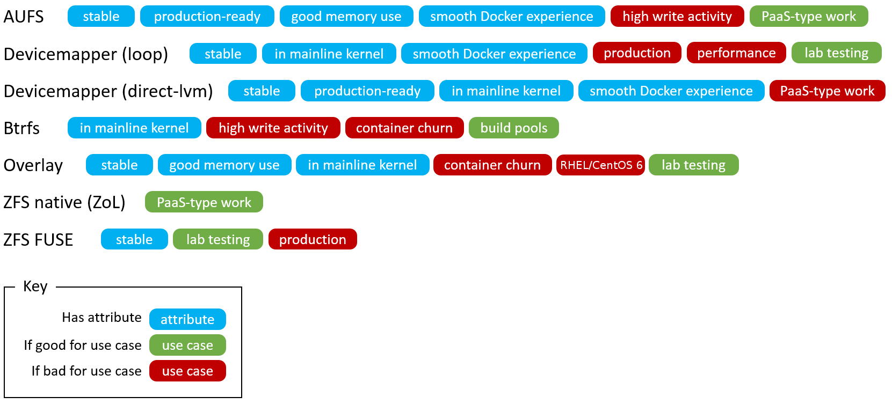

<!--[metadata]>
+++
title = "Select a storage driver"
description = "Learn how select the proper storage driver for your container."
keywords = ["container, storage, driver, AUFS, btfs, devicemapper,zvfs"]
[menu.main]
parent = "engine_driver"
weight = -1
+++
<![end-metadata]-->

# Select a storage driver

This page describes Docker's storage driver feature. It lists the storage
driver's that Docker supports and the basic commands associated with managing
them. Finally, this page provides guidance on choosing a storage driver.

The material on this page is intended for readers who already have an
[understanding of the storage driver technology](imagesandcontainers.md).

## A pluggable storage driver architecture

Docker has a pluggable storage driver architecture. This gives you the
flexibility to "plug in" the storage driver that is best for your environment
and use-case. Each Docker storage driver is based on a Linux filesystem or
volume manager. Further, each storage driver is free to implement the
management of image layers and the container layer in its own unique way. This
means some storage drivers perform better than others in different
circumstances.

Once you decide which driver is best, you set this driver on the Docker daemon
at start time. As a result, the Docker daemon can only run one storage driver,
and all containers created by that daemon instance use the same storage driver.
 The table below shows the supported storage driver technologies and their
driver names:

|Technology    |Storage driver name  |
|--------------|---------------------|
|OverlayFS     |`overlay`            |
|AUFS          |`aufs`               |
|Btrfs         |`btrfs`              |
|Device Mapper |`devicemapper`       |
|VFS           |`vfs`                |
|ZFS           |`zfs`                |

To find out which storage driver is set on the daemon, you use the
`docker info` command:

    $ docker info
    Containers: 0
    Images: 0
    Storage Driver: overlay
     Backing Filesystem: extfs
    Execution Driver: native-0.2
    Logging Driver: json-file
    Kernel Version: 3.19.0-15-generic
    Operating System: Ubuntu 15.04
    ... output truncated ...

The `info` subcommand reveals that the Docker daemon is using the `overlay`
storage driver with a `Backing Filesystem` value of `extfs`. The `extfs` value
means that the `overlay` storage driver is operating on top of an existing
(ext) filesystem. The backing filesystem refers to the filesystem that was used
 to create the Docker host's local storage area under `/var/lib/docker`.

Which storage driver you use, in part, depends on the backing filesystem you
plan to use for your Docker host's local storage area. Some storage drivers can
 operate on top of different backing filesystems. However, other storage
drivers require the backing filesystem to be the same as the storage driver.
For example, the `btrfs` storage driver on a Btrfs backing filesystem. The
following table lists each storage driver and whether it must match the host's
backing file system:

|Storage driver |Commonly used on |Disabled on                              |
|---------------|-----------------|-----------------------------------------|
|`overlay`      |`ext4` `xfs`     |`btrfs` `aufs` `overlay` `zfs` `eCryptfs`|
|`aufs`         |`ext4` `xfs`     |`btrfs` `aufs` `eCryptfs`                |
|`btrfs`        |`btrfs` _only_   |   N/A                                   |
|`devicemapper` |`direct-lvm`     |   N/A                                   |
|`vfs`          |debugging only   |   N/A                                   |
|`zfs`          |`zfs` _only_     |   N/A                                   |

> **Note**
> "Disabled on" means some storage drivers can not run over certain backing
> filesystem.

You can set the storage driver by passing the `--storage-driver=<name>` option
to the `dockerd` command line, or by setting the option on the
`DOCKER_OPTS` line in the `/etc/default/docker` file.

The following command shows how to start the Docker daemon with the
`devicemapper` storage driver using the `dockerd` command:

    $ dockerd --storage-driver=devicemapper &

    $ docker info
    Containers: 0
    Images: 0
    Storage Driver: devicemapper
     Pool Name: docker-252:0-147544-pool
     Pool Blocksize: 65.54 kB
     Backing Filesystem: extfs
     Data file: /dev/loop0
     Metadata file: /dev/loop1
     Data Space Used: 1.821 GB
     Data Space Total: 107.4 GB
     Data Space Available: 3.174 GB
     Metadata Space Used: 1.479 MB
     Metadata Space Total: 2.147 GB
     Metadata Space Available: 2.146 GB
     Thin Pool Minimum Free Space: 10.74 GB
     Udev Sync Supported: true
     Deferred Removal Enabled: false
     Data loop file: /var/lib/docker/devicemapper/devicemapper/data
     Metadata loop file: /var/lib/docker/devicemapper/devicemapper/metadata
     Library Version: 1.02.90 (2014-09-01)
    Execution Driver: native-0.2
    Logging Driver: json-file
    Kernel Version: 3.19.0-15-generic
    Operating System: Ubuntu 15.04
    <output truncated>

Your choice of storage driver can affect the performance of your containerized
applications. So it's important to understand the different storage driver
options available and select the right one for your application. Later, in this
 page you'll find some advice for choosing an appropriate driver.

## Shared storage systems and the storage driver

Many enterprises consume storage from shared storage systems such as SAN and
NAS arrays. These often provide increased performance and availability, as well
 as advanced features such as thin provisioning, deduplication and compression.

The Docker storage driver and data volumes can both operate on top of storage
provided by shared storage systems. This allows Docker to leverage the
increased performance and availability these systems provide. However, Docker
does not integrate with these underlying systems.

Remember that each Docker storage driver is based on a Linux filesystem or
volume manager. Be sure to follow existing best practices for operating your
storage driver (filesystem or volume manager) on top of your shared storage
system. For example, if using the ZFS storage driver on top of *XYZ* shared
storage system, be sure to follow best practices for operating ZFS filesystems
on top of XYZ shared storage system.

## Which storage driver should you choose?

Several factors influence the selection of a storage driver. However, these two
 facts must be kept in mind:

1. No single driver is well suited to every use-case
2. Storage drivers are improving and evolving all of the time

With these factors in mind, the following points, coupled with the table below,
 should provide some guidance.

### Stability
For the most stable and hassle-free Docker experience, you should consider the
following:

- **Use the default storage driver for your distribution**. When Docker
installs, it chooses a default storage driver based on the configuration of
your system. Stability is an important factor influencing which storage driver
is used by default. Straying from this default may increase your chances of
encountering bugs and nuances.
- **Follow the configuration specified on the CS Engine
[compatibility matrix](https://www.docker.com/compatibility-maintenance)**. The
 CS Engine is the commercially supported version of the Docker Engine. It's
code-base is identical to the open source Engine, but it has a limited set of
supported configurations. These *supported configurations* use the most stable
and mature storage drivers. Straying from these configurations may also
increase your chances of encountering bugs and nuances.

### Experience and expertise

Choose a storage driver that you and your team/organization have experience
with. For example, if you use RHEL or one of its downstream forks, you may
already have experience with LVM and Device Mapper. If so, you may wish to use
the `devicemapper` driver.

If you do not feel you have expertise with any of the storage drivers supported
 by Docker, and you want an easy-to-use stable Docker experience, you should
consider using the default driver installed by your distribution's Docker
package.

### Future-proofing

Many people consider OverlayFS as the future of the Docker storage driver.
However, it is less mature, and potentially less stable than some of the more
mature drivers such as `aufs` and `devicemapper`.  For this reason, you should
use the OverlayFS driver with caution and expect to encounter more bugs and
nuances than if you were using a more mature driver.

The following diagram lists each storage driver and provides insight into some
of their pros and cons. When selecting which storage driver to use, consider
the guidance offered by the table below along with the points mentioned above.

## Related information

* [Understand images, containers, and storage drivers](imagesandcontainers.md)
* [AUFS storage driver in practice](aufs-driver.md)
* [Btrfs storage driver in practice](btrfs-driver.md)
* [Device Mapper storage driver in practice](device-mapper-driver.md)
