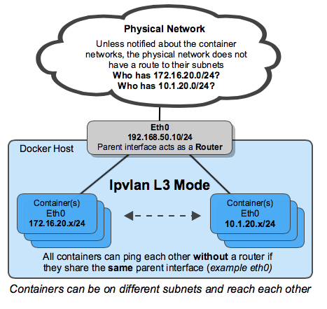

# Ipvlan Network Driver

### Getting Started

The Ipvlan driver is currently in experimental mode in order to incubate Docker users use cases and vet the implementation to ensure a hardened, production ready driver in a future release. Libnetwork now gives users total control over both IPv4 and IPv6 addressing. The VLAN driver builds on top of that in giving operators complete control of layer 2 VLAN tagging and even Ipvlan L3 routing for users interested in underlay network integration. For overlay deployments that abstract away physical constraints see the [multi-host overlay ](https://docs.docker.com/engine/userguide/networking/get-started-overlay/) driver.

Ipvlan is a new twist on the tried and true network virtualization technique. The Linux implementations are extremely lightweight because rather than using the traditional Linux bridge for isolation, they are simply associated to a Linux Ethernet interface or sub-interface to enforce separation between networks and connectivity to the physical network.

Ipvlan offers a number of unique features and plenty of room for further innovations with the various modes. Two high level advantages of these approaches are, the positive performance implications of bypassing the Linux bridge and the simplicity of having fewer moving parts. Removing the bridge that traditionally resides in between the Docker host NIC and container interface leaves a simple setup consisting of container interfaces, attached directly to the Docker host interface. This result is easy access for external facing services as there is no need for port mappings in these scenarios.

### Pre-Requisites

- The examples on this page are all single host and setup using Docker experimental builds that can be installed with the following instructions: [Install Docker experimental](https://github.com/docker/docker/tree/master/experimental)

- All of the examples can be performed on a single host running Docker. Any examples using a sub-interface like `eth0.10` can be replaced with `eth0` or any other valid parent interface on the Docker host. Sub-interfaces with a `.` are created on the fly. `-o parent` interfaces can also be left out of the `docker network create` all together and the driver will create a `dummy` interface that will enable local host connectivity to perform the examples.

- Kernel requirements:
 
 - To check your current kernel version, use `uname -r` to display your kernel version
 - Ipvlan Linux kernel v4.2+ (support for earlier kernels exists but is buggy)

### Ipvlan L2 Mode Example Usage

An example of the ipvlan `L2` mode topology is shown in the following image. The driver is specified with `-d driver_name` option. In this case `-d ipvlan`.


The parent interface in the next example `-o parent=eth0` is configured as followed:

```
$ ip addr show eth0
3: eth0: <BROADCAST,MULTICAST,UP,LOWER_UP> mtu 1500 qdisc pfifo_fast state UP group default qlen 1000
    inet 192.168.1.250/24 brd 192.168.1.255 scope global eth0
```

Use the network from the host's interface as the `--subnet` in the `docker network create`. The container will be attached to the same network as the host interface as set via the `-o parent=` option.

Create the ipvlan network and run a container attaching to it:

```
# Ipvlan  (-o ipvlan_mode= Defaults to L2 mode if not specified)
$ docker network  create -d ipvlan \
    --subnet=192.168.1.0/24 \ 
    --gateway=192.168.1.1 \
    -o ipvlan_mode=l2 \
    -o parent=eth0 db_net

# Start a container on the db_net network
$ docker  run --net=db_net -it --rm alpine /bin/sh

# NOTE: the containers can NOT ping the underlying host interfaces as
# they are intentionally filtered by Linux for additional isolation.
```

The default mode for Ipvlan is `l2`. If `-o ipvlan_mode=` are left unspecified, the default mode will be used. Similarly, if the `--gateway` is left empty, the first usable address on the network will be set as the gateway. For example, if the subnet provided in the network create is `--subnet=192.168.1.0/24` then the gateway the container receives is `192.168.1.1`.

To help understand how this mode interacts with other hosts, the following figure shows the same layer 2 segment between two Docker hosts that applies to and Ipvlan L2 mode.


The following will create the exact same network as the network `db_net` created prior, with the driver defaults for `--gateway=192.168.1.1` and `-o ipvlan_mode=l2`.

```
# Ipvlan  (-o ipvlan_mode= Defaults to L2 mode if not specified)
$ docker network  create -d ipvlan \
    --subnet=192.168.1.0/24 \ 
    -o parent=eth0 db_net_ipv

# Start a container with an explicit name in daemon mode
$ docker  run --net=db_net_ipv --name=ipv1 -itd alpine /bin/sh

# Start a second container and ping using the container name
# to see the docker included name resolution functionality
$ docker  run --net=db_net_ipv --name=ipv2 -it --rm alpine /bin/sh
$ ping -c 4 ipv1

# NOTE: the containers can NOT ping the underlying host interfaces as
# they are intentionally filtered by Linux for additional isolation.
```

The drivers also support the `--internal` flag that will completely isolate containers on a network from any communications external to that network. Since network isolation is tightly coupled to the network's parent interface the result of leaving the `-o parent=` option off of a `docker network create` is the exact same as the `--internal` option. If the parent interface is not specified or the `--internal` flag is used, a netlink type `dummy` parent interface is created for the user and used as the parent interface effectively isolating the network completely.

The following two `docker network create` examples result in identical networks that you can attach container to:

```
# Empty '-o parent=' creates an isolated network
$ docker network  create -d ipvlan \
    --subnet=192.168.10.0/24 isolated1

# Explicit '--internal' flag is the same:
$ docker network  create -d ipvlan \
    --subnet=192.168.11.0/24 --internal isolated2

# Even the '--subnet=' can be left empty and the default 
# IPAM subnet of 172.18.0.0/16 will be assigned
$ docker network  create -d ipvlan isolated3

$ docker run --net=isolated1 --name=cid1 -it --rm alpine /bin/sh
$ docker run --net=isolated2 --name=cid2 -it --rm alpine /bin/sh
$ docker run --net=isolated3 --name=cid3 -it --rm alpine /bin/sh

# To attach to any use `docker exec` and start a shell
$ docker exec -it cid1 /bin/sh
$ docker exec -it cid2 /bin/sh
$ docker exec -it cid3 /bin/sh
```

### Ipvlan 802.1q Trunk L2 Mode Example Usage

Architecturally, Ipvlan L2 mode trunking is the same as Macvlan with regard to gateways and L2 path isolation. There are nuances that can be advantageous for CAM table pressure in ToR switches, one MAC per port and MAC exhaustion on a host's parent NIC to name a few. The 802.1q trunk scenario looks the same. Both modes adhere to tagging standards and have seamless integration with the physical network for underlay integration and hardware vendor plugin integrations.

Hosts on the same VLAN are typically on the same subnet and almost always are grouped together based on their security policy. In most scenarios, a multi-tier application is tiered into different subnets because the security profile of each process requires some form of isolation. For example, hosting your credit card processing on the same virtual network as the frontend webserver would be a regulatory compliance issue, along with circumventing the long standing best practice of layered defense in depth architectures. VLANs or the equivocal VNI (Virtual Network Identifier) when using the Overlay driver, are the first step in isolating tenant traffic.


The Linux sub-interface tagged with a vlan can either already exist or will be created when you call a `docker network create`. `docker network rm` will delete the sub-interface. Parent interfaces such as `eth0` are not deleted, only sub-interfaces with a netlink parent index > 0.

For the driver to add/delete the vlan sub-interfaces the format needs to be `interface_name.vlan_tag`. Other sub-interface naming can be used as the specified parent, but the link will not be deleted automatically when `docker network rm` is invoked. 

The option to use either existing parent vlan sub-interfaces or let Docker manage them enables the user to either completely manage the Linux interfaces and networking or let Docker create and delete the Vlan parent sub-interfaces (netlink `ip link`) with no effort from the user.

For example: use `eth0.10` to denote a sub-interface of `eth0` tagged with the vlan id of `10`. The equivalent `ip link` command would be `ip link add link eth0 name eth0.10 type vlan id 10`.

The example creates the vlan tagged networks and then start two containers to test connectivity between containers. Different Vlans cannot ping one another without a router routing between the two networks. The default namespace is not reachable per ipvlan design in order to isolate container namespaces from the underlying host.

**Vlan ID 20**

In the first network tagged and isolated by the Docker host, `eth0.20` is the parent interface tagged with vlan id `20` specified with `-o parent=eth0.20`. Other naming formats can be used, but the links need to be added and deleted manually using `ip link` or Linux configuration files. As long as the `-o parent` exists anything can be used if compliant with Linux netlink.

```
# now add networks and hosts as you would normally by attaching to the master (sub)interface that is tagged
$ docker network  create  -d ipvlan \
    --subnet=192.168.20.0/24 \
    --gateway=192.168.20.1 \
    -o parent=eth0.20 ipvlan20

# in two separate terminals, start a Docker container and the containers can now ping one another.
$ docker run --net=ipvlan20 -it --name ivlan_test1 --rm alpine /bin/sh
$ docker run --net=ipvlan20 -it --name ivlan_test2 --rm alpine /bin/sh
```

**Vlan ID 30**

In the second network, tagged and isolated by the Docker host, `eth0.30` is the parent interface tagged with vlan id `30` specified with `-o parent=eth0.30`. The `ipvlan_mode=` defaults to l2 mode `ipvlan_mode=l2`. It can also be explicitly set with the same result as shown in the next example.

```
# now add networks and hosts as you would normally by attaching to the master (sub)interface that is tagged.
$ docker network  create  -d ipvlan \
    --subnet=192.168.30.0/24 \
    --gateway=192.168.30.1 \
    -o parent=eth0.30 \
    -o ipvlan_mode=l2 ipvlan30

# in two separate terminals, start a Docker container and the containers can now ping one another.
$ docker run --net=ipvlan30 -it --name ivlan_test3 --rm alpine /bin/sh
$ docker run --net=ipvlan30 -it --name ivlan_test4 --rm alpine /bin/sh
```

The gateway is set inside of the container as the default gateway. That gateway would typically be an external router on the network.

```
$$ ip route
  default via 192.168.30.1 dev eth0
  192.168.30.0/24 dev eth0  src 192.168.30.2
```

Example: Multi-Subnet Ipvlan L2 Mode starting two containers on the same subnet and pinging one another. In order for the `192.168.114.0/24` to reach `192.168.116.0/24` it requires an external router in L2 mode. L3 mode can route between subnets that share a common `-o parent=`. 

Secondary addresses on network routers are common as an address space becomes exhausted to add another secondary to an L3 vlan interface or commonly referred to as a "switched virtual interface" (SVI).

```
$ docker network  create  -d ipvlan \
    --subnet=192.168.114.0/24 --subnet=192.168.116.0/24 \
    --gateway=192.168.114.254  --gateway=192.168.116.254 \
     -o parent=eth0.114 \
     -o ipvlan_mode=l2 ipvlan114
     
$ docker run --net=ipvlan114 --ip=192.168.114.10 -it --rm alpine /bin/sh
$ docker run --net=ipvlan114 --ip=192.168.114.11 -it --rm alpine /bin/sh
```

A key takeaway is, operators have the ability to map their physical network into their virtual network for integrating containers into their environment with no operational overhauls required. NetOps simply drops an 802.1q trunk into the Docker host. That virtual link would be the `-o parent=` passed in the network creation. For untagged (non-VLAN) links, it is as simple as `-o parent=eth0` or for 802.1q trunks with VLAN IDs each network gets mapped to the corresponding VLAN/Subnet from the network.

An example being, NetOps provides VLAN ID and the associated subnets for VLANs being passed on the Ethernet link to the Docker host server. Those values are simply plugged into the `docker network create` commands when provisioning the Docker networks. These are persistent configurations that are applied every time the Docker engine starts which alleviates having to manage often complex configuration files. The network interfaces can also be managed manually by being pre-created and docker networking will never modify them, simply use them as parent interfaces. Example mappings from NetOps to Docker network commands are as follows:

- VLAN: 10, Subnet: 172.16.80.0/24, Gateway: 172.16.80.1

    - `--subnet=172.16.80.0/24 --gateway=172.16.80.1 -o parent=eth0.10` 

- VLAN: 20, IP subnet: 172.16.50.0/22, Gateway: 172.16.50.1

    - `--subnet=172.16.50.0/22 --gateway=172.16.50.1 -o parent=eth0.20 ` 

- VLAN: 30, Subnet: 10.1.100.0/16, Gateway: 10.1.100.1

    - `--subnet=10.1.100.0/16 --gateway=10.1.100.1 -o parent=eth0.30` 

### IPVlan L3 Mode Example

IPVlan will require routes to be distributed to each endpoint. The driver only builds the Ipvlan L3 mode port and attaches the container to the interface. Route distribution throughout a cluster is beyond the initial implementation of this single host scoped driver. In L3 mode, the Docker host is very similar to a router starting new networks in the container. They are on networks that the upstream network will not know about without route distribution. For those curious how Ipvlan L3 will fit into container networking see the following examples.



Ipvlan L3 mode drops all broadcast and multicast traffic. This reason alone makes Ipvlan L3 mode a prime candidate for those looking for massive scale and predictable network integrations. It is predictable and in turn will lead to greater uptimes because there is no bridging involved. Bridging loops have been responsible for high profile outages that can be hard to pinpoint depending on the size of the failure domain. This is due to the cascading nature of BPDUs (Bridge Port Data Units) that are flooded throughout a broadcast domain (VLAN) to find and block topology loops. Eliminating bridging domains, or at the least, keeping them isolated to a pair of ToRs (top of rack switches) will reduce hard to troubleshoot bridging instabilities. Ipvlan L2 modes is well suited for isolated VLANs only trunked into a pair of ToRs that can provide a loop-free non-blocking fabric. The next step further is to route at the edge via Ipvlan L3 mode that reduces a failure domain to a local host only. 

- L3 mode needs to be on a separate subnet as the default namespace since it requires a netlink route in the default namespace pointing to the Ipvlan parent interface.

- The parent interface used in this example is `eth0` and it is on the subnet `192.168.1.0/24`. Notice the `docker network` is **not** on the same subnet as `eth0`.

- Unlike ipvlan l2 modes, different subnets/networks can ping one another as long as they share the same parent interface `-o parent=`.

```
$$ ip a show eth0
3: eth0: <BROADCAST,MULTICAST,UP,LOWER_UP> mtu 1500 qdisc pfifo_fast state UP group default qlen 1000
    link/ether 00:50:56:39:45:2e brd ff:ff:ff:ff:ff:ff
    inet 192.168.1.250/24 brd 192.168.1.255 scope global eth0
```

- A traditional gateway doesn't mean much to an L3 mode Ipvlan interface since there is no broadcast traffic allowed. Because of that, the container default gateway simply points to the containers `eth0` device. See below for CLI output of `ip route` or `ip -6 route` from inside an L3 container for details.

The mode ` -o ipvlan_mode=l3` must be explicitly specified since the default ipvlan mode is `l2`.

The following example does not specify a parent interface. The network drivers will create a dummy type link for the user rather then rejecting the network creation and isolating containers from only communicating with one another.

```
# Create the Ipvlan L3 network
$ docker network  create  -d ipvlan \
    --subnet=192.168.214.0/24 \
    --subnet=10.1.214.0/24 \
     -o ipvlan_mode=l3 ipnet210

# Test 192.168.214.0/24 connectivity
$ docker run --net=ipnet210 --ip=192.168.214.10 -itd alpine /bin/sh
$ docker run --net=ipnet210 --ip=10.1.214.10 -itd alpine /bin/sh

# Test L3 connectivity from 10.1.214.0/24 to 192.168.212.0/24
$ docker run --net=ipnet210 --ip=192.168.214.9 -it --rm alpine ping -c 2 10.1.214.10

# Test L3 connectivity from 192.168.212.0/24 to 10.1.214.0/24
$ docker run --net=ipnet210 --ip=10.1.214.9 -it --rm alpine ping -c 2 192.168.214.10

```

Notice there is no `--gateway=` option in the network create. The field is ignored if one is specified `l3` mode. Take a look at the container routing table from inside of the container:

```
# Inside an L3 mode container
$$ ip route
  default dev eth0
  192.168.214.0/24 dev eth0  src 192.168.214.10
```

In order to ping the containers from a remote Docker host or the container be able to ping a remote host, the remote host or the physical network in between need to have a route pointing to the host IP address of the container's Docker host eth interface. More on this as we evolve the Ipvlan `L3` story.

### Dual Stack IPv4 IPv6 Ipvlan L2 Mode

- Not only does Libnetwork give you complete control over IPv4 addressing, but it also gives you total control over IPv6 addressing as well as feature parity between the two address families.

- The next example will start with IPv6 only. Start two containers on the same VLAN `139` and ping one another. Since the IPv4 subnet is not specified, the default IPAM will provision a default IPv4 subnet. That subnet is isolated unless the upstream network is explicitly routing it on VLAN `139`.

```
# Create a v6 network
$ docker network create -d ipvlan \
    --subnet=2001:db8:abc2::/64 --gateway=2001:db8:abc2::22 \
    -o parent=eth0.139 v6ipvlan139
    
# Start a container on the network
$ docker run --net=v6ipvlan139 -it --rm alpine /bin/sh

```

View the container eth0 interface and v6 routing table:

```
# Inside the IPv6 container
$$ ip a show eth0
75: eth0@if55: <BROADCAST,MULTICAST,UP,LOWER_UP> mtu 1500 qdisc noqueue state UNKNOWN group default
    link/ether 00:50:56:2b:29:40 brd ff:ff:ff:ff:ff:ff
    inet 172.18.0.2/16 scope global eth0
       valid_lft forever preferred_lft forever
    inet6 2001:db8:abc4::250:56ff:fe2b:2940/64 scope link
       valid_lft forever preferred_lft forever
    inet6 2001:db8:abc2::1/64 scope link nodad
       valid_lft forever preferred_lft forever
       
$$ ip -6 route
2001:db8:abc4::/64 dev eth0  proto kernel  metric 256
2001:db8:abc2::/64 dev eth0  proto kernel  metric 256
default via 2001:db8:abc2::22 dev eth0  metric 1024
```

Start a second container and ping the first container's v6 address. 

```
# Test L2 connectivity over IPv6
$ docker run --net=v6ipvlan139 -it --rm alpine /bin/sh

# Inside the second IPv6 container
$$ ip a show eth0
75: eth0@if55: <BROADCAST,MULTICAST,UP,LOWER_UP> mtu 1500 qdisc noqueue state UNKNOWN group default
    link/ether 00:50:56:2b:29:40 brd ff:ff:ff:ff:ff:ff
    inet 172.18.0.3/16 scope global eth0
       valid_lft forever preferred_lft forever
    inet6 2001:db8:abc4::250:56ff:fe2b:2940/64 scope link tentative dadfailed
       valid_lft forever preferred_lft forever
    inet6 2001:db8:abc2::2/64 scope link nodad
       valid_lft forever preferred_lft forever

$$ ping6 2001:db8:abc2::1
PING 2001:db8:abc2::1 (2001:db8:abc2::1): 56 data bytes
64 bytes from 2001:db8:abc2::1%eth0: icmp_seq=0 ttl=64 time=0.044 ms
64 bytes from 2001:db8:abc2::1%eth0: icmp_seq=1 ttl=64 time=0.058 ms

2 packets transmitted, 2 packets received, 0% packet loss
round-trip min/avg/max/stddev = 0.044/0.051/0.058/0.000 ms
```

The next example with setup a dual stack IPv4/IPv6 network with an example VLAN ID of `140`.

Next create a network with two IPv4 subnets and one IPv6 subnets, all of which have explicit gateways:

```
$ docker network  create  -d ipvlan \
    --subnet=192.168.140.0/24 --subnet=192.168.142.0/24 \
    --gateway=192.168.140.1  --gateway=192.168.142.1 \
    --subnet=2001:db8:abc9::/64 --gateway=2001:db8:abc9::22 \
     -o parent=eth0.140 \
     -o ipvlan_mode=l2 ipvlan140
```

Start a container and view eth0 and both v4 & v6 routing tables:

```
$ docker run --net=ipvlan140 --ip6=2001:db8:abc2::51 -it --rm alpine /bin/sh

$ ip a show eth0
78: eth0@if77: <BROADCAST,MULTICAST,UP,LOWER_UP> mtu 1500 qdisc noqueue state UNKNOWN group default
    link/ether 00:50:56:2b:29:40 brd ff:ff:ff:ff:ff:ff
    inet 192.168.140.2/24 scope global eth0
       valid_lft forever preferred_lft forever
    inet6 2001:db8:abc4::250:56ff:fe2b:2940/64 scope link
       valid_lft forever preferred_lft forever
    inet6 2001:db8:abc9::1/64 scope link nodad
       valid_lft forever preferred_lft forever

$$ ip route
default via 192.168.140.1 dev eth0
192.168.140.0/24 dev eth0  proto kernel  scope link  src 192.168.140.2

$$ ip -6 route
2001:db8:abc4::/64 dev eth0  proto kernel  metric 256
2001:db8:abc9::/64 dev eth0  proto kernel  metric 256
default via 2001:db8:abc9::22 dev eth0  metric 1024
```

Start a second container with a specific `--ip4` address and ping the first host using IPv4 packets:

```
$ docker run --net=ipvlan140 --ip=192.168.140.10 -it --rm alpine /bin/sh
```

**Note**: Different subnets on the same parent interface in Ipvlan `L2` mode cannot ping one another. That requires a router to proxy-arp the requests with a secondary subnet. However, Ipvlan `L3` will route the unicast traffic between disparate subnets as long as they share the same `-o parent` parent link.

### Dual Stack IPv4 IPv6 Ipvlan L3 Mode 

**Example:** IpVlan L3 Mode Dual Stack IPv4/IPv6, Multi-Subnet w/ 802.1q Vlan Tag:118

As in all of the examples, a tagged VLAN interface does not have to be used. The sub-interfaces can be swapped with `eth0`, `eth1`, `bond0` or any other valid interface on the host other then the `lo` loopback.

The primary difference you will see is that L3 mode does not create a default route with a next-hop but rather sets a default route pointing to `dev eth` only since ARP/Broadcasts/Multicast are all filtered by Linux as per the design. Since the parent interface is essentially acting as a router, the parent interface IP and subnet needs to be different from the container networks. That is the opposite of bridge and L2 modes, which need to be on the same subnet (broadcast domain) in order to forward broadcast and multicast packets.

```
# Create an IPv6+IPv4 Dual Stack Ipvlan L3 network 
# Gateways for both v4 and v6 are set to a dev e.g. 'default dev eth0'
$ docker network  create  -d ipvlan \
    --subnet=192.168.110.0/24 \
    --subnet=192.168.112.0/24 \
    --subnet=2001:db8:abc6::/64 \
     -o parent=eth0 \
     -o ipvlan_mode=l3 ipnet110


# Start a few of containers on the network (ipnet110) 
# in separate terminals and check connectivity
$ docker run --net=ipnet110 -it --rm alpine /bin/sh
# Start a second container specifying the v6 address
$ docker run --net=ipnet110 --ip6=2001:db8:abc6::10 -it --rm alpine /bin/sh
# Start a third specifying the IPv4 address
$ docker run --net=ipnet110 --ip=192.168.112.30 -it --rm alpine /bin/sh
# Start a 4th specifying both the IPv4 and IPv6 addresses
$ docker run --net=ipnet110 --ip6=2001:db8:abc6::50 --ip=192.168.112.50 -it --rm alpine /bin/sh
```

Interface and routing table outputs are as follows:

```
$$ ip a show eth0
63: eth0@if59: <BROADCAST,MULTICAST,NOARP,UP,LOWER_UP> mtu 1500 qdisc noqueue state UNKNOWN group default
    link/ether 00:50:56:2b:29:40 brd ff:ff:ff:ff:ff:ff
    inet 192.168.112.2/24 scope global eth0
       valid_lft forever preferred_lft forever
    inet6 2001:db8:abc4::250:56ff:fe2b:2940/64 scope link
       valid_lft forever preferred_lft forever
    inet6 2001:db8:abc6::10/64 scope link nodad
       valid_lft forever preferred_lft forever
     
# Note the default route is simply the eth device because ARPs are filtered.
$$ ip route
  default dev eth0  scope link
  192.168.112.0/24 dev eth0  proto kernel  scope link  src 192.168.112.2

$$ ip -6 route
2001:db8:abc4::/64 dev eth0  proto kernel  metric 256
2001:db8:abc6::/64 dev eth0  proto kernel  metric 256
default dev eth0  metric 1024
```

*Note:* There may be a bug when specifying `--ip6=` addresses when you delete a container with a specified v6 address and then start a new container with the same v6 address it throws the following like the address isn't properly being released to the v6 pool. It will fail to unmount the container and be left dead.

```
docker: Error response from daemon: Address already in use.
```

### Manually Creating 802.1q Links

**Vlan ID 40**

If a user does not want the driver to create the vlan sub-interface it simply needs to exist prior to the `docker network create`. If you have sub-interface naming that is not `interface.vlan_id` it is honored in the `-o parent=` option again as long as the interface exists and is up.

Links, when manually created, can be named anything as long as they exist when the network is created. Manually created links do not get deleted regardless of the name when the network is deleted with `docker network rm`.

```
# create a new sub-interface tied to dot1q vlan 40
$ ip link add link eth0 name eth0.40 type vlan id 40

# enable the new sub-interface
$ ip link set eth0.40 up

# now add networks and hosts as you would normally by attaching to the master (sub)interface that is tagged
$ docker network  create  -d ipvlan \
   --subnet=192.168.40.0/24 \
   --gateway=192.168.40.1 \
   -o parent=eth0.40 ipvlan40

# in two separate terminals, start a Docker container and the containers can now ping one another.
$ docker run --net=ipvlan40 -it --name ivlan_test5 --rm alpine /bin/sh
$ docker run --net=ipvlan40 -it --name ivlan_test6 --rm alpine /bin/sh
```

**Example:** Vlan sub-interface manually created with any name:

```
# create a new sub interface tied to dot1q vlan 40
$ ip link add link eth0 name foo type vlan id 40

# enable the new sub-interface
$ ip link set foo up

# now add networks and hosts as you would normally by attaching to the master (sub)interface that is tagged
$ docker network  create  -d ipvlan \
    --subnet=192.168.40.0/24 --gateway=192.168.40.1 \
    -o parent=foo ipvlan40

# in two separate terminals, start a Docker container and the containers can now ping one another.
$ docker run --net=ipvlan40 -it --name ivlan_test5 --rm alpine /bin/sh
$ docker run --net=ipvlan40 -it --name ivlan_test6 --rm alpine /bin/sh
```

Manually created links can be cleaned up with:

```
$ ip link del foo
```

As with all of the Libnetwork drivers, they can be mixed and matched, even as far as running 3rd party ecosystem drivers in parallel for maximum flexibility to the Docker user.
