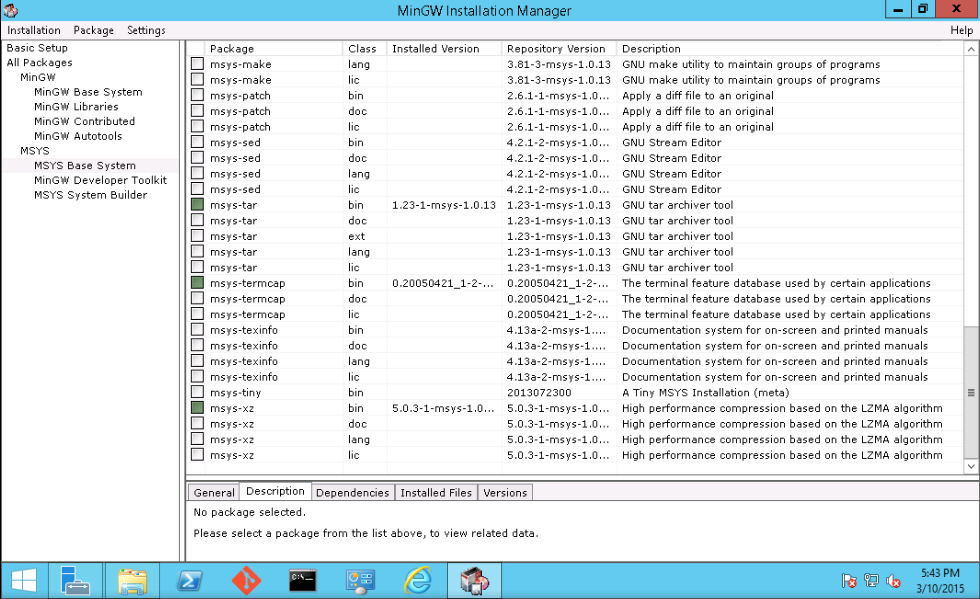

# Building and testing the Windows Docker client

In this document, you will learn how to setup a Windows machine for building and
testing the Docker Windows client.

Things you will need:

- Windows Server/Desktop Machine
- MSysGit
- TDM-GCC
- MinGW (tar and xz)
- Go with linux/amd64 cross-compiling

## Installing MSysGit

1. In Internet Explorer go to [msysgit.github.io](https://msysgit.github.io/).

2. Tap or click the button to download MSysGit.

## Installing GCC

1. In Internet Explorer go to
   [tdm-gcc.tdragon.net/download](http://tdm-gcc.tdragon.net/download).

2. Tap or click the lastest version of the package, install and run.

## Installing MinGW (tar and xz)

1. In Internet Explorer download the latest MinGW from
   [SourceForge](http://sourceforge.net/projects/mingw/).

2. This will install the MinGW Installation Manager.

3. In the MinGW Installation Manager, make sure you select `tar` and `xz` as
   shown below, then select Installation > Apply Changes, to install the
   selected packages.

    

## Installing Golang with linux/amd64 cross-compiling

1. Lets make sure gcc is in your `Path`.

2. Go to Control Panel > System and Security > System, then click the Advanced
   System Settings link in the sidebar.

3. In the Advanced tab, click Environment Variables. Now scroll to the Path
   variable under System variables, and double-click it to see what it
   includes.

    

4. Make sure it has at least `C:\TDM-GCC64` so we can cross compile Go.

5. In Internet Explorer, download and install the latest `.msi` installer from
   [golang.org/dl](http://golang.org/dl/).

6. After that is done installing open gitbash.

7. Enter the directory where go was installed. For basic installations, run `cd
   /c/Go/src`.

8. Run `cmd.exe`. You should now be in the `cmd.exe` prompt.

9. Run

        set GOOS=linux
        set GOARCH=amd64
        make.bat

10. This will allow for cross compiling for linux/amd64. If this fails with
    cannot find `gcc` go back to step 1.

11. Add the `GOPATH` enviornment variables. Create a folder
    `C:\gopath\src\github.com\docker\docker` and clone docker into it. Set the
    `GOPATH` variable in the screen from step 3 as
    `C:\gopath;C:\gopath\src\github.com\docker\docker\vendor`.

## Building and testing the Windows Docker Client
You should now have a windows server and remote host all set up for building and testing docker.

Let's try it.

1. Open Git Bash.

2. Enter the docker source directory we set up and export the Docker
   environment variables.

        cd /c/gopath/src/github.com/docker/docker
        
        export DOCKER_CLIENTONLY=1
        export DOCKER_TEST_HOST=tcp://XXXXXXX:2376
        
        # if you did not set up your GOPATH you can do this here as well
        export GOPATH=/c/gopath/src/github.com/docker/docker/vendor:/c/gopath

3. Run `project/make.sh binary test-integration-cli` to make the binary and run
   the integration tests.
   Since many tests are skipped on windows for various reasons, you can run
   with `TESTFLAGS='-test.v'` to see the skipped tests.

If you make any changes just run these commands again.
