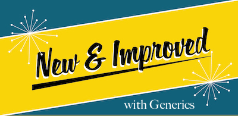

[](https://goreportcard.com/report/github.com/deckarep/golang-set/v2)
[](http://godoc.org/github.com/deckarep/golang-set/v2)

# golang-set

The missing `generic` set collection for the Go language.  Until Go has sets built-in...use this.

## Psst
* Hi there, 👋! Do you use or have interest in the [Zig programming language](https://ziglang.org/) created by Andrew Kelley? If so, the golang-set project has a new sibling project: [ziglang-set](https://github.com/deckarep/ziglang-set)! Come check it out!

## Update 3/14/2025
* Packaged version: `2.8.0` introduces support for true iterators for Go 1.23+. Please see [issue #141](https://github.com/deckarep/golang-set/issues/141)
for further details on the implications of how iterations work between older Go versions vs newer Go versions. Additionally, this
release has a minor unit-test spelling fix.

## Update 12/3/2024
* Packaged version: `2.7.0` fixes a long-standing bug with *JSON Unmarshaling*. A large refactor in the interest of performance
introduced this bug and there was no way around it but to revert the code back to how it was previously. The performance
difference was likely negligible to begin with. JSON Marshaling and Unmarshaling is now properly supported again without
needing to do workarounds.

## Update 3/5/2023
* Packaged version: `2.2.0` release includes a refactor to minimize pointer indirection, better method documentation standards and a few constructor convenience methods to increase ergonomics when appending items `Append` or creating a new set from an exist `Map`.
* supports `new generic` syntax
* Go `1.18.0` or higher
* Workflow tested on Go `1.20`



Coming from Python one of the things I miss is the superbly wonderful set collection.  This is my attempt to mimic the primary features of the set collection from Python.
You can of course argue that there is no need for a set in Go, otherwise the creators would have added one to the standard library.  To those I say simply ignore this repository and carry-on and to the rest that find this useful please contribute in helping me make it better by contributing with suggestions or PRs.

## Install

Use `go get` to install this package.

```shell
go get github.com/deckarep/golang-set/v2
```

## Features

* *NEW* [Generics](https://go.dev/doc/tutorial/generics) based implementation (requires [Go 1.18](https://go.dev/blog/go1.18beta1) or higher)
* One common *interface* to both implementations
  * a **non threadsafe** implementation favoring *performance*
  * a **threadsafe** implementation favoring *concurrent* use
* Feature complete set implementation modeled after [Python's set implementation](https://docs.python.org/3/library/stdtypes.html#set).
* Exhaustive unit-test and benchmark suite

## Trusted by

This package is trusted by many companies and thousands of open-source packages. Here are just a few sample users of this package.

* Notable projects/companies using this package
  * Ethereum
  * Docker
  * 1Password
  * Hashicorp

## Star History

[](https://star-history.com/#deckarep/golang-set&Date)


## Usage

The code below demonstrates how a Set collection can better manage data and actually minimize boilerplate and needless loops in code. This package now fully supports *generic* syntax so you are now able to instantiate a collection for any [comparable](https://flaviocopes.com/golang-comparing-values/) type object.

What is considered comparable in Go? 
* `Booleans`, `integers`, `strings`, `floats` or basically primitive types.
* `Pointers`
* `Arrays`
* `Structs` if *all of their fields* are also comparable independently

Using this library is as simple as creating either a threadsafe or non-threadsafe set and providing a `comparable` type for instantiation of the collection.

```go
// Syntax example, doesn't compile.
mySet := mapset.NewSet[T]() // where T is some concrete comparable type.

// Therefore this code creates an int set
mySet := mapset.NewSet[int]()

// Or perhaps you want a string set
mySet := mapset.NewSet[string]()

type myStruct struct {
  name string
  age uint8
}

// Alternatively a set of structs
mySet := mapset.NewSet[myStruct]()

// Lastly a set that can hold anything using the any or empty interface keyword: interface{}. This is effectively removes type safety.
mySet := mapset.NewSet[any]()
```

## Comprehensive Example

```go
package main

import (
  "fmt"
  mapset "github.com/deckarep/golang-set/v2"
)

func main() {
  // Create a string-based set of required classes.
  required := mapset.NewSet[string]()
  required.Add("cooking")
  required.Add("english")
  required.Add("math")
  required.Add("biology")

  // Create a string-based set of science classes.
  sciences := mapset.NewSet[string]()
  sciences.Add("biology")
  sciences.Add("chemistry")
  
  // Create a string-based set of electives.
  electives := mapset.NewSet[string]()
  electives.Add("welding")
  electives.Add("music")
  electives.Add("automotive")

  // Create a string-based set of bonus programming classes.
  bonus := mapset.NewSet[string]()
  bonus.Add("beginner go")
  bonus.Add("python for dummies")
}
```

Create a set of all unique classes.
Sets will *automatically* deduplicate the same data.

```go
  all := required
    .Union(sciences)
    .Union(electives)
    .Union(bonus)
  
  fmt.Println(all)
```

Output:
```sh
Set{cooking, english, math, chemistry, welding, biology, music, automotive, beginner go, python for dummies}
```

Is cooking considered a science class?
```go
result := sciences.Contains("cooking")
fmt.Println(result)
```

Output:
```false
false
```

Show me all classes that are not science classes, since I don't enjoy science.
```go
notScience := all.Difference(sciences)
fmt.Println(notScience)
```

```sh
Set{ music, automotive, beginner go, python for dummies, cooking, english, math, welding }
```

Which science classes are also required classes?
```go
reqScience := sciences.Intersect(required)
```

Output:
```sh
Set{biology}
```

How many bonus classes do you offer?
```go
fmt.Println(bonus.Cardinality())
```
Output:
```sh
2
```

Thanks for visiting!

-deckarep
